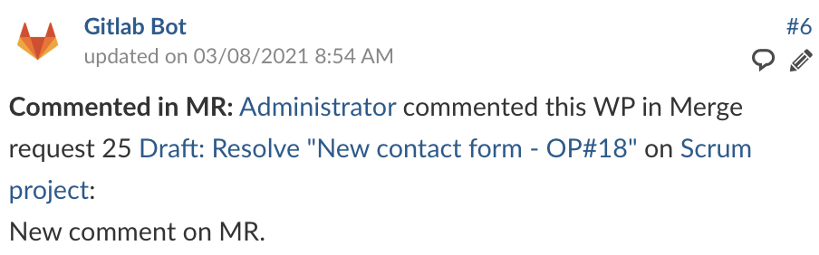

# openproject-gitlab-integration

## NEW VERSION 2.0.8 GA

Based on the current Github integration (OpenProject 12), this plugin offers the same functionalities as the current plugin for Github (and something else). This version includes changes to the DB and a new view similar to the current Github tab. Only the management of "pipelines" is pending an open issue in Gitlab (https://gitlab.com/gitlab-org/gitlab/-/issues/345028).


This 2.x version includes a UI with all linked MRs, their status, their labels and the last pipeline *(pending the Gitlab issue)*.
## Introduction

OpenProject module for integration with Gitlab:
* Latest Gitlab release tested: **15.9**
* Latest OpenProject release tested: **12.4.5** (for OpenProject versions earlier than 12.2.0 use v2.0.5, and for version earlier than 12.1.0 use v2.0.4)

This plugin is based on the current [plugin to integrate Github with OpenProject](https://www.openproject.org/docs/system-admin-guide/integrations/github-integration/).

The reference system is the same as for GitHub integration. You can use a link to the work package or just use “OP#87” or "PP#87" in the title in Gitlab.

> **Note about the references.** Whether or not to include the reference in certain places depends on the information that Gitlab sends through its webhook. If you include the reference in the title of an issue, the comments on the issue do not need to include the reference. The same will happen when you generate a Merge Request based on an Issue that already includes the reference; comments from that MR need not include the reference.

#### Difference between OP and PP

If you use `OP#` as a reference in an Issue or MR title, all comments will be replicated in OpenProject. However, sometimes you may only want to keep information about the status of an Issue/MR in OpenProject, but you don't want your comments to be published. In this case, you can use `PP#` as a reference. This way the comments will not be published in OpenProject. But if at any time one of your comments in a private Issue/MR is of interest to you to be published in OpenProject you can use `OP#` *directly in that comment*. So only that comment will be published in OpenProject. The rest of the comments will remain private and will not be published.

## Available events captured in OpenProject

OpenProject will **add comments** to work package for the following events:

* Merge Request (Opened, Closed and Merged)
* Issue (Opened, Closed)
* Push commits in Merge Requests
* Comments (on Issues, Merge Request, Commits and Snippets)
* *Pipelines (pending)*

OpenProject will **update WP status** in this events:

* Merge Request (opened) - Status: In progress (currently ID=7)
* Merge Request (merged) - Status: Developed (currently ID=8)

> **Note about the status.** If you want to change the ID of the status you can do this in this section of the [code](https://github.com/btey/openproject-gitlab-integration/blob/master/lib/open_project/gitlab_integration/notification_handler/merge_request_hook.rb#L40-L41). By default is *disabled*, you can enable it by setting to `true` this [lines](https://github.com/btey/openproject-gitlab-integration/blob/master/lib/open_project/gitlab_integration/notification_handler/merge_request_hook.rb#L38-L39).

## Example workflow

A typical workflow on Gitlab side would be:

1. **Create Issue.**
   
   
   
   > **Issue Opened:** Issue 6 New contact form - OP#18 for Scrum project has been opened by Administrator.

2. **Comment on issue.**
   
   If the reference is included in the title, the comments will not need a reference. By default, all comments will use the title as a reference.
   
   
   
   > **Commented in Issue:** Administrator commented this WP in Issue 6 New contact form - OP#18 on Scrum project:
   > 
   > New comment on the issue with attachment.

3. **Create Merge Request.**
   
   
   
   > **MR Opened:** Merge request 25 Draft: Resolve "New contact form - OP#18" for Scrum project has been opened by Administrator.
   > 
   > **Status** changed from _Specified_
   > **to** _In progress_

4. **Comment in Merge Request.**
   
   
   
   > **Commented in MR:** Administrator commented this WP in Merge request 25 Draft: Resolve "New contact form - OP#18" on Scrum project:
   > 
   > New comment on MR.

5. **Reference in other Issues or Merge Request (comments).**
   
   If the reference is NOT included in the title of the Issue/MR, the comments will need a reference. In OpenProject the comment will be saved as "referenced" in Issue/MR.
   
   
   
   > **Referenced in Issue:** Administrator referenced this WP in Issue 2 New backend pipeline on Scrum project:
   > 
   > OP#18 New comment about...
   > 
   > **Note:** If you use the reference `PP#` in the title of the Issue/MR, you can use `OP#` in the comment to generate the same type of comment in OpenProject. 

6. **New commit in Merge Request.**
   
   
   
   > **Pushed in MR:** Administrator pushed fca3d6fb to Scrum project at 2021-03-08T08:01:57+00:00:
   > 
   > Update readme.md OP#18

7. **Comment in a new commit of the Merge Request.**
   
   
   
   > **Referenced in Commit:** Administrator referenced this WP in a Commit Note 0bf0e3e9 on Scrum project:
   > 
   > This change is for OP#18.

8. **Merge Request merged (generates up to 3 events).**
   
   
   
   > **Pushed in MR:** Administrator pushed 1da09cb4 to Scrum project at 2021-03-05T14:57:37+00:00:
   > 
   > Merge branch '5-new-contact-form-op-18' into 'master'
   > 
   > Resolve "New contact form - OP#18"
   > 
   > Closes #6
   > 
   > See merge request root/scrum!9
   
   
   
   > **MR Merged:** Merge request 24 Resolve "New contact form - OP#18" for Scrum project has been merged by Administrator.
   > 
   > **Status** changed from _In progress_
   > **to** _Developed_
   
   
   
   > **Issue Closed:** Issue 6 New contact form - OP#18 for Scrum project has been closed by Administrator.

## Configuration

You will have to configure both **OpenProject** and **Gitlab** for the integration to work.

In case of **Docker** installation, follow the official OpenProject documentation [here](https://www.openproject.org/docs/installation-and-operations/installation/docker/#openproject-plugins). If for some reason the installation with Docker described in the official documentation does not work for you, you can try building your own docker image:
* Clone from the Openproject Repo: `git clone https://github.com/opf/openproject.git --branch=stable/12 --depth=1 .`
* Clone the plugin inside the modules folder: `git clone https://github.com/btey/openproject-gitlab-integration.git --depth=1 modules/gitlab_integration`
* Apply the changes below in Gemfile.lock and Gemfile.modules (the same ones you would do in a manual install).
* Build the container: `docker build -t openproject-docker --file=docker/prod/Dockerfile .`
* Now run the image following the official documentation.

In case of **DEB/RPM** based instalation, follow the official OpenProject documentation [here](https://www.openproject.org/docs/installation-and-operations/configuration/plugins/).

In case of [**manual**](https://www.openproject.org/docs/installation-and-operations/installation/manual/) installation, this plugin should be installed in the same place as the Github plugin that comes bundled with OpenProject.

- **Github plugin path:** `modules/github_integration`

- **Path to put Gitlab plugin:** `modules/gitlab_integration`

But first you must modify **Gemfile.lock** and **Gemfile.modules** so that OpenProject detects the new module.

Add the following in **Gemfile.lock**:

```
PATH
  remote: modules/gitlab_integration
  specs:
    openproject-gitlab_integration (2.0.6)
      openproject-webhooks
```

And add this other line in DEPENDENCIES section:

```
DEPENDENCIES
...
  openproject-github_integration!
  openproject-gitlab_integration!
  openproject-job_status!
...
```

Add the following in **Gemfile.modules**:

```
group :opf_plugins do
...
  gem 'openproject-gitlab_integration',        path: 'modules/gitlab_integration'
...
end
```

**Note:** It's possible that you need to use these commands before and after the "bundle install" if you get an error in this step warning about a change in the Gemfile:

```
bundle config unset deployment 
bundle install --deployment --without mysql2 sqlite development test therubyracer docker
bundle config set deployment
```

### The Gitlab Bot user in OpenProject

First you will need to create a user in OpenProject that will make the comments. The user will have to be added to each project with a role that allows them to comment on work packages and change status.

Once the user is created you need to generate an OpenProject API token for it to use later on the Gitlab side:

* Login as the newly created user.
* Go to My Account (click on Avatar in top right corner).
* Go to Access Token.
* Click on generate in the API row.
* Copy the generated key. You can now configure the necessary webhook in Gitlab.

### The webhook in Gitlab

In Gitlab you have to set up a webhook in each repository to be integrated with OpenProject.

You need to configure just two things in the webhook:

1. The URL must point to your OpenProject server’s Gitlab webhook endpoint (/webhooks/gitlab). Append it to the URL as a simple GET parameter named key with previouslly generated token as value. In the end the URL should look something like this:
   
   ```
   http://openproject-url.com/webhooks/gitlab?key=generated_access_token
   ```

2. Enable the required triggers:
   
   1. Push events
   
   2. Comments
   
   3. Issues events
   
   4. Merge request events

Now the integration is set up on both sides and you can use it.

> **Note:** If you are installing and configuring OpenProject on the same server as Gitlab you will need to enable in Gitlab the option "Allow requests to the local network from web hooks and services" so that it can send the data locally to the OpenProject webhook since they will be on the same machine.

## How to report bugs or issues

Any error, bug or issue can be reported by creating a new [issue](https://github.com/btey/openproject-gitlab-integration/issues/new).
