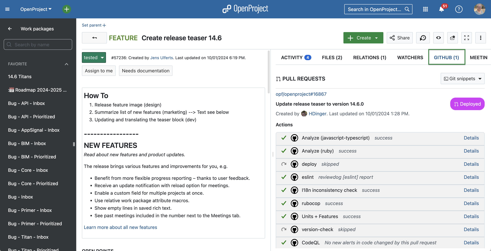

# OpenProject

**We empower teams to achieve great things together for the good of society.**

OpenProject is a web-based project management software. Use OpenProject to manage your projects, tasks and goals. Collaborate via work packages and link them to your pull requests on Github. [Read more about the OpenProject GitHub integration](https://www.openproject.org/docs/system-admin-guide/integrations/github-integration/).

OpenProject's key features are:

* [Project planning and scheduling](https://www.openproject.org/collaboration-software-features/#project-planning)
* [Product roadmap and release planning](https://www.openproject.org/collaboration-software-features/#product-management)
* [Task management and team collaboration](https://www.openproject.org/collaboration-software-features/#task-management)
* [Agile and Scrum](https://www.openproject.org/collaboration-software-features/#agile-scrum)
* [Time tracking, cost reporting, and budgeting](https://www.openproject.org/collaboration-software-features/#time-tracking)
* [Bug tracking](https://www.openproject.org/collaboration-software-features/#bug-tracking)
* [Wikis](https://www.openproject.org/docs/user-guide/wysiwyg/)
* [Forums](https://www.openproject.org/docs/user-guide/forums/)
* [Meeting agendas and meeting minutes](https://www.openproject.org/docs/user-guide/meetings/)

More information and screenshots can be found on our [website](https://www.openproject.org).

## Start now with OpenProject

- **Free Trial**:[Start a 14-days free trial of OpenProject](https://start.openproject.com/).
- **Community Edition**, free of charge: Download OpenProject and get started with the self-hosted Community edition. If you want to run an instance of OpenProject in production (or for evaluation), refer to our in-depth [installation guides](https://www.openproject.org/download-and-installation/).
- **Enterprise Edition**: Sign up for the Enterprise version, choose between cloud or on-premises and benefit from comprehensive support and Enterprise add-ons.
- **Documentation**: Explore our [comprehensive documentation](https://www.openproject.org/docs/) to help you get up and running quickly.
- **Training**: [Book one of our training or consulting offers](https://www.openproject.org/training-and-consulting/#training-signup) to get your team on board in no time.

## Report bugs

You found a bug? Please [report it](https://www.openproject.org/docs/development/report-a-bug/) to our [OpenProject Community](https://community.openproject.org/projects/openproject). Thank you!

## Contribute

OpenProject is supported by its Community members, both companies and individuals.

We are always looking for new members to our Community, so if you are interested in improving OpenProject we would be glad to welcome and support you getting into the code. There are guides as well, e.g. a [Quick Start for Developers](https://www.openproject.org/development/setting-up-development-environment/), but don't hesitate to simply [contact us](https://www.openproject.org/contact) if you have questions.

Working on OpenProject comes with the satisfaction of working on a widely used open source application.

Also, if you do not want to be limited to working on open source in your free time, OpenProject GmbH, the company contributing to the OpenProject development, [is hiring](https://www.openproject.org/career/).

## Stay in contact

Here you can find our [contact information](https://www.openproject.org/contact/). As we regularly update OpenProject, we recommend staying in touch – here is where you can find us:

- [OpenProject Community](https://www.openproject.org/blog/community-instance/) with [forum discussions](https://community.openproject.org/projects/openproject/forums): The open instance where we develop our features – transparent and open for discussions, bug reports or feature requests.
- [LinkedIn](https://www.linkedin.com/company/18706985)
- [Reddit](https://www.reddit.com/r/openproject/)
- [Fosstodon](https://fosstodon.org/@openproject)
- [Twitter/X](https://twitter.com/openproject)

## Security / responsible disclosure

We take security very seriously at OpenProject. We value any kind of feedback that
will keep our Community secure. If you happen to come across a security issue we urge
you to disclose it to us privately to allow our users and Community enough time to
upgrade. Security issues will always take precedence over anything else in the pipeline.

For more information on how to disclose a security vulnerability, [please see this page](docs/security-and-privacy/statement-on-security/README.md).

## License

OpenProject is licensed under the terms of the GNU General Public License version 3.
See [COPYRIGHT](COPYRIGHT) and [LICENSE](LICENSE) files for details.

## Credits

### Icons

Thanks to Vincent Le Moign and his fabulous Minicons icons on [webalys.com](http://www.webalys.com/minicons/icons-free-pack.php).

### OpenProject icon font

Published and created by the OpenProject Foundation (OPF) under [Creative Commons Attribution 3.0 Unported License](http://creativecommons.org/licenses/by/3.0/)
with icons from the following sources
[Minicons Free Vector Icons Pack](http://www.webalys.com/minicons) and
[User Interface Design framework](http://www.webalys.com/design-interface-application-framework.php) both by webalys

**Creative Commons License**

OpenProject Icon Font by the OpenProject Foundation (OPF) is licensed under Creative Commons Attribution 3.0 Unported License
and Free for both personal and commercial use. You can copy, adapt, remix, distribute or transmit it.

Under this condition: provide a mention of the "OpenProject Foundation" and a link back to OpenProject www.openproject.org.
