# API v3 usage example

The following guide is meant to be read as an hands on example on how to use the API v3 as a client.
It should enable a reader to understand how authentication and authorization are handled and demonstrates creating
a work package, filtering for it, updating it and finally the deletion of it.

The guide itself is technology agnostic. You will find no ready to use code in it. However, given that an api client, in this case
[Postman](https://www.postman.com/downloads/) is employed, the reader should be able to transform the visualized steps into the client language
of choice.

While being limited to the work package resource, the same principles apply throughout the API.

## Fetching work packages from community.openproject.org

Because it is readily at hand, we will first fetch a list of work packages from [community.openproject.org](https://community.openproject.org).

In its simplest form, fetching work packages looks like this:

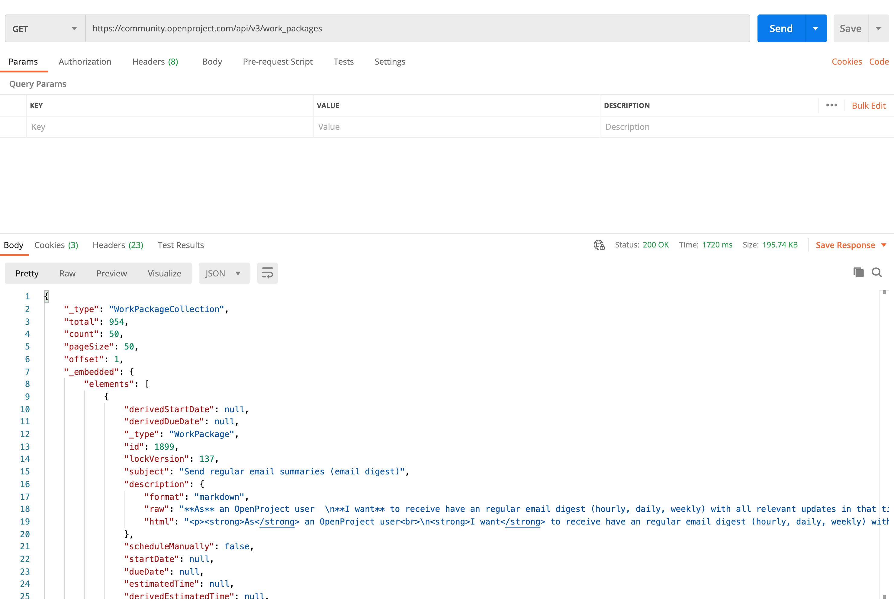

The GET request returns a `WorkPackageCollection`, which is a list of `WorkPackage` resources. Although not explicitly required by the HAL standard, every embedded `WorkPackage` is complete, meaning it will contain every property.

Please notice that no headers and no credentials need to be provided. Because the community instance of OpenProject is configured to be available to the public, no authentication is required.

## Authentication

In a default OpenProject installation however, credentials are necessary to even access the instance, so this guide will assume this
default behavior to apply further on. Only in very limited use cases should an unauthenticated access ever be allowed.

Without authentication, a client will be informed of the missing credentials as demonstrated below when issuing a  request
identical to the one above against a locally run installation:

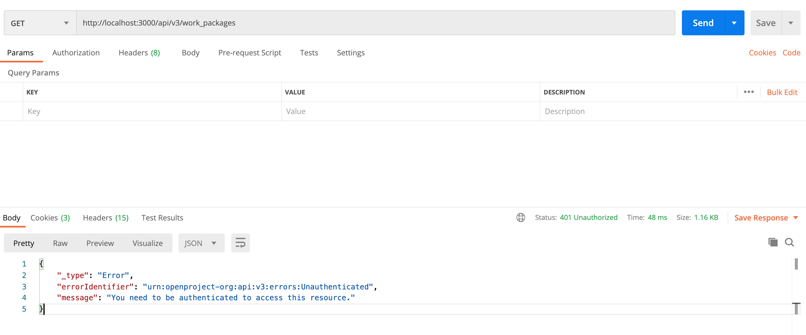

In case such an error is returned, the client has a couple of possibilities to authenticate. Of the available possibilities, the guide will demonstrate two: Basic Auth because it is the most commonly used mechanism and OAuth 2 because it should be the most commonly used mechanism.

Regardless of the authentication mechanism used, a client will always authenticate as a user within OpenProject. Even for the OAuth2 [Client credentials](https://oauth.net/2/grant-types/client-credentials/) flow, which is aimed to not involve user interaction, every interaction on the server will be carried out in the name of a specific user to regulate authorization as you will see below.

### Basic auth

Basic auth is simple to setup and understand but should be avoided in
the long run due to security reasons but also because it limits a client
and is harder to manage within an organization.

In order to authenticate with basic auth, a user first has to login
into OpenProject and generate an API key. After that he can use the
API key to authenticate API calls. The normal login credentials will
not work when communicating via the API.

An API key can be generated on the "Access token" page within the
"My account" section by clicking on the "Generate" or "Reset"
(depending on whether a key already exists) link within the "API" row.

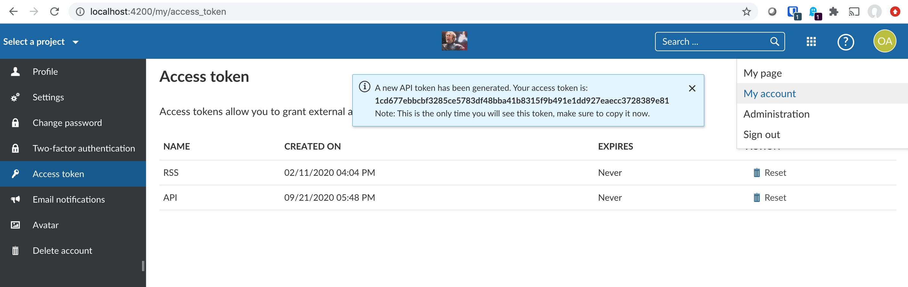

Only one API key can exist for a user at any given time.
Generating a new key will invalidate the former key, so please
make sure to note down the access token.
This is one of the limitations that do apply to basic auth
but do not apply to OAuth2.

Postman offers to correctly encode the key and set the
correct `Authorization` header via a form. So using Postman,
having chosen "Basic Auth" as the authorization type,
we can authenticate by pasting in the key into the
"Password" field and by setting 'apikey' for "Username".
When using basic auth, the user's login is never used. T
he whole of the information is already encoded in the generated key.

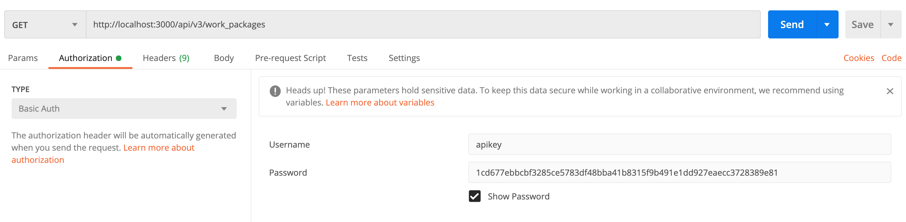

When switching to the Headers tab within Postman, please notice that an `Authorization` header will be set for us:

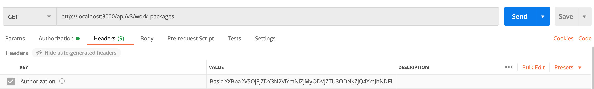

We could just as well have generated the header ourselves by Base64 encoding the string "apikey:[generated key]" which in our example would have been "apikey:1cd677ebbcbf3285ce5783df48bba41b8315f9b491e1dd927eaecc3728389e81" and prepend "Basic " to it.

### OAuth2

OAuth2 based authentication requires an administrator to create
and configure an OAuth2 application as described in the [OAuth applications
documentation](../../system-admin-guide/authentication/oauth-applications/) of
the Administration Guide.
The guide also explains how to use the Postman application to
test the OAuth2 flow and to obtain a Bearer token.

Once available, we chose to use the resulting Bearer token
in Postman by pressing "Use token".

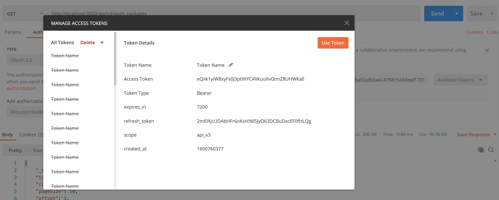

Please note that an OAuth token expires after two hours,
so the client has to request a new token then. This will require
another click to the "Get New Access Token" button at the bottom
of the Postman "Authorization" tab.

### Being authenticated

With the Bearer token included in the request,
we should see a list of work packages
in the work packages page above.

However, the collection of work packages returned might still
not contain the work packages the client is looking for.
This might be, because the user in whose name the client
accesses the application is lacking permissions.
We need to ensure that the user also has the necessary authorization.

## Authorization

As the client accesses OpenProject on behalf of a user,
that user needs to have authorization to do the desired actions.
So while the user might be authenticated, she/he might lack the
necessary permissions to do anything.

In OpenProject, permissions are mostly granted by creating a
connection between a user, a project and a role in the form of a
membership. So for every project the user is supposed to have access,
a role needs to be assigned to him/her.

This can be done in the members administration of each project:

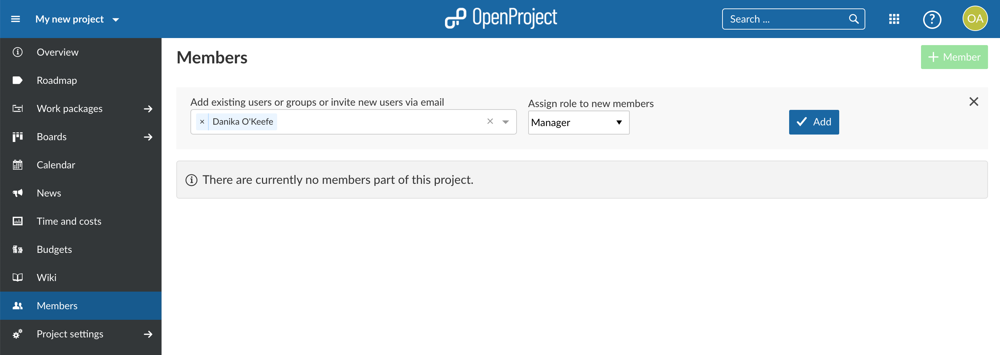

In case permissions are lacking, the client returns a 403 response so if you encounter such an error, please check the permissions.

## Creating a work package

When having the necessary authentication and authorization, a client may create work packages via the API.

To aid in creating work packages, a work package form resource is available

### Fetching the work package form

A form:

* provides a *payload* object that can serve as the blueprint for creating work packages. It can also be used to display the work package to be created in the client application as it also contain default values set automatically, e.g. for `priority`.
* contains a *schema* describing the properties of the work package as well as listing the available values for those referencing other resources. E.g. the projects in which work packages can be created (read in which the user has the permission to create work packages) are listed.
* notes the current *errors* in the payload. E.g. a work package cannot be created outside of a project so a project reference needs to be provided.

The API documentation offers detailed information [on forms in general](../forms) and on the [work package create form](../endpoints/work-packages/#form-for-creating-work-packages-in-a-project) in particular.

We will first fetch the empty form:

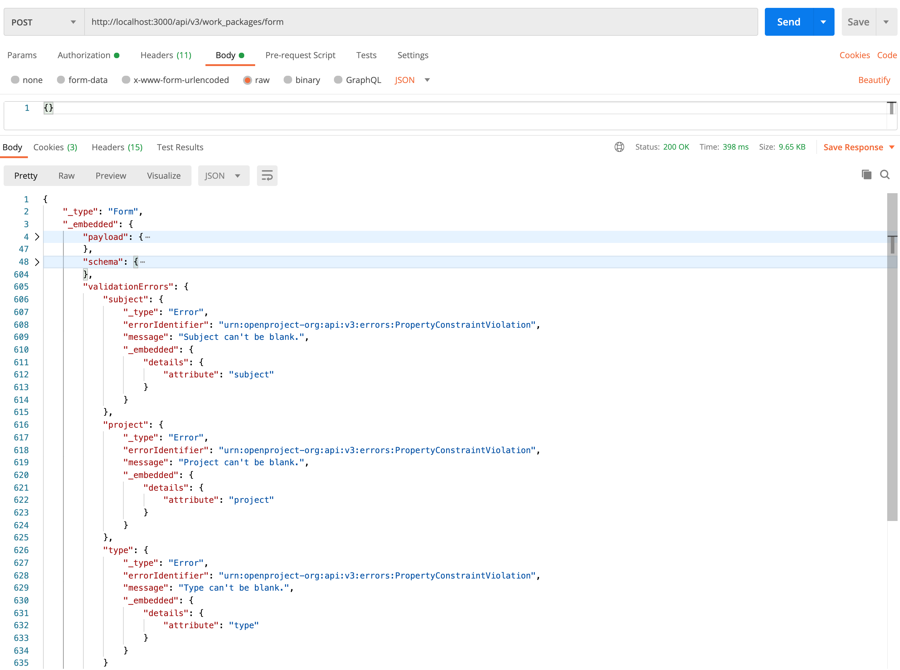

We have send a POST request to the application with an empty body that is configured to be json. This will set a `ContentType: application/json` header which is a necessary header whenever sending a state altering request, so whenever a POST, PATCH or DELETE request is send.

The response informs us within the `validationErrors` section (nested in `_embedded`) of the errors the send body has which is of no surprise, given that it was empty. The currently stated errors are that `type`, `project` and `subject` are empty.
Given that `subject` just takes any string (up to a length of 255 characters), fixing this is rather easy. We know that, because the `Schema` embedded in the `Form` tells the client:

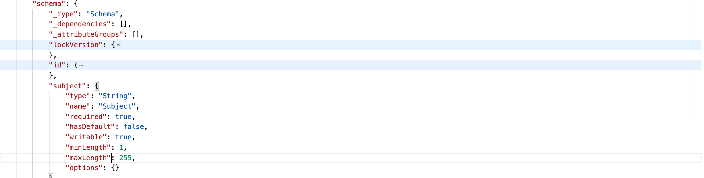

The schema also describes the `type` and `project` properties which other than the `subject` cannot be freely chosen. Both properties need to reference already existing resources.

For `type`, the available values are directly listed in the schema:

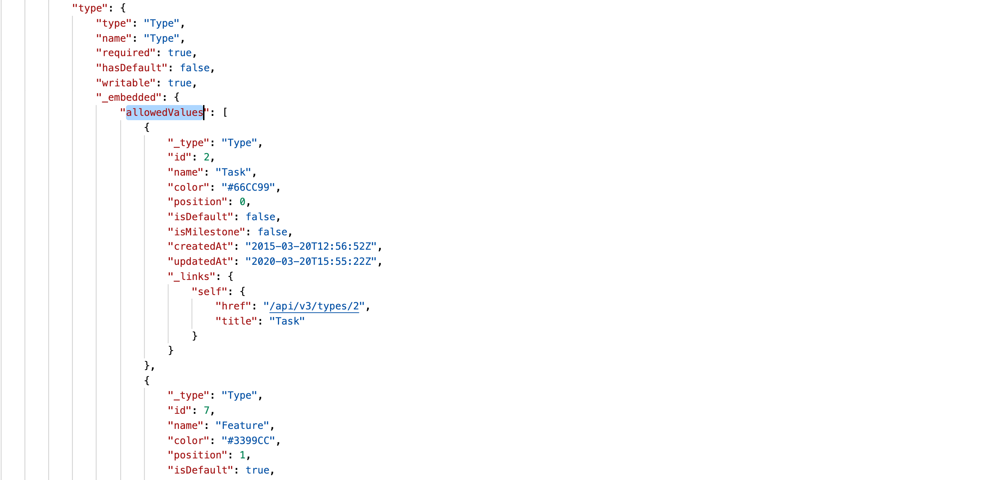

For `project`, a link is provided which clients can call to get the projects available for work package creation:

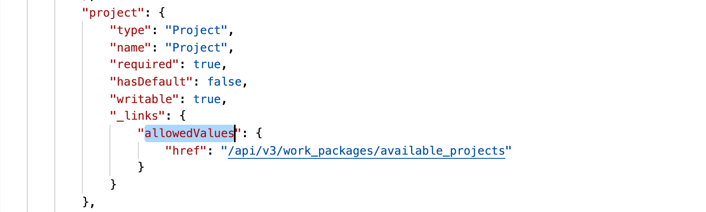

Whether the available values for a project are embedded directly within the schema or available only after having called an additional endpoints depends on the amount of values that are expected to be returned for each.
While there can be hundreds, even thousands, of projects, there typically are only a few types in an OpenProject instance. And for non resource referencing properties like `subject` no `availableValues` are provided at all so a client needs to handle all those cases.

Using the various available values, the client can now construct a body that will not return any validation errors:

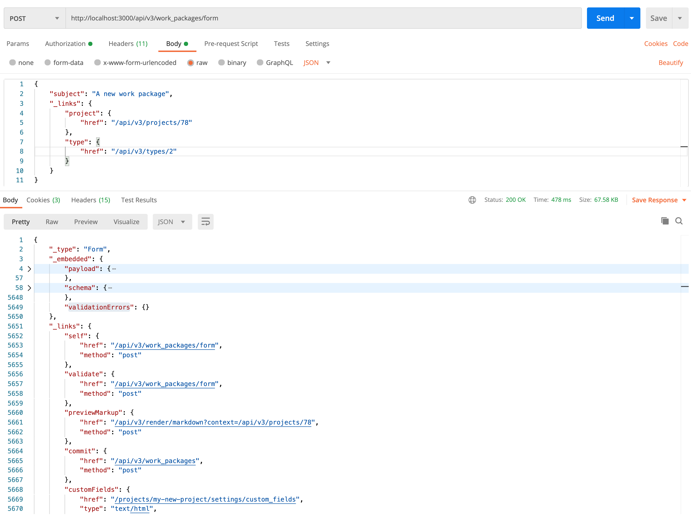

When constructing the body of the request, the difference between properties referencing resources according to HAL and those with scalar values also shows.
All referencing properties (`project` and `type` in our case) are noted in the `_links` section and have an `href` property while the scalar values (`subject` in our case) are provided on the root level.

```json5
{
  // Scalar values
  "subject": "abc",
  "_links": {
    // Resource values
    "project": {
      "href": "some/url"
    }
  }
}
```

The value taken for the `href` in a resource value will always be the `self` link of a resource:

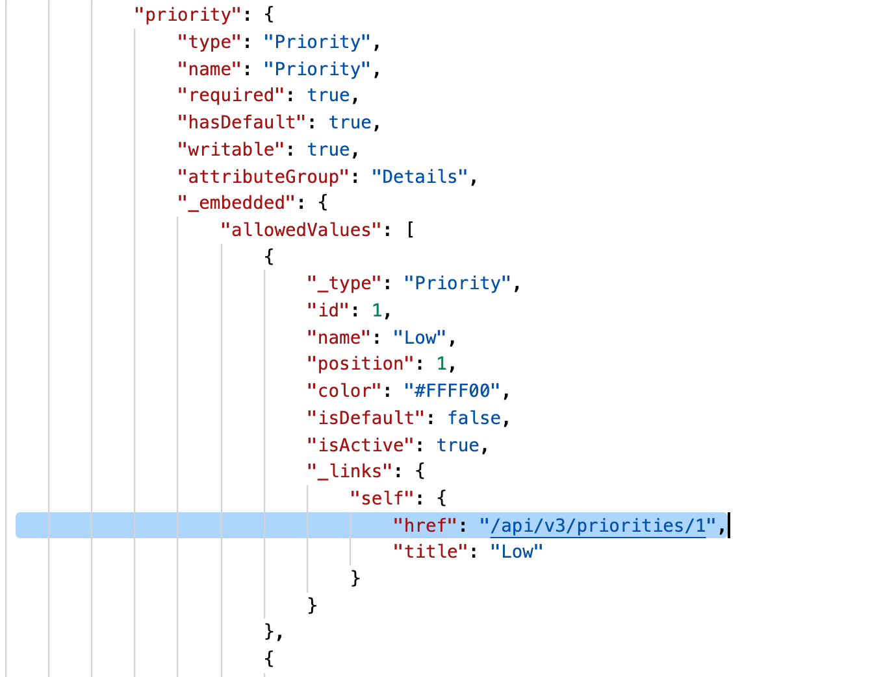

*The correct combination of `project` and `type` needs to be chosen. Sometimes a type is not available in every project. In that case, the type either can be added to the project in the UI or a different type needs to be chosen for the project. This is why it sometimes makes sense to first send the project within the form body as this will update the `availableValues` listed for `type`*

### Sending the create request

Once no more validation errors are displayed, we can create the work package. For this, a client either uses the payload embedded in the form, or use the body of the create form request.

If no validation errors exist, a `commit` link will be provided in the form following the idea of HATEOAS to allow a client to navigate through the API via links provided in the response.
We send a POST request to the url listed for the `commit` link and with the `payload` as the request body. Again, we have the `ContentType: application/json` header set.

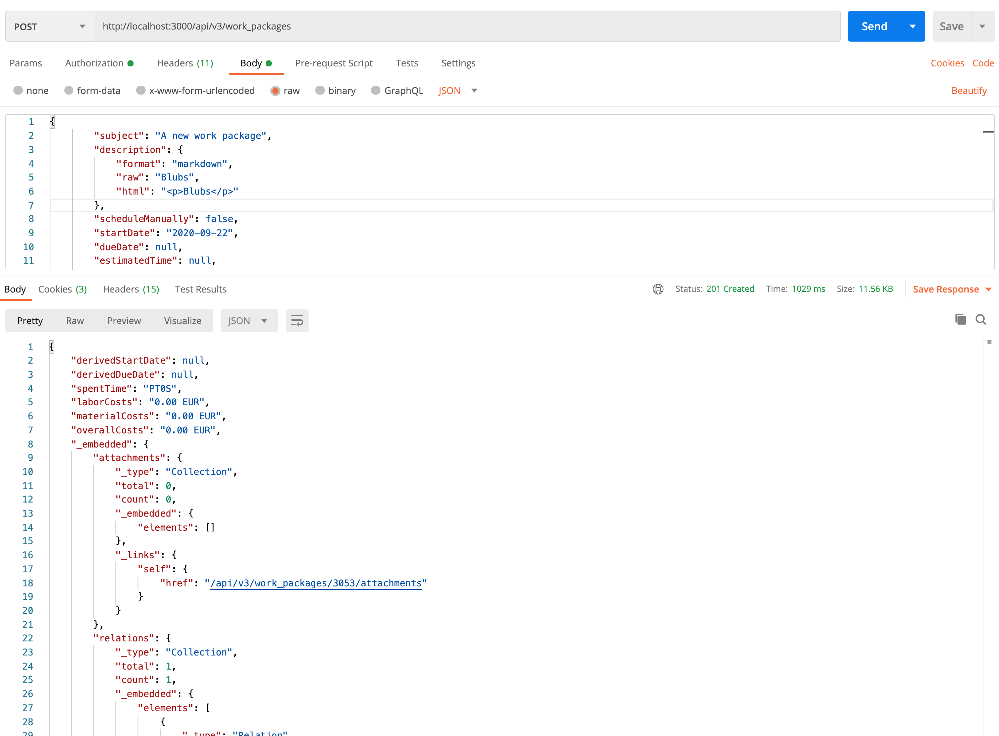

Now the client has created a work package with the properties provided. The server returns the whole work package resource created. The whole of the resource will contain more properties and links than the client sent as it will include default values, non writable fields and links highlighting available actions.

### Custom fields

Especially setting values for custom field properties is helped by the work package form prior to creation.
As the existence of custom field and their available values by their very nature is different between OpenProject instances, a client that is build to be of used in combination with multiple OpenProject instances cannot have a hard coded set of custom fields and custom field values.
Additionally, the availability of custom fields depend on the `project` and the `type` of a work package resource. Custom fields can be configured to be available only for certain types and certain projects.

The schema will list all available custom fields in the schema, with their name being provided in a human readable form and the available values being listed same as for `project`:

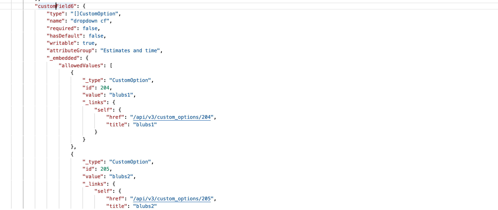

The set of available custom fields might change depending on the values provided for `project` and `type`. I.e. if no `project` and no `type` is provided at first, custom fields will not be listed in the schema.

As some custom fields reference other resources (e.g. list and user) while others are scalar values (e.g. integer and float), setting the properties requires to have them set in different parts of the body payload. This is the same as for the `subject` property vs. the `project` property.
The schema can instruct the client where to set them properly. All properties with an `availableValues` section either listing values themselves or linking to them need to be placed in the `_links` section of the payload.

```json5
{
  // Scalar values
  "customFieldX": 123,
  "_links": {
    // Resource values
    "customFieldY": {
      "href": "some/url"
    }
  }
}
```

## Filtering work packages

Once a work package is created, it can also be retrieved again.

Adapting the request we issued against the community installation, the client can fetch all work packages quite easily:

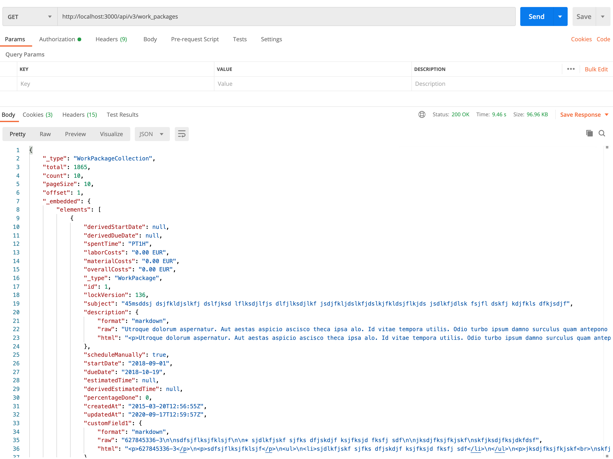

This however will return all work packages the authenticated user employing the client is eligible to see, which might potentially be thousands of work packages.
The server will always limit the amount of work packages actually returned (and will indicate the total amount by the `total` attribute that is part of the `WorkPackageCollection` resource) but using this method to find an individual work packages is laborious.

That is why the [API supports filters](../filters). The filter that is applied most easily, is the filter for the project. This filter can be applied requesting via a project scoped url:

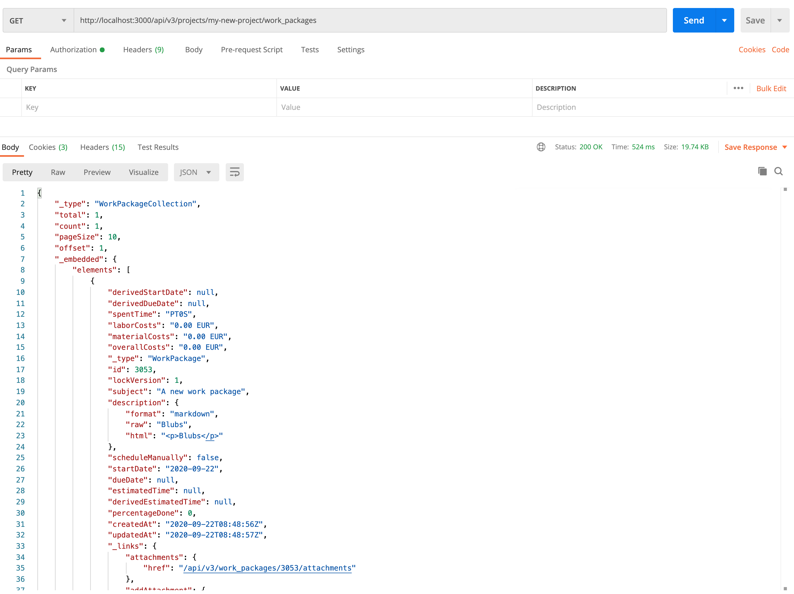

Please notice the difference in the url: `api/v3/projects/:project_identifier_or_id/work_packages` vs. `api/v3/work_packages`.

There are however a whole lot of additional filters for work packages, e.g. the one for the subject:

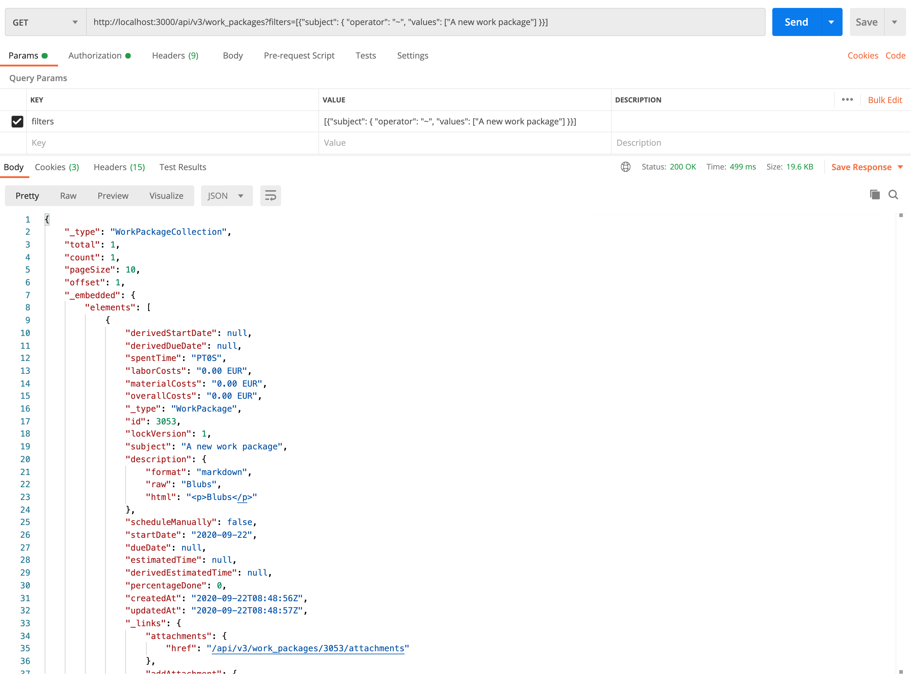

By providing the filters as a query parameter (`[{"subject": { "operator": "~", "values": ["A new work package"] }}]`) the client only receives work packages whose subject contains the provided string.
The client can just as well filter for most of the other properties and can combine those filters:

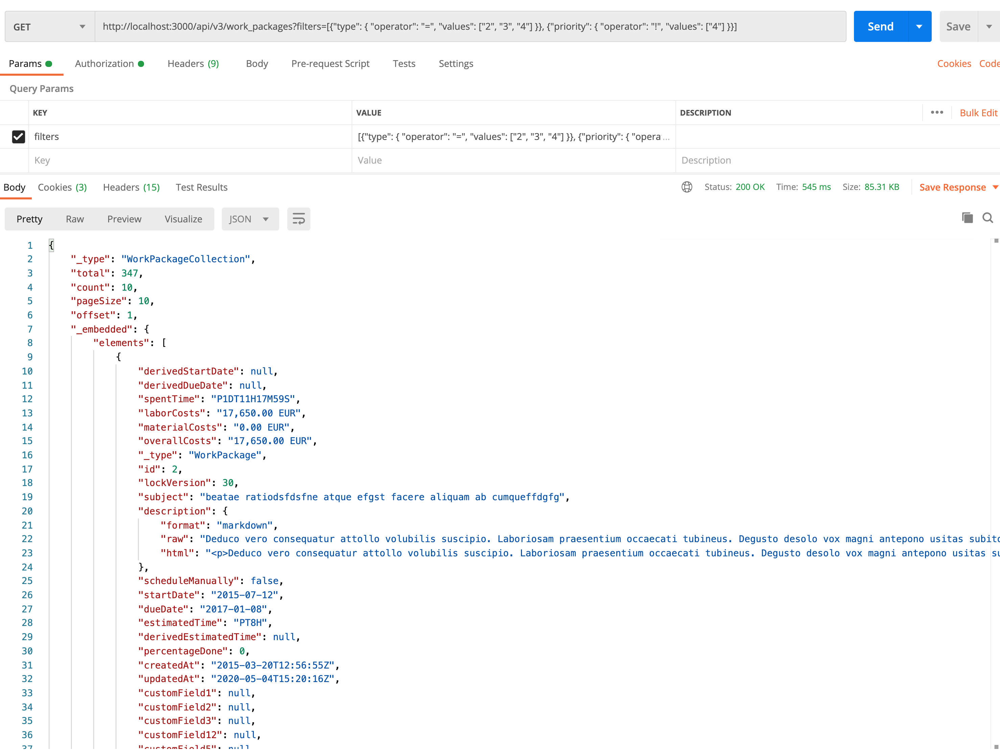

In the example displayed above, the clients filters for all work packages having their type set to the types with the id 2, 3 or 4 **and** whose priority is not the priority with the id 4.
Once again, this displays a difference between scalar and resource values. While the client is expected to provide scalar value directly, in needs to provide the id of resources in case a resource property is filtered for.

Apart from filtering, the work packages can also be sorted (e.g. `sortBy=[["assignee", "asc"], ["createdAt", "desc"]`),
the number of work packages included in the response can be adapted (e.g. `pageSize=50`) and the page offset the result set
starts from can be specified (e.g. `offset=5`).

In total, this provides a lot of capabilities for retrieving the set of work packages the client needs. Because those capabilities
might be overwhelming at first, it is a good idea to use the OpenProject UI to configure the filters, order, etc. desired and
take a look at the request the UI sends to the backend (e.g. via the developer tool's network tab). As the OpenProject UI is an API client as well,
it can guide other potential clients to correctly communicate with the OpenProject backend.

## Updating a work package

Once the correct work package is found, it can also be updated. Once again, a form can support the client in that endeavour.

### Fetching the update form

The form is also listed as a link of a work package resource:

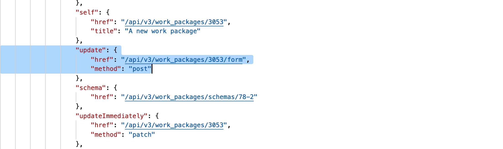

Sending a POST request to that link, as specified via the `method` attribute next to the `href` attribute, will fetch the update form:

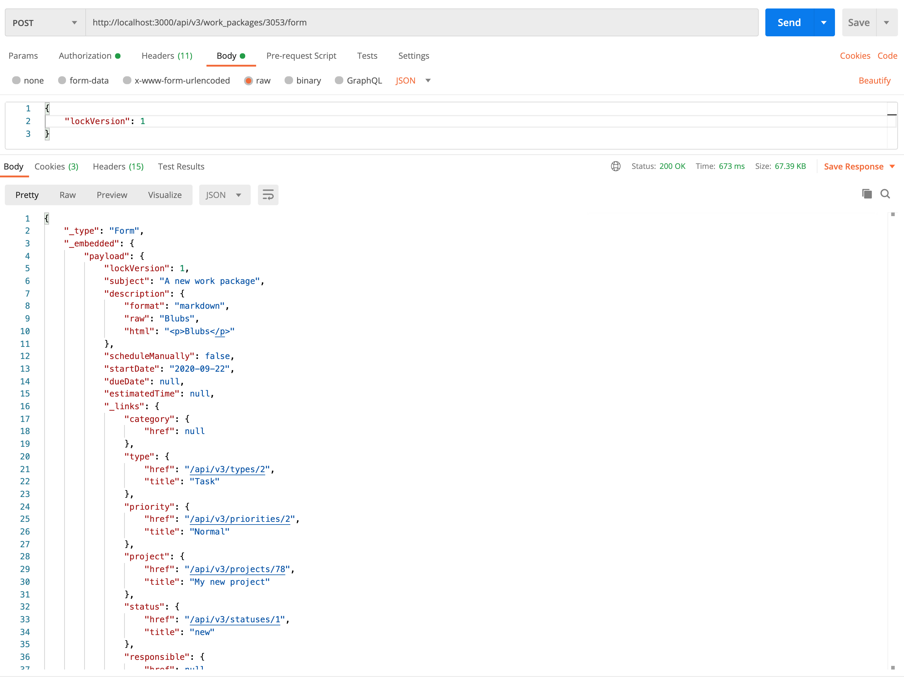

The body of the request needs to include the current `lockVersion` of the work package. The `lockVersion` property prevents conflicting modifications in scenarios where one user changes a work package and another
user overwrites that change unknowingly because she/he did not notice the update having been made in the meantime. The `lockVersion` is listed as one of the work package's properties.

The form itself is the same as the form for creating work packages with `payload`, `schema` and `validationErrors` helping the client to perform the update. Again a couple of changes can be prepared before the
actual change is performed:

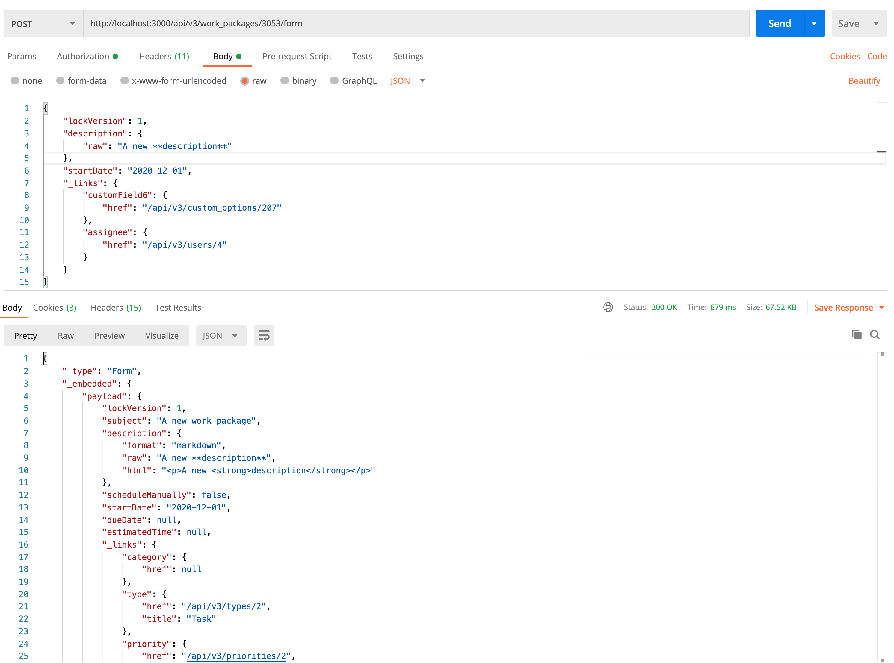

Please keep in mind that available values and even the applicability of properties might change if the `type` or the `project` property is altered. Custom fields might not be configured for the chose combination,
and the switch to a new project might lead to different users being available to become assignees. Switching projects might also lead to additional or less properties being available depending on the modules activated
in the projects (e.g. the `budget` property depends on the budgets module being active).
The permissions the requesting user has can also influence what properties can be altered. The `version` property is e.g. only writable for users with the "Assign versions" permission.

### Updating the work package

Once all the desired changes are prepared and no validation errors are displayed in the form, the client can perform the actual update request:

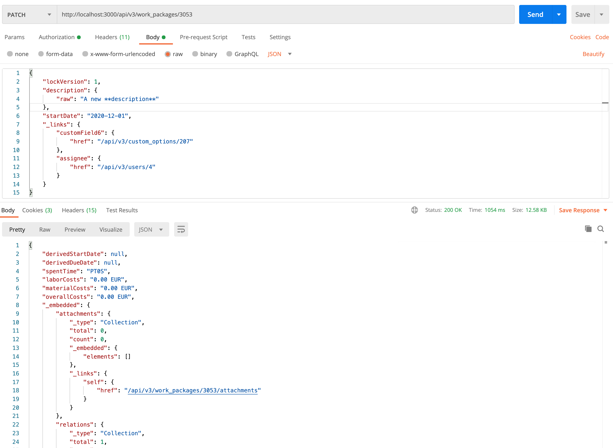

In this case, a PATCH request is issued. This means that the client does not have to provide all of the properties. Only the provided properties are altered
(with them being sent to null in case that is specified, e.g. `"dueDate": null`). After the update is done, the `lockVersion` will increase by one so a subsequent request will have to take this into account.

## Deleting a work package

Deletion of work packages is done be issuing a DELETE request to the work package's url:

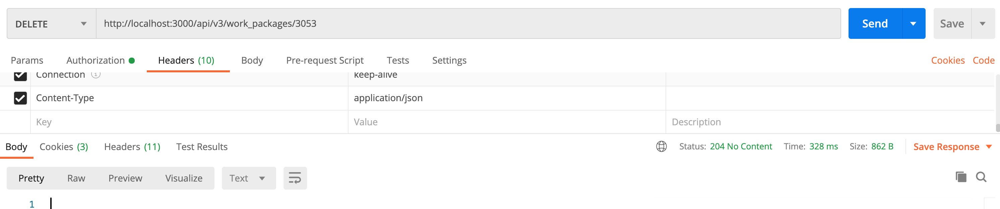

The `Content-Type: application/json` header was set in Postman by hand this time as no body is required.
