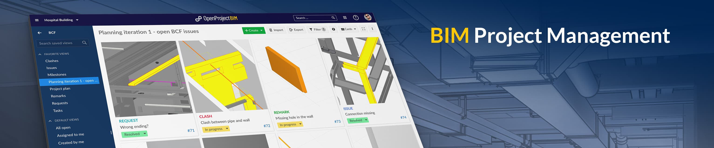

---
sidebar_navigation:
  title: BIM guide
  priority: 975
description: User guide for the OpenProject BIM edition.
keywords: BIM user guide
---
# BIM guide

Welcome to the OpenProject user guide for Building Information Modeling (BIM) with OpenProject.

On top of the general project management functionalities, OpenProject BIM enables construction teams to better plan, communicate and collaborate in their building projects. OpenProject BIM includes a 3D model viewer (IFC viewer), support of the BIM collaboration format (BCF) for BIM issue management, and much more powerful features, e.g. a [Revit integration](revit-add-in).

> **Note**: This guide only covers the specific [BIM features and functionalities of OpenProject](https://www.openproject.org/bim-project-management/). To learn more about the core features for project management of OpenProject (which are included in the BIM edition as well), please visit our [User Guide](../user-guide/).

## Overview of all topics regarding the OpenProject BIM edition

OpenProject BIM edition provides powerful features particular designed for the needs of construction industry. Please choose the topic you want to learn more about.

## IFC viewer

Upload your IFC building models and show them directly in the internet browser, without any additional software.

Details: [IFC-Viewer](ifc-viewer)

## BIM issue management

Create tasks directly connected to your building model, import tasks or export tasks from any other BIM application.

Details: [BIM Issue Management](bim-issue-management)

## Revit add-in

Stay always connected to OpenProject in realtime, show and create tasks while you're working in the Revit, using the Revit Add-in.

Details: [Revit Add-in](revit-add-in)

## How to get a free trial

You easily can start a new BIM trial on our [OpenProject BIM website](https://www.openproject.org/bim-project-management/). The have a look at the full description of how to start a new trial installation just follow the Link: [Create trial installation](../enterprise-guide/enterprise-cloud-guide/create-cloud-trial/).

## How to enable the BCF module

The BCF Module and the included IFC viewer can be enabled for every single project. Here you can find the description how to [enable a module](../user-guide/projects/project-settings/modules/) within your ***project settings***.

## Reporting bugs

You found a bug? Please [report it](../development/report-a-bug) to our [OpenProject community](https://community.openproject.org/projects/revit-add-in). Thank you!

## BIM FAQs

### Can OpenProject features be used within the OpenProject BIM edition?

Yes, you are able to use all known features. Within our BIM edition you get the full functionality and additionally some features only for the building industry.

### Is it possible to switch my existing OpenProject installation to the BIM edition?

Yes, an existing OpenProject on-premises (self-hosted) installation can easily be switched to the BIM edition without losing your settings and projects.

In our [Installation & Upgrade Guide](../installation-and-operations/bim-edition/) you can find a description how to switch.

### Is OpenProject BIM compatible to other BIM software?

Yes of course. We are of the opinion that the full potential of the BIM method only works through collaboration and the exchange of information (openBIM). For this reason we support the open BCF XML Standard. You are able to import and export all created BCF and stay interoperable with any other BCF software.

### Why do I need a Revit add-in?

You don't need it, but it makes your BIM Issue Management much easier. The *OpenProject Revit Add-In* allows you to use the open source project management software *OpenProject BIM* directly within your Autodesk Revit environment. It lets you create, inspect and manage issues right in the moment when you can also solve them - when you have your Revit application fired up and the relevant BIM models open. Issues get stored as BIM Issues centrally and are available to every team member in real time - thanks to our browser based IFC viewer even to those team members without expensive Revit licenses. No BCF XML import/export is needed. However, you still can import and export BCF XML as you like and stay interoperable with any other BCF software.

### Are there any system requirements for the Revit add-in?

The OpenProject Revit Add-In does not have any special system requirements. Only a supported [version of Autodesk Revit](./revit-add-in/#system-requirements) must be installed.

### Which versions of Revit are supported?

The OpenProject BIM Add-in for Revit supports the following versions:

- REVIT 2019
- REVIT 2020
- REVIT 2021

### Is it possible to use OpenProject BIM without Revit?

Yes! The Revit Add-In is just additional to the OpenProject BIM core functionality. It's still possible to import and export BCF XML as you like and stay interoperable with any other Software for BIM Issue Management.

### Are integrations with other BIM software planned?

Yes, we want to develop some other integrations to stay interoperable with other BIM software and make BIM Issue Management with OpenProject BIM much easier.

### How to enable the BCF module

The BCF Module and the included IFC viewer can be enabled or disabled for every single project. Here you can find the description how to [enable a module](../user-guide/projects/project-settings/modules/) within the project settings.

*The BCF Module is an OpenProject BIM Enterprise add-on. Please make sure, that you are already using the OpenProject BIM edition ([switch to the BIM edition](../installation-and-operations/bim-edition/))*

### Why can't I see a building model?

There are many potential reasons why you can't see your building model. Please check out the most common reasons and their solution:

- BCF Module could be disabled ([How to enable a module](../user-guide/projects/project-settings/modules/))
- Building model is hidden in Model hierarchy (check within the [IFC Model Tree](ifc-viewer/#show-or-hide-models-or-elements-via-model-tree))
- Building model is completely sliced ([clear all slices](ifc-viewer/#how-to-slice-the-building-model) within the model viewer toolbar)
- IFC file isn't uploaded yet or is invalid (please check the status of the uploaded file within the [IFC Model management area](ifc-viewer/#import-and-export-ifc-models)).
- IFC file does not have any geometry (please check if your IFC file has some geometry)

### Where to find the version of my Revit add-in?

To see which version of the Revit AddIn you are currently using, navigate to the OpenProject tab in the Revit taskbar and open the settings. Here you can see which version you are currently using.
