---
sidebar_navigation:
  title: BIM issue management
  priority: 200
description: How to use OpenProject BIM Issue Management.
keywords: BIM, BCF, IFC, BIM Issue Management, BCF-Management
---

# BIM issue management (BIM feature)

Within the *BCF-Module* you are able to manage *BIM Issues (BCF)*. All BIM Issues get stored as BCFs centrally and are available to every team member in real time. Below you find the most important features how to use the BCF Module to create, inspect and manage issues.

## What is a BIM issue?

A BIM Issue is a special kind of work package to communicate directly within the building model. It supports you to solve problems and coordinate the planning phase in a building project.

The BIM Issue is not only a description of a problem, the view of the building model is stored within the issue as well. This includes the current selection, view , rotation & zoom of the model.

OpenProject BIM supports the standard of the ***BIM Collaboration Format (BCF)***. All BIM Issues which are created within another *Open BIM* Software can be imported to work with this issue within our project management solution.

## Create a BIM issue

To create a BIM Issue you don't have to configure a new type of work package. Every work package (e.g. Task, Issue, Milestone, … ) can become a BIM Issue only by adding a viewpoint to the work package.

There are two ways to create new BIM Issue:

- [Create a new BIM Issue](#create-a-new-bim-issue) within the building model
- Add a viewpoint to an existing work package (doesn't matter which type)

BIM-Issues always belong to a project and a building model. Therefore, you first need to [select a project](../../getting-started/projects/#open-an-existing-project) and upload an IFC file to see the building .

Then, navigate to the BCF module in the project navigation.

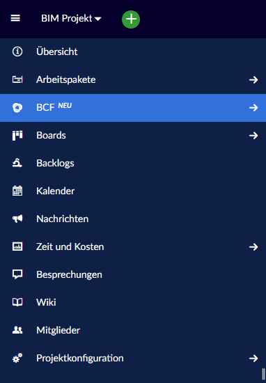

### Create a new BIM issue

To create new BIM Issues, you have to open the Model - Viewer first and create the view you want to save within the BIM Issue (e.g. zoom, [rotate](../ifc-viewer/#how-to-rotate-the-building-model), [slice](../ifc-viewer/#how-to-slice-the-building-model), [select](../ifc-viewer/#how-to-select-elements), [hide](../ifc-viewer/#show-or-hide-models-or-elements-via-model-tree), … ).

Click on the **+ Create new work package** and select the type of work package you want.

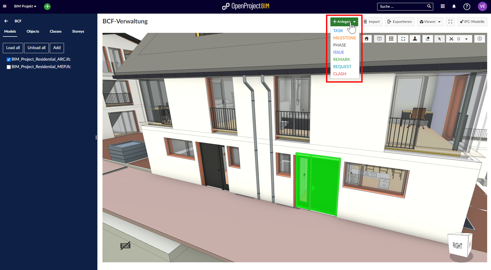

Now you can see a detail view of the new Issue. Describe all necessary information to work on that task and add a viewpoint by clicking on the **"+ Viewpoint"**-Button. Now the current Viewpoint of the Building Model is added to the Issue. After saving your new BIM issue is created.

*Within the viewpoint the current status of your building model is saved. So please check the view before - is there everything shown within the model viewer?*

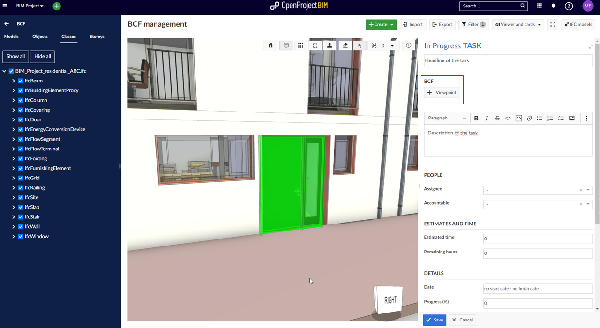

You also have the option of adding multiple viewpoints to a work package. Rotation, selection and visibility can be changed for every viewpoint to get a better model based communication.

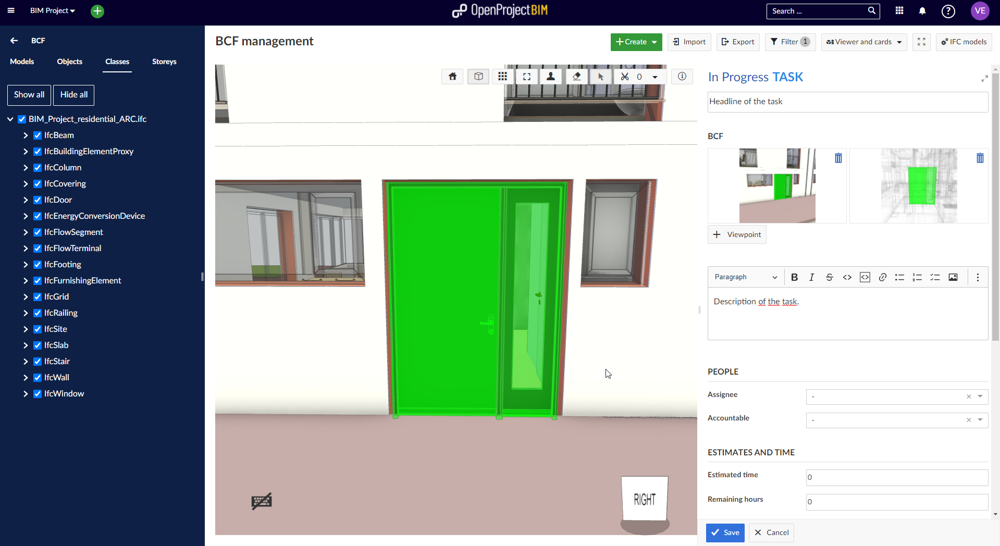

### Add a viewpoint to an existing work package

The workflow of adding a viewpoint to an existing work package is similar to creating a new BIM Issue. To switch an existing work package to a BIM Issue just follow the steps:

Open the **BCF-Module** to see the building model.
 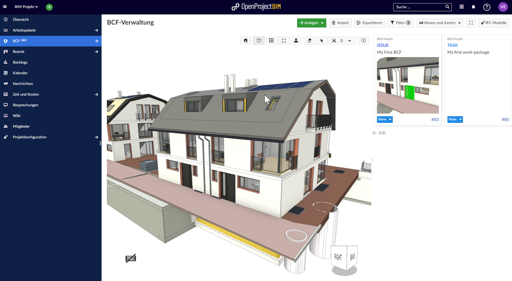

Make sure the "Model Viewer & Maps" - View or "Model Viewer & Table" - View is selected within the **OpenProject-Toolbar**.

Now open the **work package Details** by double click on the work package ("my first work-package"). Now you are able to add a viewpoint like it is described above.

## BIM issue handling (details view)

The handling of BIM Issues is similar to the handling of work packages (including configuration of the attribute). To jump to a viewpoint of an existing BIM Issue the model viewer has to be activated (visible in the center of your screen) or you have to open the detail view of the work package.

### Jump to a viewpoint with the details view

If the Model viewer isn't shown yet, open the Detail - view of the BIM Issue and follow the Cube symbol of the preview. Now the model viewer opens and the viewpoint of the BIM Issue will be displayed.

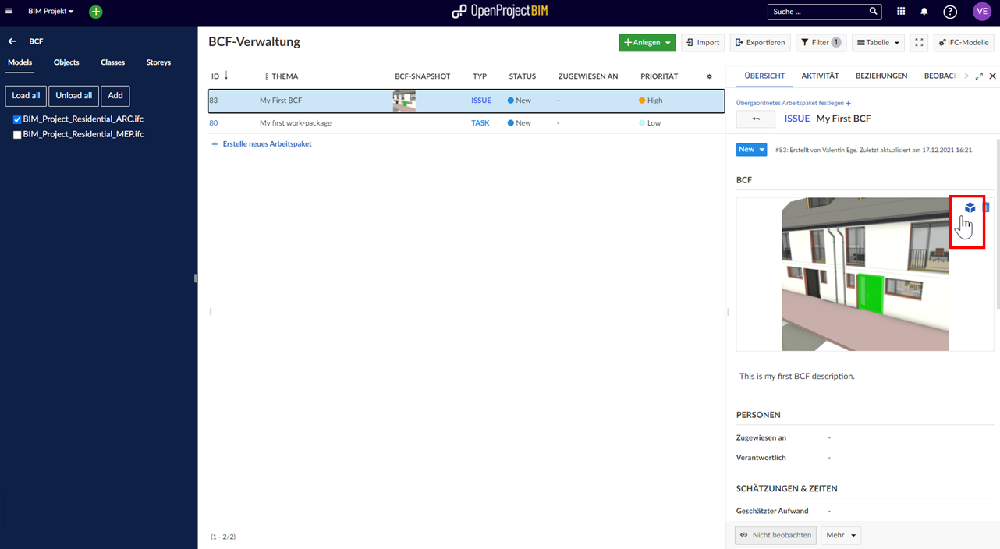

### Switch between different viewpoints

After creating multiple BIM Issues you are able to jump between different viewpoints easily. The "Viewer and Cards" - Mode shows all of your BIM Issues. With a single click at the preview of the BIM Issue, the model viewer changes immediately.

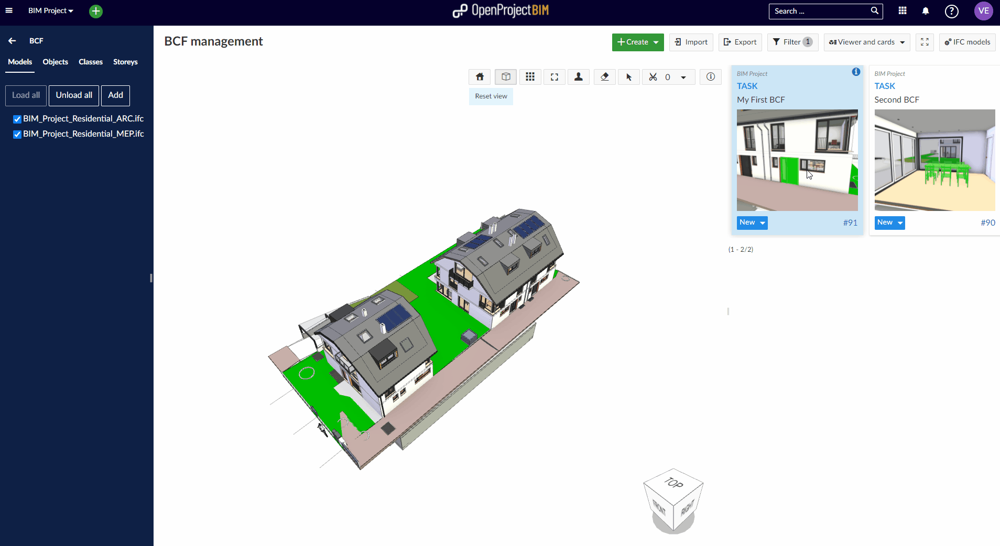

### Configuration of BIM issues

To create BIM Issues you don't have to configure additional work package types. Every existing work package can become a BIM Issue by adding a viewpoint. Before you can add a viewpoint to a work package, this work package must be enabled for viewpoints in the system administration.

## View and find BIM issues (cards and list view)

### Overview

You can switch between different View modes within the OpenProject toolbar. Just open the dropdown menu and select the view which fits best to your situation.

 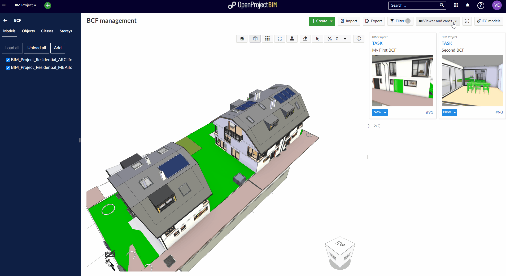

### Viewer and cards

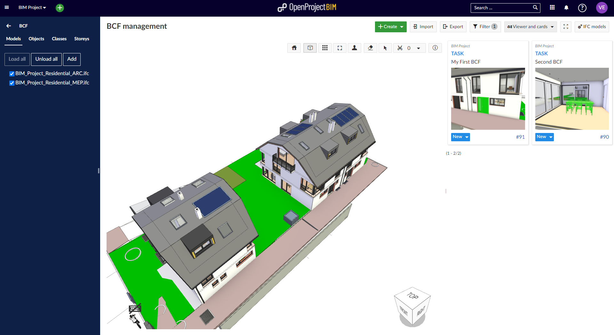

The detail view of every work package can be shown by different user actions. To open the viewpoint and see the description in the details view, just double click at the BIM Issue in the card view. After double click your current viewpoint in the model viewer will be reset and the viewpoint of the BIM Issue including all details will be displayed.  

To view only the detail view of the BIM issue without resetting the current view of the model, you can click on the work package number ("#…") or the "information icon" on the card.

### Cards mode

Within the cards view you are not able to jump directly to a viewpoint. First you have to open the details view by using the "information icon" or the work package number ("#…") at the card. There you can find the "Cube" which leads you to the viewpoint within the appearing model viewer.  

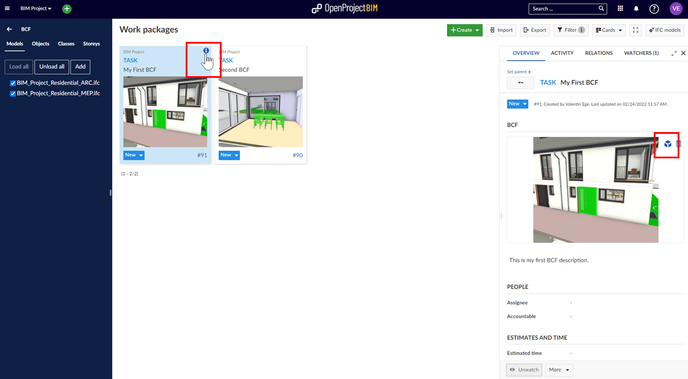

### Viewer and table

To open the BIM Issue in this mode just click at the work package in the table. By double click at the BIM Issue the viewpoint will be shown and the details will appear. The details of each work package can be shown without changing the current view of the model by single click at the work package ID.

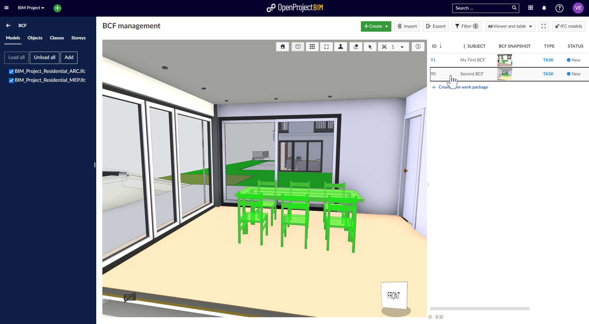

### Table

Within the table view you are not able to jump directly to a viewpoint. First you have to open the details view by using the "information icon" or the work package number ("#…") or double click at the work package. At the details view you can find the "Cube" which leads you to the viewpoint within the appearing model viewer.  

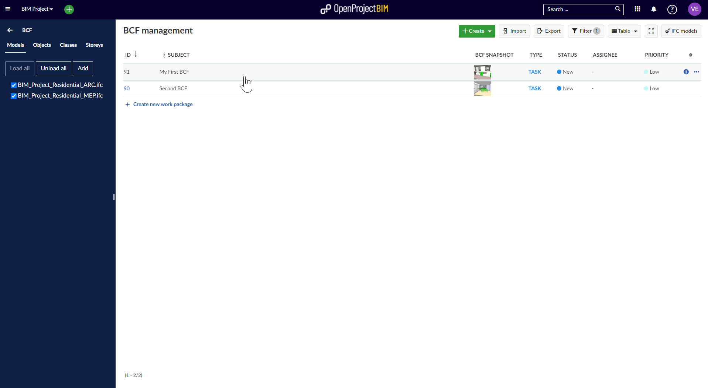

## Filter BIM issues

You are able to filter BIM Issues by using the filter button in the **OpenProject toolbar**. The filter is usable in every view.

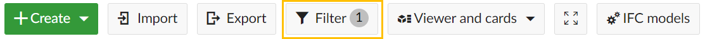

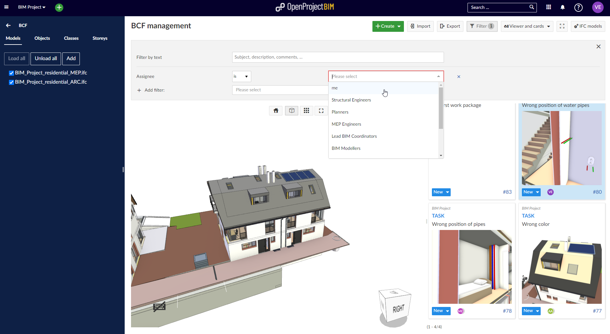

## BIM issues in work package module

BIM Issues are also listed in the work package module. This supports you to manage your building project in the best way and get an overview of all issues. To separate work packages and BIM Issues we created a new filter which enables you to filter BIM Issues.

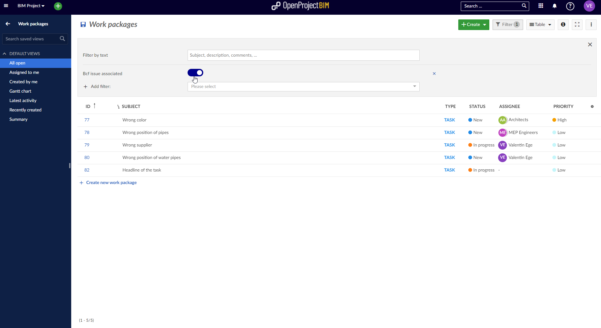

## Import and export BCF issues using BCF

Within the BCF module you are able to upload BIM Issues which are created within other software and download already existing files to manage them within other BIM project management solutions. Just Click on the ***"Import"-Button*** or ***"Export"-Button*** within the OpenProject Toolbar.

### Import of attributes

After importing a BCF Issue (or multiple Issues at the same time) from another software, OpenProject will match existing attributes and types of the work package.

If attributes of the imported BCF Issue can't be matched automatically (because they are not available within your project configuration), you are able to synchronize the values manually.

**Currently the following attributes can be synchronized and matched:**

- Title & Description
- Priority
- Type (e.g. Clash)
- Status
- Viewpoint
- Creation Date
- Creation Author
- Modified Date
- Modified Author
- Assignee
- Due Date
- Comments

After a successful matching of the attributes the topics will be displayed in OpenProject.

### Outdated BCF issues

If there are more recent changes to the work package in OpenProject than in the imported BCF ("ModifiedDate"), the import will be rejected.

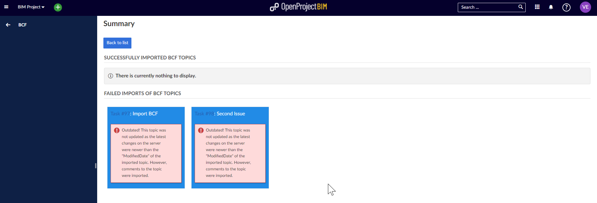
