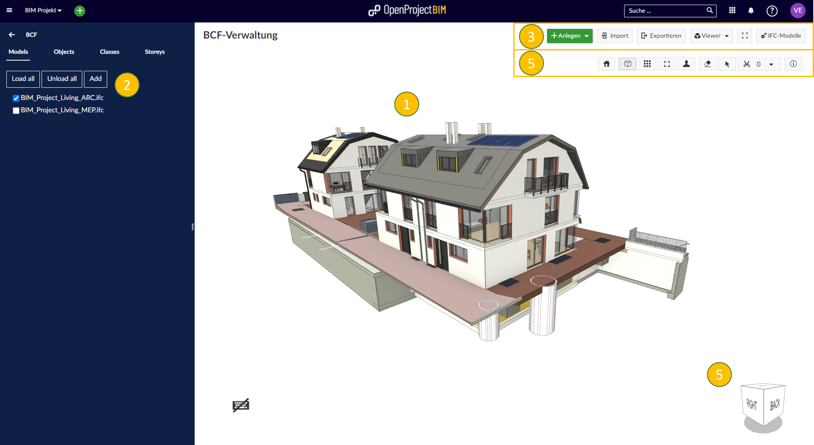
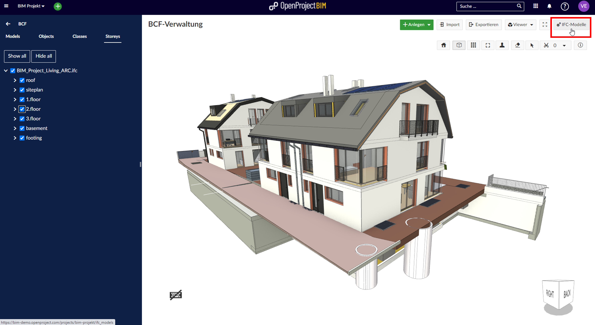
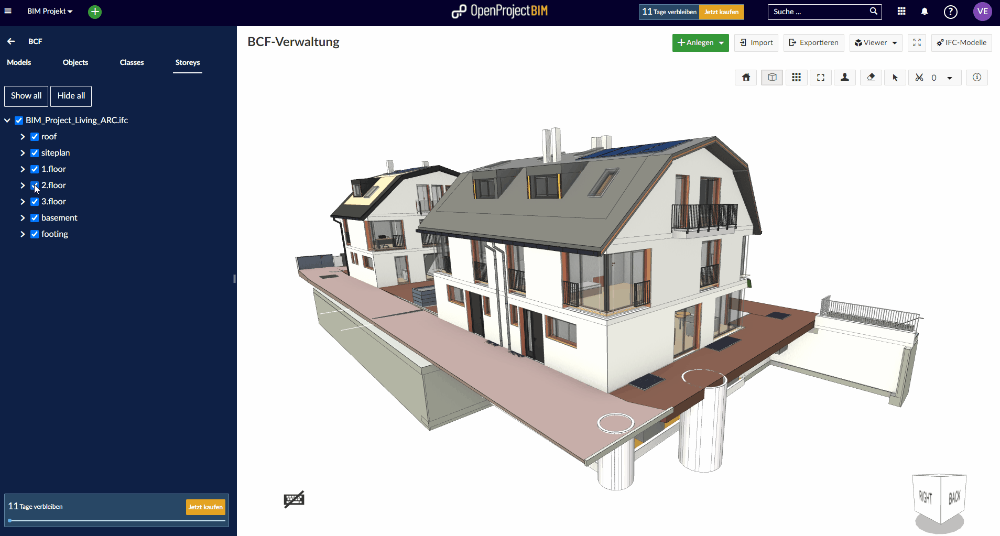

---
sidebar_navigation:
  title: Revit Add-in
  priority: 900
description: How to use the OpenProject IFC-Viewer.
robots: index, follow
keywords: BIM, BCF, IFC, Viewer
---

# IFC-Viewer (BIM feature)

OpenProject BIM includes a very powerful IFC viewer to show and interact with building models in 2D & 3D.

IFC-Files can be uploaded and shown directly within your Web-Browser without installing any additional software on your computer. 

| Topic                                                        | Content                                           |
| ------------------------------------------------------------ | ------------------------------------------------- |
| [Basics](#basics)                                            | Overview of the BIM module                        |
| [Show / Hide](#show-or-hide-elements-or-models)              | Show or Hide elements or models                   |
| [IFC Import / Export](#import-and-export-ifc-models)         | Import and Export IFC Models                      |
| [How to rotate?](#how-to-rotate-the-building-model?)         | How to rotate the building model?                 |
| [How to select elements?](#how-to-select-elements?)          | How to select Elements within the building model? |
| [How to slice the building model?](#how-to-slice-the-building-model?) | How to slice the model?                           |
| [How to clear slices?](#how-to-clear-slices?)                | How to clear slices?                              |

## Basics

The BCF Module has included a very powerful IFC viewer. Here is a short overview of available user actions:

1. **IFC Model Viewer** to have a look at the building model directly within OpenProject BIM.
2. **IFC Model Tree** to see the IFC Model Structure and show / hide elements.
3. The **OpenProject toolbar** shows the most important user actions like createing new (BIM) issues, Import & Export BCF files, Change OpenProject View and upload & download IFC-Models 
4. The **View Cube** to rotate the building model.
5. The **IFC-Viewer toolbar** to interact with the building model (e.g. change perspective, hide/ show elements, select elements & slice the building model)

## Import and Export IFC Models

Within the BCF module you are able to manage your IFC files. You are able to upload new building models and download already existing files. Just Click on the ***"IFC-Models"-Button*** within the OpenProject Toolbar. 

@Valentin: Alternativer (manchmal einfacherer) Weg:

 

@Valentin: Hier bitte starten mit einem Screen, wie es aussieht, wenn keine Modelle da sind. Dann unbedingt noch Screenshots der "Modellverwaltung" machen (mit Hinweisen zum Hochladen, Überschreiben, Umbenennen), und insbesondere kurz auf das Thema Standardmodelle eingehen.

@Valentin: auch wenn dadurch hier eine kleine Dopplung entsteht, würde ich hier kurz anhand eines Screenshots zeigen, wie man Modelle im Viewer ein und ausblendet

## How to rotate the building model?

To rotate the IFC model you either left-click on the building viewer and ***rotate the building model by panning*** your cursor **or** use the ***View Cube*** in the right bottom corner for navigation.

## Homebutton, 2D/3D, Orthografic, Fit View and First Person Mode

@Valentin: gleich zu beginn würde ich diese Dinge einarbeiten ==> bspw. Homebutton ist hilfreich, wenn man die Ansicht zurücksetzen will (weil man irgendwas verstellt hat oder so)

## How to slice the building model?

To have a deeper look within the building model you are able to slice the whole building. To start slicing click on the "***scissors symbol***" within the ***IFC-Viewer toolbar*** and left-click on an element which has the same angle you want to slice (you can edit this angle later as well). Now there are shown some arrows. Grab one and slice the model by dragging the arrow to the location you want. 

## How to clear slices?

You are able to clear all slices by using the ***dropdown*** menu next to the "***scissors symbol***" within the ***IFC-Viewer-Toolbar***.

## How to select elements?

To select elements within the building model, you have to activate the selection mode by clicking on the highlighted toogle button placed in the ***IFC-Viewer toolbar***. After activating the selection mode you are able to select a single or multiple elements within the viewer by left click. Your individual selection won't be reset after leaving the selection mode. You are able to reset your current selection with the context menu (right click).

## Show properties

@Valentin: Wichtig fände ich noch die Anzeige von Eigenschaften. (rechte maustaste "inspect properties")

## Show or Hide elements via viewer

@Valentin: rechte Maustaste oder über den radierer in der navigation

@Valentin: Hier bitte auch auf den xray mode eingehen

@Valentin: auch an die entsprechende Stelle im modelltree zu springen "Show in Explorer" ist eine wertvolle Funktion

@Valentin: Fit view evtl. auch

## Show or Hide modells or elements via modell tree

If you have uploaded several IFC models of one building (e.g. one for each discipline - Architecture, Structural & MEP) and want to have a look at a single model or just want to hide specific elements, you are able to hide them by changeing the status of the ***checkbox within the model tree.***

@Valentin: ich würde hier folgendes zeigen

1. Modelle ein- und ausblenden
2. Storey (bei gleichzeitger Anzeige von ARC und TGA Modell ==> dazu an einer Seite aufschneiden)
3. Classes (bspw. Fenster, Türen o.ä.)

## Show or Hide modells or elements via modell tree

If you have uploaded several IFC models of one building (e.g. one for each discipline - Architecture, Structural & MEP) and want to have a look at a single model or just want to hide specific elements, you are able to hide them by changeing the status of the ***checkbox within the model tree.***

@Valentin: ich würde hier folgendes zeigen

1. Modelle ein- und ausblenden
2. Storey (bei gleichzeitger Anzeige von ARC und TGA Modell ==> dazu an einer Seite aufschneiden)
3. Classes (bspw. Fenster, Türen o.ä.)

