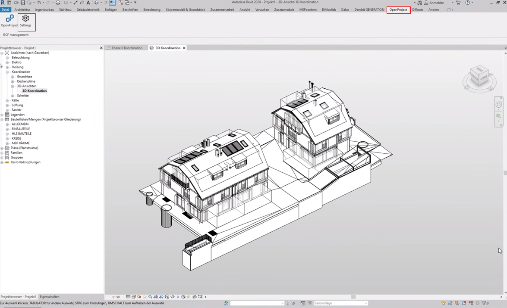
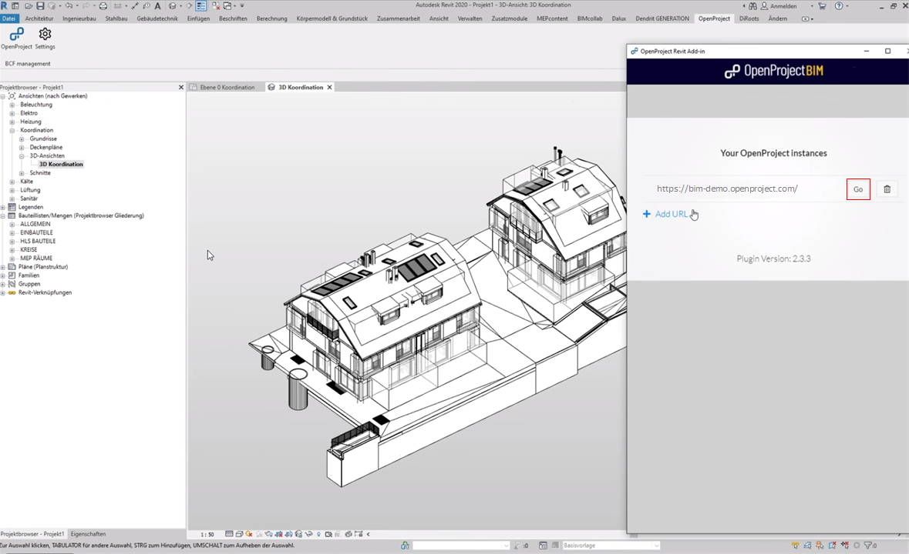
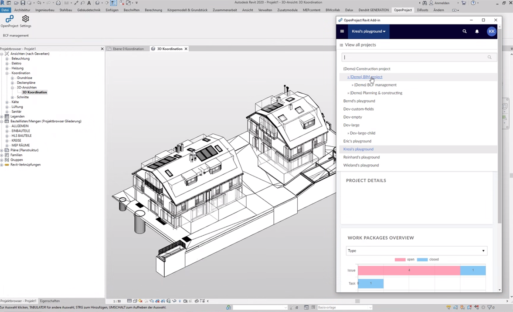
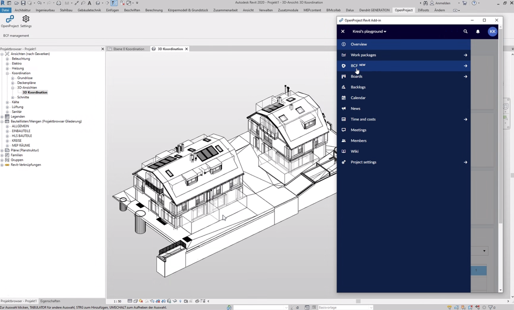
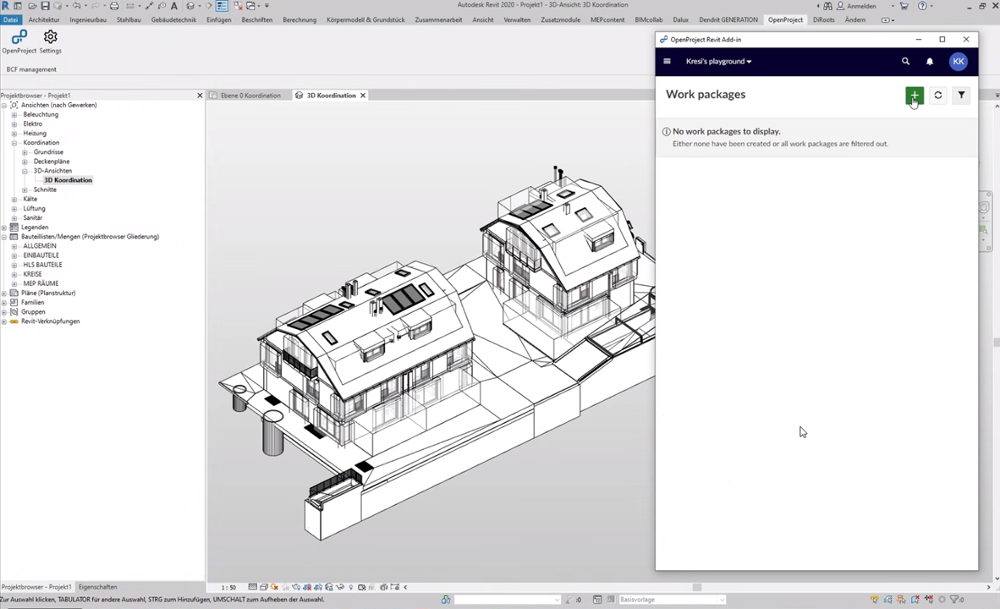
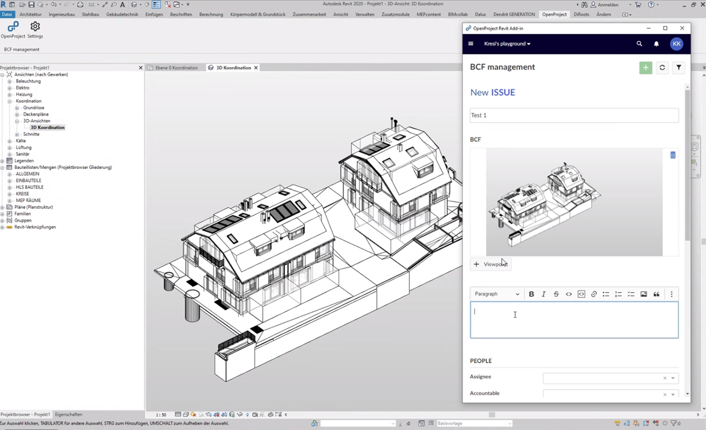
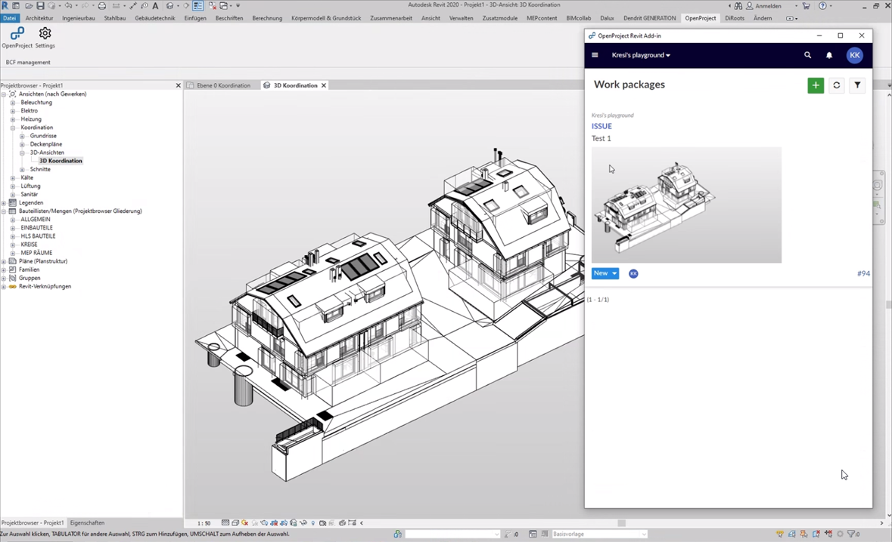
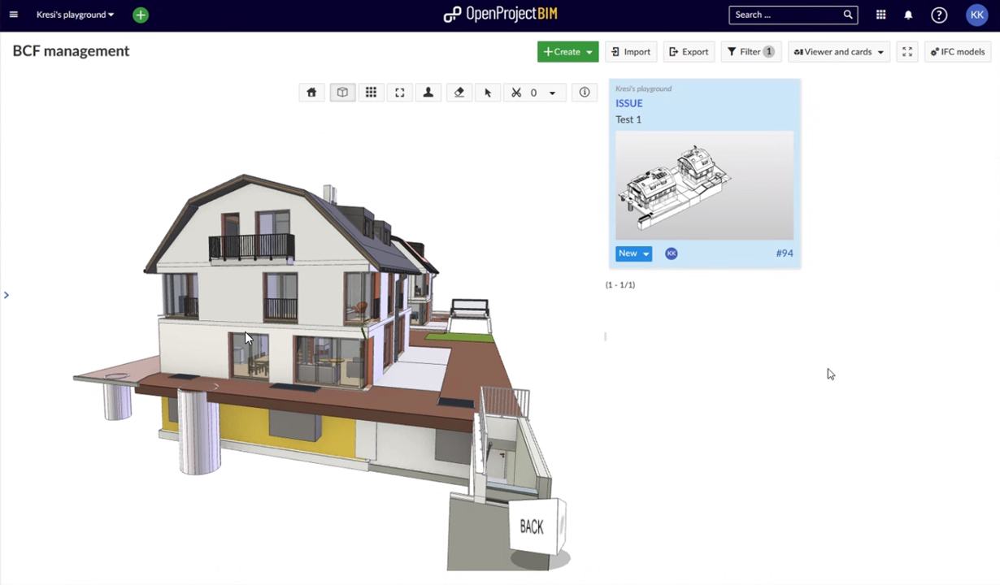

# Revit Add-In (BIM feature)

The *OpenProject Revit Add-In* allows you to use the open source project management software *OpenProject BIM* directly within your Autodesk Revit environment. It lets you create, inspect and manage issues right in the moment when you can also solve them - when you have your Revit application fired up and the relevant BIM models open. Issues get stored as BCFs centrally and are available to every team member in real time - thanks to our browser based IFC viewer even to those team members without expensive Revit licenses. No BCF XML import/export is needed. However, you still can import and export BCF XML as you like and stay interoparable with any other BCF software.

To download the latest version (v2.2.3) of our OpenProject Revit AddIn click here: [DOWNLOAD](https://github.com/opf/openproject-revit-add-in/releases/download/v2.3.3/OpenProject.Revit.exe)

**Note**: OpenProject BIM & BCF Management is a Premium Feature and can only be used with [Enterprise cloud](../../enterprise-guide/enterprise-cloud-guide/) or [Enterprise on-premises](../../enterprise-guide/enterprise-on-premises-guide/). An upgrade from the free Community Edition is easily possible.

| Topic                                                        | Content                                   |
| ------------------------------------------------------------ | ----------------------------------------- |
| [Before Usage](#before-usage)                                | First steps before usage                  |
| [How to login?](#how-to-login)                               | How to link Revit and OpenProject BIM?    |
| [How to select a Project?](#how-to-select-a-project?)        | How to select an existing project?        |
| [Working with BIM Issues](#working-with-bim-issues)          | How to Create, Open or Edit a BIM Issue?  |
| [Synchronize Tasks between Revit and OpenProject](#synchronize-tasks-between-revit-and-openproject) | How to synchronize tasks?                 |
| [How to install?](#how-to-install)                           | How to install the Revit Add-In?          |
| [How to update?](#how-to-update)                             | How to get the latest Version?            |
| [How to uninstall?](#how-to-uninstall?)                      | How to uninstall the Revit Add-In?        |
| [Troubleshooting](#troubleshooting)                          | Troubleshooting of Windows' Error Message |
| [Reporting Bugs](#reporting-bugs)                            | How to report a bug.                      |

## Before Usage

Please check the following steps before useing the OpenProject BIM Edition.

1. Does OpenProject BIM support your [Version of Revit](#system-requirements)?
2. Did you already install the latest Version of our OpenProject BIM Addin?
3. Is the latest IFC Model uploaded to your Project in OpenProject BIM?

If you can answer all questions with "yes" you are ready to start using our Revit Addin.

## How to install?

### System Requirements

The **OpenProject Revit AddIn** does not have any special system requirements. Autodesk Revit must be installed. The following versions of Revit are supported:

- 2019
- 2020
- 2021

### Download the Installer

To download the setup application for the **OpenProject Revit AddIn**, click here: [DOWNLOAD](https://github.com/opf/openproject-revit-add-in/releases/download/v2.3.3/OpenProject.Revit.exe)

You can find the latest version of our AddIn on [Github](https://github.com/opf/openproject-revit-add-in/releases/latest) as well.

### Installation 

After you have downloaded the file, please run it to start the installation process.

1. **Start Installation process**
   In the first screen, click *Next* to continue: 

2. **Select Revit Version**

   Next, select the Revit version you have installed locally and click *Next* to continue. You can select multiple versions:

3. **Start Installation**

   Verify the installation steps are correct in the next screen and click on *Install* to install the **OpenProject Revit AddIn**:

4. **Ready to use**

   Please wait a few moments for the installation to complete and then click *Finish* to finish the installation.

## How to update from an Earlier Version?

If you already have an earlier version installed, simply follow the same steps as for a new installation ([How to install?](#how-to-install)). The existing **OpenProject Revit AddIn** will be updated.

## How to login?

After Installing the OpenProject BIM AddIn you can find a new tab within the Revit taskbar named "OpenProject". To login you have to open the **settings** first.

The settings will appear in a new tab. Within this tab you have to insert your own ***OpenProject BIM URL*** and confirm with "Go". Your OpenProject account is now linked to your Revit application and you can close the tab.

## How to select a Project

After connecting your OpenProject BIM instance you are able to start working with your BCF Tasks within Revit. Firstly you have to open the **OpenProject Tab** in the taskbar and start the application. 

After starting the application a new tab will be created and you are able to select the Project you want to work in.  

## Working with BIM Issues

To work with BIM Issues, please open our AddIn and navigate to our BCF Module. 

Within this module all existing work packages are displayed. Within this demo project doen't exist any work package yet. To create a new one, click on the "add new workpackage"-Button.  

An empty form for new work packages is now displayed. After adding a title and detailed information describing your issue, you have to add a viewpoint. This viewpoint saves your current view & selection of the building model (so check the rotation, selection and zoom of the model before). 

And the most important thing: **don't forget to save** the work package.

To open a BIM Issue (BCF) and restore the viewpoint you have to navigate to the BCF Module and just click on the BIM Issue you want to open. The behavior of working with the issues is almost the same like in OpenProject.

@Valentin: Hier noch n bisschen drauf eingehen, dass die Bedienung genauso ist wie beim BCF Management (mit Link), die wenigen Unterschiede:

* dass dem IFC Veiwer wird Revit verwendet wird
* weniger Platz ==> reduzierte Ansicht 
* dass ein paar wenige Bedienelemente des Browsers fehlen, die man evtl. gewohnt ist (zurück button)

## Synchronize Tasks between Revit and OpenProject

OpenProject BIM and Revit automatically synchronize all BIM work packages. You don't have to pay attention to anything else and you can manage your entire project directly in OpenProject. Whatever you do, users of OpenProject BIM Edition will see any changes in the browser as well.  

## How to uninstall the OpenProject Revit AddIn?

To remove the **OpenProject Revit AddIn** remove the AddIn like any other AddIn from Revit. First close any running instance of Revit. Then you'll have to enter the directory `C:\ProgramData\Autodesk\Revit\Addins\<REVIT_VERSION>`. There you must delete the file `OpenProject.Revit.addin` and the folder `OpenProject.Revit`. After a restart of Revit, the **OpenProject Revit AddIn** is no longer available.

## Troubleshooting

### 'Your computer was protected by Windows' Error Message

This is an internal Windows defense mechanism called *Windows SmartScreen*. When you run the installer, you might see a message similar to this:

This can happen when a new release was not yet installed by many users, so internal Microsoft services do not yet know about the trustworthiness of the **OpenProject Revit AddIn** version.

To continue, please click on the highlighted part labeled *Additional Information*, then you should see a screen like the following:

Ensure that publisher says *OpenProject GmbH*. That means the installer was correctly signed by OpenProject and is safe to use.

To proceed with the installation, click on *Run Anyway* and the installation will start.

## Reporting bugs

You found a bug? Please [report it](https://docs.openproject.org/development/report-a-bug) to our [OpenProject community](https://community.openproject.com/projects/revit-add-in). Thank you!
