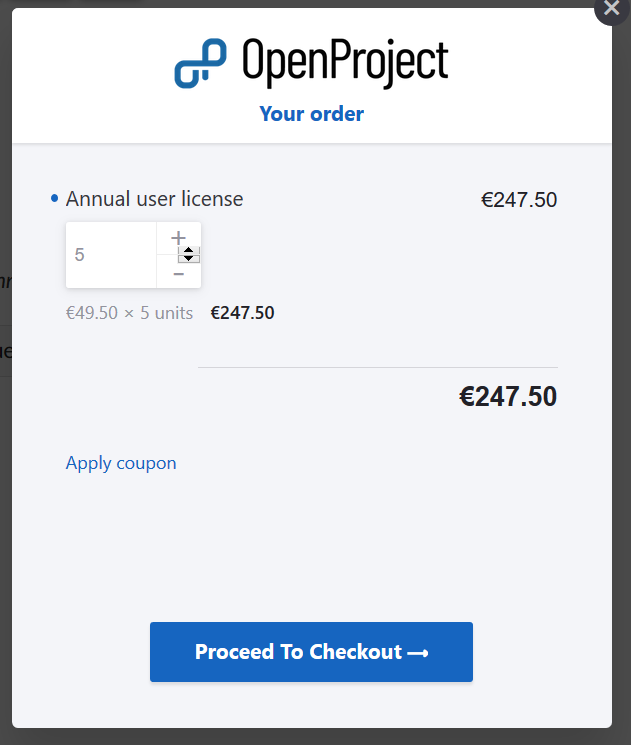
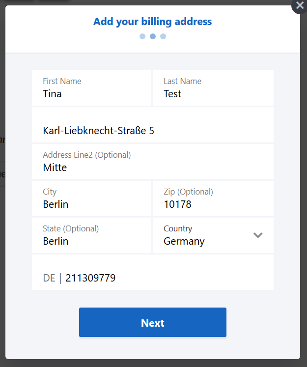
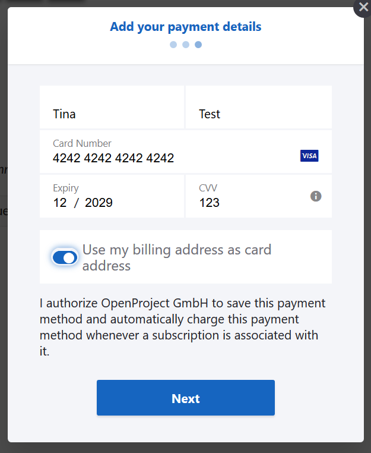
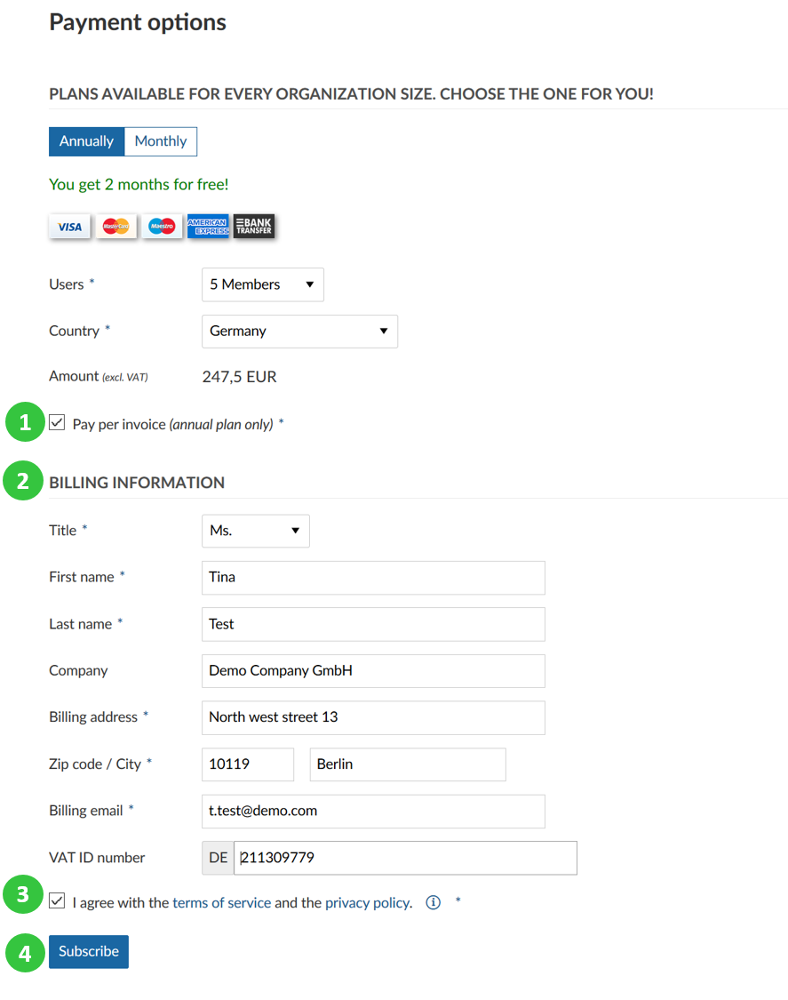
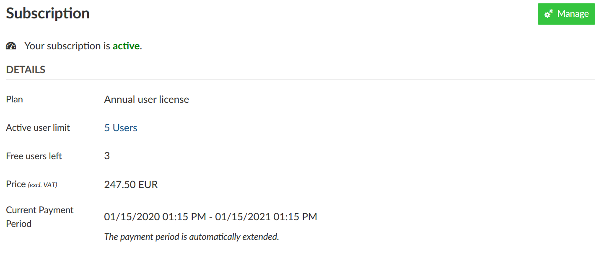

---
sidebar_navigation:
  title: Subscribe
  priority: 960
description: Book the OpenProject Cloud Edition.
robots: index, follow
keywords: Book Cloud Edition
---
# Book the Cloud Edition

After you have tested the OpenProject Could Edition and want to continue working with OpenProject, you can subscribe to one of our plans.

Please refer to our website for the Cloud Edition [pricing](https://www.openproject.org/pricing/).

You can subscribe to a monthly or yearly plan. The subscription can be **paid via Credit Card or Bank transfer** (only for yearly subscription).

To upgrade your trial to the full version, **click on the BUY NOW teaser**, e.g. in the application header or project menu.

You will be directed to the -> *Administration* -> *Billing*.

(1) First, choose if you want to subscribe to an **annual or monthly plan**. Only annually billed plans can be paid via bank transfer.

(2) Select the **amount of users** from the drop-down list. It is only to book members in the steps of 5, minimum 5 users.

(3) Select your **country** from the drop-down list.

(4) The **total amount** (excl. VAT) will  be displayed.

(5) Click the **Subscribe** button.

Next, click the **Proceed to Checkout button**.

Verify your **account details** and click the blue Next button.

Add your **Billing address and VAT number** and click the blue **Next** button.

Enter your **payment details** (credit card information). Make sure to verify your address (same as for the invoice) in order to avoid payment failures via credit card. If your credit card is stated to a different address, make sure to enter it here as card address.

Click the blue **Next** button.

You will once again get an overview about your subscription. 
Here, you can edit the account or billing information if needed.

Subscribe to our regular newsletter in order to keep up to date with latest product developments.

Click the blue **Pay button and subscribe** to the OpenProject Cloud Edition.

A payment receipt will be sent via email.

## Pay per invoice (via bank transfer)

If you book an annual plan you can also choose to pay via invoice.

(1) Click the **Pay per invoice check mark**.

(2) Enter your **Billing information**. Make sure to validate your billing email to receive the required information and invoice.
If you are a business customer, please enter a valid **VAT ID number**.

(3) You have to **agree to our terms of services and privacy policy**.

(4) Click the blue **Subscribe** button.

 

You will get an overview of your booked subscription.

An invoice will be sent via email to the Billing email.

## Frequently asked questions (FAQ)

### Is there an advantage of the annual over the monthly OpenProject plan?

We offer two months of the Cloud Edition for free if you choose an annual plan.
