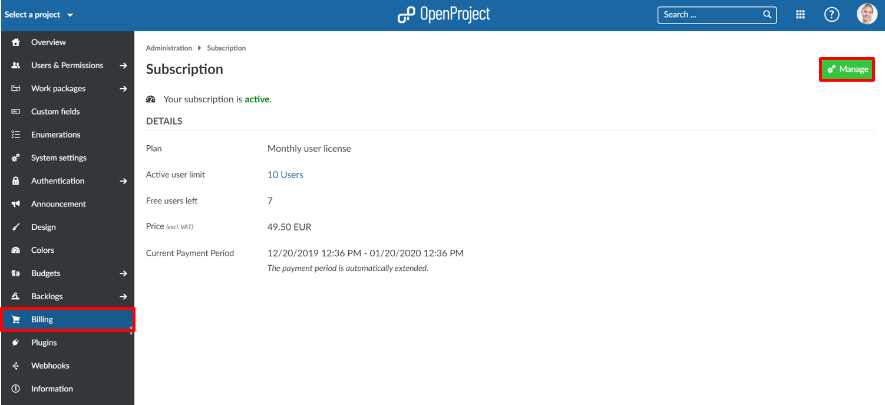

---
sidebar_navigation:
  title: Invoices and billing history
  priority: 980
description: View the invoices and payment history.
robots: index, follow
keywords: invoices, payment history
---

# Invoices for the OpenProject Cloud Edition

You will **receive an invoice for your OpenProject Cloud Edition via email** to the email address which you used during the booking process.

The invoice lists the subscription (billing) period as well as the next billing date.

You will also see the payment status. 
For invoices via bank transfer, the money needs to be paid via bank transfer to the bank account listed at the bottom of the invoice. 

**Note**: For the correct assignment of payments, please enter the  invoice number on your bank transfer.

## Payment history and download invoices

If you want to see the billing history or download older invoices of your Cloud Edition, navigate to -> *Administration* -> *Billing* within your system's Administration.

Click the green **Manage button** at the top right.

In the overlay window, click on the link **Billing History**.

Here, you will get an overview about all your past payments for the Cloud Edition. 

With the **Download link** you can download the inovices.

The **Load more link** will open more positions on the list.

## Frequently asked questions (FAQ)

### Can we pay the OpenProject cloud edition by transfer?

Yes, for customers in the EU it is possible to pay by bank transfer (as well as by credit card).
To do this, you can sign into your OpenProject environment and select the "Buy now" button from the top menu. You are then directed to the payment page, where you can select the number of users you want to work with and your country. Then you can check the option to pay by invoice and fill out the billing information. You will then receive an invoice from us.
