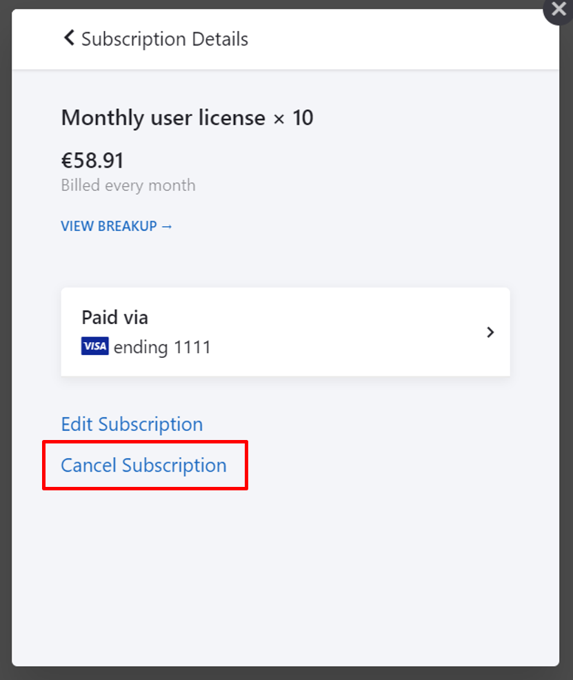

---
sidebar_navigation:
  title: Manage subscription
  priority: 970
description: View the invoices and payment history.
robots: index, follow
keywords: manage subscription
---

# Manage your OpenProject Cloud subscription

If you want to make changes to your subscription (Up- or downgrade, cancel), navigate to -> *Administration* -> *Billing* within your system's Administration.

Click the green **Manage button**.

In the overlay window, you can choose between several topics:

| Popular Topics                                               | Description                                            |
| ------------------------------------------------------------ | :----------------------------------------------------- |
| [Upgrade, downgrade or cancel](#update-existing-subscriptions) | How to upgrade, downgrade or cancel a subscription?    |
| Edit Account information                                     | How to edit account information?                       |
| Edit Billing Addresses                                       | How to edit the billing addresses?                     |
| Edit or add payment methods                                  | How to edit or add the payment method?                 |
|                                                              |                                                        |
| [View billing history and dowload invoices](../invoices-and-billing-history) | How to view the billing history and download invoices? |

## Update existing subscriptions

If you want to up- or downgrade the amount of users of an existing subscription, click on the subscription listed at the top.

Here you can either **Edit or Cancel the existing subscription**.

### Upgrade or downgrade subscription

You can **upgrade an existing subscription** at any time. Open the [Manage subscription menu](#manage-your-subscription). Additional users will be billed on a prorated basis, this means you will only pay the amount of additional users until the end of the current subscription period.

You can **downgrade a subscription** to the end of a current subscription period. This means the downgrade becomes active with the next payment term.

Click the **Edit Subscription** link.

You can choose the new amount of users. Your next payment will be displayed below.

Click the blue **Update your subscription now button** to save the changes.

### Cancel subscription

To cancel your subscription, open the [Manage subscription](#manage-your-openproject-cloud-subscription) form and click to [update the subscription](#update-existing-subscriptions) you want to cancel.

Click on the **Cancel Subscription link** if you want to terminate your OpenProject Cloud Edition subscription.

**Note**: After cancellation you will receive an email confirmation. Your subscription will be terminated at the end of the current subscription period. After cancellation your data will be kept for a certain period of time in case of reactivation of a subscription.

## Frequently asked questions (FAQ)

### How can I increase the number of users in the OpenProject Cloud Edition?

Please note that the minimum number of users is 5. You can then increase the number of users in steps of 5. Just write an email to sales@openproject.com.

### Is it possible to change the number of users in the OpenProject Cloud Edition?

You can always increase the number of users. The number of users can be increased in steps of 5 (e.g. you could start with 5 users and then increase the number of users to 10 users). You can purchase the Enterprise Edition from [here](https://www.openproject.org/enterprise-edition/). Simply click on the button "Book now" and follow the steps. A reduction in the number of users would take effect after the current service period.

### Do you have OpenProject guest accounts?

Currently, all users working in the OpenProject Enterprise Edition need a license in order to access OpenProject. Regarding payments we only count the active (not blocked) users.

### Can I run OpenProject as a single user?

Our minimum plan for the Cloud Edition and Enterprise Edition is five users. Our pricing scheme covers three subscription options: Community ($0), Cloud (€4.95/member/month or approximately $5.60/member/month), and Enterprise (€5.95/member/month or approximately $6.73/member/month). We recommend to start the [community version](https://www.openproject.org/download-and-installation/) free of charge if the 5 user minimum is an issue.