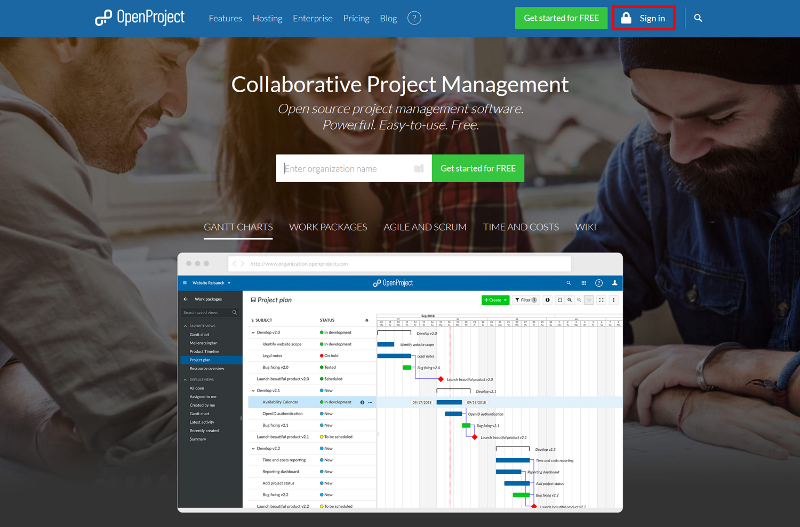
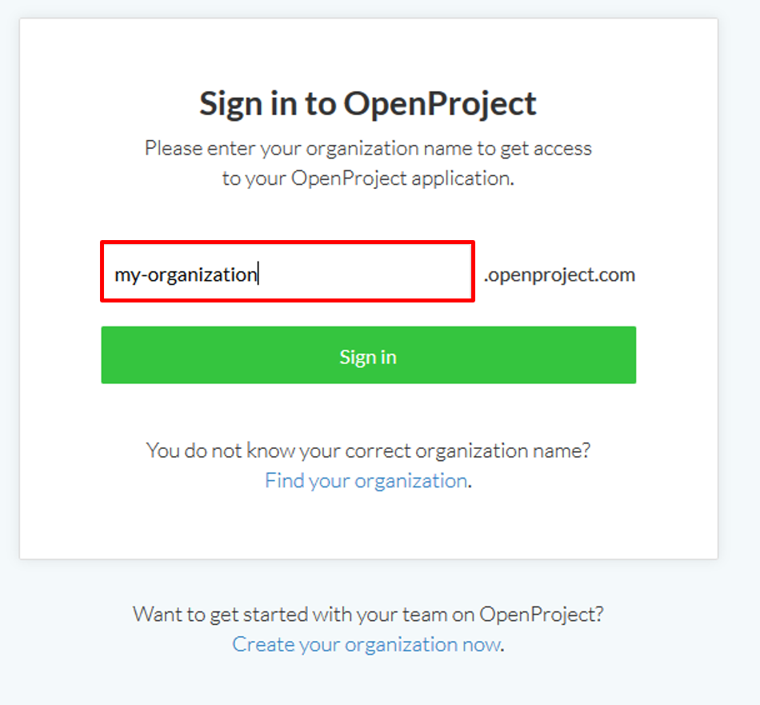
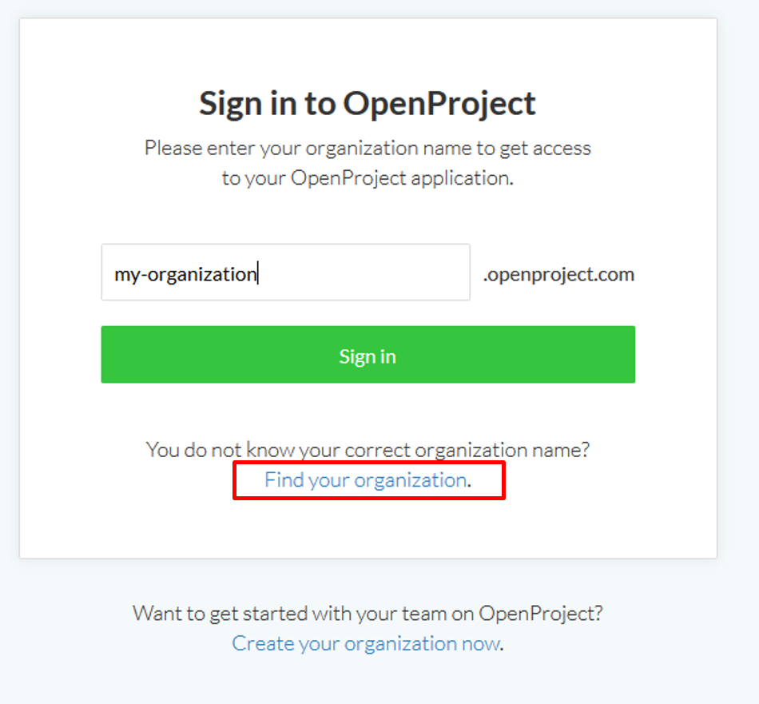

---
sidebar_navigation:
  title: Sign in
  priority: 997
description: Sign in to your OpenProject Cloud Edition.
robots: index, follow
keywords: sing in
---

# Sign in to the OpenProject Cloud Edition

Login to your OpenProject Cloud Edition via the website or by entering directly the URL of your OpenProject instance.

If you do not have an OpenProject Cloud Edition, you can [set up your own OpenProject installation](../create-trial-installation).

## Sign in via the OpenProject website

In order to sign in to your OpenProject Cloud Edition via our website, navigate to https://www.openproject.org/ and click the **Sign in button** at the top of the page.

You are asked to enter your OpenProject organization name. This is the name that appears in the first part of the URL, e.g. my-organization.openproject.com.

Click the green **Sign in button** and you will be logged into your OpenProject installation.

## Forgot organization name of OpenProject Cloud Edition

If you forgot the URL or the organization name of your OpenProject Cloud Edition and need to find your organization, you can click the **Find your organization** link on the Sign in page of the website.

You will then be asked to enter your e-mail address with which you signed in to OpenProject.

Click the Submit button to get an email with further information.

You will receive an email from OpenProject with the installations you are currently member of.

Click the link in the email to get directed to your installation. If you are member of several OpenProject installations, they will all be listed in this email.

