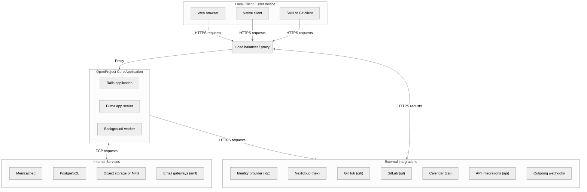
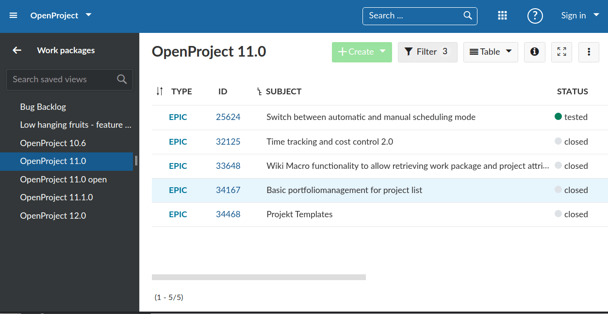
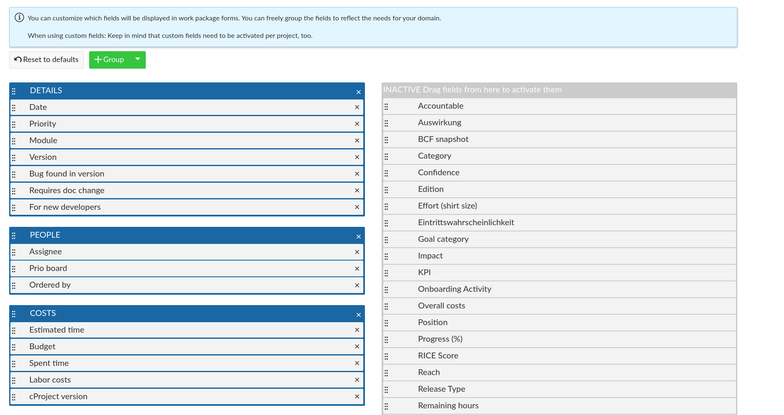

---
sidebar_navigation:
  title: Application architecture
description: An introduction of the architecture used at OpenProject and their interplay.
keywords: architecture overview, hybrid application, Ruby on Rails, Angular
---

# Application architecture

## Involved services

| Service                             | Relationship to OpenProject                                  | Communication interfaces and mechanisms                      | Access modes (R - read) (W - write) | References                                                   |
| ----------------------------------- | ------------------------------------------------------------ | ------------------------------------------------------------ | ----------------------------------------- | ------------------------------------------------------------ |
| Web browser                         | Performs requests to the application                         | HTTPS                                                        | RW                                        | n/a                                                          |
| Native client                       | Performs requests to the application                         | HTTPS                                                        | RW                                        | n/a                                                          |
| SVN client                          | Performs SVN requests to the application web server          | HTTPS                                                        | RW                                        | [Repository integrations](../../user-guide/repository/)      |
| Git client                          | Performs Git Smart HTTP requests to the application server   | HTTPS                                                        | RW                                        | [Repository integrations](../../user-guide/repository/)      |
| Load balancer / Proxy               | Depending on installation mechanism, terminates TLS/SSL, accepts and proxies or load balances web requests to the different OpenProject web application servers | HTTPS / PROXY                                                | -                                         | [Configuration for packaged installations](../../installation-and-operations/installation/packaged/#step-3-apache2-web-server-and-ssl-termination) [Configuration for Docker/Kubernetes](../../installation-and-operations/installation/docker/#disabling-https-mode) |
| Puma application server             | Accepts web requests, runs the OpenProject web facing application | Web requests (HTTP/HTTPS) Database (TCP) Memcached (TCP) Email gateways (SMTP) External integration requests (HTTPS) | RW                                        | [Database TLS setup](../../installation-and-operations/configuration/#database-configuration-and-ssl) [Cache configuration](../../installation-and-operations/configuration/#cache-configuration-options) [SMTP configuration](../../installation-and-operations/configuration/outbound-emails/) [Integrations guide](../../system-admin-guide/integrations/) |
| Memcached / Redis / File cache      | Application-level cache (if enabled)                         | TCP connections                                              | RW                                        | [Cache configuration](../../installation-and-operations/configuration/#cache-configuration-options) |
| PostgreSQL                          | Database management system                                   | (Encrypted) TCP connections between web and background workers |                                           | [Database TLS setup](../../installation-and-operations/configuration/#database-configuration-and-ssl)  |
| Background worker                   | Handles asynchronous jobs, such as backup requests, email delivery, | Database (TCP) Memcached (TCP) Email gateways (SMTP) External integration requests (HTTPS) | RW                                        | [Database TLS setup](../../installation-and-operations/configuration/#database-configuration-and-ssl) [Cache configuration](../../installation-and-operations/configuration/#cache-configuration-options) [SMTP configuration](../../installation-and-operations/configuration/outbound-emails/) [Integrations guide](../../system-admin-guide/integrations/) |
| Attached storages or Object storage | Access for attachments for the OpenProject application. Either directly (or networked) attached storages, or configuration of an S3-compatible Object store | Local filesystem access (local drives, NFS) HTTPS (S3-compatible storage) | RW                                        | [Configuration of the attachment storage](../../installation-and-operations/configuration/#attachments-storage) |
| Email gateways                      | Send emails (e.g., notifications) from OpenProject application | SMTP                                                         | W (deliver mails to relay)                | [SMTP configuration](../../installation-and-operations/configuration/outbound-emails/) |
| Identity providers                  | External authentication providers (e.g., Keycloak, ADFS, etc.) | HTTPS through standard protocols (OpenID connect, SAML, OAuth 2.0) | R (Redirect and read user info)           | [OpenID connect provider configuration](../../system-admin-guide/authentication/openid-providers/) [SAML provider configuration](../../system-admin-guide/authentication/saml/) [OAuth 2.0 application configuration](../../system-admin-guide/authentication/oauth-applications/) |
| Nextcloud                           | External bilateral integration                               | HTTPS                                                        | RW                                        | [Nextcloud integration guide](../../system-admin-guide/integrations/nextcloud/) |
| GitHub                              | Pull Request / Issue referencing Integration into OpenProject | HTTPS (Webhooks)                                             | R (Incoming webhook from GitHub)          | [GitHub integration guide](../../system-admin-guide/integrations/github-integration/) |
| GitLab                              | Merge Request / Issue referencing Integration into OpenProject | HTTPS (Webhooks)                                             | R (Incoming webhook from GitLab)          | [GitLab integration guide](../../system-admin-guide/integrations/gitlab-integration/) |
| Calendars                           | External calendars requesting dynamic ICS calendar files from OpenProject | HTTPS (iCalendar/webdav)                                     | R (Outgoing calendar data)                | [Calendar subscriptions configuration](../../system-admin-guide/calendars-and-dates/#calendar-subscriptions) |
| API integrations                    | Structural access to OpenProject through API endpoints. Optional access to users and third party organizations depending on authorized scopes | HTTPS                                                        | (Optional) R (Optional) W           | [API configuration](../../system-admin-guide/api-and-webhooks/) |
| Outgoing Webhooks                   | Outgoing requests for changes within the application         | HTTPS                                                        | R (Outgoing webhook data)                 | [Webhook configuration an administration](../../system-admin-guide/api-and-webhooks/#webhooks) |

## Software

OpenProject is developed as a GPLv3 licensed, open-source software. The software core is developed and maintained using [GitHub](https://github.com/opf/openproject/). OpenProject is available as several versions:

- [Community Edition](https://www.openproject.org/community-edition/)
- [Enterprise on-premises and Enterprise cloud](https://www.openproject.org/enterprise-edition/)

## Environments

OpenProject is continuously tested, developed, and distributed using the following environments

| **Environment**               | **Description**                                                                                                                                                                                                                                            | **Release Target**                                                                                                                                               | **Deployment cycles**                                                                                                            |
|-------------------------------|------------------------------------------------------------------------------------------------------------------------------------------------------------------------------------------------------------------------------------------------------------|------------------------------------------------------------------------------------------------------------------------------------------------------------------|----------------------------------------------------------------------------------------------------------------------------------|
| Edge                          | Automatic deployments through [GitHub actions](https://github.com/opf/openproject/blob/dev/.github/workflows/continuous-delivery.yml) for instances on openproject-edge.com Subject for continuous QA, acceptance and regression testing.               | Next minor or major release planned and developed in our [community instance](https://community.openproject.org/projects/openproject/)                           | On every push to `opf/openproject#dev`                                                                                           |
| Stage                         | Automatic deployments through [GitHub actions](https://github.com/opf/openproject/blob/dev/.github/workflows/continuous-delivery.yml) for instances on openproject-stage.com. Subject for QA and acceptance testing of bugfix prior to stable releases. | Next patch release of the current stable release following our [release plan](https://community.openproject.org/projects/openproject/work_packages?query_id=918) | On every push to `release/X.Y`, where `X.Y` is the current stable release major and minor versions.                              |
| Production (SaaS / Cloud)  | Production cloud environments. Deployed manually with the latest stable release                                                                                                                                                                            | Stable releases                                                                                                                                                  | Manually                                                                                                                         |
| Production (Docker images) | [Official public OpenProject docker images](https://hub.docker.com/r/openproject/openproject/) Continuous delivery for development versions using `dev-*`tags. Stable releases through major, minor, or patch level tags.                            | Development (`dev`, `dev-slim` tag) Stable releases (`X`, `X.Y`, `X.Y.Z`, `X-slim`, `X.Y-slim`, `X.Y.Z-slim`)                                                 | Automatically on new releases of the OpenProject application                                                                     |
| Production (Packages)      | [Official public OpenProject Linux packages](../../installation-and-operations/installation/packaged/)   Stable releases for supported distributions                                                                                                 | Stable releases                                                                                                                                                  | Automatically on new releases of the OpenProject application                                                                     |
| Production (Helm chart)    | [Official public OpenProject Helm charts](../../installation-and-operations/installation/helm-chart/) Stable releases                                                                                                                                   | Stable releases (configurable through container tags)                                                                                                            | Updates to Helm chart are manual, underlying deployment uses OpenProject docker images                                           |
| PullPreview                   | Temporary instances for development of features scope to a pull request.                                                                                                                                                                                   | Feature branches                                                                                                                                                 | Automatically deployed when developers/QA request a pull preview instance by labelling pull requests with the `PullPreview` tag. |

## Patch and change management

OpenProject uses the Community instance [https://community.openproject.org](https://community.openproject.org) for managing the application lifecycle. For a full overview on the process of developing changes to the application, please see our [product development guide](../product-development-handbook/).

This section summarizes all relevant information about the process for providing releases.

### Current release

The [release notes](../../release-notes) provide a list of all the releases including the current stable one.

Administrators can identify their currently deployed version of OpenProject in the [Administration information page of their installation](../../system-admin-guide/information).

### Upcoming releases

See the [Roadmap](https://community.openproject.org/projects/openproject/roadmap) for the overview of the upcoming stable releases.

### Versioning

OpenProject follows [Semantic Versioning](https://semver.org/). Therefore, the version is a composition of three digits in the format of e.g. 0.1.1 and can be summarized as followed:

- MAJOR version when you make incompatible API changes,
- MINOR version when you add functionality in a backwards-compatible manner, and
- PATCH version when you make backwards-compatible bug fixes.

Please note that OpenProject considers the following to be non breaking changes which do not lead to a new major version:

- Database schema changes
- Updates on depended upon libraries packaged with the distributions of OpenProject (e.g. Ruby, Rails, etc.)

Changes to those can thus happen also in minor or patch releases.

On the other hand, changes to the following are considered breaking changes and thus lead to a new major version.

- Changes to the minimum version of supported operating systems.
- Changes to the minimum version of the supported database system (PostgreSQL).

This list is not conclusive but rather serves to highlight the difference to the previous list of non breaking changes.

### Version tracing in containers and packages

OpenProject embeds some release information into the packages and containers to ensure they are traceable. For all containers, the following files exist under `/app`. For packages, these files reside under `/opt/openproject/` and `/opt/openproject/config`, depending on the used version.

- **CORE_VERSION**: Reference to the commit of the https://github.com/opf/openproject core repository of OpenProject that is the foundation of the build
- **CORE_URL** URL to the commit at GitHub for easier reference
- **PRODUCT_VERSION** Commit of the flavour/product version. In case of the [openDesk container](https://hub.docker.com/r/openproject/open_desk), contains a reference to the openDesk repository https://github.com/opf/openproject-open_desk
- **BUILDER_VERSION** Internal reference of the building CI repository that we use to create and publish the images.

### Support of releases

For the community edition, only the current stable release is maintained. The [Enterprise on-premises](https://www.openproject.org/enterprise-edition) provides extended maintenance.

We recommended to update to a new stable release as soon as possible to have a supported version installed. To that end, OpenProject will show an information banner to administrators in case a new stable release is available.

### Change history

All changes made to the OpenProject software are documented via work packages bundled by the version. The [Roadmap view](https://community.openproject.org/projects/openproject/roadmap) gives a corresponding overview. A release is also summarized in the [release notes](../../release-notes).

### Distribution

OpenProject is distributed in [various formats](../../installation-and-operations/installation). Manual installation based on the code in GitHub is possible but not supported.

### Versions in the codebase

The version is represented as [tags](../git-workflow/#tagging) and [branches](../git-workflow/#branching-model) in the repository. The version is also manifested in the [version.rb](https://github.com/opf/openproject/blob/dev/lib/open_project/version.rb).

## Components

A typical installation of OpenProject uses a web server such as NGINX or Apache to proxy requests to and from the internal [Puma](https://puma.io/) application server. All web requests are handled internally by it. A background job queue is used to execute longer running data requests or asynchronous communications.

### Puma application server

OpenProject uses a Puma application server to run and handle requests for the Rails stack. All HTTP(S) requests to OpenProject are handled by it. Puma is a configurable multi-process, multithreading server. The exact number of servers being operated depends on your deployment method of OpenProject. See the [process control and scaling documentation](../../installation-and-operations/operation/control/) for more information.

### External load balancer or proxying server

A web server is expected to handle requests between the end-user and the internal Puma application server. It is responsible for e.g.,  terminating TLS and managing user-facing HTTP connections, but depending on the deployment, also for serving static assets and certain caching related functionality. This server performs a proxy-reverse proxy pattern with the internal application server. No external connections are allowed directly to the Puma server.

### Rails application

The core application, built on the Ruby on Rails framework, handling business logic, database operations, and user interactions. Utilizes the Model-View-Controller (MVC) design pattern. Follows [secure coding guidelines](../concepts/secure-coding/) for authentication, session management, user input validation, and error logging.

The application aims to return to the MVC pattern using Rails, Hotwire, and ViewComponents for UI element composition. This strategy aims for higher usability and efficient development.

### Angular frontend

Some of the responses of the application include a frontend application approach using Angular. These pages communicate with a REST API to receive data and perform updates. An example of this is the work packages module. Requests within the module are handled completely in the frontend, while boundary requests are forwarded to the Rails stack, returning to a classical request/response pattern.

All requests to the application are still handled by Rails. In some of the responses, only the root Angular component is rendered to bootstrap the Angular frontend. On these pages, [UI-Router for Angular](https://github.com/ui-router/angular) parses the URL to determine what module/frontend route to load and show.

In the following, we'll take a look at the different components at use in the application stack of OpenProject as well as concrete examples on how these components interact.

#### Exemplary frontend view request

Let's take a look at how the request to `/projects/identifier/work_packages` would be handled by Rails and Angular (excluding any external actual HTTP requests to the web server)

1. Rails receives the request and according to its [`config/routes.rb`](https://github.com/opf/openproject/blob/dev/config/routes.rb#L257), will handle the request with the [WorkPackagesController#index action](https://github.com/opf/openproject/blob/dev/app/controllers/work_packages_controller.rb#L66-L81).
2. This controller responds with [an index template](https://github.com/opf/openproject/blob/dev/app/views/work_packages/index.html.erb) that only renders some details but otherwise, will output the `<openproject-base>` Angular root component that is defined in the [`Rails angular layout`](https://github.com/opf/openproject/blob/dev/app/views/layouts/angular/angular.html.erb).
3. The rendered response is returned to the Browser and Angular is initialized globally once in [`frontend/src/main.ts`](https://github.com/opf/openproject/blob/dev/frontend/src/main.ts#L48-L49).
4. As the `<openproject-base>` component contains a ui-router [`[ui-ref]`](https://github.com/opf/openproject/blob/dev/frontend/src/app/core/routing/base/application-base.component.ts) directive, the ui-router will start parsing the URL and looks for a route definition that matches. It will end up matching `root.work-packages` [defined in the work packages' module routes file](https://github.com/opf/openproject/blob/dev/frontend/src/app/features/work-packages/routing/work-packages-routes.ts).
5. From there, the flow is as with a single-page application. The router mounts that component and the Angular frontend will use the APIv3 to fetch and render the application table.

This will result in a page on which the majority of the content has been rendered by Angular. Only the toolbar, basic page structure, and upper side menu have been rendered by Rails.

This approach has the significant disadvantage to go through the entire Rails stack first to output a response that is mostly irrelevant for the Angular application, and both systems (Rails and Angular) need a somewhat duplicated routing information. The long-term goal is to move to a single-page application and avoid the first two steps.

#### Exemplary Rails view request augmented by Angular

A response that is fully controlled by Rails but extended by some Angular components in the frontend might look as follows. Let's take a look at the request to [edit a type's form configuration](../../system-admin-guide/manage-work-packages/work-package-types/#work-package-form-configuration-enterprise-add-on) `/types/1/edit/form_configuration`:

1. Rails receives the request and according to its [`config/routes.rb`](https://github.com/opf/openproject/blob/dev/config/routes.rb#L257), will handle the request with the [TypesController#edit action](https://github.com/opf/openproject/blob/dev/app/controllers/types_controller.rb#L71-L82) with its tab set to `form_configuration`.

2. This controller responds with [an edit template](https://github.com/opf/openproject/blob/dev/app/views/types/edit.html.erb) that will include the [type form partial](https://github.com/opf/openproject/blob/dev/app/views/types/form/_form_configuration.html.erb#L77-L83). In this component, an Angular component is explicitly output that will be bootstrapped on page load.

3. The rendered response is returned to the Browser and Angular is initialized globally once in [`frontend/src/main.ts`](https://github.com/opf/openproject/blob/dev/frontend/src/main.ts#L48-L49).

4. Dynamic components in Angular are registered as [custom elements](https://angular.dev/guide/elements) so they can be used throughout the page as web components.

5. This triggers the [`FormConfigurationComponent`](https://github.com/opf/openproject/blob/dev/frontend/src/app/features/admin/types/type-form-configuration.component.ts) to be initialized and allows the application to include a highly dynamic component (drag & drop organization of attributes) to be used on an admin form that otherwise has no connection to Angular.

   

## Evolution of the application

Historically, OpenProject has been forked from [Redmine](https://www.redmine.org/) and modified from a primarily software-development focused flow into a general project management application suite. A Ruby on Rails monolith was used to serve the entire application, frontend and API. Javascript was used to extend some of the functionality with Prototype.js and jQuery on existing, Rails-rendered pages.

The monolith was turned into a hybrid application with semi-separated JavaScript frontend by the [introduction of AngularJS in 2014](https://github.com/opf/openproject/pull/913) for a redesign of the [work package table](../../user-guide/work-packages/work-package-views/#work-packages-views). The Rails monolith was and is still rendering a large portion of the frontend however. The AngularJS frontend was served from within Rails and not separated. Therefore, the application frontend is not a single-page application yet.

Due to performance issues with AngularJS digest cycles and a large number of components, the work package table was [refactored into a plain JavaScript renderer](https://github.com/opf/openproject/pull/5117) end of 2016. Finally, in early 2018, the application frontend was [migrated from AngularJS to Angular](https://github.com/opf/openproject/pull/5984) during the course of a few releases.

[In early 2019](https://github.com/opf/openproject/pull/7385), the rest of AngularJS code was removed and the frontend switched to the Angular CLI with Ahead-of-Time compilation (AOT).
