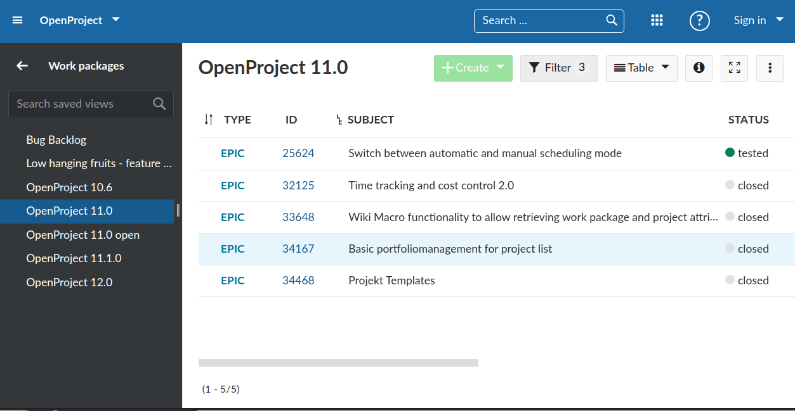
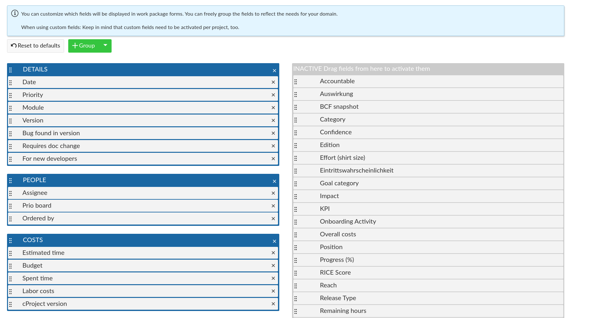

---
sidebar_navigation:
  title: Application architecture
description: An introduction of the architecture used at OpenProject and their interplay.
robots: index, follow
keywords: architecture overview, hybrid application, Ruby on Rails, Angular
---

# Application architecture

OpenProject is a hybrid application consisting of a Ruby on Rails monolith with an Angular application serving specific modules of the OpenProject frontend. Strategically, the application is shifting towards a single-page application. However, many of the views are still generated largely by Rails and only extended by Angular components.

All requests to the application are still responded by Rails. In some of the responses, only the root Angular component is rendered to bootstrap the Angular frontend. On these pages, [UI-Router for Angular](https://github.com/ui-router/angular) parses the URL to determine what module/frontend route to load and show.

In the following, we'll take a look at the two main ways the Rails templates will interact or trigger the Angular frontend.

## Exemplary frontend view request

Let's take a look at how the request to `/projects/identifier/work_packages` would be handled by Rails and Angular (excluding any external actual HTTP requests to the web server)

1. Rails receives the request and according to its [`config/routes.rb`](https://github.com/opf/openproject/blob/dev/config/routes.rb#L257), will handle the request with the [WorkPackagesController#index action](https://github.com/opf/openproject/blob/dev/app/controllers/work_packages_controller.rb#L66-L81). 
2. This controller responds with [an index template](https://github.com/opf/openproject/blob/dev/app/views/work_packages/index.html.erb) that only renders some details but otherwise, will output the `<openproject-base>` Angular root component that is defined in the [`Rails angular layout`](https://github.com/opf/openproject/blob/dev/app/views/layouts/angular.html.erb#L39).
3. The rendered response is returned to the Browser and Angular is initialized globally once in [`frontend/src/main.ts`](https://github.com/opf/openproject/blob/dev/frontend/src/main.ts#L48-L49).
4. As the `<openproject-base>` component contains a ui-router [`[ui-ref]`](https://github.com/opf/openproject/blob/dev/frontend/src/app/modules/router/base/application-base.component.ts#L37) directive, the ui-router will start parsing the URL and looks for a route definition that matches. It will end up matching `root.work-packages` [defined in the work packages' module routes file](https://github.com/opf/openproject/blob/dev/frontend/src/app/modules/work_packages/routing/work-packages-routes.ts#L49).
5. From there, the flow is as with a single-page application. The router mounts that component and the Angular frontend will use the APIv3 to fetch and render the application table.

This will result in a page on which the majority of the content has been rendered by Angular. Only the toolbar, basic page structure, and upper side menu has been rendered by Rails.

This approach has the significant disadvantage to go through the entire Rails stack first to output a response that is mostly irrelevant for the Angular application, and both systems (Rails and Angular) need a somewhat duplicated routing information. The long-term goal is to move to a single-page application and avoid the first two steps.

## Exemplary Rails view request augmented by Angular

A response that is fully controlled by Rails but extended by some Angular components in the frontend might look as follows. Let's take a look at the request to [edit a type's form configuration](../../../system-admin-guide/manage-work-packages/work-package-types/#work-package-form-configuration) `/types/1/edit/form_configuration`:

1. Rails receives the request and according to its [`config/routes.rb`](https://github.com/opf/openproject/blob/dev/config/routes.rb#L257), will handle the request with the [TypesController#edit action](https://github.com/opf/openproject/blob/dev/app/controllers/types_controller.rb#L71-L82) with its tab set to `form_configuration`. 

2. This controller responds with [an edit template](https://github.com/opf/openproject/blob/dev/app/views/types/edit.html.erb) that will include the [type form partial](https://github.com/opf/openproject/blob/dev/app/views/types/form/_form_configuration.html.erb#L77-L83). In this component, an Angular component is explicitly output that will be bootstrapped on page load.

3. The rendered response is returned to the Browser and Angular is initialized globally once in [`frontend/src/main.ts`](https://github.com/opf/openproject/blob/dev/frontend/src/main.ts#L48-L49).

4. A global service, the [`DynamicBootstrapper`](https://github.com/opf/openproject/blob/dev/frontend/src/app/globals/dynamic-bootstrapper.ts), looks for eligible components to bootstrap in the rendered template and forces the global angular application to bootstrap this component. This may result in many dom-separated components in the page to be bootstrapped by Angular for dynamic content.

5. This triggers the [`FormConfigurationComponent`](https://github.com/opf/openproject/blob/dev/frontend/src/app/modules/admin/types/type-form-configuration.component.ts) to be initialized and allows the application to include a highly dynamic component (drag & drop organization of attributes) to be used on an admin form that otherwise has no connection to Angular.

   

# Evolution of the application

Historically, OpenProject has been forked from [Redmine](https://www.redmine.org/) and modified from a primarily software-development focused flow into a general project management application suite. A Ruby on Rails monolith was used to serve the entire application, frontend and API. Javascript was used to extend some of the functionality with Prototype.js and jQuery on existing, Rails-rendered pages.

The monolith was turned into a hybrid application with semi-separated JavaScript frontend by the [introduction of AngularJS in 2014](https://github.com/opf/openproject/pull/913) for a redesign of the [work package table](../../../user-guide/work-packages/work-package-views/#work-packages-views). The Rails monolith was and is still rendering a large potion of the frontend however. The AngularJS frontend was served from within Rails and not separated. Therefore, the application frontend is not a single-page application yet.

Due to performance issues with AngularJS digest cycles and a large number of components, the work package table was [refactored into a plain JavaScript renderer](https://github.com/opf/openproject/pull/5117) end of 2016. Finally, in early 2018, the application frontend was [migrated from AngularJS to Angular](https://github.com/opf/openproject/pull/5984) during the course of a few releases.

[In early 2019](https://github.com/opf/openproject/pull/7385), the rest of AngularJS code was removed and the frontend switched to the Angular CLI with Ahead-of-Time compilation (AOT).

