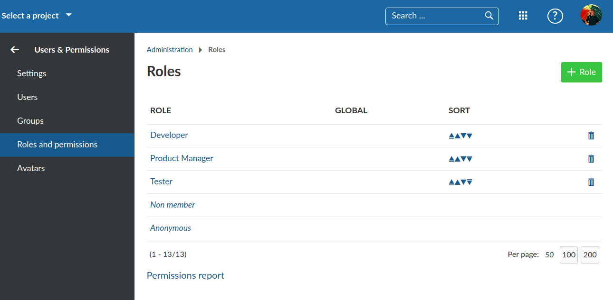

---
sidebar_navigation:
  title: Permissions
description: Get an overview of how roles and permissions are handled in the OpenProject application code
keywords: permissions, roles, RBAC
---

# Development concept: Permissions

OpenProject is very flexible when it comes to authorization and granting permissions to users. The OpenProject application uses a Role-based access control (RBAC) approach to grant individual users permissions to projects or individual resources.

With RBAC, the application defines a set of roles that users and groups can be individually assigned to within the scope of a project, resource or globally. In OpenProject, the roles and permissions contained within are freely configurable. There can be an arbitrary number of roles defined.

## Key takeaways

*Permissions in OpenProject...*

- use the Role-based access control (RBAC) approach to allow fine-grained access to authorized resources
- are assigned to users and groups through roles on a per-resource, per-project, or global level
- are often communicated to the frontend through the presence of action links in HAL resources

## Definition of roles

Roles in OpenProject can be defined in the global administration. If you want to read about roles from a user experience, please see the [Roles & Permissions guide](../../../system-admin-guide/users-permissions/roles-permissions/#roles-and-permissions)

In the backend, roles are a polymorphic Rails model [`Role`](https://github.com/opf/openproject/tree/dev/app/models/role.rb)
that holds a set of permissions associated in a `RolePermission` lookup table.

There are multiple types of roles:

- [Global roles](https://github.com/opf/openproject/blob/dev/app/models/global_role.rb) that are granted to user on a global level, i.e. they are not assigned per project. They can contain the permissions to e.g., *Create new projects* or *Create* or *Manage users*
- Entity specific roles like [WorkPackage Role](https://github.com/opf/openproject/blob/dev/app/models/work_package_role.rb) that allows a user to get certain permissions on a single entity. *Currently, those roles are only seeded and cannot be manually edited or created by administrators.*
- All other roles (and the de facto default) are [Project roles](https://github.com/opf/openproject/blob/dev/app/models/project_role.rb). They grant users permission on an entire project and all resources belonging to that project. There are 2 special types of project roles:
  - *Non member* roles that is a special role that applies to any _authenticated_ user and all public projects that this user is not a member of. On the OpenProject community, it is configured to grant non-members of the public projects, i.e. all logged in users, the permissions *Add forum posts* and *Create new work package*.
  - *Anonymous* roles that is a special role, similar to the *non member* role but applying to non-authenticated users.

In the following screenshot, you can see the builtin, non-deletable roles *Non member* and *Anonymous*, as well as three additional, user-created roles.



Scrolling through the list of available permissions, you will begin to see the flexibility (and complexity) of the potential user permissions that are available:


## Definition of Permissions

The permissions are defined in two places:

1. The core [`config/initializers/permissions.rb`](https://github.com/opf/openproject/tree/dev/config/initializers/permissions.rb) initializer file. It defines the available project modules and its associated permissions
2. Module permissions defined in the `engine.rb` of modules under `module/` folder. For example, the definitions for budgets are defined in[`modules/budgets/lib/budgets/engine.rb`](https://github.com/opf/openproject/tree/dev/modules/budgets/lib/budgets/engine.rb).

These definitions determine the name of the permission and the Rails controller actions that this permission unlocks. In some cases, the permissions do not define a controller action and then is only used for authorization checks in contracts.

The definition also specifies what context a permission can be given to. The `permissible_on:` specifies those allowed contexts. The permission system will than take care of hinting the developer when they are checking a permission in a wrong context (i.e. checking for `create_user` permission on a specific project, but it only being a global permission).

## Checking of permissions in Backend

The way a developer can check for permissions obviously depends on whether the backend or frontend is doing the check. We will go through some of the possible ways to check for authorization.

### Desired layer

While not the case throughout the application, permissions:

 * should be checked in the Contracts whenever wanting to change a record. This also includes the values that are assignable (e.g. which users are available to become assignee of a work package)
 * should be applied to scopes whenever fetching a set of records. Even when only fetching an individual record it is best to apply a scope checking the visibility before the `find` instead of fetching the record first and then check for the visibility.
 * needs unfortunately to be checked in the view/representers whenever an attribute is visible for one group of users but not for another.
 * should **not** be checked in the controller layer unless an explicit 403 response needs to be returned.

### Controller `before_action`

If the permission should be tested for a specific controller action, it will suffice to call the `before_action :authorize` to handle authorization.

As an example, the permissions `:manage_members`,  `:view_members` is defined as follows:

```ruby
permission :manage_members, { members: %i[index new create update destroy autocomplete_for_member] }
permission :view_members, { members: [:index] }
```

This means if a user has only the `:view_members` permission, the `authorize` check in the [`MembersController`](https://github.com/opf/openproject/tree/dev/app/controllers/members_controller.rb) will allow the user to pass through for the `index` action (Overview of the members), but not the CRUD actions. These will only pass if the user has the `manage_members` (or both) permissions.

### API Endpoints

Given that the API endpoints are controllers as well, the permission checks are handled similarly, to protect an endpoint against unauthorized access, a before block is defined e.g. like this:

```ruby
after_validation do
  authorize :manage_members, global: true
end
```

However, for most end points, this does not need to be and should not be done on the controller level. Endpoints that are contract backed, which is true for most of the create, update and delete end points, the permissions, including access to a resource is checked within the contracts. The index end points are mostly protected by their queries relying on a `visible` scope which factors the permissions into the SQL fetching the records. That way, an empty collection is returned if the user lacks permission. If an explicit 403 needs to be returned, though, the explicit permission check in the endpoint is required for now. The show endpoints need to be protected akin to how the index actions. The `visible` scope is applied (e.g. `WorkPackage.visible.find(5)`). This will lead to a `RecordNotFound` exception being thrown when the permission is lacking. That exception is then handled transparently by returning a 404. We return 404 instead of 403 to not reveal the existence of a record.

### Scopes

When a set of records is to be returned, e.g. for an index action, it is best to limit the returned result set to the records the user is allowed to see. To avoid having to apply the permission check after the records have been fetched and instantiated, which is costly, it is best to limit the records in the sql right away. As there are a couple of different scenarios for fetching records, there are a couple of matching scopes defined:

| Scenario                                            | Scope                                               | Example                                                      |
|-----------------------------------------------------|-----------------------------------------------------|--------------------------------------------------------------|
| All projects a user is allowed a permission in      | `Project.allowed_to(user, permission)`              | `Project.allowed_to(User.current, :view_work_packages)`      |
| All work packages a user is allowed a permission in | `WorkPackage.allowed_to(user, permission)`          | `WorkPackage.allowed_to(User.current, :view_work_packages)`  |
| All users granted a permission in a project         | `Authorization.users(permission, project: project)` | `Authorization.users(:view_work_packages, project: project)` |
| All roles a user has in a project                   | `Authorization.roles(user, project)`                | `Authorization.roles(User.current, project)`                 |
| All roles a user has for a specific resource        | `Authorization.roles(user, entity)`                 | `Authorization.roles(User.current, work_package)`            |
| All roles a user has globally                       | `Authorization.roles(user)`                         | `Authorization.roles(User.current)`                          |

Most of the time, a developer will not witness those queries as they are the embedded deeply within the existing scopes. E.g. the `visible` scopes defined for most AR models.

The developer should mostly rely on the `allowed_to` scopes defined on the models that permissions can be checked for.

### Explicitly testing for permissions

If you have a user and a project, you can explicitly ask for a permission like so:

```ruby
project = Project.find_by(name: 'My project')
work_package = project.work_packages.find_by(subject: 'My task')
user = User.find_by(login: 'foobar')

# Checks if the user has the permission in the given project
user.allowed_in_project?(:view_members, project)

# Checks if the user has the permission in *any* project
user.allowed_in_any_project?(:view_members)

# Checks if the user has the permission in the given work package *or* the project it belongs to
user.allowed_in_work_package?(:view_work_package, work_package)

# Checks if the user has the permission in any work package *or* project
user.allowed_in_any_work_package?(:view_work_package)

# Checks if the user has the permission in the given project *or* any work package that belongs to the given project
user.allowed_in_any_work_package?(:view_work_package, in_project: project)
```

The same is true for global permissions using `user.allowed_globally?(permission)`. This will test for a global permission such as `:add_project`.

Those methods will also aid the developer, when they are trying to request a permission in the wrong context. For example, when you try to check a global permission on a project, it will raise an `IllegalPermissionContextError`

```ruby
user.allowed_in_project(:create_user, project)
# => Authorization::IllegalPermissionContextError: Used permission "create_user" which maps to create_user in project context. Correct contexts for this permission are: global.
```

It also checks, that you are checking for a permission that really exists. This prevents accidentally adding a typo to a permission name, that previously just silently returned `false`:

```ruby
user.allowed_globally?(:create_users)
# => Authorization::UnknownPermissionError: Used permission "create_users" that is not defined. It will never return true.
```

### Deprecated methods

Previously, we used to check permissions using the `allowed_to?`, `allowed_to_globally?` and `allowed_to_in_project?` methods. Because of some ambiguity in them (i.e. you could check for project permissions globally, which then returned what is now `allowed_in_any_project?`) and the lack of the checks that are mentioned above, those methods have been deprecated and will be removed in a future version of OpenProject. If you are using those methods in a module, please migrate to the new methods.

### Permissions in tests

When writing tests for code that checks permissions, you have multiple options to set the system up so that your permission
checks will return the desired results:

#### Setting up roles and users

This setup should be used when the entire database is filled with data in your test and you might need to set up the same
role for multiple users. Mostly used when writing full integration specs or data about the role itself are important (i.e. role name).

```ruby
let(:global_role) { create(:global_role, name: "Create Users Role", permissions: [:create_user])}
let(:project_role) { create(:project_role, permissions: [:view_work_packages, :add_work_packages])}

let(:project) { create(:project) }

let(:user) { create(:user, member_with_roles: { project => [projet_role] }, global_roles: [global_role]) }
```

#### Setting up users with permissions

When you don't care about data of the role itself, you can let the factories set up roles with the given permissions. This
simplifies the amount of code you have to write in the test setup.

```ruby
let(:project) { create(:project) }

let(:user) do
  create(:user,
    member_with_permissions: { project => [:view_work_packages, :add_work_packages] },
    global_permissions: [:create_user]
  )
end
```

#### Mocking Permissions

When working in an entirely in-memory setup (i.e. in unit tests) when nothing is persisted in the database, you can mock the permission system without creating any roles or users in the database.

```ruby
let(:user) { build(:user) }
let(:project) { build(:project) }

before do
  mock_permissions_for(user) do |mock|
    mock.allow_in_project :view_work_packages, :add_work_packages, project: project
    mock.allow_globally :create_user
  end
end
```

This hooks into all permission checks (including the deprecated `allowed_to?` methods and methods like `allowed_in_any_project?`) that are executed on the user. **Scopes like `Project.visible`, `Project.allowed_to` and methods like `Authorization.roles` are _not_ mocked by this.**

## Checking of permissions in Frontend

In the frontend, we have to rely on the API to tell us what actions the user is allowed to do. With [`HAL+JSON resources`](../hal-resources), we can do that by checking for the presence or absence of an action link in responses.

For example, if the user has the permission to create work packages in the OpenProject project on the community, [the collection response of the work packages API](https://community.openproject.org/api/v3/projects/openproject/work_packages?pageSize=0) of it will contain a link `createWorkPackage` that contains the link to the create form API endpoint.

To check these links, one can use the [`ModelAuthService`](https://github.com/opf/openproject/tree/dev/frontend/src/app/core/model-auth/model-auth.service.ts) that gets initialized with the resources being loaded:

```typescript
const modelAuth = injector.get(ModelAuthService);
modelAuth.initModelAuth('work_packages', { createWorkPackage: () => 'foo' });

modelAuth.can('work_packages', 'createWorkPackage'); // true
modelAuth.can('work_packages', 'someOtherAction'); // false
```

The service doesn't care for what's inside the links but just looks for their presence.

The fact that permissions are implicitly checked through links has the advantage that the frontend doesn't need to care about whether a functionality has been disabled in the project (i.e., the project module is not enabled there) or if the user has no permission to access it.

The downside to this approach is that it is impossible to check a multitude of permissions upfront without loading the necessary requests. In some cases, we thus load requests just for the sake of permission testing, even though we do not depend on the API response itself.
