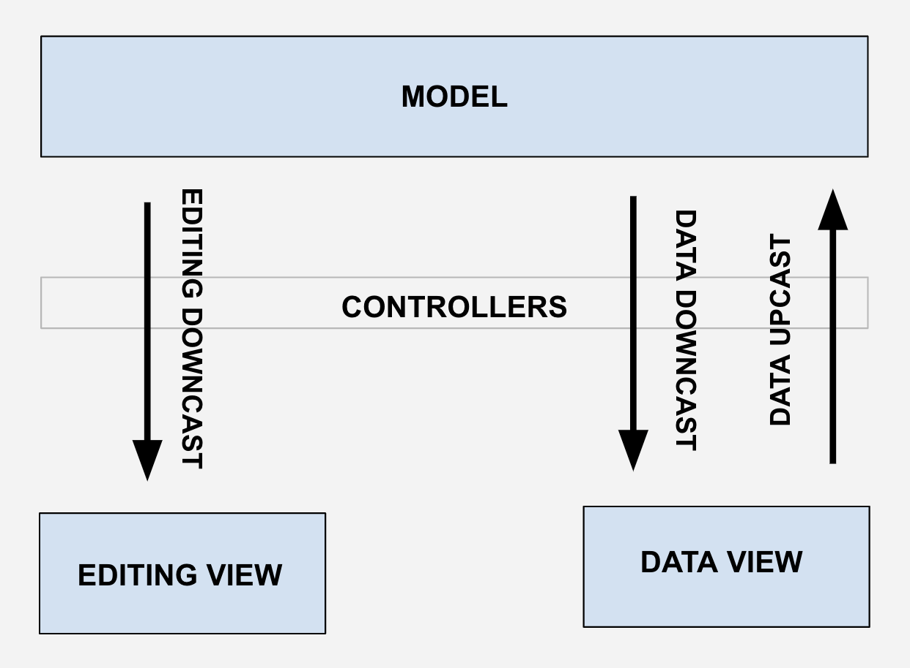
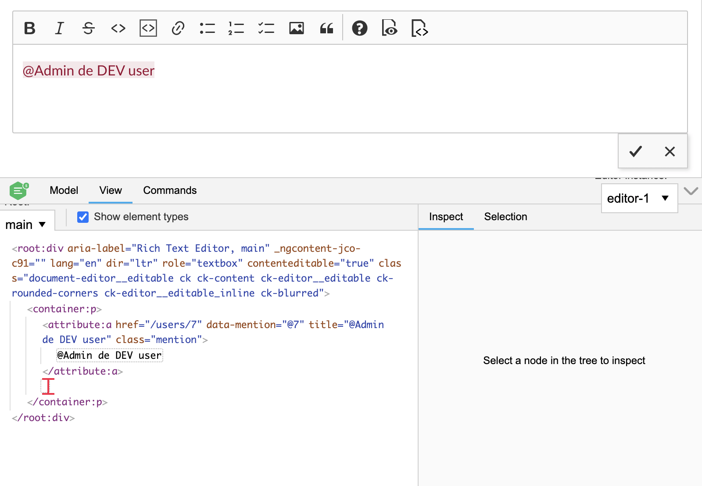

# WYSIWYG editor

OpenProject uses the ckEditor WYSIWYG editor. ckEditor is a great WYSIWYG framework with a lot of functionalities and great flexibility (custom builds, plugins...). All the OpenProject code related to ckEditor is hosted on a separate [repository](https://github.com/opf/commonmark-ckeditor-build).

ckEditor is used in OpenProject as an input for string fields that require formatting, for example the description of a task, a comment or a wiki page.

## MarkDown

All formatted string field values are saved in the backend in [Markdown](https://guides.github.com/features/mastering-markdown/) format.

In order to convert the backend markdown into the HTML that ckEditor needs, and the other way around, to convert the HTML that ckEditor outputs into the markdown that the backend is expecting, OpenProject uses [Turndown](https://github.com/domchristie/turndown).

The CommonMarkDataProcessor class (```commonmarkdataprocessor.js```) is in charge of this conversion, making all the tasks needed in order to turn markdown into HTML inside its "toView" method, and placing all the tasks needed to turn HTML into markdown within its "toData" method.

Because some elements needed into the editor (macros, mentions...) are not standard markdown elements, they are not converted to markdown but placed as strings in the markdown (&lt;macro class="embedded-table" data-query-props="...">&lt;/macro>). The conversion from markdown to HTML will just skip converting them and ckEditor will handle them properly.

## ckEditor Mental Model

ckEditor follows a particular model-view-controller architecture that could be simplified like this:

### Model

Is the HTML input data once loaded into the editor. ckEditor has a Model "DOM" where the HTML elements are replaced by ckEditor model elements emulating somehow the DOM tree.

### Views

CkEditor has two types of views:

* **Data View:** the editor's input/output, the data imported to the editor and exported from the editor (HTML).
* **Editing View:** the UI, the elements that the user interacts with in the editor's UI.

### Controller

Layer in charge of transforming the elements from the two Views to the Model and the other way around. This means to transform:

* The Data View (input HTML elements) into Model elements and the other way around.
* The Editing View (UI elements) into Model elements and the other way around.

In ckEditor the Model is considered to be above the controllers, while the Views are below. This mental model is key to understand how the editor works.



## Plugins: Adding functionality

Because OpenProject is using some functionality/elements that are not the HTML standards, we need to extend the functionality of the CkEditor. This is done by adding Plugins that hook into the editor's operations which are the following:

### Data Upcast

Import the Data View into the Model (loading the HTML into the editor). We can hook into this process with the method editor.conversion.for("upcast").

### Editing Upcast

Import the Editing View into the Model (translate the elements of the editor's UI into the Model). This is done by the editor features/plugins.

### Data Downcast

Turning the Model into the Data View (the HTML output). We can hook into this process with the method editor.conversion.for("dataDowncast").

### Editing Downcast

Turning the Model into the Editing View (the UI elements that the user manipulates). We can hook into this process with the method editor.conversion.for("editingDowncast").

If we would want to hook into the Editing Downcast and the Data Downcast at the same time, applying the same transformations to the Model elements in both views, we could hook into the generic method editor.conversion.for("downcast").

## Elements, Attributes and Schemas

ckEditor has a Model "DOM" where the HTML elements are replaced by ckEditor model elements emulating somehow the DOM tree. Like in the DOM, in the CkEditor Model DOM we can place elements and attributes on elements.

In order to work with custom elements (ie: &lt;macro>, &lt;mention>...), we'll need to add them to the CkEditor schema.

## Events

CkEditor provides an alternative way to hook into the upcast and downcast (editing downcast and data downcast) pipelines through events.

For example, we could hook on the data downcast whenever a mention attribute is parsed with:

```javascript
editor.conversion.for( 'dataDowncast' ).add( dispatcher => {
   dispatcher.on( 'attribute:mention',
   ( evt, data, conversionApi ) => {/*...*/},
   { priority: 'high' } );
})
```

## Debugging

CkEditor comes with a debugger inspector that will make the development process easier, showing in real time the view and model representation that the editor has:



In order to activate it, just import it (```import CKEditorInspector from '@ckeditor/ckeditor5-inspector';```) at the beginning of the ```op-config-customizer.js``` file and then attach it inside the editorClass.create method:

```javascript
return editorClass.create(wrapper, configuration).then(editor => {
  CKEditorInspector.attach(editor);

  return editor;
});
```

## An example

As an example, let's take a look at our mention feature that allows mentioning colleagues on the ckEditor with an autocomplete. The backend will send us them as mention tags inside the raw markdown (ie: &lt;mention data-type="user" data-id="1" data-link="/users/1" data-text="@userName">@userName&lt;/mention>).

In order to get it working, we did the following steps:

### 1 - Markdown to HTML

Define how the markdown elements are going to be translated to HTML elements. In this case, the backend is going to send the mention elements as tags (&lt;mention ...>...&lt;/mention>) right inside the markdown data, so we don't need to make any conversion in order to turn it into the valid HTML that the CkEditor needs. \
\
In case it would be needed, it would be defined in the CommonMarkDataProcessor class (```commonmarkdataprocessor.js```), in its "toView" method.

### 2 - Upcast

Define how the mention elements of the HTML input data are going to be represented in the ckEditor's Model:

```javascript
editor.conversion
  .for( 'upcast' )
  .elementToAttribute( {
  view: {
     name: 'mention',
     key: 'data-mention',
     classes: 'mention',
  },
  model: {
     key: 'mention',
     value: viewItem => {
        // Third party plugin config (https://ckeditor.com/docs/ckeditor5/latest/features/mentions.html)
        const mentionAttribute = editor.plugins.get( 'Mention' ).toMentionAttribute( viewItem, {
           // Data that we need to pass to the model.
           id: viewItem.getAttribute( 'data-id' ),
           link: viewItem.getAttribute( 'data-link' ),
           text: viewItem.getAttribute( 'data-text' ),
           type: viewItem.getAttribute( 'data-type' ),
        } );

        return mentionAttribute;
     }
  },
  converterPriority: 'high'
} );
```

Here we basically say that when the ckEditor finds a 'mention' element with the CSS class 'mention' in the input data (HTML), it should place it in the editor's model as a 'mention' attribute with the additional data that we pass (id, link, text and type).

This is defined in the CkEditor plugin (```mentions-caster.js```).

### 3 - Editing downcast

Define how the mention attribute is going to be represented in the ckEditor's UI (Editing View):

```javascript
editor.conversion
  .for('editingDowncast')
  .attributeToElement({
     model: 'mention',
     converterPriority: 'high',
     view: (modelAttributeValue, {writer}) => {
        // Do not convert empty attributes (lack of value means no mention).
        if ( !modelAttributeValue ) {
           return;
        }

        const element = writer.createAttributeElement(
           'a',
           {
              'class': 'mention',
              'href': modelAttributeValue.link || '',
              'data-mention': modelAttributeValue.id || '',
              'title': modelAttributeValue.text || '',
           }
        );

        return element;
     }
  });
```

Here we say that we want to place the mention attributes of the ckEditor's model as links in the ckEditor's UI (&lt;a href="/users/1" class="mention" data-mention="1" title="@userName">@userName&lt;/a>).\
\
This is defined in the CkEditor plugin (```mentions-caster.js```).

### 4 - Data downcast

Define how the mention attribute is going to be represented in the ckEditor's output (Data View):

```javascript
editor.conversion
  .for('dataDowncast')
  .attributeToElement({
     model: 'mention',
     converterPriority: 'high',
     view: (modelAttributeValue, {writer}) => {
        if ( !modelAttributeValue ) {
           return;
        }

        const element = writer.createAttributeElement(
           'mention',
           {
              'class': 'mention',
              'data-id': modelAttributeValue.link || '',
              'data-type': modelAttributeValue.type || '',
              'data-link': modelAttributeValue.link || '',
              'data-text': modelAttributeValue.text || '',
           }
        );

        return element;
     }
  });
```

Here we say that we want to place the mention attributes of the ckEditor's model as mention tags in the ckEditor's output HTML (&lt;mention data-type="user" data-id="1" data-link="/users/1" data-text="@userName">@userName&lt;/mention>).

This is defined in the CkEditor plugin (```mentions-caster.js```).

The model update of the mentions when the user adds or removes a mention is handled by the editor features/plugins (a third party mention plugin in this case).

### 5 - HTML to Markdown

Define how the HTML mention tags are going to be represented in the markdown. They should be placed as strings, so we need to turn any mention element into its string representation:

```javascript
turndownService.addRule( 'mentions', {
  filter: (node) => {
     return (
        node.nodeName === 'MENTION' &&
        node.getAttribute('data-id') &&
        node.getAttribute('data-type') &&
        node.getAttribute('data-link') &&
        node.getAttribute('data-text') &&
        node.classList.contains('mention')
     )
  },
  replacement: ( _content, node ) => node.outerHTML,
});
```

This is defined in the CommonMarkDataProcessor class (```commonmarkdataprocessor.js```), in its "toData" method.

### More documentation

For more details about CkEditor, checkout its [documentation](https://ckeditor.com/docs/ckeditor5/latest/builds/guides/overview.html).

If you're looking for instructions on how to use the WYSIWYG editor on OpenProject please look at [this page](../../../user-guide/wysiwyg).
