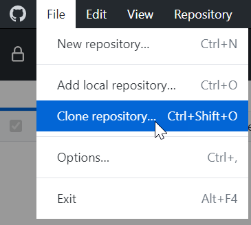
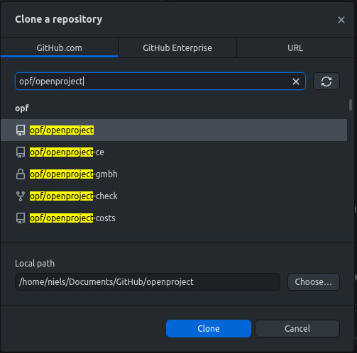
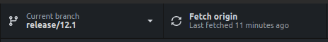
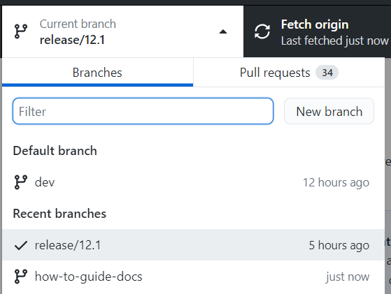
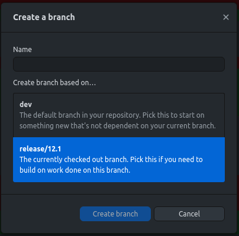
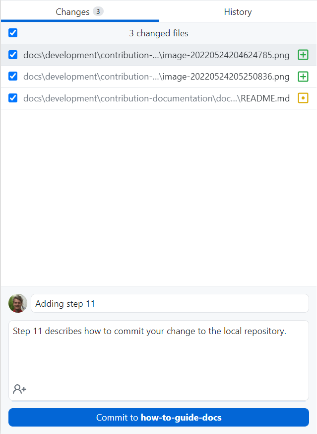
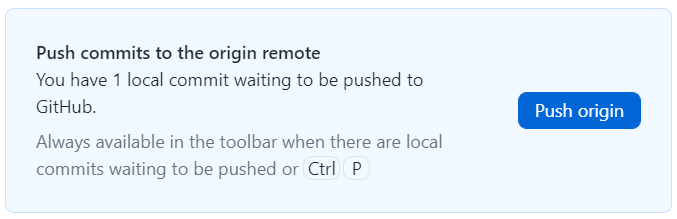
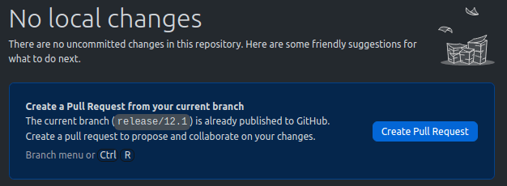
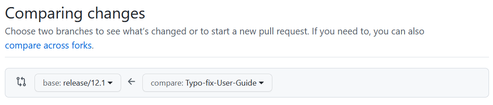
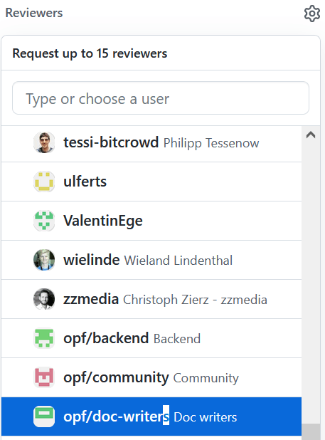

---
sidebar_navigation:
  title: Internal docs contributor
  priority: 800
description: Quick guide for internal team members that have write permissions
keywords: contribution, documentation, documentation process
---

# Documentation process for internal team members

This guide describes how internal team members with write permissions can contribute to the OpenProject documentation.

## Prerequisites

1. [The contributor has a user account on GitHub.com](../../../development/contribution-documentation/documentation-process/#step-1-create-user-account-on-githubcom)
2. The contributor has write permissions on the [OpenProject repository](https://github.com/opf/openproject)
3. [Software Typora editor installed](../../../development/contribution-documentation/documentation-process/#step-2-install-typora)
4. [Software GitHub Desktop installed](../../../development/contribution-documentation/documentation-process/#step-3-install-github-desktop)

## Step 1: Clone the OpenProject repository in GitHub Desktop

Before you can make changes you need to create a local clone of the OpenProject repository on your local computer. Open GitHub Desktop and navigate to **File -> Clone repository**.

In the modal window select the repository ""*opf/openproject*"". Also select a folder on your computer for the cloned repository. Click **Clone**.

## Step 2: Update local repository (fetch origin)

> **Important**: Before you make changes always update your local repository.

1. Select the branch you want to work on, e.g. `release/13.0` in the main toolbar.
2. Click on the button **Fetch origin** in the main toolbar.

## Step 3: Create a new Git branch for your change

1. Select the latest release branch e.g. `release/13.0` as the current branch.
    

2. In the same drop down click on **New branch**.

3. In the next modal window insert a branch name that describes your changes. Also select the branch you want to work on, e.g. `release/13.0`. The click the button **Create branch**.

## Step 4: Open the files you want to change in Typora

In Typora open the files you want to change (File -> Open). In the file picker navigate to the local folder you selected in the step 1.

## Step 5: Make the changes in Typora and save the file

The Typora editor makes it quite easy to make changes to the file. After you made your changes do not forgot to save.

## Step 6: Commit the change to your local repository in GitHub Desktop

Open GitHub Desktop. Here you can see all the changes you made in your local repository.

Add a commit message that best describes your change. This description should allow other users to easily understand the change you made.

## Step 7: Push your changes to GitHub.com

At the moment your change is only available in your local repository. To make it available on GitHub.com you need upload (push) by pressing the button **Push origin**.

## Step 8: Create a pull request

A pull request is a workflow to ask for a review from the OpenProject team. With a pull request you basically ask a team member to check your changes and to merge it to the branch you want your change to merged to, e.g. `release/13.0` . After you pushed your local changes to your own repository click the button **Create Pull Request**.

In the first dropdown select the base branch you want your work to be merged in e.g. `release/13.0`. In the second dropdown select the branch you created in step 3 which contains your changes.

In the description field of the pull request enter a summary for the changes you made. If there is already a work package on https://community.openproject.org you can also add this to the description. This adds a relation between your pull request and the work package.

## Step 9: Request review

Select the label "*documentation*".

In the field "*Reviewers*" select "*opf/doc-writers".*

## Step 10: Wait for feedback from the reviewers

... and hopefully it is all LGTM which means "Looks good to me(rge). Congrats to your first contribution to the OpenProject documentation. We appreciate your effort :-)

## Additional notes for working on the legal docs

* We always deploy the [main branch](https://github.com/opf/legal/tree/main) on our [website](https://www.openproject.org/legal/). This deployment needs to be manually triggered by the marketing team.
* If you want to make minor changes you don't need a review do this directly in the main branch without creating a new branch and new pull request.
* If you need a review you need to create a new branch from the main branch. The branch `release/13.0` only exists in the repository opf/openproject (OpenProject software).
