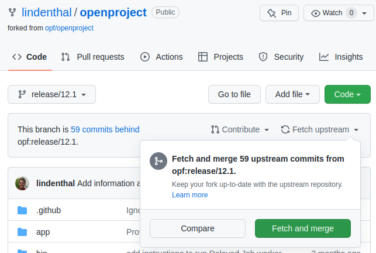
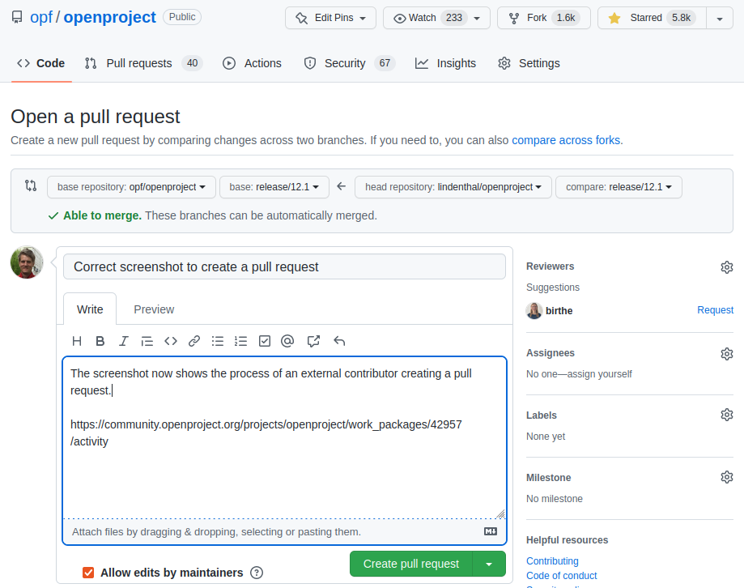

---
sidebar_navigation:
  title: Documentation process
  priority: 999
description: The process, incl. tool setup, of how to contribute to the OpenProject documentation
keywords: contribution, documentation, documentation process, tool setup
---

# Documentation process

This guide describes how to contribute to the OpenProject documentation, including the tool setup.

## Setup the tools to easily contribute to the OpenProject documentation

This guide aims to help users that are new to Git and Markdown to contribute to the OpenProject documentation. There are a two very helpful tools that makes it extremely easy to contribute to OpenProject:

| Tool               | Purpose of this tool                                         | Website and download                              |
| ------------------ | ------------------------------------------------------------ | ------------------------------------------------- |
| **Typora**         | Typora is an application that enables you to easily edit markdown files. The markdown file format is used for the OpenProject documentation which allows you to focus on the content instead of the formatting. | [desktop.github.com](https://desktop.github.com/) |
| **GitHub Desktop** | Desktop is an application that enables you to interact with GitHub using a GUI instead of the command line or a web browser. | [typora.io](https://typora.io/)                   |

## Step 1: Create user account on GitHub.com

You need an account on GitHub.com to contribute to the OpenProject documentation. Here you can [sign-up a new account](https://github.com/signup).

## Step 2: Install Typora

You can download the installer from the [Typora website](https://typora.io/#download). Follow the prompts to complete the installation. In case you need more information there are very detailed [help](https://support.typora.io/) for each supported operating systems [Linux](https://support.typora.io/Typora-on-Linux/), [macOS](https://support.typora.io/Typora-on-macOS/) and [Windows](https://support.typora.io/Typora-on-Windows/). 

## Step 3: Install GitHub Desktop

You can install the software GitHub Desktop on any [supported operating systems](https://docs.github.com/en/desktop/installing-and-configuring-github-desktop/overview/supported-operating-systems). To install GitHub Desktop navigate to [https://desktop.github.com](https://desktop.github.com) and download the appropriate version for your operating system. Follow the prompts to complete the installation.

## Step 4: Sign in into Github.com in GitHub Desktop

To exchange data between your local repository and remote repositories you need to first sign (File -> Options -> Sign in).

In the next screen click on "Continue with browser".

This opens your browser. To authenticate to type your GitHub.com credentials and click **Sign in**. If you have configured two-factor authentication (2FA) for GitHub enter your 2FA code in the prompt on GitHub and click **Verify**.

Alternatively, if you were already signed in to GitHub, follow the prompts to return to GitHub Desktop to finish authenticating.

After authenticating your account, you are ready to manage and contribute to projects with GitHub Desktop.

## Step 5: Fork the OpenProject repository 

If you are an external contributor you don't have write permissions on the repository [https://github.com/opf/openproject](https://github.com/opf/openproject). In this case you first need to fork the repository by clicking the button **[Fork](https://github.com/opf/openproject/fork)**. This basically means that you have your own copy of the repository on GitHub.com. Since it is your own repository you have write privileges here.

## Step 6: Clone the forked OpenProject repository in GitHub Desktop

Before you can make changes you need to create a local clone of the OpenProject repository on your local computer. Open GitHub Desktop and navigate to "File -> Clone repository".

In the modal window select the repository you forked in Step *Fork the Open Project repository*. Also select a folder on your computer for the cloned repository. Click **Clone**.

In the next screen select "*To contribute to the parent project*".

## Step 7: Fetch origin with upstream changes (update local repository)

Every time you start editing please make sure you have fetched the latest changes from GitHub.com. First you need to update your forked repository. There you select the branch you are working on, e.g. release/12.1. If there are updates in the main repository opf/openproject click on on "Fetch upstream".

Now you have fetched the latest changes from the main repository.

You have to fetch those changes in GitHub Desktop by clicking "Fetch origin" in the main toolbar at the right. It is mandatory to be on the latest release branch (eg. release/12.1), it does not work if you are in any other branch.

Afterwards you also have to press **"Pull Upstream"**. Afterwards your local repository is updated to the latest commits of eg. opf/openproject/release/12.1

 

## Step 8: Create a new Git branch for your change

Select the latest release branch e.g.`release/12.1` as the current branch. 

In the same drop down click on "New branch". In this window insert a branch name that describes your changes and select the latest release branch e.g. `release/12.1` the created branch is based on.

## Step 9: Open the files you want to change in Typora

In Typora open the files you want to change (File -> Open). In the file picker navigate to the local folder you selected in the Step *Clone the forked OpenProject repository in GitHub Desktop*.

## Step 10: Make the changes in Typora and save the file

The Typora editor makes it quite easy to make changes to the file. After you made your changes do not forgot to save.

## Step 11: Commit the change to your local repository in GitHub Desktop

Open GitHub Desktop. Here you can see all the changes you made in your local repository.

Add a commit message that best describes your change. This description should allow other users to easily understand the change you made.

## Step 12: Push your changes to GitHub.com

At the moment your change is only available in your local repository. To make it available on GitHub.com you need upload (push) by pressing the button "Push origin".

## Step 13: Create a pull request

A pull request is a workflow to ask for a review from the OpenProject team. With a pull request you basically ask to check your changes and to copy it over to the OpenProject repository (opf/openproject). After you pushed your local changes to your own repository click the button **Create Pull Request**.

Here select the latest release branch e.g. release/12.1 in the first dropdown. In the second select the branch you have changed.

In the description field of the pull request enter a summary for the changes you made. If there is already a work package on https://community.openproject.org you can also add this to the description. This adds a relation between your pull request and the work package.

## Step 14: Request review

Select the label "documentation". 

 

In the field "Reviewers" select "opf/doc-writers". 

## Step 15: Wait for feedback from the reviewers

... and hopefully it is all LGTM which means "Looks good to me(rge). Congrats to your first contribution to the OpenProject documentation. We appreciate your effort :-)

## APPENDIX A) Rebase your fork when the release branch changes

(e.g. from release/12.0 to release 12.1)**:**

#### A) Change Remote Repository to UPSTREAM

- In **Github Desktop**
- Choose Menu **Repository / Repository settings...**
- This will open a new window (screenshot below)
- **Enter the URL** of the upstream/original OpenProject repository (e.g. **https://github.com/opf/openproject.git**)
- Press **Save**

#### B) Fetch origin

- In **GitHub Desktop**
- Select the new branch at **Current branch** (e.g. **origin/release/12.1**) **[1]**
- Press **Fetch Upstream [2]**

#### C) Change Remote Repository back to your FORK

- In **Github Desktop**
- Choose Menu **Repository / Repository settings...**
- This will open a new window (screenshot below)
- **Enter the URL** of the your forked OpenProject repository (e.g. **https://github.com/adam-op/openproject.git**)
- Press **Save**

#### D) Push to your FORK

- In **GitHub Desktop**
- Choose Menu **Repository / Push**

