---
sidebar_navigation:
  title: Documentation process
  priority: 999
description: The process, incl. tool setup, of how to contribute to the OpenProject documentation
keywords: contribution, documentation, documentation process, tool setup
---

# Documentation process

This guide describes how to contribute to the OpenProject documentation, including the tool setup.

## Setup the tools to easily contribute to the OpenProject documentation

This guide aims to help users that are new to Git and Markdown to contribute to the OpenProject documentation. There are a two very helpful tools that makes it extremely easy to contribute to OpenProject:

| Tool               | Purpose of this tool                                         | Website and download                             |
| ------------------ | ------------------------------------------------------------ |--------------------------------------------------|
| **Typora**         | Typora is an application that enables you to easily edit markdown files. The markdown file format is used for the OpenProject documentation which allows you to focus on the content instead of the formatting. | [typora.io](https://typora.io)                   |
| **GitHub Desktop** | Desktop is an application that enables you to interact with GitHub using a GUI instead of the command line or a web browser. | [desktop.github.com](https://desktop.github.com) |

## Step 1: Create user account on GitHub.com

You need an account on GitHub.com to contribute to the OpenProject documentation. Here you can [sign-up a new account](https://github.com/signup).

## Step 2: Install Typora

You can download the installer from the [Typora website](https://typora.io). Follow the prompts to complete the installation. In case you need more information there are very detailed [help](https://support.typora.io/) for each supported operating systems [Linux](https://support.typora.io/Typora-on-Linux/), [macOS](https://support.typora.io/Typora-on-macOS/) and [Windows](https://support.typora.io/Typora-on-Windows/).

## Step 3: Install GitHub Desktop

You can install the software GitHub Desktop on any [supported operating systems](https://docs.github.com/en/desktop/installing-and-configuring-github-desktop/overview/supported-operating-systems). To install GitHub Desktop navigate to [https://desktop.github.com](https://desktop.github.com) and download the appropriate version for your operating system. Follow the prompts to complete the installation.

## Step 4: Sign in into Github.com in GitHub Desktop

To exchange data between your local repository and remote repositories you need to first sign (File -> Options -> Sign in).

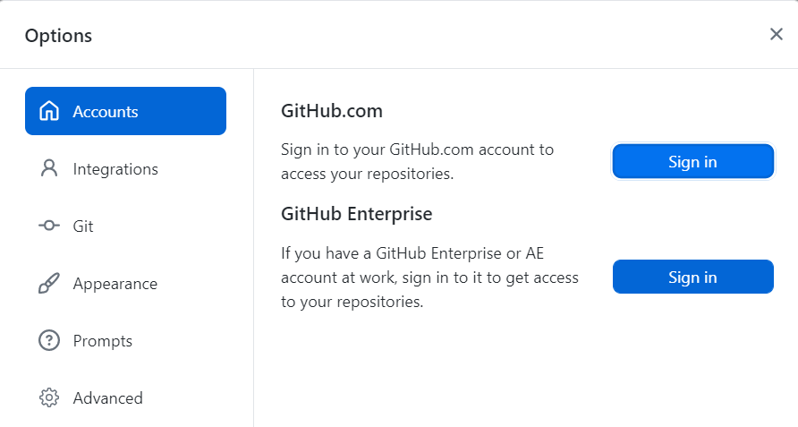

In the next screen click on "Continue with browser".

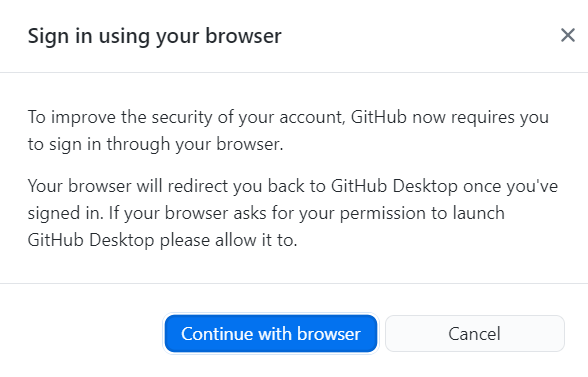

This opens your browser. To authenticate to type your GitHub.com credentials and click **Sign in**. If you have configured two-factor authentication (2FA) for GitHub enter your 2FA code in the prompt on GitHub and click **Verify**.

Alternatively, if you were already signed in to GitHub, follow the prompts to return to GitHub Desktop to finish authenticating.

After authenticating your account, you are ready to manage and contribute to projects with GitHub Desktop.

## Step 5: Fork the OpenProject repository

If you are an external contributor you don't have write permissions on the repository [https://github.com/opf/openproject](https://github.com/opf/openproject). In this case you first need to fork the repository by clicking the button [Fork](https://github.com/opf/openproject/fork). This basically means that you have your own copy of the repository on GitHub.com. Since it is your own repository you have write privileges here.

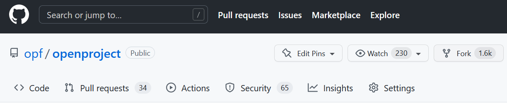

## Step 6: Disable Actions on GitHub.com

There is are automated actions configured in the original repository, that we do not need for writing documentation. Therefore we may deactivate the github actions in the Settings of our own forked repository. On GitHub.com navigate to "Settings -> Actions" and Disable Actions and confirm with **Save**.

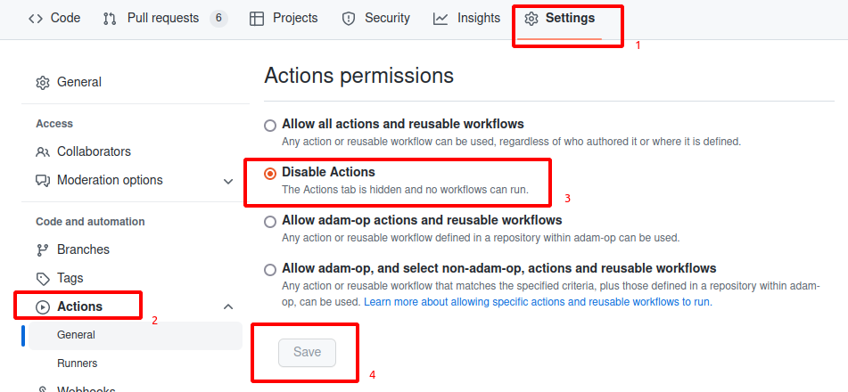

## Step 7: Change the Default branch for GitHub Desktop

Open `https://github.com/[your-user]/openproject`. On the forked repository go to "Settings -> Branches" in the left side menu and Switch the default branch by pressing the symbol with the **two arrows** [3].

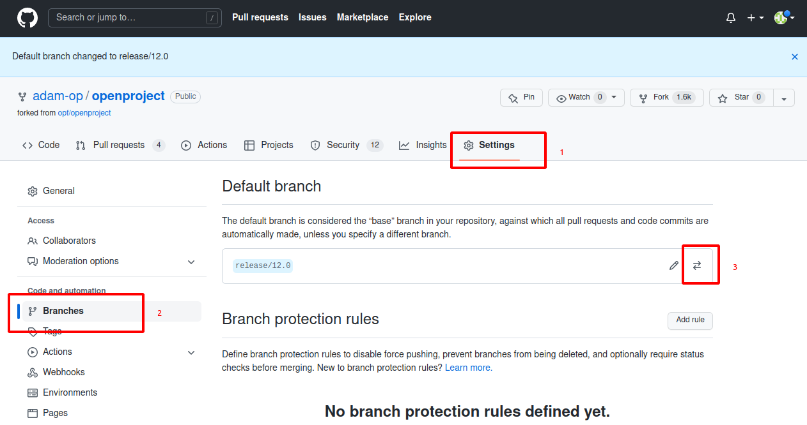

Select `release/12.3` as default branch and confirm with **Update**

*NOTE:* There will be an additional window. Press the button: **I understand, update the default branch.**

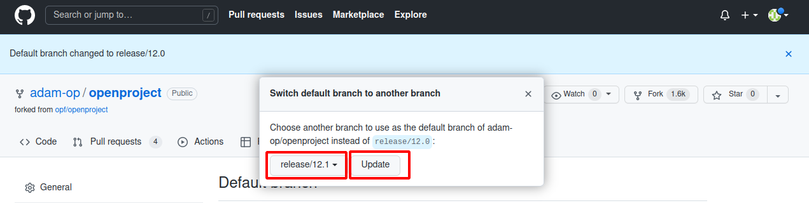

## Step 8: Sync fork and Update branches (update local repository)

Every time you start editing please make sure you have fetched the latest changes from GitHub.com. First you need to update your forked repository. There you select the branch you are working on, e.g. `release/12.3`. If there are updates in the main repository opf/openproject click on **Sync fork** and **Update branch**.

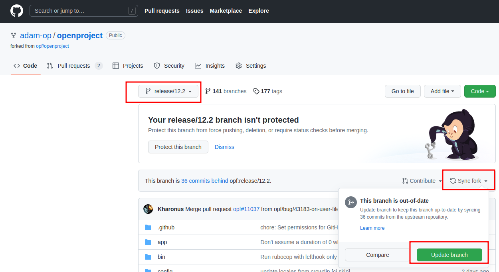

Now you have fetched the latest changes from the main repository and can go back to GitHub Desktop.

Finally you have to press **"Pull origin"**. Afterwards your local repository is updated to the latest commits of eg. `opf/openproject/release/12.3`

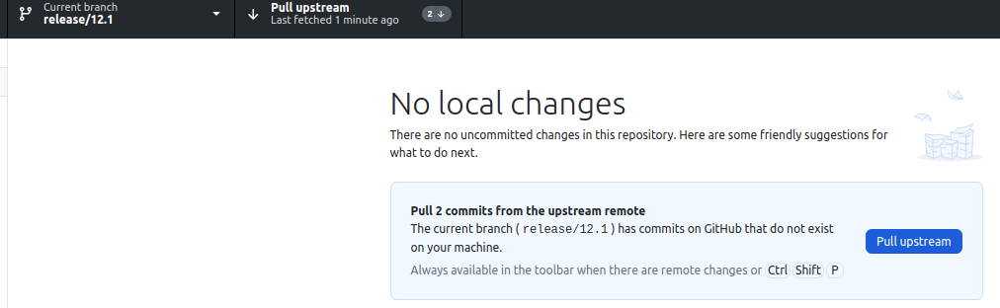

## Step 9: Clone the forked OpenProject repository in GitHub Desktop

Before you can make changes you need to create a local clone of the OpenProject repository on your local computer. Open GitHub Desktop and navigate to "File -> Clone repository".

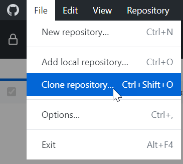

In the modal window select the repository you forked in step *Fork the OpenProject repository*. Also select a folder on your computer for the cloned repository. Click **Clone**.

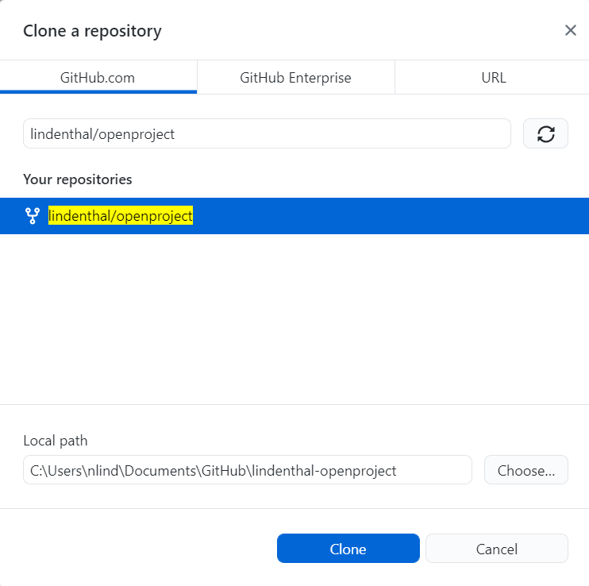

In the next screen select **To contribute to the parent project**.

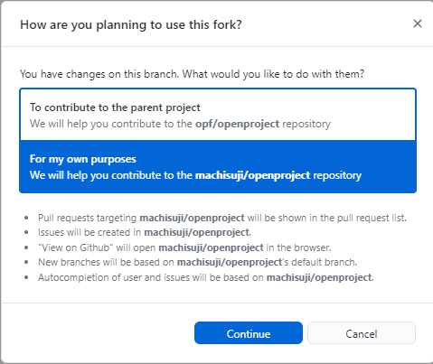

## Step 10: Create a new Git branch for your change

Select the latest release branch e.g. `release/12.3` as the current branch.

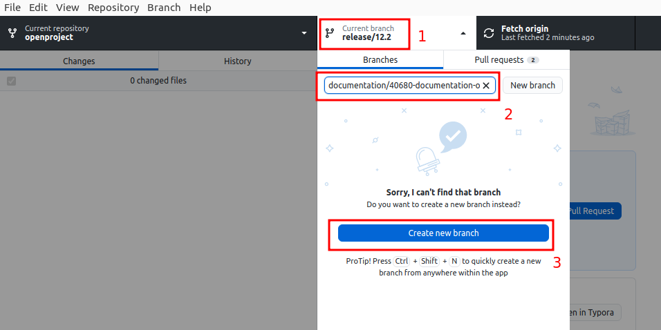

In the same drop down click on "New branch". In this window **insert a branch name that describes your changes** and **select the latest release branch** e.g. `release/12.3` the created branch is based on.

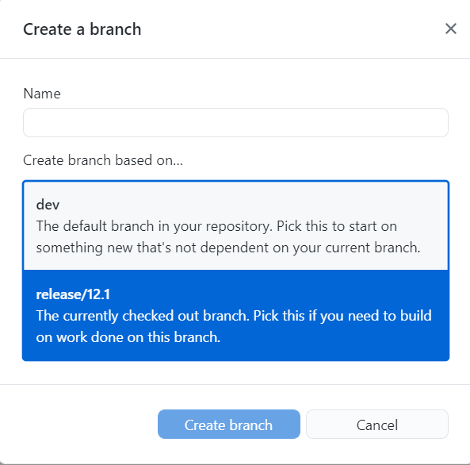

After that Publish your branch to the forked remote repository on github.com.

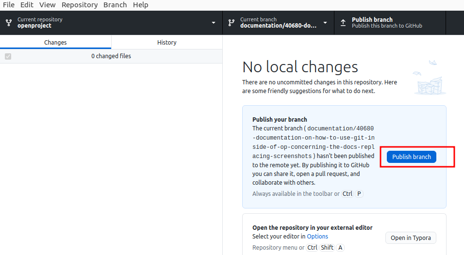

## Step 11: Open the files you want to change in Typora

In Typora open the files you want to change (File -> Open). In the file picker navigate to the local folder you selected in the step *Clone the forked OpenProject repository in GitHub Desktop*.

## Step 12: Make the changes in Typora and save the file

The Typora editor makes it quite easy to make changes to the file. After you made your changes do not forgot to save.

## Step 13: Commit the change to your local repository in GitHub Desktop

Open GitHub Desktop. Here you can see all the changes you made in your local repository.

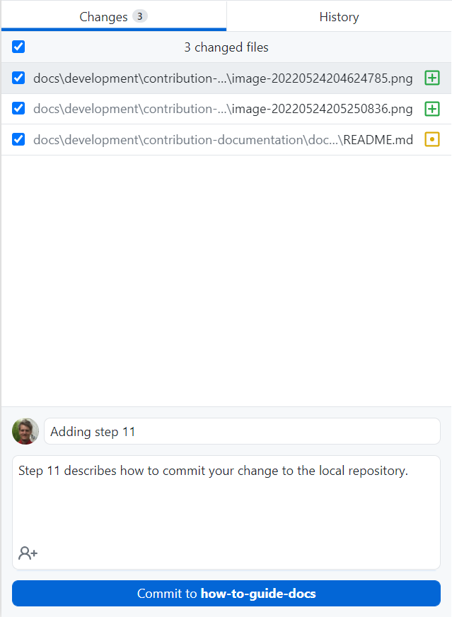

Add a commit message that best describes your change. This description should allow other users to easily understand the change you made.

## Step 14: Push your changes to GitHub.com

At the moment your change is only available in your local repository. To make it available on GitHub.com you need upload (push) by pressing the button "Push origin".

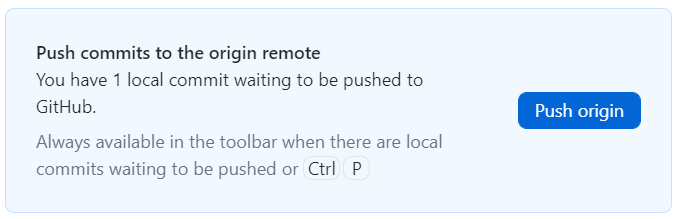

## Step 15: Create a pull request

A pull request is a workflow to ask for a review from the OpenProject team. With a pull request you basically ask to check your changes and to copy it over to the OpenProject repository (opf/openproject). After you pushed your local changes to your own repository click the button **Create Pull Request**.

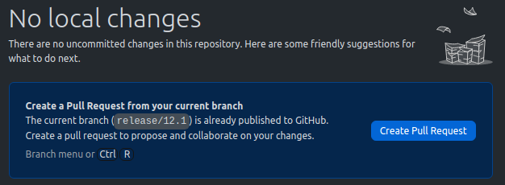

Your Draft Pull Request will be created in the browser **on github.com** (the "draft" status of the pull request signals that you are still working on it and it is not yet ready for a review.) Here select the latest release branch e.g. `release/12.4` in the **"base:"** dropdown on the left side. In the **"compare:"** dropdown select the branch you have changed.

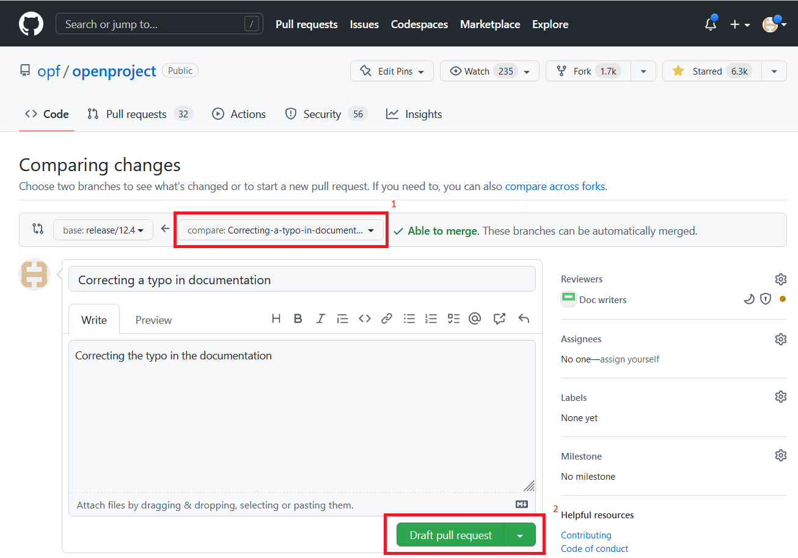

In the description field of the pull request enter a summary for the changes you made. If there is already a work package on https://community.openproject.org you can also add this to the description with its complete URL. This adds a relation between your pull request and the work package.

Once you have made all the changed and are certain that these are final, you can request a review.

## Step 16: Request review

Select the label "documentation".

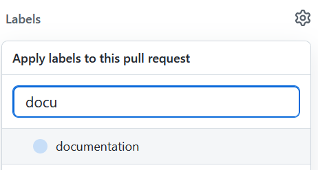

In the field "Reviewers" select "opf/doc-writers".

Now you can press "Ready for review" button.

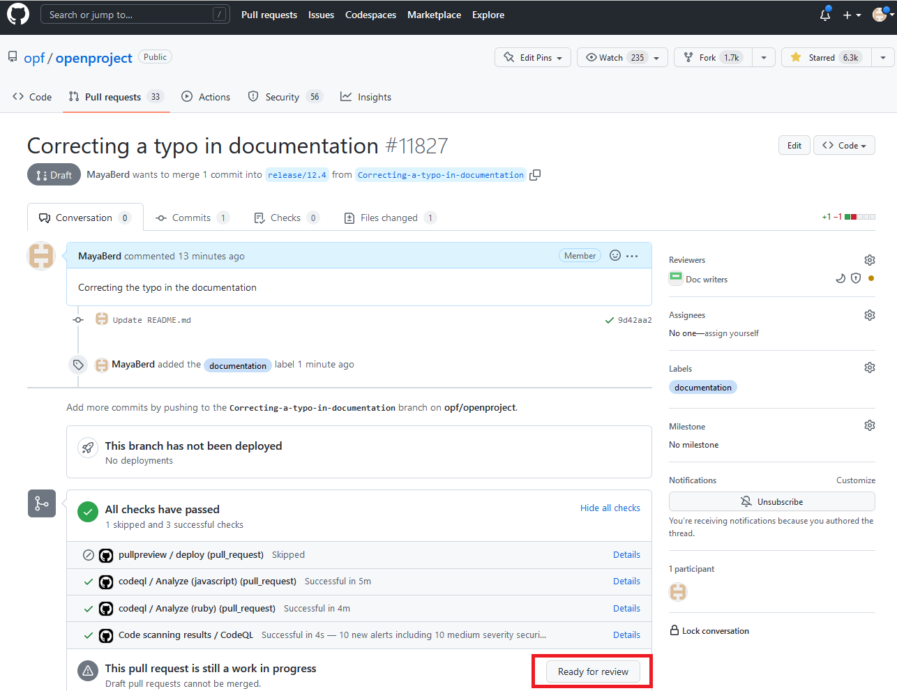

## Step 17: Wait for feedback from the reviewers

... and hopefully it is all LGTM which means "Looks good to me(rge). Congrats to your first contribution to the OpenProject documentation. We appreciate your effort :-)

## Appendix A: How to import a new release branch into your fork

*(e.g. Release changes from `release/12.2` to `release 12.3`)*

If a new release branch is generated on the upstream opf/openproject repository, the fork will NOT automatically fetch and merge and generate this release branch. With the following 'workaround' we get the new branch from the upstream (opf) repository and push it to our new origin (forked repository).

### A) Change Remote Repository to UPSTREAM

In GitHub Desktop choose menu "Repository -> Repository settings". This will open a new window (screenshot below). Enter the URL of the upstream/original OpenProject repository (e.g. https://github.com/opf/openproject.git). Confirm with **Save**

### B) Fetch origin (in this case repository 'opf')

In GitHub Desktop **at Current branch the old branch is visible [1]** . After you press **Fetch origin [2]** you will be able to **select the new branch at Current branch** (e.g. `origin/release/12.3`

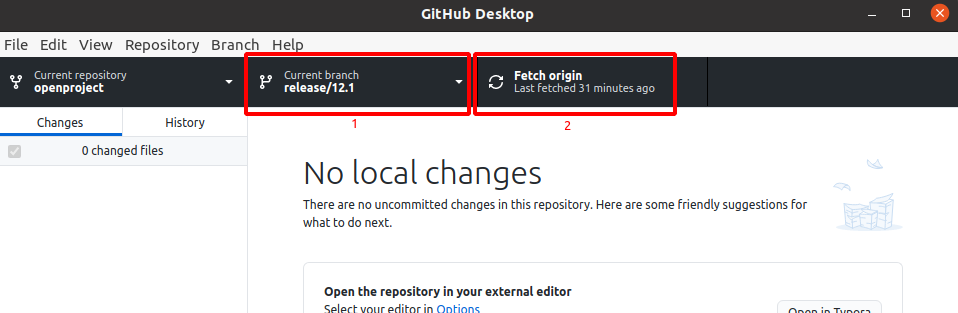

### C) Change remote repository back to the forked repository (ORIGIN)

In Github Desktop choose menu "Repository -> Repository settings". This will open a new window (screenshot below). Enter the URL of your forked OpenProject repository (e.g. https://github.com/adam-op/openproject.git). Confirm with **Save**

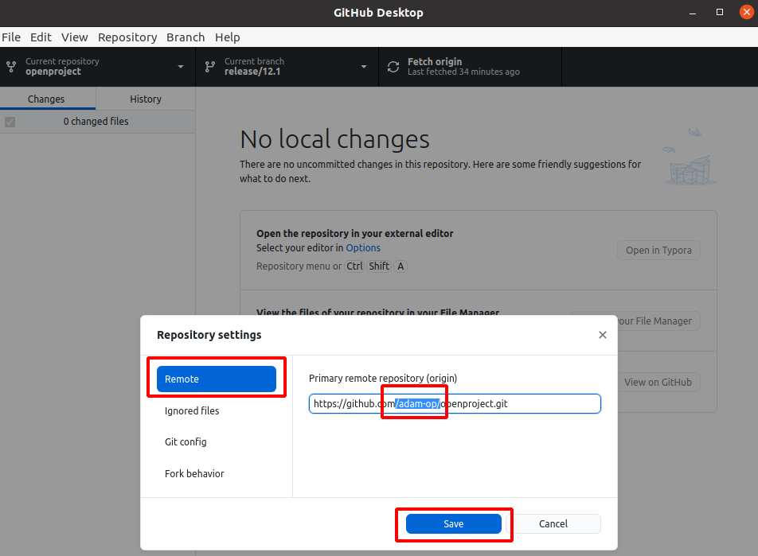

### D) PUSH to the forked repository (ORIGIN)

In GitHub Desktop choose menu "Repository -> Push".

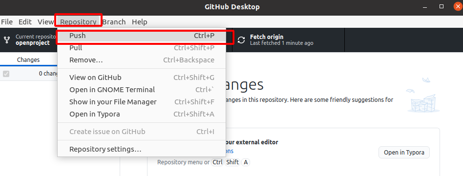

## Appendix B: How to change the Branch of an open Pull Request

If a new release branch is generated on the upstream opf/openproject repository, **and the steps in Appendix A were done** to get the new branch to the fork. We still might have open Pull Requests on the old, now outdated, release branch. The following steps show how to re-base your open Pull Requests to the new release branch. It is important, because otherwise your changes will not be synchronized with the online documentation on the webpage

### A) Open the Pull Request in the forked repository

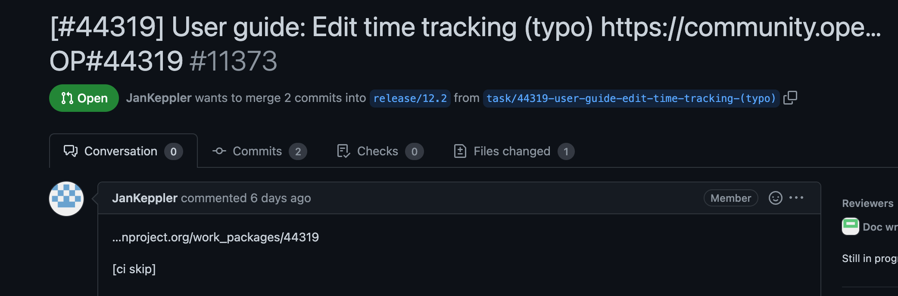

### B) Edit the Pull Request

Click on the Edit button on the right side of the Pull Request subject

### C) Open the Branches drop down list

### D) Select the new release branch

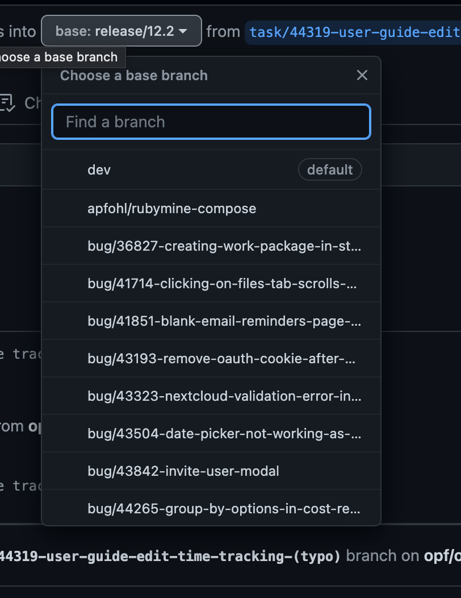

### E) Resolving Conflicts

It is possible that conflicts will be shown after you change the release branch, depending on how much time passed between the new release branch being created and the Pull Request being rebased.

If you change the branches, you need to do a rebase to the updated target branch and remove any commits that should not be in there. It's hard to document this as what you need to remove depends on the target branches. You can read up on how this works in general by searching for "rebasing" or "interactive rebase" for the git client of your choice. Reach out to us by mentioning or assigning an OpenProject developer to your PR in github if you still need help in rebasing your branch. Over time you'll learn what is necessary.
