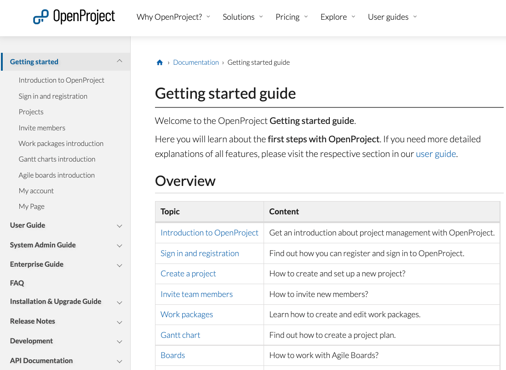
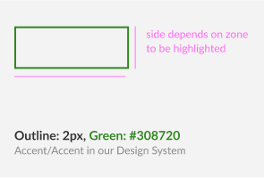
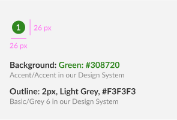

---
sidebar_navigation:
  title: Documentation style guide
  priority: 700
description: What styles and formats to follow when contributing to the OpenProject documentation
keywords: documentation style guide, style guide, format, style
---

# Documentation style guide

This document defines the standards for the OpenProject documentation, including grammar, formatting, wording and more.

## Markup language

All OpenProject documentation is written in Markdown. Feel free to either work directly in the Markdown files or to use [GitHub desktop](https://desktop.github.com) with a markdown editor like [Typora](https://typora.io) or others.

## Documentation structure

The OpenProject documentation is divided into the top level folders:

- Guides: getting started guide, user guide, system admin guide, Enterprise edition guide, installation and operation guide. Thereby each guide is available at top level on its own.
- FAQs
- Release notes
- Development
- API

Within each folder there is a sub-hierarchy of topics. E.g. in the Getting started guide you find amongst others the Introduction to OpenProject and Sign in and registration as sub-topics. Sub-topics are individual documentation pages in GitHub. You will notice the sub-topics in the documentation menu on the left when unfolding each folder's menu.



### Folder content

We aim to have a clear hierarchical structure with meaningful URLs like `https://www.openproject.org/docs/getting-started/sign-in-registration/`. With this structure you can identify straight away that this part of the documentation is about the sign in and registration process. At the same time, the website path matches our repository, making it easy to update the documentation.

Find an overview of content per folder here:

| **Directory**                                                              | **Contents**                                                                                                                                                                                                                                                                        |
|----------------------------------------------------------------------------|-------------------------------------------------------------------------------------------------------------------------------------------------------------------------------------------------------------------------------------------------------------------------------------|
| [Getting started guide](../../../getting-started/)                         | Here you will learn about the first steps with OpenProject. It is a short introduction on registration,  sign up, inviting members, starting to set up a project and the most important  features work packages, Gantt charts and agile boards.                                     |
| [User guide](../../../user-guide/)                                         | This guide covers the details of all features and  functionalities found in OpenProject.                                                                                                                                                                                            |
| [System admin guide](../../../system-admin-guide/)                         | Documentation on how to  make changes to settings affecting your entire OpenProject environment. This  is relevant for users with administrator rights for the configuration of all  modules but also overall, e.g. regarding system settings, authentication or user  permissions. |
| [Enterprise guide](../../../enterprise-guide/)                             | Here you will find all about the management and  administration of your Enterprise cloud and Enterprise on-premises  subscription.                                                                                                                                                  |
| [FAQs](../../../faq/)                                                      | This is  the central overview of frequently asked questions for OpenProject.                                                                                                                                                                                                        |
| [Installation and operations guide](../../../installation-and-operations/) | This guide summarizes the options for getting  OpenProject, either hosted or on-premises and what to do if you want to  include BIM features in your application. For the on-premises versions you  will find all operation and installation instructions.                          |
| [Release notes](../../../release-notes/)                                   | OpenProject is regularly upgraded with new features, security updates  and more. The release notes inform you about the news in each release.                                                                                                                                       |
| [Development](../../../development/)                                       | This guide details how to contribute to the code of  the OpenProject application.                                                                                                                                                                                                   |
| [API](../../../api/)                                                       | This part of the documentation deals with the API specification, what endpoints  and functionality are available.                                                                                                                                                                   |

## Directory and file names

Please respect the following when working with directories and files:

1. When you create a new topic, i.e. a new documentation page, always create a new folder with a **lowercase name** and a new **README.md** file in that folder.

   Example: `new-feature/README.md`

2. Use **lowercase latin characters and numbers**.

   Do not use special characters, umlauts and spaces, or capital letters in file names, directory names, branch names and anything that generates a path.

3. Use **no spaces**

   When creating a directory and it has more than one word in its name, use dashes (`-`) instead of spaces.

   Example: `new-feature`

   When creating a file and it has more than one word in its name, use dashes (`-`) or underscores (`_`) instead of spaces.

   Example: `open_details-view_work_packages.png`

   Only exception is the markdown file which always needs to be named **README.md**

If you are unsure where to place a document or a content addition, this should not stop you from authoring and contributing. Use your best judgment, and then add a comment to your pull request.

## No duplication of information

Do not include the same information in multiple places. Instead, link through to the information in the documentation where it is already mentioned so that there is only a single source of truth that needs to be maintained.

## References across the documentation

- When mentioning other OpenProject modules or features, link to their respective documentation, at least on first mention.

- Please see in [links](#links) how to use links within the documentation.

- When making reference to third-party products or technologies, link out to their external sites, documentation and resources.

## Structure in documents

- Structure content in tables or lists etc. in alphabetical order unless there is a reason to use any other order of importance.

## Documentation language

The OpenProject documentation should be as clear and easy to understand as possible. Avoid unnecessary words.

- Be clear and concise with as little words as possible.

- Write in US English with US grammar.  

We aim to use fair language on our language and documentation and choose gender-neutral terms whenever possible. If this is not possible due to the language, e.g. German, we use : to be as inclusive as possible. Please refer to the [fair language guide](../../translate-openproject/fair-language/) for more specific instructions.

## Capitalization

### Headings

Use sentences that describe the content and capitalize the first letter in the sentence. For example:

`# Create an OpenProject trial installation`

`## Start a new trial installation`

### UI text

When referring to specific user interface text, like a button label or menu item, use the name as in the application and start the word with a capital letter. Moreover, please make it bold. Example: **Start free trial** button.

### Feature names

Feature names are typically capitalized (the first word) and in bold. For example:

- **Gantt chart**
- **Roadmap**
- **Project overview**
- **News**
- **Wiki**

#### Other terms

Capitalize names of:

- OpenProject products: OpenProject Community edition, OpenProject Enterprise on-premises edition, OpenProject Enterprise cloud edition
- Third-party organizations, software, and products. For example Nextcloud, The Linux Foundation etc.

Follow the capitalization style by the third party which may use non-standard case styles. For example: OpenProject, GitHub.

## Placeholders

### User information

You may need to include user information in entries. Do not use real user information or email addresses in the OpenProject documentation. For email addresses and names, do use:

- Email address: Use an email address ending in @example.com.

- Names: Use strings like example_username. Alternatively, use diverse or non-gendered names with common surnames, such as Avery Smith.

- Screenshots: When inserting screenshots in the documentation, make sure you are not giving away your identity by using your actual avatar. Rather create a fake user name and avatar.

### URLs

When including sample URLs in the documentation, use example.com when the domain name is generic.

### Tokens

There may be times where a token is needed to demonstrate an API call. It is strongly advised not to use real tokens in documentation even if the probability of a token being exploited is low.

You can use this fake token as example: 12345678910ABCDE

### Commands

You might want to provide a command or configuration that uses specific values.

In these cases, use `<` customize `>` to call out where a reader must replace text with their own value.

For example:

```shell
cp <your_source_directory> <your_destination_directory>
```

## Contractions

Please do not use any contractions like don’t or isn’t.

## Copy

### Punctuation

Follow these guidelines for punctuation:

- Avoid semicolons. Use two sentences instead.

- Always add a space before and after dashes when using it in a sentence (for replacing a comma, for example).

- Do not use double spaces.

- When a colon is part of a sentence, always use lowercase after the colon.

### Spaces between words

Use only standard spaces between words so that the search engine can find individual search terms.

## Lists

Always start list items with a capital letter.

### Ordered and unordered lists

Only use ordered lists when their items describe a sequence of steps to follow.

Example for an ordered list:

Follow these steps:

1. Do this

2. Then do that

3. And then finish off with something else.

Example for an unordered list:

- Feature 1

- Feature 2

- Feature 3

### Markup

- Use dashes (`-`) for unordered lists.

### Punctuation

- Do not add commas (`,`) or semicolons (`;`) to the ends of list items.
- Separate list items from explanatory text with a colon (`:`). For example:
    - Feature 1: very attractive new feature
    - Feature 2: description of an additional feature

## Tables

Tables should be used to describe complex information. Note that in many cases, an unordered list is sufficient to describe a list of items with a single, simple description per item. But, if you have data that is best described by a matrix, tables are the best choice.

### Creation guidelines

To keep tables accessible and scannable, tables should not have any empty cells. If you still remain with a cell without content, please enter N/A (for ‘not applicable’) or none.

To help tables be easier to maintain, consider adding additional spaces to the column widths to make them consistent. For example:

```markdown
| **Feature**   | **Description**                                           |
| ------------- | --------------------------------------------------------- |
| Great feature | Enhances collaboration between marketing and sales        |
| Best feature  | Use it to synchronize your example table with OpenProject |
```

instead of:

```markdown
| **Feature** | **Description** |
| ------------- | --------------------------------------------------------- |
| Great feature | Enhances collaboration between marketing and sales |
| Best feature | Use it to synchronize your example table with OpenProject |
```

## Headings

- Add only one H1 in each documentation page, by adding # at the beginning of the headline (when using Markdown).

- Start with an H2 (##)  and respect the order H2 > H3. Never skip the hierarchy level, such as H3 > H2. Do not go lower in the hierarchy than H3 (###).

- Do not use symbols and special characters in headings.

- When possible, avoid including words that might change in the future. Changing a heading changes its anchor URL, which affects other pages that link to this headline.

- Leave exactly one blank line before and after a heading.

- Do not use links in headings.

- Make your subheading titles clear, descriptive, and complete to help users find the right example.

- See  [Capitalization](#capitalization) for guidelines on capitalizing headings.

### Heading titles

Keep heading titles clear and direct. Make every word count. Where possible, use the imperative. Example: Sign in with an existing account (**not** Signing in with an existing account).

### Anchor links

Headings generate anchor links when rendered. `## This is an example` generates the anchor `#this-is-an-example`.

Keep in mind that there are various links to OpenProject documentation pages and anchor links on the internet to take the users to the right spot. Thus, please avoid changing headings.

## Links

Links are important in the documentation. Use links instead of duplicating content to help preserve a single source of truth in the OpenProject documentation.

### Basic link criteria

- Use inline link Markdown markup `[Description](https://example.com)`. It is easier to read, review, and maintain.

- Use meaningful anchor text descriptions. For example, instead of writing something like `Read more about Gantt charts [here](LINK)`, write `Read more about [Gantt charts](LINK)`.

### Links to internal documentation

Internal links are links within the OpenProject website which includes the OpenProject documentation. In these cases, use relative links. I.e. do not use the full URL of the linked page but instead show the current URL's relation to the linked page's URL.

To link to internal documentation:

- Use relative links to Markdown files in the same repository.
- Use ../ to navigate to higher-level directories.

### Links to external documentation

When linking to external information, you have to use absolute URLs. Make sure that you are only linking to an authoritative source, i.e. official and credible sources written by the people who created the item or product. These sources are the most likely to be accurate and remain up to date.

## Navigation

When documenting navigation through the OpenProject application, use these terms.

### Menus

Use these terms when referring to OpenProject’s main application elements:

- **Header menu**: This is the blue bar at the top that spans the width of the application. It includes the OpenProject logo, the search field, the link to all projects, the global modules, the help icon and the user’s avatar.
- **Project menu**: This is the menu on the left in the OpenProject application that displays the modules after the selection of a project.

All project menu items are spelled as in the application in bold, e.g.

- In the project menu, select **Work packages** to open your work package table.

### How to document a navigation path

To be consistent, use this format when you write about UI navigation. Use the same names as in the application in italic and with arrows in between:

* In the header menu, click on your *Avatar > Administration* to find system settings.

## Images

Images, including screenshots, can help a reader better understand a guide. However, they can be hard to maintain with software updates being released, and should be used sparingly.

Before including an image in the documentation, ensure it provides value to the reader.

### Capture images

Use images to help the reader understand where they are in a process, or how they need to interact with the application.

When you take screenshots:

- Capture the most relevant area: Do not include unnecessary blank space or areas of the page that do not help illustrate the point. The project menu on the left of the OpenProject application can change, so don’t include it unless it is necessary.

- Be consistent: Coordinate screenshots with the other screenshots already on a documentation page. For example, if other screenshots include the left sidebar, include the sidebar in all screenshots.

### Highlight specific areas and add numbered labels

You can highlight a specific area of a screenshot to draw the reader's attention to it. Additionally, add numbered labels to refer to specific parts of the screenshot in the documentation text. These should be used sparingly since any future changes to the interface require the highlighted areas and labels to be manually added to each updated screenshot.

A highlighted area should be marked with a green rectangle (3px width, *Accent/Accent* color in our design system: #308720). The size of the area will naturally depend on the size of the area you wish you highlight.



The numbered labels should be light grey text *(Basic/Grey 6*: #F3F3F3) on a 24-pixel green circle (*Accent/Accent*: #308720) with a light grey outline (2px, *Basic/Grey 6*: #F3F3F3).



This is an example of a screenshot with both highlighted areas and numbered labels:


When referring to the numbered labels in the documentation text, use either an ordered list starting at number 1, with the numbers corresponding to the labeled parts of the screenshot. You may also refer to them within a line of text by using the word "Area" followed by the number, in parentheses, like so: "(Area 1)".

### Save images

- Save the image with a file name that describes the image. Use lower cases and no spaces (see [file names requirements](#directory-and-file-names)).

- Make sure to not exceed the maximum image size of 200KB.

- Place your images in the same directory where the README.md document that you are working on is located.

- Compress GIFs, maximum size 250KB.

### Add the image link to content

The Markdown code for including an image in a document is: ``

The image description is the alt text for the rendered image on the documentation page. For accessibility and SEO, use descriptions that are short and precise.

## Videos

At the moment it is not possible for external contributors to upload videos to the documentation. Please open a ticket in case you want to add a video.

## Alert boxes

Use alert boxes to call attention to information. The alert boxes in the OpenProject documentation have a specific format. Please use the following to be consistent:

```markdown
> **Note**: If you do not have an OpenProject installation yet, please visit our site on [how to create an OpenProject trial installation](../../../enterprise-guide/enterprise-cloud-guide/create-cloud-trial/).
```

> **Note**: If you do not have an OpenProject installation yet, please visit our site on [how to create an OpenProject trial installation](../../../enterprise-guide/enterprise-cloud-guide/create-cloud-trial/).

## Alerts

Alerts are a Markdown extension by Github based on the blockquote syntax that you can use to emphasize critical information.

```markdown 
> [!NOTE]
> Useful information that users should know, even when skimming content.


> [!TIP]
> Helpful advice for doing things better or more easily.


> [!IMPORTANT]
> Key information users need to know to achieve their goal.


> [!WARNING]
> Urgent info that needs immediate user attention to avoid problems.


> [!CAUTION]
> Advises about risks or negative outcomes of certain actions.
```

> [!NOTE]
> Useful information that users should know, even when skimming content.


> [!TIP]
> Helpful advice for doing things better or more easily.


> [!IMPORTANT]
> Key information users need to know to achieve their goal.


> [!WARNING]
> Urgent info that needs immediate user attention to avoid problems.


> [!CAUTION]
> Advises about risks or negative outcomes of certain actions.
