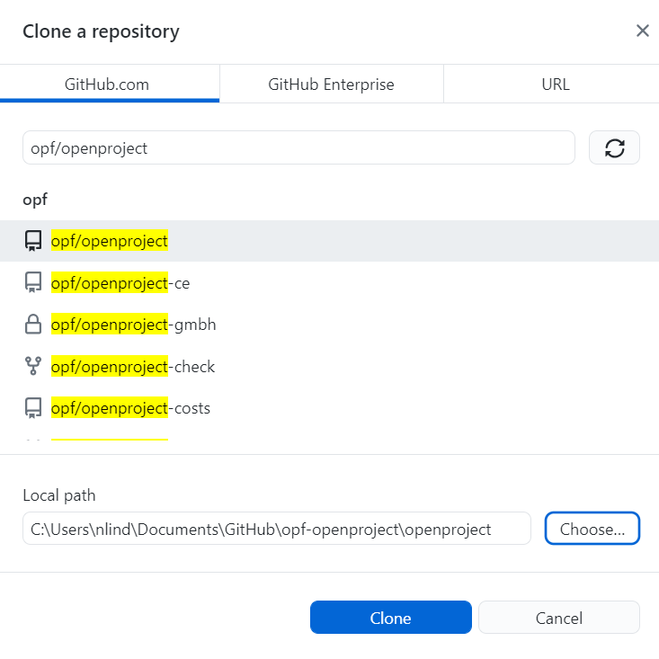

---
sidebar_navigation:
  title: Tool setup for non-techies
  priority: 999
description: Setup the tools to easily contribute to the OpenProject documentation
robots: index, follow
keywords: contribution, documentation, documentation process
---

# Setup the tools to easily contribute to the OpenProject documentation

This how-to guide aims to help users that are new to Git and Markdown to contribute to the OpenProject documentation. There are a two of very helpful tools that makes it extremely easy to contribute to OpenProject:

| Tool                  | Purpose of this tool                                         | Website and download                                         |
| --------------------- | ------------------------------------------------------------ | ------------------------------------------------------------ |
| Git                   | Git is a software for tracking changes in any set of files, usually used for coordinating work among programmers collaboratively developing source code during software development. | [https://git-scm.com/downloads](https://git-scm.com/downloads) |
| Typora                | Typora is an application that enables you to easily edit markdown files. The markdown file format is used used for the OpenProject documentation which allows you to focus on the content instead of the formatting. Typora is referred to as "What-You-See-Is-What-You-Mean". | https://desktop.github.com/                                  |
| GitHub desktop client | Desktop is an application that enables you to interact with GitHub using a GUI instead of the command line or a web browser. GitHub Desktop encourages you and your team to collaborate using best practices with Git and GitHu | https://typora.io/                                           |

## Step 1: Install Git

If you do not already have Git installed, you can download and install the latest version of Git from [https://git-scm.com/downloads](https://git-scm.com/downloads).

## Step 2: Install Typora

You can download the installer from the website https://typora.io/#download. Follow the prompts to complete the installation. In case you need more information there are very detailed [help](https://support.typora.io/) for each supported operating systems [Linux](https://support.typora.io/Typora-on-Linux/), [macOS](https://support.typora.io/Typora-on-macOS/) and [Windows](https://support.typora.io/Typora-on-Windows/). 

## Step 3: Install GitHub desktop client

You can install the GitHub desktop client on any [supported operating systems](/desktop/getting-started-with-github-desktop/supported-operating-systems). To install GitHub Desktop client navigate to [https://desktop.github.com/](https://desktop.github.com/) and download the appropriate version for your operating system. Follow the prompts to complete the installation.

## Step 4: Sign in into Github.com in GitHub desktop client

You need an account on GitHub.com to contribute to the OpenProject documentation. To exchange data between your local and remote repositories you need to first sign (File -> Options -> Sign in).

In the next screen click on "Continue with browser".

This opens your browser. To authenticate to type your GitHub.com credentials and click **Sign in**. If you have configured two-factor authentication (2FA) for GitHub enter your 2FA code in the prompt on GitHub and click **Verify**.

Alternatively, if you were already signed in to GitHub, follow the prompts to return to GitHub Desktop to finish authenticating.

After authenticating your account, you are ready to manage and contribute to projects with the GitHub desktop client.

## Step 5: Fork the OpenProject repository 

If you are an external contributor you don't have write permissions on the repository https://github.com/opf/openproject/. In this case you need to fork the repository first. This basically means that you have your own copy of the repository on GitHub.com. Since it is your own repository you have write privileges here.

## Step 6: Clone the OpenProject repository in the GitHub desktop client

Before you can make changes you need to create a local clone of the OpenProject repository on your local computer. Open the GitHub desktop client and navigate to "File -> Clone repository". Here select the repository you selected in Step 5. Also select a folder on your computer for the cloned repository. Click "Clone".

## Step 7: Create a new Git branch for your change

Select the latest release branch e.g.`release/12.1` as the current branch. 

In the same drop down click on "New branch". In this window insert a branch name select the latest release branch e.g. `release/12.1`.

## Step 8: Fetch origin (update local repository)

Every time you start editing please make sure you have fetched the latest changes from GitHub.com by clicking on "Fetch origin" in the main toolbar:

## Step 9: Open the files you want to change in Typora

In Typora open the files you want to change (File -> Open). In the file picker navigate to the local folder you selected in the step 6.

## Step 10: Make the changes in Typora and save the file

The Typora editor makes it quite easy to make changes to the file. After you made your changes do not forgot to save.

## Step 11: Commit the change to your local repository in the GitHub desktop client

Open the GitHub desktop client. Here you can see all the changes you made in the local repository.

Add a commit message that best describes your change. This description should allow other users to easily understand the change you made.
