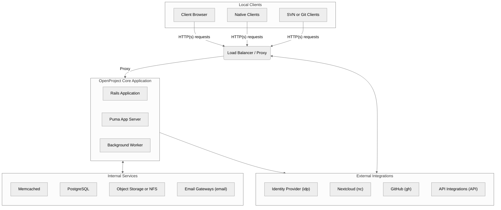
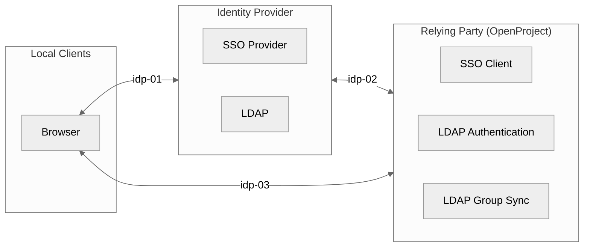
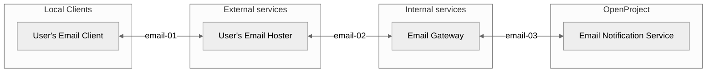
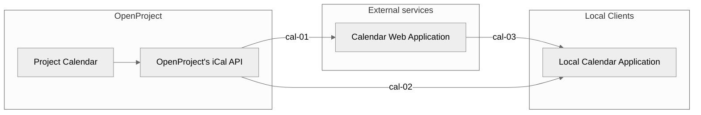
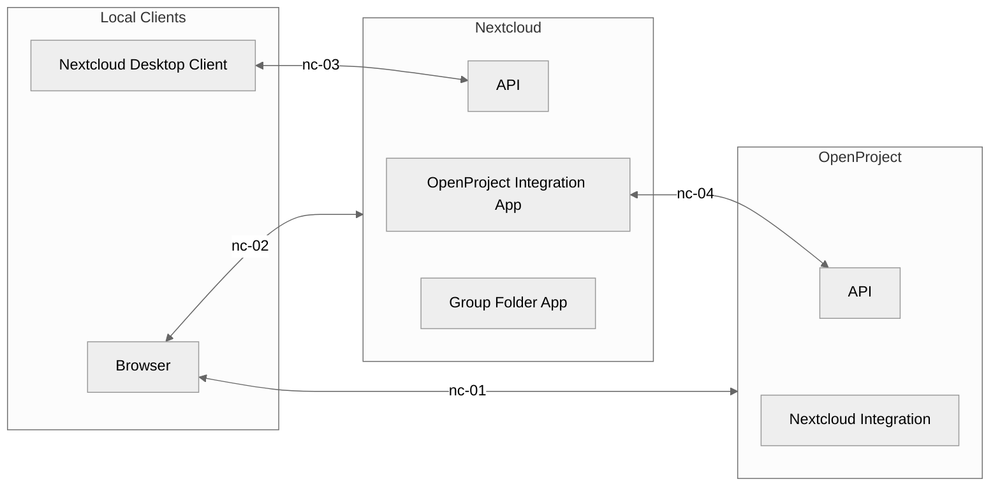
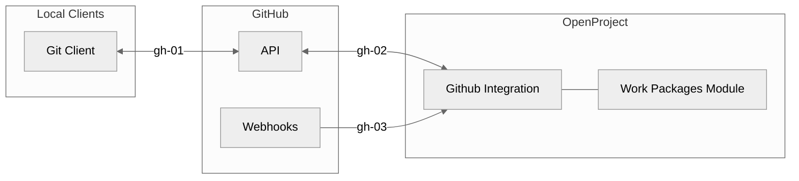

# Processing of personal data

> **Note:** Purpose of this document is to provide users a starting point for creating their own data privacy information documentation imposed by the GDPR. The legal information for using services provided by the OpenProject GmbH can be found here:
> * [Privacy Policy](https://www.openproject.org/legal/privacy/)
> * [Data Processing Agreement](https://www.openproject.org/legal/data-processing-agreement/)
> * [Sub-Processors](https://www.openproject.org/legal/data-processing-agreement/sub-processors/)
> * [Technical and Organizational Data Security Measures](https://www.openproject.org/legal/data-processing-agreement/technical-and-organizational-data-security-measures/)

Status of this document: DRAFT 2023-10-27

## Purpose and subject of processing

### Anonymous access of OpenProject

Depending on the individual permission and authentications settings persons can access OpenProject [anonymously](../../system-admin-guide/users-permissions/roles-permissions/#anonymous) without a user account. The [OpenProject community platform](https://community.openproject.org) is an example of an OpenProject installation where individual projects where set to public.  

### Registration of a user account

To sign-in to the OpenProject platform, the registration of a user account is required. For registered user's the following personal data are processed:

- Name
- Username
- Email address
- Avatar
- Notification settings
- Email reminder settings
- Hourly rate history
- Display settings: High contrast mode, standard mode, dark mode, and custom themes.
- Project roles
- Global roles
- Time zones
- Group memberships
- Password (encrypted)
- Display language
- Standard weblog data (IP address of calling computer, time of call, version of operating system and browser used)

- Telephone number for sending one-time passwords via SMS,
- OATH secret code (e.g. for the 2FA app FreeOTP).

> **Note:** Administrators can add so-called [custom fields](../../system-admin-guide/custom-fields/) to their OpenProject installation which extend the data fields of a user.

### Using OpenProject

Depending on the individual use and permissions of the user the following personal data is processed:

- Comments in work packages, meetings, wiki pages and project news
  - Change history
  - Persons named in comments

- Work packages
  - Change history
  - Persons named in attributes and text fields

- Project plans
  - Change history
  - Persons named in schedules

- Work package lists
  - Change history
  - Visibility settings
  - Filter settings
  - Sort settings
  - Display settings
  - Persons named in work package lists

- Wiki pages
  - Modification history
  - Persons named in wiki pages
- Time tracking
  - Change history
  - Persons named in time entries

- Meeting agendas and minutes
  - Change history
  - Invitees
  - Participants
  - Persons named in agenda items

- Team planner
  - Change history
  - Persons named in team planners
  - Assignments of work packages to persons

- Boards
  - Change history
  - Persons named in the boards
  - Assignments of work packages to persons
- Calendar
  - Change history
  - Persons named in the calendars
  - Assignments of work packages to persons
- Project news
  - Change history
  - Persons named in project news

- Project status information
  - Change history
  - Persons named in project status information

- Project attributes
  - Change history
  - Persons named in project attributes

- Files
  - Change history
  - Persons named in file attachments incl. file attributes

- Project overviews
  - Change history
  - Persons named in project overviews

### Logging

Every interaction (i.e. web request) of a browser or other client results in an entry written to logfiles. These files support the operation of the application as they provide information on faulty behaviour of the system (i.e. bugs and lack of performance).

Those log files contain the following person related data:
* id of the user performing the request
* time of the request
* url called
* parameters sent to the server as part of the request which comprises the user's input in the form of e.g. work package title and description, wiki page content, comment text, SAML user information etc.

Data that can be identified as sensitive information like passwords are not logged.

The data listed above is generated upon entering the application. When actually processing the request within the application, events deemed noteworthy by the developers might be logged additionally. An example of this are failed login attempts.

The logfiles are automatically removed based on a first-in-first-out mechanism. This is done to limit the disk space which ensures the server's operation and at the same time serves as a means to erase the log entries once they have served their purpose of supporting operations. The deciding criteria for how long log entries are kept is by default the size of the logfiles. Once the logfiles reach the limit, the oldest entries are removed. As such, the log entries are not kept for a fixed set of days. If there are a lot of requests, old entries are removed faster then if there are less requests. Administrators of the servers might decide to configure a different behaviour that factors in the age of the log entries as well.

More technical information about the logging mechanism can be found in the operations documentation:

* [Monitoring your OpenProject installation](../../installation-and-operations/operation/monitoring/)

On top of the log files OpenProject manages, additional logs might be written by systems that are part of the used network infrastructure (e.g., load balancers, proxying servers, or other network components). These are out of scope for this documentation but oftentimes contain additional information such as the IP address. On the other hand, since TLS is employed for all connections by default, those intermediary systems do not have access to the full request body so they are not able to see for example the request parameters.

## Data flows of personal data

### System overview

The following diagram provides an overview of the data flows of personal data in OpenProject. This applies to the different installation methods.

As a web application, the primary data flow is between the Client Browser (or attached API clients) through an external proxying web server (this might be a load balancer or proxying server). Depending on the individual setup the proxying server is responsible for terminating TLS connections for the course of this document - although encrypted connections between Load balancer and Puma server are possible. In case of packaged or Kubernetes installations, this proxying server might be part of the OpenProject stack (e.g., an Apache2 packaged installation server or nginx ingress).

The external web server acts as a proxy/reverse-proxy for the OpenProject Puma application server, relaying requests for it to handle and respond. In the course of the request, access to external services such as the PostgreSQL database, a caching server, or attached storages might be performed. In case of S3-compatible object storage set ups, OpenProject performs calls to the object storage to put or request files from it. Likewise, for network-attached storages linked into the application, underlying network requests are performed. These are out of scope for this evaluation, as they are provided and maintained by the operator of the system.

In the course of using the application, background tasks are enqueued in the database such as outgoing emails, cleanup tasks, or notification processing. These tasks are performed in a separate process, the background worker queue. This process accesses the same services as the application server process to access or modify data. It might connect to external integrations such as a [Nextcloud](../user-guide/nextcloud-integration/) instance to set up file sharings depending on actions performed by the users.

**Exemplary request flow**

- **User request**: An end-user sends an HTTPS request to the load balancer or proxying server.
- **Load balancer**: The external load balancer or proxying server receives the request, terminates TLS, and forwards the HTTP request to the Puma application server.
- **Puma app server**: Processes the request and invokes the appropriate Rails middlewares and controller.
- **Rails application**:
- Authenticates the user according to the mechanisms outlined in the [secure coding guidelines](../concepts/secure-coding)
  - Validates session and input data
  - Responsible for error handling, logging, and auditing aggregation
  
- Retrieves or updates resources to the PostgreSQL database via models
  - Calls or interacts with external services for requests, such as retrieving files or attachments from object storage
  
- Renders the appropriate views
- **Response**: Sends the HTTP response back through the Puma server and load balancer to the end-user.
- **Background worker:** Operate on periodical background data, or perform actions requested by the web request of user (sending emails, exporting data, communicating with external services)

### Sign-in using an identity provider

#### Overview

#### Purpose

* Centralized identity and access management
* Single sign on
* Single sign out
* Syncing LDAP groups with OpenProject groups  

#### Security measures

* `idp-01` TLS
* `idp-02` TLS
* `idp-03` TLS

### Email 

#### Overview

#### Purpose

* Create a new work package by sending an email to a configured email adress.
* Adding a comment to an existing work package by answering to an email notification.
* TODO Incoming email
* Sending email notifications about updates in OpenProject (e.g [email reminder](../../system-admin-guide/emails-and-notifications/))

#### Security measures

* `email-01` TLS (not controlled by the OpenProject system)
* `email-02` TLS (not controlled by the OpenProject system)
* `email-03` TLS (encryption can be activated in the email settings in the OpenProject Administration)
* **Note**: OpenProject does not support end-to-end encryption using GPG or S/MIME.

### Calendar

#### Overview

#### Purpose

* Users can import project calendars into their calendar applications using the iCal format.

#### Security measures

* `cal-01` TLS
* `cal-02` TLS (not controlled by the OpenProject system)
* `cal-03` TLS (not controlled by the OpenProject system) 

### Nextcloud

#### Overview

#### Reason for the data processing

* Users can link files stored in Nextcloud with work package in OpenProject.
* Project folders in Nextcloud can be managed in OpenProject (create, delete, update, user permissions).

#### Security measures

* `nc-01` TLS
* `nc-02` TLS
* `nc-03` TLS
* `nc-04` TLS

### GitHub

#### Overview

#### Purpose

- Connect pull requests in GitHub with work packages in OpenProject.
- Show the status of pull requests in related work packages.

#### Security measure

* `gh-01` TLS
* `gh-02` TLS
* `gh-03` TLS

## Database schema 

OpenProject's database schema is considered an internal API, please do not rely on it as a stable point of references. Schema modifications by the OpenProject core might be performed in any upgrade, including patch releases. Modifications to the database schema are considered a third-party customization and might prevent us from giving proper support. If you have an active support contract with OpenProject, please note that modifications affect our warranty. For more information, please consult the [Terms of Services](https://www.openproject.org/legal/terms-of-service/#-5-warranty).

We recommend you use existing database tools to inspect and export the database as an ERD. That being said, we've prepared an export of an ERD of the current state of the database. Note that this diagram is not regularly updated. Use tools like IntelliJ database explorer or [mermerd](https://github.com/KarnerTh/mermerd) to generate a live ERD of your database set up instead.

## Use of technical cookies

OpenProject makes use of technical cookies to identity the browser client and/or remember information such as 2FA login state. The core application makes use of these cookies:

| **Cookie name**                                | **Description**                                              | **Expiry**                                                   | **Security flags**                                    | **Implementation**                                           |
| ---------------------------------------------- | ------------------------------------------------------------ | ------------------------------------------------------------ | ----------------------------------------------------- | ------------------------------------------------------------ |
| `_open_project_session` (name is configurable) | contains the information about the logged in user as well as information stored between requests on the user's choices (e.g. the filters for costs are in part stored there) | Session  + configurable server-sideTTL                  | secure httponly Samesite=Lax encrypted | [Code ref](https://github.com/opf/openproject/blob/release/13.0/config/initializers/session_store.rb#L34-L39) |
| `autologin` (name is configurable)             | (Optional feature, requires opt-in under Administration > Authentication settings)  enables the user to automatically log in again after the session expired (e.g. because the browser was closed). It is set when the user checks the '*Stay logged in*' box in the login form.  | Cookie 1 year + server-side token N days (configurable) | secure httponly Samesite=Lax encrypted | [Code ref](https://github.com/opf/openproject/blob/release/13.0/app/controllers/concerns/accounts/user_login.rb#L19C1-L29) |
| `op2fa_remember_token`                         | the presence of that cookie suppresses the need for the user to provide a second factor upon login for N days (configurable by administration) if the user selects to do so when entering the 2fa information. | N days (configurable)                                        | secure httponly Samesite=Lax encrypted | [Code ref](https://github.com/opf/openproject/blob/release/13.0/modules/two_factor_authentication/app/controllers/concerns/two_factor_authentication/remember_token.rb#L28-L34) |

On top of that, for cloud instances:

- `openproject_cloud_instances` contains a list of instances the user recently accessed.
- additional technical cookies might be set by the load balancer and intermediate processes (i.e., to remember a sticky load balancer and ensuring subsequent requests are routed similarly).

## Deletion and anonymization of personally identifiable information

Whenever users in OpenProject are fully deleted, the system scrubs and removes all structural PII. For more information on user account deletion, please see [the user administration guide](../../system-admin-guide/users-permissions/users/#delete-users).

Deleting a user account is a permanent action and cannot be reversed. All actions performed in the name of the user are being scrubbed and replaced with a singular "Deleted user" reference in order to maintain integrity of database references, such as being an author of a work package that remains. Finally, the user data itself will be deleted, removing all structural traces of PII in the system. Due to the user references changing, respective cache keys for information such as work packages or projects are invalidated automatically. Note that user-input data such as text or comments cannot be deleted or scrubbed in an automated fashion.

Log files might still retain PII data of the user for the configured retention period. Memory references in memcached might still refer to (invalidated) user data until it is being reassigned.
