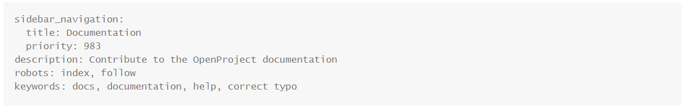
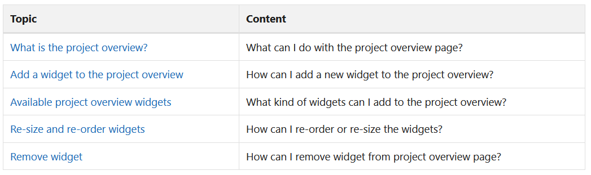
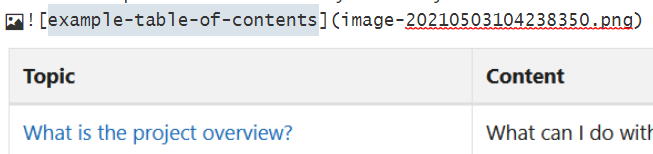

---
sidebar_navigation:
  title: Documentation
  priority: 983
description: Contribute to the OpenProject documentation
robots: index, follow
keywords: docs, documentation, help, correct typo
---

# Contributing to the OpenProject documentation

If you find something missing in the documentation: Please feel invited to contribute to it. We are looking forward to your help!

The following overview will give you insights into how the documentation is structured, how you can contribute and what needs to be considered when changing something.

| Topic                                             | Content                                                      |
| ------------------------------------------------- | :----------------------------------------------------------- |
| [Structure](#structure)                           | Understand how the documentation is structured and what belongs where. |
| [Wording and formatting](#wording-and-formatting) | Get to know existing guidelines and common examples for formatting and wording. |
| [Contributing](#contributing)                     | Learn how to contribute to the documentation - be it correcting typos or adding sections. |

## Structure

The documentation is structured along different topics or section of the software, respectively:

- **Getting started**: General overview of OpenProject and introduction to basic features. Apart from the section "Sign in and registration", "My account" and "My page", there will be additional or more extensive information in the User guide.
- **User guide**: Covers all sections of the software (except from the ones mentioned above) that a non-admin user may have access to. 
- **System admin guide**: Covers all sections of the software that are accessible via the *Administration* link when clicking on one's avatar.
- **FAQ**: Contains general frequently asked questions and such that do not really fit elsewhere. Within the other main sections there are additional FAQ pages that focus on the respective topic.
- **Enterprise guide**: Covers all subscription-related topics for Enterprise on-premises and Enterprise cloud. Information about premium features that come with Enterprise on-premises and Enterprise cloud can be found in User guide and System admin guide.
- **Installation & operations guide**: Only relevant for on-premises installations of OpenProject (Community Edition and Enterprise on-premises). Covers topics like installation, configuration, operation and upgrading.
- **Release notes**: Gives an overview of OpenProject releases and their features and bug fixes. More information will be provided in release news on the OpenProject blog.
- **Development**: Details the development concepts and processes of OpenProject. As OpenProject is Open Source, everyone is invited to contribute. The explanation of feature requests, bug reports and translations can also be found here.
- **API documentation**: Documentation of the API(s) of OpenProject and e.g. their endpoints.

In each of these main chapters there are several sub-sections with up to two hierarchical levels. The User guide and the System admin guide and structured along the structure of the software. The rest is structured along topics. 
Most parts of the documentation are feature oriented (rather than use case oriented). There will be additional documentation and resources that look at OpenProject more from a "how do I..." perspective.

### Structure within a section

Within a section/chapter, there are a few main elements:

- **Meta data** for the structure of the documentation and for search engines. 
  The title will be shown in the menu/hierarchy. The priority influences the relative position of the respective documentation page within a section.
  The description, "robots" and the keywords are meant for search engines.
  
  Depending on the tool, it makes sense to edit this in the source code mode. Feel free to copy this from another page if you're unsure and adapt it afterwards.
- A **table of contents**: With its headers "Topic" and "Content" it gives an overview of the chapter. There's no general rule or agreement on the structure of the description (below "Content"), yet (e.g. "How to ...", "Main features of button X", "How can you ...?").
  The table of contents only contains the main headers (h2) of a chapter or (in a case like [Enterprise guide](../../enterprise-guide)) links to its sub-sections that are not on the same page.
  For short chapters it is not absolutely necessary to add a table of contents. 
  
  The table of contents is made up of a simple table. If your text editor does not offer tables, feel free to copy the markdown from another chapter.
- **Headers**: Put a main header (h1) directly below the meta data of each chapter. There should only be one h1-header per chapter. Structure the chapter with h2- and more headers. At the moment, all headers will be shown on the right hand side of the documentation.
- **Links**: There are three types of links in the documentation:
  - Links to other chapters: Use relative links. This means that you may have to use (multiple)"../" to link to a higher hierarchical level.
    Example: Linking from this chapter to https://docs.openproject.org/user-guide/work-packages/work-package-table-configuration/#sort-the-work-package-list looks like this: Put the word that should be linked in square brackets, directly followed by round brackets that contain the link. Each "../" brings you up one hierarchical level (in this case we need to reach the level above the User guide). Then you can enter the regular path. As you can see in the example, a combination of links to other chapters and within a chapter ("#sort-...", see below) works. Make sure to spell-check.
    
  - Links within a chapter: You can link to headers. The link starts with a hash sign (#) and contains the name of the header with hyphens in-between. The basic formatting is the same as shown above
    Watch out if there are special characters or capitalizations in the header (e.g. "screen-shot" has to be linked as "#screen-shot" whereas "FAQ - frequently" has to be linked as "#faq---frequently" and "highlighting (Premium)" has to be linked as "#highlighting-premium"). Do not put brackets or commas from a header in the link.
    Please only put links to headers within the same page for rather long pages, not on short pages.
  - External links: When linking to e.g. the OpenProject blog or GitHub, put the "https://" or "http://" in front of the URL. Do not enter the link without this formatting as it might be understood as a relative link and thus not work properly.
- **Screen-shots**: To add a screen-shot, paste it into the editor you use or put it in the same folder as the text file you're about to change is. if necessary, link the image it like in the screen-shot below. Add a name (with hyphens).
  
  The description of a screen-shot goes above it. In other words, the image belonging to an instruction should be inserted *after* the instruction.
  In some places you will find numbers in green circles in screen-shots that refer to explanations of steps or options or green or red boxes. Feel free to ask an OpenProject team member to do this for you or to give you the template.
- **Videos**: Where possible, the OpenProject team will embed explanatory videos, which can also be found on our YouTube channel. 
  The rule for positioning is the same as for screen-shots.

## Wording and formatting

Here are some guidelines to ensure a consistent look and feel of the documentation:

### Capitalization

| Guideline                                                    | Examples                                                     |
| ------------------------------------------------------------ | ------------------------------------------------------------ |
| Sections of the documentation start with a capital letter, no additional capital letters | User guide, System admin guide                               |
| Proper names, names of modules and names of buttons start with a capital letter | My page, Activity, Project settings, View all projects, Gantt chart; Enterprise on-premises, Enterprise cloud, but: Community Edition |
| General terms start with a lowercase letter                  | work package list, board, time tracking, filter, administrator |

### Bold and italic print and quotation marks

| Guideline                                                    | Examples                                                     |
| ------------------------------------------------------------ | ------------------------------------------------------------ |
| Use italic and arrows to describe a navigation path          | Please navigate to *Administration -> System settings -> Projects* and click on X |
| Use bold for buttons the user should click                   | Click on **Delete project**. Don't forget to press **Save** to keep your changes. |
| You may use quotation marks to refer to names of modules or buttons when capitalization is not enough to set them apart or when referring to external names. | The "Delete project" button can be found in the upper right corner. According to "GitHub News" there's a new kid in town. Also: The Boards module is great. |
| You may use bold if there's something important in the text you'd like to stress. | **Watch out**: Deleting a project can't be reverted.         |

### Phrasing and tone

The documentation should be written in a formal and precise language. Nevertheless, as this is humans talking to humans, feel free to use "you" and thus refer to the reader personally. There's no need to use the passive form all the time.

Please try to be precise: Use the exact names of buttons and modules. If you're unsure about phrasing, use other parts of the documentation as guideline.

Use imperative ("do X") or a more descriptive approach ("it is possible to do X"), depending on what suits the situation best.

## Contributing

The creation and editing of this documentation is based on repositories in GitHub (like the code of OpenProject). You will need a GitHub account to contribute. 

There are two repositories:

- https://github.com/opf/openproject: In the folder "docs" you will find all the documentation contents
- https://github.com/opf/openproject-docs: This repository is for building the basic structure of the documentation (User guide, Enterprise guide, etc.) as well as the start page (https://docs.openproject.org). Usually, you will not need this.

To contribute to the documentation please fork from the latest release branch (e.g. for release 11.2.4 this is "[/release/11.2](https://github.com/opf/openproject/tree/release/11.2)"). Other than for the code, the **release branch** is the correct one for working on the documentation. As soon as you're ready, issue a pull request against the latest release branch. Please add a meaningful description of your changes and, if necessary, the reason for it. Someone from the OpenProject team will have a look at it.

Please have a look at [this more extended documentation](../git-workflow/) to better understand our GitHub work-flow.

### Tools

For people who (only) want to contribute to the documentation we can recommend a combination of GitHub Desktop and Typora. 

### Folder structure

For each chapter, there is a folder. The folder name influences the URL of the docs page. Within the folder, there is a file called "README.md"; this is the content of the documentation page. Screen-shots should be put in the same folder and can be inserted as shown above.
