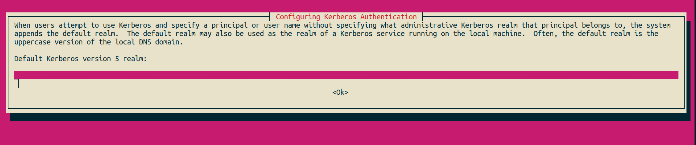
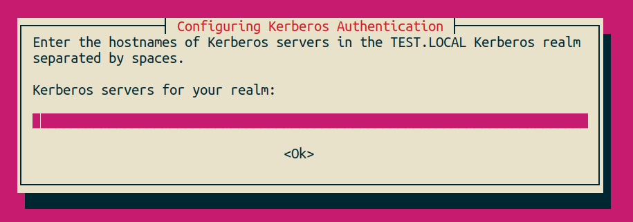
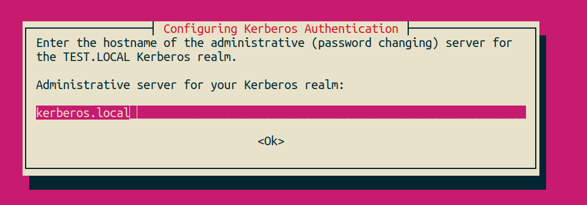
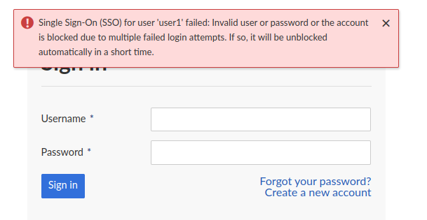

---
sidebar_navigation:
  title: Kerberos development setup
  priority: 920
robots: index, follow
---

# Set up a development kerberos server

**Note:** This guide is targeted only at development with OpenProject. For the Kerberos configuration guide, please see this guide: [Kerberos authentication guide](../../system-admin-guide/authentication/kerberos/)

To test Kerberos, you'll need to setup a local kerberos admin and kdc server. This guide shows you how to do this for debian/ubuntu systems. YMMV on other distributions.

## Prerequisites

- A debian / ubuntu VM or local machine

- A local packaged installation installed using the hostname `openproject.local`

## Installing kerberos server

First, install kdc and admin server:

```shell
apt install krb5-kdc krb5-admin-server krb5-config -y
```

During that installation, you'll be asked to enter the default realm. We'll use `TEST.LOCAL` in the course of this guide.



Next, you'll have to enter the hostnames used for your server. We'll assume this setup:

- The development server is running under `openproject.local`
- The KDC and admin server will be running under `kerberos.local`

You can simply add both of these hostnames to localhost in your `/etc/hosts` file.

Then, in the following screen, enter `openproject.local kerberos.local`



For the administrative server, also enter `kerberos.local`



The next dialog, you can simply continue with OK. The configuration will continue, and the krb5-kdc service will fail with a missing database. This is normal.

### Adding the realm

Next, add the realm with the command `krb5_newrealm`. You'll be prompted for a password. Double-check that it prints this line or similar:

`Initializing database '/var/lib/krb5kdc/principal' for realm 'TEST.LOCAL',`

Enter a password and continue with enter. The realm is now setup.

Next,  you'll restart the kdc server with `systemctl restart krb5-kdc` and confirm it's running with `systemctl status krb5-kdc`

### Adding your principal

You can now run `kadmin.local`  to access the admin CLI for adding principals to kerberos. In that prompt, enter a new user for testing:

`addprinc user1`

This will prompt for a password for user1, which you have to confirm afterwards.

To check that the user was created successfully, run this command `get_principal`:

```text
> kadmin.local: get_principal user1
Principal: user1@TEST.LOCAL
Expiration date: [never]
Last password change: Mi Jun 22 16:28:58 CEST 2022
Password expiration date: [never]
Maximum ticket life: 0 days 10:00:00
Maximum renewable life: 7 days 00:00:00
Last modified: Mi Jun 22 16:28:58 CEST 2022 (HTTP/admin@TEST.LOCAL)
Last successful authentication: [never]
Last failed authentication: [never]
Failed password attempts: 0
Number of keys: 2
Key: vno 1, aes256-cts-hmac-sha1-96
Key: vno 1, aes128-cts-hmac-sha1-96
MKey: vno 1
Attributes: REQUIRES_PRE_AUTH
Policy: [none]
```

### Create a service principal and output as keytab

The OpenProject Apache module for kerberos will call the kerberos with its own service principal. That we will have to create and add a keytab for, so that the password can be access by Apache.

In the `kadmin.local` prompt, run this:

```shell
addprinc -randkey HTTP/openproject.local
```

Note that this will not require a password prompt.

This adds a principal for the HTTP/openproject.local service. Next, add it to a keyfile at `/etc/apache2/openproject.keytab`:

```shell
ktadd -k /etc/apache2/openproject.keytab HTTP/openproject.local
```

Exit the `kadmin.local` console. Make sure the file is readable by apache2:

```shell
chown www-data:www-data /etc/apache2/openproject.keytab
chmod 400 /etc/apache2/openproject.keytab
```

## Set up Apache2 kerberos config

First, install the GSSAPI apache module with:

```shell
apt install libapache2-mod-auth-gssapi
```

Add the customization dir `mkdir -p /etc/openproject/addons/apache2/custom/vhost` and create this file: `vim /etc/openproject/addons/apache2/custom/vhost/kerberos.conf`

Add the following contents:

```apache
<Location />
  AuthType GSSAPI
  # The Basic Auth dialog name shown to the user
  # change this freely
  AuthName "TEST.LOCAL realm login"

  # The realm used for Kerberos, you will want to
  # change this to your actual domain
  GssapiCredStore keytab:/etc/apache2/openproject.keytab
  # You can also try to set the explicit name instead of the keytab,
  # this will lookup the keytab from its default location /etc/kr5b.keytab
  #GssapiCredStore HTTP/openproject.local@TEST.LOCAL
  # Disable SSL
  GssapiSSLonly           Off
  # Enable sending username without REALM
  GssapiLocalName         On
  GssapiAllowedMech krb5

  # After authentication, Apache will set a header
  # "X-Authenticated-User" to the logged in username
  # appended with a configurable secret value
  RequestHeader set X-Authenticated-User expr=%{REMOTE_USER}:MyPassword

  # Apache directive to ensure a user is authenticated
  Require valid-user
</Location>
```

Save the file and check the config with `apache2ctl configtest`. If this works fine, restart apache with `systemctl restart apache2`.

If your OpenProject installation isn't yet running under `openproject.local`, run `openproject reconfigure` to change the hostname.

## Configure OpenProject

The rest is the same as the production config. You need to tell OpenProject to use header based SSO:

```shell
openproject config:set OPENPROJECT_AUTH__SOURCE__SSO_HEADER="X-Authenticated-User"
openproject config:set OPENPROJECT_AUTH__SOURCE__SSO_SECRET="MyPassword"
```

Afterwards, restart the OpenProject server with `systemctl restart openproject`

## Use the integration

If you access OpenProject now, you'll see that the SSO login is tried but fails:



This is expected, as there is no `user1` login with an auth source connected. To fix that, open a console with `openproject run console` and run:

```ruby
auth_source = LdapAuthSource.create! name: 'test', host: 'localhost', attr_login: 'uid'

user = User.create! login: 'user1', firstname: 'user', lastname: 'one', mail: 'user1@example.org', admin: true, ldap_auth_source: auth_source
```

Now reload the page and you'll be logged in immediately.
