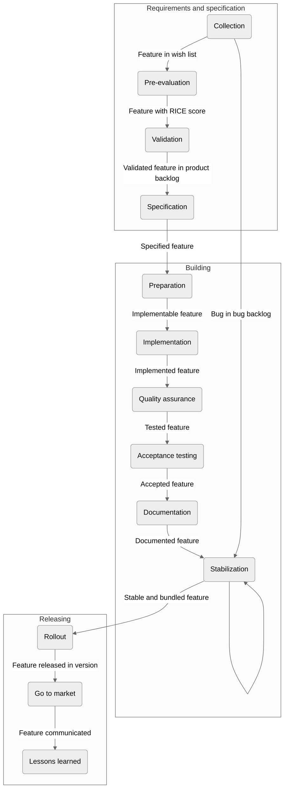

---
sidebar_navigation:
  title: Product development
  priority: 999
description: Learn about OpenProject's product development process and the RICE score
keywords: product development, requirement process, RICE score
---

# OpenProject product development

## 1. Overview & objectives

OpenProject aims to connect distributed teams and organizations and make project management intuitive and fun. The application is continuously developed and maintained by an active international community to provide a powerful feature set and yet intuitive user interface. The overall purpose is to create customer benefit. To achieve this, OpenProject follows a requirements and product development process that empathizes identifying and building the functionality which most aligns with OpenProject’s product vision and delivers customer value.

This guide is an evolving description of the steps taken from collecting requirements all the way to implementation and release. The goal is to provide a single source of truth and provide a guideline for team members, community contributors and interested customers. As such this document will continuously be updated whenever involved components, roles, or permissions are changing.

## 2. Process overview

The product development process involves various roles during the different phases:

* Product Manager (PM)
* Designer
* QA/Tester
* Developer
* Security & Privacy engineers
* DevOps
* Customer
* Marketing
* Community
* UX researcher

All of those roles interact to guide a feature from the initial idea to it being released. The following picture gives an overview of the steps taken on that course.

The following sections describe each of those steps in more detail and also take note of the roles involved and their responsibilities in each step and.

## 3. Phases

The development process is split into three phases, with the first being "Requirements collection and specification", followed by "Building", to be completed by the "Release". While the split helps to explain the process, it is misleading at the same time as it suggests the process to be more segregated than it is actually lived. Whenever new knowledge is acquired, e.g. limitations in the technology or an additional feature aspect, that knowledge can be incorporated into the development without having to halt and restart the full process.

At the same time, features are bundled into versions to be released. However, this does not limit the building of a feature to only take place in a single version. Since the application supports feature flags, features can be developed over multiple versions while remaining hidden until they are deemed complete, at which point the feature flag is removed and by that the feature officially released.

Since multiple teams are working on different features of different sizes, the process for each can be in a different phase.

In total, the process allows more flexibility than the pattern of phases and versions suggests at first. And it has to be since it is a never-ending repetition of the phases to continuously drive a product forward which can never be considered finished.

The following sections describe the steps taken during each phase in detail for a single feature. The phases are broken down into sub-phases to better describe the steps taken.

### 3.1 Requirements collection and specification phase

The phase for requirements collection and specification aims to get the best possible understanding of new requirements and enables to prioritize the development in an objective manner.

For new ideas and requirements which are not clearly understood yet and require specification, Product Managers (PM), User Experience Experts / designers (UX), and the requesting party (e.g. customer or community member) work together to validate the idea before moving on to the build phase.

Product Managers and UX prepare the work together at least one version (~ 2 months) ahead, so that the development team in the build phase has always well-defined and validated requirements ready to start. Especially requirements with a level of confidence lower 80% (see [RICE Score](#42-rice-score)) should be clearly validated.

The specification phase may not be necessary for bug fixes, minor design changes, minor improvements of smaller code maintenance topics.

### 3.1.1 Evaluation phase 1: Collection

| Involved                                                                                                                   | Output                                                     |
|----------------------------------------------------------------------------------------------------------------------------|:-----------------------------------------------------------|
| - Entire team (incl. PMs, UX researcher, developers, etc.)    - Customers   - Community   - Other stakeholders | - Feature request in Wish List   - Bugs in Bug backlog |

The [OpenProject Wish List](https://community.openproject.org/projects/openproject/work_packages?query_id=180) is used to collect a backlog of potential validation opportunities. Requirements may come from customers, internal usage, support messages, community forums or through other communication channels.

Requirements should be captured as a **Feature** or **Epic** (for larger features which we can be broken down into smaller features) and focus on describing the customer’s problem rather than jumping ahead to a solution.
For a guideline on how to report feature requests, refer to the [Feature request guideline](../../development/submit-feature-idea/). Technical maintenance issues and refactorings can be tracked as **Code Maintenance**.

**Bugs** are [reported aside from the feature/epic track](../../development/report-a-bug/) as they are oftentimes not subject to an elaborate specification. On the other hand, sometimes bugs turn out to be caused by either the functionality implemented not meeting the users' expectations or by a not implemented feature. Upon identifying a bug to be such a case, it is treated as a feature. But most of the bugs upon collecting find their way into the [Bug backlog](https://community.openproject.org/projects/openproject/work_packages?query_id=491). Those are then picked up in the [Building phase 5: Stabilization](#335-building-phase-5-stabilization).

### 3.1.2 Evaluation phase 2: Pre-evaluation

| Involved                            | Output                               |
|-------------------------------------|:-------------------------------------|
| - Product Manager   - Developer | Feature with RICE score in Wish list |

PMs regularly screen the requirements added to the Wish List and evaluate them:

1. PM adjusts feature requests to a common format (see [Feature Request guideline](../../development/submit-feature-idea/)).
2. PM rejects duplicated feature requests with a reference to the original feature requests.
3. PM sets RICE values and a RICE score for feature requests. They are helped by Developers as those are responsible for providing the estimation for the Effort-value.

Oftentimes, the process stops for a time at this phase. This is because the RICE score is a good indicator for the value of a feature while not requiring a lot of effort to produce. The later steps however require considerably more work and as such cannot be done for all features. Only those features for which an implementation is considered likely in the near future are processed further. Reasons for considering a feature to be likely to be implemented can be the RICE score but also the financial backing of a customer.

### 3.1.3 Evaluation phase 3: Validation

| Involved                                                  | Output                                                                      |
|-----------------------------------------------------------|:----------------------------------------------------------------------------|
| - Product Manager   - UX Researcher               | Evaluated feature in Product Backlog (status "In specification") or version |

Those features judged positively by the PM:

1. PM creates an Opportunity Canvas for requirements with a moderate to high level of uncertainty (> 80%) or for large requirements (effort > 1 week).
2. PM assigns features to the product backlog (only features with RICE values are allowed in the [product backlog](https://community.openproject.org/projects/openproject/work_packages?query_id=2261)).
3. For requirements which require an Opportunity Canvas: PM and UX Researcher meet to discuss appropriate research methodology to collect user feedback.
   1. PM and UX Researcher schedule interviews with relevant users.
   2. PM and UX Researcher document interview results in opportunity canvas.
4. PM changes feature status from “New” to “In Specification”.
5. PM assigns the feature either to the Product Backlog or to an upcoming version. Only rarely and in consultation with Development should PM assign a feature to the currently developed version.

For internal or customer requirements requirements may directly be created, evaluated based on the [RICE framework](#42-rice-score) and assigned to the product backlog.

### 3.1.4 Evaluation phase 4: Requirement specification

| Involved                                                                   | Output                                                               |
|----------------------------------------------------------------------------|:---------------------------------------------------------------------|
| - Product Manager   - UX Researcher   - Developer   - Designer | Specified feature (status “Specified”) in Product Backlog or version |

Based on the Product Managers judgement (taking among other things the RICE score and customer backing into account) validated and prioritized features (status: “In specification”) are specified in more detail:

1. PM specifies the solution and creates mockups (e.g. PowerPoint, Google Docs, …).

2. PM updates the Opportunity Canvas (especially “Solution” section).

3. PM and Developer validate solution (technical feasibility / solution).

   *If this solution touches security relevant components of the application, a Security Engineer is involved to identity and model the associated risks and impacts (thread modelling) according to the documented risks in the [Secure Coding Guidelines](../../development/concepts/secure-coding/#secure-coding-guidelines).*

4. PM / UX Researcher validates the solution through user interviews. (optional)

5. PM / UX Researcher iterates through possible solutions based on user interviews and updates the Opportunity canvas. (optional)

6. PM / Developer adds more detailed effort and cost estimates.

7. Designer is assigned to the "Designer" field of the feature.

8. Designer creates visuals based on mockups (if necessary).

9. PM validates design with users (user interviews) (optional)

10. PM in coordination with Developer assigns feature to upcoming product version.

11. PM hands over features to the Developer.

12. PM highlights features that require change in documentation if necessary (custom field “Requires doc change”).

The features in a product version need to be specified at least one iteration prior to development start. If a feature is added to the current version it needs to be specified with high priority. If it is added to the next version it can be specified with a lower priority but still higher then other features in the product backlog.

## 3.2 Building phase

During the building phase we develop, improve and test the validated solutions.

### 3.2.1 Building phase 1: Preparation

| Involved                                                        | Output                                                                                                     |
|-----------------------------------------------------------------|:-----------------------------------------------------------------------------------------------------------|
| - Developer   - QA   - Product Manager   - Designer | Technical work packages ("Implementation") ready for implementation   Test cases for quality assurance |

The preparations the development team conducts consists of two parts:

* Preparing for the implementation
* Preparing for the quality assurance

For the implementation, prior to working on a new feature, the development team analyzes the feature from a technical viewpoint and breaks them down into technical work packages:

1. A developer responsible for guiding the feature implementation is selected, the "Feature lead". Additional developers are assigned to help in the implementation.
2. Developer breaks feature / Epics into technical work packages of type "Implementation". These work packages contain technical specifications and also break down the feature into chunks that can be implemented by a single developer. Open topics (i.e. unclear specification and omissions in the specification) are clarified together with the PM/Designer.
3. The Feature lead developer presents the feature to the whole team in a weekly team meeting. Doing so ensures a thorough understanding of the feature by the feature lead and provides the opportunity for feedback and spreads knowledge about the feature to previously uninvolved members including support, marketing and sales.

For the quality assurance, prior to testing the feature, QA analyzes the feature from a testing viewpoint:

1. A tester responsible for the quality assurance of the feature is selected.
2. The tester generates test cases out of the specification. Open topics (i.e. unclear specification and omissions in the specification) are clarified together with the PM/Designer.

Ideally the preparation of both QA and development happen at the same time so that the specification can be adjusted as early as possible. At the same time, there isn't an explicit need for it to be synchronized.

### 3.2.2 Building phase 2: Implementation

| Involved           | Output                                 |
|--------------------|:---------------------------------------|
| - Developer        | Developed feature on test environment  |

1. The feature lead developer distributes the work on the feature amongst all developers assigned. The feature is put into the status "In development".
2. Developer starting on a topic put their "Implementation" work package into the status "In development" and work on implementing the feature. Automated tests are added as well.
3. Developer creates a pull request on GitHub where all automated tests are run.
4. Developer hands over "Implementation" work package upon completion to another developer for review (status: “In review”).
5. Developer (different from the one implementing the code) performs a review and, if changes are accepted according to the points mentioned below merges the pull request and closes the "Implementation" work package.
   1. [Secure coding guidelines](../concepts/secure-coding/) have been evaluated for the proposed changes.
   2. New or changed functionality is covered following the [Writing and Running Tests guide](../running-tests/) to ensure the entire required spectrum of tests were added.
   3. [Code review guidelines](../code-review-guidelines/) are followed by the submitter and reviewer
   4. [Pull request targets the correct version](../git-workflow/#create-a-pull-request), and has a related work package that will form the changelog.
7. The feature lead developer updates the status of the feature to "merged" once the feature is fully implemented. This can be done even with bugs still open that QA has already identified.
8. Developer highlights features that require change in documentation if necessary (custom field “Requires doc change”).

In case the requirements are identified to be unclear or incomplete during the implementation, the developer together with PM/Designer clarifies the requirements. The specification and other artifacts are updated accordingly.

Every merged PR is deployed automatically on the test environment and can be tested by QA at this point in time so even before a feature is completely developed.

Changes to the technical documentation, e.g API documentation, are done in parallel to the implementation.

### 3.2.3 Building phase 3: Quality Assurance

| Involved | Output                                                                                                                                 |
| -------- |:---------------------------------------------------------------------------------------------------------------------------------------|
| - DevOps | [Edge or Staging environments](../application-architecture/#environments) are updated automatically or manually with necessary changes |
| - QA     | Tested feature                                                                                                                         |

1. Tester adapts test plan if acceptance criteria was altered since the original creation of the test plan.
2. Tester performs and verifies additional tests according to the  [Writing and Running Tests guide](../../development/running-tests/) to ensure the application has been tested according to specifications and requirements.
3. Tester tests feature (based on test plan)
   1. Tester adjusts status when no errors in feature (status: “tested”).
   2. Tester adjusts status when errors occur (status: “test failed”) and notifies developer (move back to phase 2 - Implementation)

The Implementation and Quality Assurance phase can run partly in parallel for those parts of a feature already implemented and  may loop since implemented features may need to be adjusted.

When all features, bugs have been tested successfully, regression testing was performed successfully and no critical errors are reported on community.openproject.org OpenProject environment, new product version is prepared for release.

### 3.2.3 Building phase 4: Acceptance test

| Involved                                                | Output                                                                              |
|---------------------------------------------------------|:------------------------------------------------------------------------------------|
| - Product manager - (possibly) External Stakeholders | Accepted feature (acceptance succeeded) OR Changes necessary (acceptance failed) |

1. PM tests features to see if requirements are met, discusses necessary changes with developer (acceptance test) (status: “closed”).
1. If external stakeholders are involved and depending on any additional agreements between OpenProject and the external stakeholders, an additional presentation or feature presentation is performed as part of the acceptance testing. The result of this test may result in additional iterations of the steps Building phase 1 - 3.

If required changes are identified or predefined acceptance criteria is not met, the acceptance test is failed, the respective work packages are returned ot the developers/product team for additional changes or specification work

### 3.2.4 Building phase 4: Documentation

| Involved                           | Output             |
|------------------------------------|:-------------------|
| - Product manager   - Designer | Documented feature |

1. PM/Designer writes the user documentation for the developed feature.

### 3.3.5 Building phase 5: Stabilization

| Involved                                | Output                                                  |
|-----------------------------------------|:--------------------------------------------------------|
| - QA   - Developers    - DevOps | Release candidate deployed in community.openproject.org |

Developed features are bundled into a version that is released to the public via different channels (package, SaaS, docker, ...). This means that not every feature will receive its own release but rather that a feature's release will happen together with other features as well as bugfixes. This offers the opportunity to add another quality assurance step. At the end of building multiple features, the application in its entirety is tested again and bugs identified can be fixed. This includes bugs that are in the newly developed feature, regressions caused by the feature development as well as bugs originating in former versions.

1. DevOps creates release branch for new version (`release/X.Y`).
2. Tester performs regression test.
3. QA identifies important bugs to be fixed in the release.
4. Developer fixes bugs from regression testing as well as bugs from former versions.
5. Tester retests bugs

  * Tester adjusts status on errors (status: “test failed").
  * Tester adjusts status when no errors are found (status: “closed").

6. Developer fixes bugs that were not fixed successfully.
7. DevOps deploys release candidate on community.openproject.org.
8. DevOps monitors for failures.
9. QA vets incoming bug reports and checks if they need to be fixed before the release.

Those steps can be repeated multiple times (restarting at step 2) until the release candidate is deemed stable enough to be released.

For patch level releases, where only bugs are addressed, the process for a version starts at this point.

## 3.3 Release phase

During the release phase, the new OpenProject version is rolled out, release notes are published and lessons learned are documented.

Phase 1 “Rollout” and phase 2 “Go to market” partially overlap / follow in short succession.

### 3.3.1 Release phase 1: Rollout

| Involved | Output                        |
|----------|-------------------------------|
| - DevOps | Rolled out / released version |

Once tested and stabilized, a new OpenProject version is rolled out in stages:

1. DevOps deploys new release on Enterprise cloud edition trials.
2. DevOps deploys new release on Enterprise cloud production.
3. DevOps releases new OpenProject version for on-premise installations (Packager, Docker, notify UCS).

### 3.3.2 Release phase 2: Go to market

| Involved               | Output                       |
|------------------------|------------------------------|
| - Marketing   - PM | Announced / marketed release |

In parallel or shortly after the rollout, marketing release notes and announcements are published.

1. Marketing / PM creates news and release notes.
2. Marketing updates documentation for new release.
3. Marketing publishes news.
4. Marketing publishes release notes.
5. Marketing reaches out to media outlets for external posts.
6. Marketing posts on social media.
7. Marketing releases newsletter.

### 3.3.3 Release phase 3: Evaluation / Lessons learned

After launch, the PM should pay close attention to product usage and customer feedback to guide further improvements, until the defined success metrics are met or the product has been sufficiently improved.

The metrics defined in the Opportunity Canvas are referenced to evaluate this.

The entire team documents possible improvements for the next release.

## 4. Artifacts

### 4.1 Version/Release

A version is the name given to a collection of features and/or bugfixes. A release is the publicly available version of the OpenProject software. More information is provided on the [Application architecture page](../application-architecture/#patch-and-change-management).

### 4.2 RICE Score

The RICE scoring model is an evaluation method used to evaluate and compare requirements with each other and decide which products or features to prioritize on the roadmap - in an as objective manner as possible.

Using the RICE scoring model has three main benefits:

1. Minimize personal bias in decision making.
2. Enable product managers to make better decisions.
3. Help defend priorities to other stakeholders such as executives or customers.

The RICE scoring model was developed by [Intercom](https://www.intercom.com/) to improve its own decision making process.
A helpful guideline with further information on the RICE framework is provided by [ProductPlan](https://www.productplan.com/glossary/rice-scoring-model/).

The RICE scoring model aims to objectively evaluate requirements (new products, features, add-ons, …) based on four different criteria to determine the RICE Score:

> RICE Score = **R**each x **I**mpact x **C**onfidence / **E**ffort

The RICE framework is used especially in the early phases of evaluating requirements and provides an easy and fast way to prioritize feature requests.
For complex requirements with a low level of confidence (80% or lower) and / or high effort (more than 1 week), an opportunity canvas should be used in addition to the RICE score.

**Reach**

The first factor when determining the RICE score is the number of users reached by the feature.
For OpenProject, Reach refers to the number of users and customers who will benefit from a new requirement in the first quarter after its launch.

The reach ranges from 0.5 for minimal reach (less than 5% of users) to 10.0 for requirements that impact the vast majority of users (80% or more).

Data sources to estimate this may include queries and user data of an associated feature (e.g. number of users using the “Work packages” module on community.openproject.org to determine the value for a new work package requirement), qualitative customer interviews, customer requests, comments on work packages, surveys, etc..

**Impact**

The second numerator is Impact which refers to the benefits for users and customers. Impact can refer to quantitative measures, such as conversion improvements, increased revenue, decreased risk or decreased cost or to qualitative measures, such as increasing customer delight.
This makes it possible to compare revenue generating opportunities to non-revenue generating opportunities.

Impact ranges from “Minimal” (0.25) to “Massive” (3.0).

The higher the impact, the higher the RICE score.

**Confidence**

Especially for more complex requirements it may be unclear what the reach, impact or effort is. The team may rely more on intuition for a factor. To account for this uncertainty, the confidence component is used.

For instance, if the reach is backed up by data but the impact is more of a gut feeling, the confidence score should account for this.

The confidence score ranges from 50% for low confidence to 100% for high confidence.

If you arrive at a confidence level below 50%, consider this requirement a “Moonshot” and focus your energy on other requirements.

**Effort**

The three aforementioned factors (Reach, Impact, Confidence) represent the numerators of the RICE score. The effort score refers to the estimated resources (product, design, engineering, quality assurance, etc.) in person-months needed to implement a feature.

The effort estimate is an approximate measure which uses shirt sizing.

The effort score ranges from 0.03 (XS = less than a day of effort) to 20 (XXXL = more than 12 months of effort).

### 4.3 Opportunity Canvas

One of the main artifacts used in the evaluation phase is the Opportunity Canvas. The Opportunity Canvas - [slightly adapted from GitLab](https://about.gitlab.com/handbook/product-development-flow) - provides a quick overview of a requirement and includes four main sections as well as two supplemental sections:

**<u>Main sections:</u>**

**1. Problem**

States the problem that the feature request is addressing. This includes the **Customer** information (the affected persona or persona segment that experiences the problem most acutely), a **Problem** description and a description of the customer **Pain**.

**2. Business Case**

The business case is closely aligned with the RICE score. The business case section includes information on the **Reach** (number of affected customers), **Impact** (how much value do customers get from the feature) and **Confidence** (what are the top risk factors that could prevent the delivery of the solution).

Additionally, the **Urgency and Priority** section provides information about the relative importance of the requirement compared to other opportunities, deadlines and other time-related information.

**3. Solution**
The solution to the problem can be laid out in this section. Define the **Minimal Viable Change** in a first version, what is **Out of scope** and the **Differentiation** from the current experience and competing solutions.
As an outlook, also provide some information on the **Next iteration**.

**4. Launch and Growth**
To get a complete picture of the requirement and its impact, it is essential to consider its marketing message early on.Define how you **Measure** if you solved the problem by specifying important metrics. Additionally, you can formulate a marketing **message** to identify the value proposition as early as possible.
Last but not least, briefly outline the **Go to Market** strategy.

**<u>Supplemental sections:</u>**

**1. Learnings**

The Opportunity Canvas is an iterative work document. As such it is often helpful to collect some assumptions early on and validate them when conducting customer interviews and learning more about the problem and solution.

The Learning section provides space to collect assumptions and validate them over time.

**2. Learning Goals**

The Learning Goals space is closely related to the Learning section. It includes assumptions and ways to validate or invalidate assumptions.

The Opportunity Canvas is intended to quickly validate or invalidate ideas and to identify possible issues early on. As such invalidating an idea through the opportunity canvas is just as valuable as validating an idea (if not even more so).

An Opportunity Canvas may not always be required - especially when a problem is well understood or small in scope.

**References:**

- [Opportunity Canvas Template](https://docs.google.com/document/d/1sgNrEx_PRCwewI9-46mN0qnyzz2AWq_SwFc6gLOcrbI/edit)
