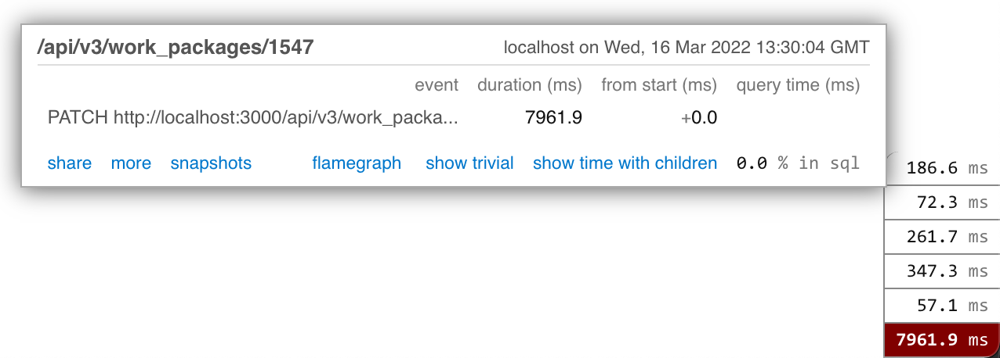

# Application profiling

In case the application performs poorly when serving a request, profiling can help to spot the areas in the code that need improving. This guide explains how to start the application in a way that profiling tools are run. It currently focuses on the backend especially on using [flamegraph](https://github.com/SamSaffron/flamegraph).

## Adding `thin` to the gemfile

The default web server OpenProject runs on is [puma](https://puma.io/), which is threaded. The profiling tool used is [rack-mini-profiler](https://github.com/MiniProfiler/rack-mini-profiler) which makes use of i.e. [stackprof](https://github.com/tmm1/stackprof). Those tools cannot work in a threaded environment which is why [thin](https://github.com/macournoyer/thin) needs to be employed. This is achieved by adding

```shell
gem 'thin'
```

to the `Gemfile` or `Gemfile.local` in case the later already exists.

If profiling is a recurring task, it might also make sense to add another gemfile, e.g. `Gemfile.profiling` and use the environment variable `CUSTOM_PLUGIN_GEMFILE` to have OpenProject load it.

Then run `bundle install` or `CUSTOM_PLUGIN_GEMFILE=Gemfile.profiling bundle install` to install `thin`.

## Starting the application

Since thin is to be used, and the profiling gems are to be loaded, the application needs to be started like this:

```shell
OPENPROJECT_RACK_PROFILER_ENABLED=true thin start
```

or, if a custom gemfile includes the reference to thin, use the following:

```shell
CUSTOM_PLUGIN_GEMFILE=gemfile.profiling OPENPROJECT_RACK_PROFILER_ENABLED=true thin start
```

This will start the application in development mode, which oftentimes is sufficient, but will lead to slightly distorted results since reloading and reloading checks, especially the ones for I18n, will take place.

To avoid this, the application can be started in production mode but before this can happen, the code needs to be adapted slightly:

* Search for the places where `OPENPROJECT_RACK_PROFILER_ENABLED` is referenced within the code and remove the references to `Rails.env.development?` from the conditions. At the time of writing, this needs to be done at:
  * `config/initializers/rack_profiler.rb`
  * `config/initializers/secure_headers.rb`
* Read the profiling gems to your `Gemfile`/`Gemfile.local`/`Gemfile.profiling` since they would otherwise only be available in the development environment:

```ruby
gem 'flamegraph'
gem 'rack-mini-profiler'
gem 'ruby-prof'
gem 'stackprof'
```

Start thin via:

```shell
SECRET_KEY_BASE='abcd' RAILS_ENV=production CUSTOM_PLUGIN_GEMFILE=gemfile.profiling OPENPROJECT_RACK_PROFILER_ENABLED=true thin start
```

## Using the profiling tools

Profiling now takes place on every request and every request will be slowed down by it which is why you should not profile on an actual production setup.

Having a flamegraph displayed is triggered by issuing the request with `pp=flamegraph` as a query prop. E.g. requesting

`http://localhost:3000/api/v3/work_packages?pp=flamegraph`

will show the flamegraph for that api request.

The options available can be displayed by adding `pp=help` to a query.

### API patch/post requests

For bodied requests (e.g. patch/post) which typically are triggered not from a browser when profiling, a flamegraph can still be created, e.g.:

`PATCH http://localhost:3000/api/v3/work_packages/1547?pp=async-flamegraph`

will result in a flamegraph being created. Instead of appending `pp=flamegraph`, the appended parameter needs to be `pp=async-flamegraph`.

But that flamegraph will not show up directly in the tools typically used.

The flamegraph needs to be accessed by calling an arbitrary page of the application via the browser after having issued the bodied request (e.g. `http://localhost:3000`). In the lower right corner, sometimes after some waiting, the profiling tools will show a small menu from which the generated flamegraph can be accessed.



In case this fails, the flamegraphs are stored in `tmp/miniprofiler` in a file called `mp_timers_[some hash]`. Knowing which file belongs to the previously created flamegraph, the file can be opened by requesting:

`http://localhost:3000/mini-profiler-resources/flamegraph?id=[some hash]`
