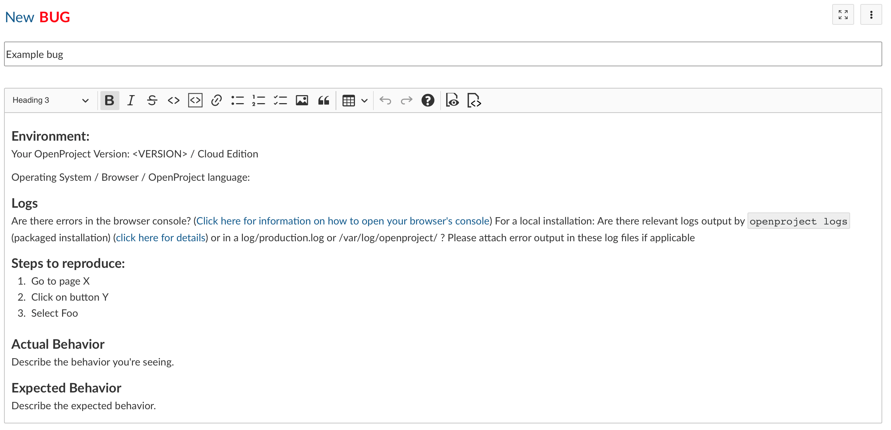

---
sidebar_navigation:
  title: Report a bug
  priority: 995
description: How to submit a bug report for OpenProject
keywords: bug report, bug, error, not working
---
# Report a bug

If you find a bug please create a bug report.

1. Login to or register at the [OpenProject community platform](https://community.openproject.org/). It's fast and free. Please note: In order to create an account, please write an email with the subject 'Joining community' to [support@openproject.com](mailto:support@openproject.com).
2. Look for an existing bug report using the search bar in the header navigation on top. If there's one, please leave a comment or add additional information. Otherwise:
3. Open the [bug form](https://community.openproject.org/projects/openproject/work_packages/new?type=1).
4. Add a precise subject.
5. Add a detailed description using the template.
6. Attach a screen-shot or log-file file (optional).
7. Press **Create**.

## Information you should add to the bug description

### Preconditions to reproduce the bug

Prior to detailing which steps to take to reproduce the error, the necessary preconditions which have to be met should be stated.

* Which browser did you use when you experienced the error?
* Do you receive any error messages in the browser console when the error occurs? Please include the error message if applicable.
* Please also include the contents of the browser's developer tool's network tab where applicable.
* If you are self-hosting please include logs from `sudo openproject logs` gathered while you are reproducing the error.

Example:

```markdown
* Forum exists
* Forum messages exist with many replies
```

### Steps to reproduce the bug

* The detailed steps that led to the bug should be listed in the description in order to replicate the bug and determine the underlying problem.

Example:

```markdown
1. Go to forum
2. Scroll to bottom of messages
```

### Actual behavior

* The actual, erroneous behavior should be stated briefly and concisely.

Example:

```markdown
* Not possible to switch to next entry in pagination
```

### Expected behavior

* If known, the expected behavior of the application should be described concisely.

Example:

```markdown
* Possible to switch to next pagination page
```

### Screenshots

* If applicable, a screenshot should be added to the bug report in order to explain the bug visually.
  * The unintended behavior should be marked in the screenshot (e.g. by using red color).
* The screenshot can be attached as a file and can be integrated in the description with the following syntax: "!Name_of_screenshot.png!" (without quotation marks)
(Notice: *Name_of_screenshot* should be replaced with the respective name of the file. The file ending (here: *.png*) has to be adjusted to the appropriate file type of the screenshot.)

### Example of bug reporting


