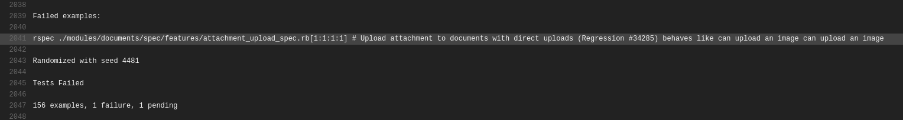

# Testing OpenProject

OpenProject uses automated tests throughout the stack. Tests that are executed in the browser (angular frontend, rspec system tests) require to have Chrome installed.

You will likely start working with the OpenProject test suite through our continuous testing setup at [Travis CI](https://travis-ci.com/opf/openproject). All pull requests and commits to the core repository will be tested by Travis CI.


# Continuous testing with Travis CI

As part of the [development flow at OpenProject](https://docs.openproject.org/development/#development-flow), proposed changes to the core application will be made through a GitHub pull request and the entire test suite is automatically evaluated on travis-ci.com. You will see the results of the travis test suite run as a status on your pull request. Successful test suite runs are one requirement to see your changes merged.

A failing status will look like the following on your pull request. You may need to click *Show all checks* to expand all checks to see the details link.


Here you'll see that the *Travis CI* check has reported an error, which likely means that your pull request contains errors. It might also result from a temporary error running the test suite, or from a test that was broken in the `dev` branch.

If you expand the view  by clicking on details, you will see the individual *jobs* that Travis executes. The test suite is run in parallel to save time.  The overall run time of the test suite is around *3 - 4 hours* on Travis, but with parallel test execution, this time is reduced to around 30 - 40 minutes waiting time.

[Here's a link to an exemplary failed test run on GitHub](https://github.com/opf/openproject/pull/8680/checks?check_run_id=1115923361). In this case, one of the feature jobs has reported an error. 


You can click on each job to show the [Travis log output for this job](https://travis-ci.com/github/opf/openproject/jobs/384924028). It will contain more information about how many tests failed and will also temporarily provide a screenshot of the browser during the occurrence of the test failure (only if a browser was involved in testing).

In our example, Travis reports one test to be failing: `./modules/documents/spec/features/attachment_upload_spec.rb[1:1:1:1]`




You can now run this test locally to try and reproduce the failure. How to do this depends on the kind of job that failed.


**Errors in the npm group**

If there is an error in the npm group, you likely have broken an existing Angular component spec or added an invalid new one. Please see the [Frontend tests section](#frontend-tests) on how to run them.


**Errors in the units group**

An error in the *units* group means there is a failing ruby unit test. Please see the [Unit tests](#unit-tests) section on how to run these.

**Errors in the features group**

You will be able to run failing tests locally in a similar fashion for all errors reported in the  `units`  and `features` jobs. Please see the [System tests](#system-tests) section for more information.


**Errors in the legacy specs**

For the `legacy specs` job, please [see the section on running legacy specs](#legacy-specs).


**Helper to extract all failing tests**

There is a small ruby script that will parse the logs of a travis run and output all `rspec` tests that failed for you to run in one command.

To run that, you will first need to install the travis gem locally with `gem install travis` . Then you can run this script with:

```
./script/travis_pr_errors	
```


Note that it will output legacy specs and specs together, which need to be run separately.


### Skipping test execution on Travis CI

Sometimes, you know you're pushing changes to a pull request that you now are work in progress or are known to break existing or new tests.

To avoid additional test executions, you can include `[CI SKIP]` in your commit message to ensure travis is not being triggered and skips your build. Please note that a successful merge of your pull request will require a green Travis CI build.


# Running tests locally

As there are multiple ways employed to test OpenProject, you may want to run a specific test or test group.


## Prerequisites

In order to be able to run tests locally, you need to have set up a local development stack.


### Verifying your dependencies

To ensure your local installation is up to date and prepared for development or running tests, there is a helper script `./bin/setup_dev` that installs backend and frontend dependencies. When switching branches or working on a new topic, it is recommended to run this script again.


### Setting up a test database

As part of the development environment guides, you will have created a development and test database and specified it under `config/database.yml`:

```yaml
default: &default
  adapter: postgresql
  encoding: unicode
  host: localhost
  username: openproject
  password: openproject-dev-password

development:
  <<: *default
  database: openproject_dev

test:
  <<: *default
  database: openproject_test
```


The configuration above determines that a database called `openproject_test` is used for the backend unit and system tests. The entire contents of this database is being removed during every test suite run.


Before you can start testing, you will often need to run the database migrations first on the development and the test database. You can use the following rails command for this:

```bash
RAILS_ENV=development rails db:migrate db:test:prepare
```


This migrates the _development_ database, outputting its schema to `db/schema.rb` and will copy this schema to the test database. This ensures your test database matches your current expected schema.


## Frontend tests

To run JavaScript frontend tests, first ensure you have all necessary dependencies installed via npm (i.e. `npm install`).

You can run all frontend tests with the standard npm command:

    npm test


Alternatively, when in the `frontend/` folder, you can also use the watch mode of Angular to automatically run tests after you changed a file in the frontend.

```bash
./node_modules/.bin/ng test --watch
```


## Unit tests

 After following the prerequisites, you can simply use the following command to run individual specs:

```bash
RAILS_ENV=test bundle exec rspec spec/models/work_package_spec.rb
```

You can run multiple specs by separating them with space:

```bash
RAILS_ENV=test bundle exec rspec spec/models/work_package_spec.rb spec/models/project_spec.rb
```


## System tests

We use Capybara and Selenium for system tests, which are often also called as *rspec feature specs*. They are automatically executed with an actual browser when `js: true` is set.

### Dependencies

For the javascript dependent integration tests, you have to install Chrome and Firefox, to run them locally.

Capybara uses Selenium to drive the browser and perform the actions we describe in each spec. We have tests that mostly depend on Chrome and Chromedriver, but some also require specific behavior that works better in automated Firefox browsers.


### Running system tests

Almost all system tests depend on the browser for testing, you will need to have the Angular CLI running to serve frontend assets.

So with `npm run serve` running and completed in one tab, run the test using `rspec` as  for the unit tests:

```bash
RAILS_ENV=test bundle exec rspec ./modules/documents/spec/features/attachment_upload_spec.rb[1:1:1:1]
```

The tests will generally run a lot slower due to the whole application being run end-to-end, but these system tests will provide the most elaborate tests possible.


You can also run *all* feature specs locally with this command. This is not recommended due to the required execution time. Instead, prefer to select individual tests that you would like to test and let Travis CI test the entire suite.

```bash
RAILS_ENV=test bundle exec rake parallel:features -- --group-number 1 --only-group 1
```


### Headless testing

Firefox tests through Selenium are run with Chrome as `--headless` by default. This means that you do not see the browser that is being tested. Sometimes you will want to see what the test is doing to debug. To override this behavior and watch the Chrome or Firefox instance set the ENV variable `OPENPROJECT_TESTING_NO_HEADLESS=1`.


### Troubleshooting

```
Failure/Error: raise ActionController::RoutingError, "No route matches [#{env['REQUEST_METHOD']}] #{env['PATH_INFO'].inspect}"

     ActionController::RoutingError:
       No route matches [GET] "/javascripts/locales/en.js"
```

If you get an error like this when running feature specs it means your assets have not been built.
You can fix this either by accessing a page locally (if the rails server is running) once or by ensuring the `bin/setup_dev` script has been run.


## Entire local RSpec suite

You can run the specs with the following commands:

* `bundle exec rake spec` Run all core specs and feature tests. Again ensure that the Angular CLI is running for these to work. This will take a long time locally, and it is not recommend to run the entire suite locally. Instead, wait for the test suite run to be performed on Travis CI as part of your pull request.

* `SPEC_OPTS="--seed 12935" bundle exec rake spec` Run the core specs with the seed 12935. Use this to control in what order the tests are run to identify order-dependent failures. You will find the seed that Travis CI used in their log output.

  

## Legacy specs

**Note:** *We do not write new tests in this category. Tests are expected to be removed from these two groups whenever they break.*

The legacy specs use `minitest` and reside under `spec_legacy/` in the application root. No new tests are to be added here, but old ones removed whenever we refactor code.

To run all legacy specs, use this command:

```bash
RAILS_ENV=test bundle exec rake spec -I spec_legacy spec_legacy/
```

## Parallel testing

Running tests in parallel makes usage of all available cores of the machine.
Functionality is being provided by [parallel_tests](https://github.com/grosser/parallel_tests) gem.
See its GitHub page for any options like number of cpus used.

#### Prepare

By default, `parallel_test` will use CPU count to parallelize. This might be a bit much to handle for your system when 8 or more parallel browser instances are being run. To manually set the value of databases to create and tests to run in parallel, use this command:

```bash
export PARALLEL_TEST_PROCESSORS=4
```


Adjust `database.yml` to use different databases:

```yml
test: &test
  database: openproject_test<%= ENV['TEST_ENV_NUMBER'] %>
  # ...
```

Create all databases: `RAILS_ENV=test ./bin/rails parallel:create db:migrate parallel:prepare`

Prepare all databases:

First migrate and dump your current development schema with `RAILS_ENV=development ./bin/rails db:migrate db:schema:dump` (will create a db/structure.sql)

Then you can just use `RAILS_ENV=test ./bin/rails parallel:prepare` to prepare test databases.


#### RSpec specs

Run all unit and system tests in parallel with `RAILS_ENV=test ./bin/rails parallel:spec`


## Manual acceptance tests

* Sometimes you want to test things manually. Always remember: If you test something more than once, write an automated test for it.
* Assuming you do not have a version of Edge already installed on your computer, you can grab a VM with preinstalled IE's directly from Microsoft: http://www.modern.ie/en-us/virtualization-tools#downloads


## Accessing a local OpenProject instance from a VM

If you want to access the development server of OpenProject from a VM, you need to work around the CSP `localhost` restrictions.

### Old way, fixed compilation

One way is to disable the Angular CLI that serves some of the assets when developing. To do that, run

```bash

# Precompile the application
./bin/rails assets:precompile

# Start the application server while disabling the CLI asset host 
OPENPROJECT_CLI_PROXY='' ./bin/rails s -b 0.0.0.0 -p 3000
```

Now assuming networking is set up in your VM, you can access your app server on `<your local ip>:3000` from it.

### New way, with ng serve

**The better way** when you want to develop against Edge is to set up your server to allow the CSP to the remote host.
Assuming your openproject is served at `<your local ip>:3000` and your ng serve middleware is running at `<your local ip>:4200`,
you can access both from inside a VM with nat/bridged networking as follows:

```bash
# Start ng serve middleware binding to all interfaces
npm run serve-public

# Start your openproject server with the CLI proxy configuration set
OPENPROJECT_CLI_PROXY='http://<your local ip>:4200' ./bin/rails s -b 0.0.0.0 -p 3000

# Now access your server from http://<your local ip>:3000 with code reloading
```

## Legacy LDAP tests

OpenProject supports using LDAP for user authentications.  To test LDAP
with OpenProject, load the LDAP export from test/fixtures/ldap/test-ldap.ldif
into a testing LDAP server.  Test that the ldap server can be accessed
at 127.0.0.1 on port 389.

Setting up the test ldap server is beyond the scope of this documentation.
The Apache DS project provides a simple LDAP implementation that should work
good as a test server.