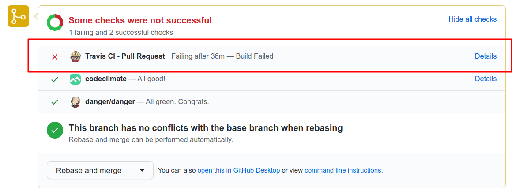
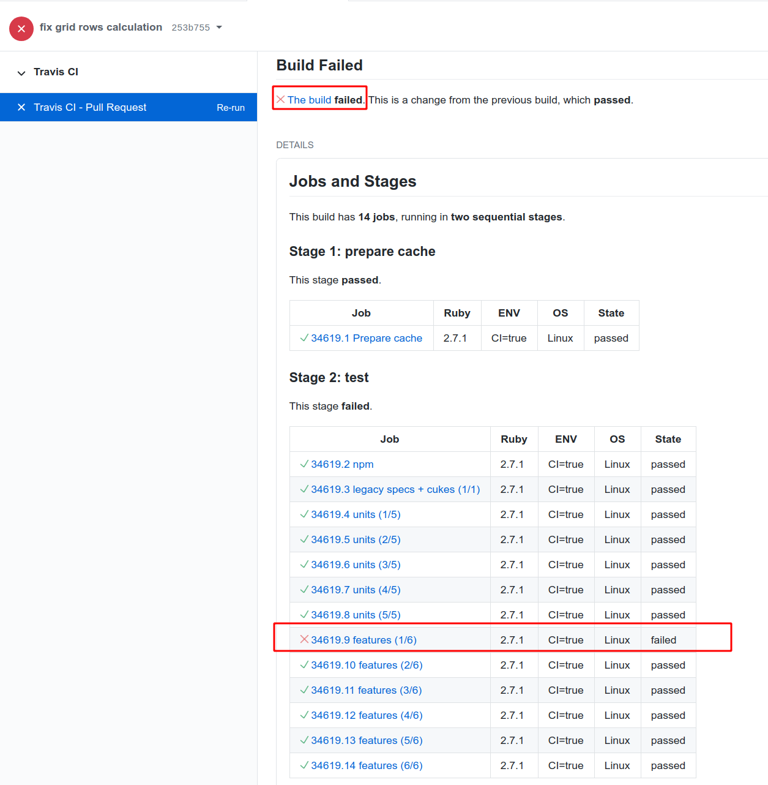
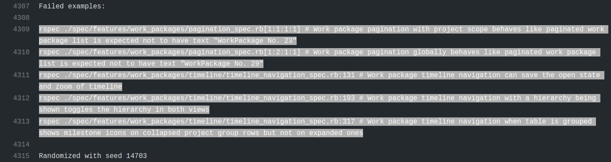

# Testing OpenProject

OpenProject uses automated tests throughout the stack. Tests that are executed in the browser (angular frontend, rspec system tests) require to have Chrome installed. To ensure we deliver high quality code to our customers, it's essential to conduct various types of tests.

## Testing

### Involved Roles

Testing OpenProject is distributed between different roles and members, depending on the testing task.

- **Functional testing**: Developer, QA/Tester
- **Non-functional testing**: Developer, QA/Tester, Product manager, Operations engineer
- **Acceptance testing**: Product manager, Designer, QA/Testers, Customers/Community members
- **Usability testing**: UX Designer, Customers, Community members
- **Accessibility testing**: Product team, Developer, External accessibility experts

### Functional testing

Functional testing ensures that the application works against the set of requirements or specifications. Tests should therefore make sure all the acceptance criteria are met.

The following types of functional tests are used at OpenProject.

| **Type**                                                    | Description                                                  | Examples, References                                         |
| ----------------------------------------------------------- | ------------------------------------------------------------ | ------------------------------------------------------------ |
| [Unit tests](#unit-tests)                                   | Test individual components of OpenProject using RSpec. Involves mocking or stubbing dependent components | e.g, Model specs under `spec/models`                         |
| [Integration tests](#integration-tests)                     | Testing the integration of multiple components, but still in their isolation without testing the entire software stack | controller, requests, service integration specs, e.g., `spec/services/**/*_integration_spec.rb` |
| [Feature / end-to-end tests](#feature-tests)                | Tests of the entire Rails application stack and all necessary dependent components (routing, controllers, database access, permissions, and responses). Performed in `RSpec` using `Capybara` feature specs.<br>External third-party service requests and responses are recorded for testing (e.g., nextcloud integration) | `spec/features`                                              |
| [Smoke tests](#smoke-tests)                                 | Automated and manual tests to ensure the main application features and happy paths are working as expected (e.g., packaging or dockerization tests, manual smoke tests by QA) | Docker test workflow under `.github/workflows/docker.yml`    |
| [Sanity and regression tests](#sanity-and-regression-tests) | Manual testing of affected or relevant components made after changes or bug fixes to the application. Performed by QA. | e.g., testing the critical path of creating work packages after a bug fix has been made in that data model<br>Manual execution of test plan defined by QA |
| [Acceptance tests](#acceptance-tests)                       | Final phase of manual testing where the system is evaluated against predefined requirements to ensure it meets user and stakeholder expectations before deployment. | Manual interactions with customers and stakeholders to identify whether we're building the correct part |

#### Unit tests

Unit testing concerns testing of isolating individual components of the application, such as individual methods within a model, service, or library, in order to verify that they perform as expected under various conditions. OpenProject uses RSpec for writing unit tests / specs.

**Key objectives and effects**

1. **Isolated validation of individual components**: Unit tests isolate the smallest testable parts of an application, often single methods or functions, to validate that they function as intended.
2. **Early defect identification**: Writing and running unit tests before (Test-Driven Development) or during the development phase may help identify bugs early, reducing the cost of fixing them in later stages.
3. **Code quality**: Unit tests shape the development of a component, ensuring that it is testable by reducing coupling between components and by that, improves code quality. Unit tests, when well written, serve as a form of documentation.
4. **Ease of maintenance**: Unit tests in an interpreted language like Ruby make it easier and safer to refactor code, add new features, or integrate new changes with confidence, knowing that existing functionality is well-tested and which functionality breaks when moving code.

**Best practices**

- Follow the Arrange-Act-Assert (AAA) Pattern
  - **Arrange**: Set up the object and scenarios for your test.
  - **Act**: Invoke the method or process you want to test.
  - **Assert**: Check that the method or process behaved as expected.
- Keep examples of unit specs simples and descriptive
- Write tests during or before development, not as an afterthought
- Test the entire range of potential inputs, including *negative* tests and validation of potentially malicious user input.

  Negative testing consists of test cases which define how software reacts to user’s invalid input or unexpected behavior. The aim is not only to prevent the application from crashing but to improve quality by specifying clear and understandable error messages so that users know what kind of input is expected and correct.
- Avoid calling the database if not necessary
- Use `FactoryBot` to set up test data in a structured, but randomized way to prevent brittle tests
- Mock external components and services, and ensure you test the boundaries of the associated components

**References**

- https://www.browserstack.com/guide/integration-testing
- https://www.codewithjason.com/difference-integration-tests-controller-tests-rails/
- https://guides.rubyonrails.org/testing.html

#### Integration tests

Integration tests focus on the interactions between different components of OpenProject to ensure they work together to deliver a specific functionality. OpenProject uses RSpec to perform integration tests to simulate real-world user behavior. In contrast to system tests, integration tests still leave out some assumptions or characteristics of the application (e.g., not running tests in an instrumented browser instance).

In Rails, the difference between integration tests and feature tests can be blurry. At OpenProject, we assume every test that involves an instrumented browser instance is a *feature spec*. Integration tests can be request or controller specs, or specs in other folders explicitly marked as integration, meaning it will not use mocking to separate the involved components.

**Key objectives and effects**

1. **Verifying interaction of components**: The primary objective of integration testing is to verify that different components or modules of the application work together as intended.
2. **Data integrity and consistency**: Test that data flows correctly between different parts of the application.
3. **API and service dependencies**: For components relying on external APIs and third-party services, integration tests define the boundary between these systems that are often not available in automated test suites. Integration tests for services should include things like proper request formatting and correct handling of all possible response types (success, failure, timeouts, etc.).
4. **Early performance and reliability evaluation**: Integration tests _may_ give an early indication of potential performance issues. Due to the interaction of components, this data flow can identify bottlenecks or inefficiencies that might not be visible during unit testing due to the amount of data mocking present.
5. **Test real interactions**: In Ruby on Rails, unit tests depending on the development style may have the flaw of testing _too_ narrow. With a high amount of mocking, the proper testing and definition of the component's boundary may become blurry and brittle. These problems will only be detectable within integration tests.

**Best practices**

- Mimic user behavior as closely as possible. This means following the paths that users are most likely to take, filling out forms, clicking buttons, etc.
- At the same time, include both successful interactions (happy paths), expected and unexpected failures and edge cases. Align these tests with what is already tested in the relevant unit tests.
- To generate test data, use our defined factories (e.g., FactoryBot) for more complex or dynamic data.
- Be wary of long-running and brittle tests and how to avoid them. Due to the nature of integration tests, execution of tests may be prone to more flickering results when compared to unit tests.
- Know the difference between integration (i.e., requests, controller) tests and system/feature tests and when to use them.

#### Feature tests

Feature tests at OpenProject drive a browser instance to act as if a user was operating the application. This includes logging in, setting session cookies, and navigating/manipulating the browser to interact as the user.

**Key objectives and effects**

1. **End-to-end testing**: Validate the interaction between the entire stack of the application, including the frontend and backend, to ensure they work as expected.

2. **User experience verification**: Simulate real-world user behavior and ensure that the application behaves as expected from a user's perspective.

3. **Increased confidence**: In Rails applications, only feature tests give you the entire picture of the application, especially when frontend code is interacting with the backend.

4. **Responsiveness and compatibility**: Verify that the application's user interface behaves consistently across various browsers, languages, and screen sizes.

**Best practices**

- Happy paths and main errors or permission checks should always be tested with a system test. Avoid testing all edge cases or boundaries using the entire stack, as this will result in slowdown of our CI infrastructure.
- Use Capybara's scoping methods (`within`, `find`, etc.), meaningful selectors, and asynchronous handling to make tests more readable and robust.
- Break down complex user interactions into reusable methods or even separate test cases to make your test suite easier to understand and maintain.
- Keep an eye on flaky tests that fail randomly and fix them, as they can undermine trust in your test suite.
- While frowned upon in unit tests, test the entire use-case in as few examples as possible to avoid additional overhead (starting the browser, loading factories into database etc.). When using multiple examples, use `let_it_be` / `shared_let` and other improvements from the [test-prof gem](https://github.com/test-prof/test-prof)
- Add automated regression tests for bug fixes that are non-trivial

#### Smoke tests

Smoke tests are automated and manual tests to ensure the main application features and happy paths are working as expected. At OpenProject, all installation methods are automatically tested using smoke tests. Packaging processes test all distributions for successful installation of OpenProject. We run the released docker image for setting up and accessing OpenProject.

**Key objectives and effects**

1. **Verify basic functionality**: Perform a quick check to ensure that the most critical functionalities of the application are working as expected.
2. **Find showstoppers**: Identify critical bugs early in the development process before the stabilization phase.
3. **Early feedback**: Provide quick feedback to the development team.

**Best practices**

- Automate smoke testing on top of manual testing when possible
- Run after deployments to the appropriate [environments](../application-architecture/#environments), e.g., the edge environment for features of the next release and staging environment for bug fixes to a stable release
- Keep smoke tests updated so that they can evolve together with the application

**References**

- https://www.browserstack.com/guide/smoke-testing

#### Sanity and regression tests

Sanity and regression tests are manually performed tests by QA for relevant components on a stabilized version, e.g., the developed new features or components of an OpenProject release. A sanity test is a subset of a regression test, which evaluates the entire application prior to a release or production deployment.

**Key objectives and effects**

1. **Proper scoping of the test**: For regression test, QA will evaluate the entire application, executing common use-cases of OpenProject. Sanity tests will instead test a subset of the application, e.g., a specific feature in the process of stabilization.
2. **Change impact**: Identify the impact of new code changes, updates, or bug fixes on the relevant functionality or module of OpenProject.
3. **Confidence**: Increases confidence among stakeholders that new or changed functionalities work as expected.

**Best practices**

- Document test plans for regression tests so that they can be executed easily and new QA employees can be onboarded easily
- Be very selective about what you test for sanity testing. Focus only on the areas that were affected by recent changes
- Stay updated to major code changes so that the regression test plan can be adapted appropriately

**Usage at OpenProject**

For writing and executing manual sanity and regression testing, especially focusing on functional requirements, one of the tools in use at OpenProject is TestLink (https://testlink.org/) to achieve the following goals:

- Test cases have clear preconditions so that the tester prepares for executing each case with enough knowledge about requirements.
- Test cases are as specific as possible. They should check the proper working of one single point/case and should therefore have no more than 8-10 steps.
- Test cases are updated with every change of the specifications.
- Test cases have precise execution steps and expected results.

**References**

- https://www.browserstack.com/guide/sanity-testing
- https://www.browserstack.com/guide/regression-testing
- https://medium.com/@Jia_Le_Yeoh/difference-between-regression-sanity-and-smoke-testing-ed2129bf049

#### Acceptance tests

Acceptance testing is the final phase of testing where the extension to the OpenProject application is evaluated against predefined requirements to ensure it meets user and stakeholder expectations before deployment.

Acceptance tests evaluate both functional and non-functional requirements.

**Key objectives and effects**

1. **Validation of requirements**: Ensure that the defined feature / change meets all specified requirements, as outlined by the stakeholders and defined by the product team.
2. **Reduced risk**: Identify and reduce risk of releasing a product that doesn't meet user expectations or contractual obligations.
3. **Contractual closure**: May act as a formal sign-off before the software goes live, signifying that it has met agreed-upon criteria.
4. **System behavior**: Confirm that all features and functionalities behave as expected in real-world scenarios.
5. **Data integrity and workflow**: Verify the end-to-end processes, and ensure data consistency and integrity throughout the system.

**Best practices**

1. Ensure customer provided user stories and acceptance criteria is well defined before development phase is entered, or be clear and open about the scope of what is to be built.
2. Perform acceptance test in an environment that mimics the production environment as closely as possible. This could be an isolated edge environment, or a separately deployed instance at the customer's request.
3. Maintain clear and detailed documentation of test cases, outcomes, and any *discrepancies* between expected and actual implementation and results.

### Non-functional testing

Non-functional testing goes beyond the functionality of the product and is aimed at end-user experience. Test cases should hence make sure to define what is expected in terms of security, performance, compatibility, accessibility etc.

Examples for non-functional test cases: software should be compatible with most used desktop and mobile browsers, as well as operating systems; all the actions can be performed with keyboard navigation; page loading should take no more than X seconds; users who lost access should no longer be able to login etc.

| Type                                                            | Description                                                                                                                                                                                   | Examples, References                                                                                                                                                                       |
|-----------------------------------------------------------------|-----------------------------------------------------------------------------------------------------------------------------------------------------------------------------------------------|--------------------------------------------------------------------------------------------------------------------------------------------------------------------------------------------|
| [Stress and performance tests](#performance-tests)              | (Half-)automated or manual testing of the response of the application during higher load, or expected upper boundaries of customer-defined data                                               | e.g., running and evaluating new query plans on existing, anonymized or simulated data that matches potential or known performance bottlenecks                                             |
| [Security tests](#security-tests)                               | Automated or manually crafted test cases for evaluating application security by assuming the role of an attacker, e.g., by providing malicious user input or trying to break the application. | Statical and automated code scanning (CodeQL, Brakeman), defined test cases for verifying security related input as defined in the [secure coding guidelines](../concepts/secure-coding/). |
| [Installation / upgrade tests](#installation-and-upgrade-tests) | Automated and manual installation tests of OpenProject                                                                                                                                        | Packaged installation build tests for various distributions, Docker installation smoke tests for verifying correct startup and basic operation of the container.                           |
| [Usability tests](#usability-testing)                           | Evaluating the UX of the application as defined and in comparison to the requirements. Involves QA, Product, Customer.                                                                        | e.g., verifying common use-cases as defined in the requirements in an early development stage (such as a PullPreview deployment), or on a pre-released version of the application.         |
| [Accessibility tests](#accessibility-tests)                     | Evaluating the accessibility of the application according to [WCAG AA](https://www.w3.org/WAI/WCAG2AA-Conformance) and similar standards                                                      | Performing automated keyboard navigation tests. <br>Manually executing screen readers to ensure application can be used.                                                                 |

#### Performance tests

Identify and prevent common causes of bottlenecks in the application. As OpenProject is a software where a lot of information might come together and presented in a very flexible manner, performance is an ever-present concern and consideration for the developers.

**Key objectives and effects**

1. **Reliability**: Improve the reliability of the application by identifying bottlenecks and performance issues.
2. **Stress testing**: Identify the limits and the breaking points of the application.
3. **User satisfaction**: Ensure that users have a good experience for common use-cases.

**Best practices**

- Include performance tests, automated or manual, in the development of every feature that involves moving a lot of user data
- Use appropriate data for the tests, this could be anonymized or prepared data provided by customers or through statically or manually provided factories.
- Establish a performance baseline so that you can compare how code changes impact performance over time.
- OpenProject implements monitoring tools for SaaS applications to monitor performance and identify bottlenecks.

#### Security tests

Automated or manual security tests for OpenProject are evaluating common weaknesses of web applications and follow the best practices of the [secure coding guidelines](../concepts/secure-coding/).

**Key objectives and effects**

1. **Vulnerability assessment**: Identify and prevent common security vulnerabilities in the application, such as SQL injection, CSRF, and XSS vulnerabilities.
2. **Authentication and authorization tests**: Ensure that authentication mechanisms are robust and that only authorized users can access sensitive features.
3. **Risk mitigation**: Early identification of security vulnerabilities helps mitigate risks associated with data breaches and unauthorized access.
4. **Audit and compliance**: Ensure that the application complies with internal security guidelines, as well as any industry-specific security standards.

**Best practices**

- Use statical and dynamical code analysis for automated vulnerability testing. OpenProject uses CodeQL and Brakeman as part of the CI pipeline to give early feedback to common vulnerabilities.
- OpenProject uses [Docker Scout](https://www.docker.com/products/docker-scout/) for the Docker images hosted on Docker Hub for automated vulnerability scanning and analysis of the built container, including all dependencies.
- Follow our [secure coding guidelines](../concepts/secure-coding/) when proposing changes to the application, especially when modifying or adding features to authentication, authorization, 2FA, or sensitive data operations.
- If possible, automate security tests for common vulnerabilities for input in your development.
- Train on recent vulnerabilities and checklists such as [OWASP Top Ten](https://owasp.org/www-project-top-ten/) or [OWASP cheat sheets](https://cheatsheetseries.owasp.org) to stay up-to-date on security testing and extend our security test suite with new information.

#### Installation and upgrade tests

OpenProject employs a number of automated tests for installation testing. Packaged installation build tests for various distributions, Docker installation smoke tests for verifying correct startup and basic operation of the container.

Upgrade tests are manually performed for major code changes and data migrations on pre-release candidates to ensure migrations are working as expected. The [OpenProject Community](https://community.openproject.org) instance also serves as an early release candidate to allow early testing and feedback.

**Key objectives and effects**

1. **Verify seamless installation**: Ensure that OpenProject can be installed as documented.
2. **Correct and minimal configuration:** Ensure that the default configuration is minimal but sufficient to operate OpenProject securely, and check that the required necessary configuration is minimal. New configuration primitives should receive a secure default.
3. **Check version compatibility**: Test the compatibility of the upgraded application with existing configurations, databases, and other dependent software.
4. **Validate migrations**: Confirm that during an upgrade, data migration occurs without data loss or corruption.
5. **Technical support**: Reduce the number of support tickets related to installation and upgrade issues.
6. **Operational efficiency**: Minimize downtime and service interruptions during the upgrade process.

**Best practices**

- Use automated testing scripts to simulate various installation and upgrade scenarios.
- Provide and test the rollback of data migrations to make sure they work as intended.
- Keep up-to-date documentation for the installation and upgrade procedures, including a list of known issues and workarounds.
- Example of test cases would be ensuring that software works in a satisfying manner on major browsers and operating systems which are defined in [system-requirements](../../installation-and-operations/system-requirements/)

#### Usability testing

When new features or changes to the application are available on our [Edge or Community environments](../application-architecture/#environments), product team members, customers, and community users can provide usability feedback on how the change is perceived.

**Key objectives and effects**

1. **User-friendliness**: Evaluate how easily end-users can navigate and perform tasks within the application, focusing on intuitiveness and accessibility.

2. **Increased user satisfaction and adoption**: Better usability promotes a higher rate of user adoption and lowers abandonment rates.

3. **Error handling and messages**: Assess the software's ability to prevent, catch, and handle errors in a way that is informative and non-intrusive for the user.

4. **Consistency and standards**: Ensure that the application's UI and functionality conform to common design and usability standards, promoting user familiarity.

5. **Reduced support costs**: Intuitive and user-friendly designs decrease the volume of help desk or support questions.

**Best practices**

- Involve actual users in requirements and usability feedback to collect genuine user insights.
- Perform usability feedback rounds at multiple stages of development to continuously refine the user experience and ensure we're building the correct things.
- **Real-world scenarios**: Test the application by simulating real-world tasks and scenarios that a typical user would encounter.
- **Quantitative and qualitative metrics**: Use a mix of metrics like task completion rates, error rates, and user satisfaction surveys to comprehensively assess usability.

#### Accessibility tests

OpenProject strives to be accessible for all users while also retaining a high usability. In web applications, these two requirements can sometimes be a seemingly contradictory requirement, especially when animations or *modern* functionalities of browsers are used.

**Key objectives and effects**

1. **Compliance with WCAG**: Standards exists to ensure and implement means of accessible interactions for all users.
2. **Universal usability**: Application is functional and provides a good user experience for people with disabilities, including those who use assistive technologies.
3. **Text-to-Speech and Speech-to-Text**: Compatibility with screen readers and voice-command software to assist visually impaired and mobility-challenged users.
4. **Navigational ease**: Application can be effectively navigated using only a keyboard, without requiring a mouse.
5. **Contrast and readability**: Test text contrast, size, and spacing to ensure readability for users with visual impairments.

**Best practices**

1. Make accessibility testing an integral part of the development lifecycle, starting with the requirements.
2. Use specialized browser extension to help identify and resolve common accessibility issues.
3. Follow the best practices of the [WCAG 2 checklists](https://www.w3.org/WAI/WCAG22/quickref/) and [accessibility patterns](https://www.w3.org/WAI/ARIA/apg/patterns/) from ARIA authoring practices guide to ensure screen readers and other assistive technologies are well supported.
4. Use [axe-core-rspec](https://github.com/dequelabs/axe-core-gems/blob/develop/packages/axe-core-rspec/README.md) in automated accessibility tests to provide continuous regression testing against common accessibility issues.
5. Use [capybara-accessible-selectors](https://github.com/citizensadvice/capybara_accessible_selectors) in [feature tests](#feature-tests) to find UI elements using screen-reader compatible selectors. This ensures the page elements used by feature tests are accessible to assistive technologies.
6. Consult with accessibility experts to conduct audits and provide recommendations for improvements. Alternatively, consult the development colleagues with experience in accessibility testing to evaluate requirements and implementation proposals.

**References**

- https://www.deque.com/axe/browser-extensions/
- https://www.w3.org/WAI/WCAG22/quickref/
- https://www.w3.org/WAI/ARIA/apg/patterns/
- https://github.com/dequelabs/axe-core-gems/blob/develop/packages/axe-core-rspec/README.md
- https://github.com/citizensadvice/capybara_accessible_selectors

## Continuous testing workflow

As part of the [development flow at OpenProject](../../development/#branching-model-and-development-flow), proposed changes to the core application will be made through a GitHub pull request and the entire test suite is automatically evaluated on GitHub Actions. You will see the results as a status on your pull request.

You will likely start working with the OpenProject test suite through our continuous testing setup at [GitHub Actions](https://github.com/opf/openproject/actions). All pull requests and commits to the core repository will be tested by GitHub Actions.

Successful test suite runs are one requirement to see your changes merged.

### List failures

A failing status will look like the following on your pull request. You may need to click *Show all checks* to expand all checks to see the details link.



Here you'll see that the *GitHub Actions* check has reported an error, which likely means that your pull request contains errors. It might also result from a [temporary error running the test suite](#tests-failing-on-github-actions-ci-and-passing-locally), or from a test that was broken in the `dev` branch.

The test suite is [run in parallel](#parallel-testing) to save time. The overall run time of the test suite is around *15 minutes* on GitHub.

Click on the Details link to see the individual *jobs* that GitHub executes.

[Here's a link to an exemplary failed test run on GitHub](https://github.com/opf/openproject/pull/9355/checks?check_run_id=2730782867). In this case, one of the feature jobs has reported an error.



Click on each job and each step to show the [log output for this job](https://github.com/opf/openproject/pull/9355/checks?check_run_id=2730782867). It will contain more information about how many tests failed and will also temporarily provide a screenshot of the browser during the occurrence of the test failure (only if a browser was involved in testing).

In our example, multiple tests are reported as failing:

```shell
rspec ./spec/features/work_packages/pagination_spec.rb[1:1:1:1] # Work package pagination with project scope behaves like paginated work package list is expected not to have text "WorkPackage No. 23"
rspec ./spec/features/work_packages/pagination_spec.rb[1:2:1:1] # Work package pagination globally behaves like paginated work package list is expected not to have text "WorkPackage No. 29"
rspec ./spec/features/work_packages/timeline/timeline_navigation_spec.rb:131 # Work package timeline navigation can save the open state and zoom of timeline
rspec ./spec/features/work_packages/timeline/timeline_navigation_spec.rb:193 # Work package timeline navigation with a hierarchy being shown toggles the hierarchy in both views
rspec ./spec/features/work_packages/timeline/timeline_navigation_spec.rb:317 # Work package timeline navigation when table is grouped shows milestone icons on collapsed project group rows but not on expanded ones
```



### Diagnose failures

Once you know which tests are failing, run them locally to try and reproduce the failures. Having reproducible failures locally is the first step to diagnose and fix them.

How to do this depends on the kind of job that failed.

**Errors in the npm group**

An error in the *npm* group means you likely have broken an existing Angular component spec or added an invalid new one. Please see the [Frontend tests](#frontend-tests) section on how to run them.

**Errors in the units group**

An error in the *units* group means there is a failing ruby unit test. Please see the [Unit tests](#unit-tests) section on how to run these.

**Errors in the features group**

You will be able to run failing tests locally in a similar fashion for all errors reported in the `units` and `features` jobs. Please see the [System tests](#system-tests) section for more information.

**Helper to extract all failing tests**

There is a small ruby script that will parse the logs of a GitHub Actions run and output all `rspec` tests that failed for you to run in one command.

```shell
./script/github_pr_errors
```

If you want to run the tests directly to rspec, you can use this command:

```shell
./script/github_pr_errors | xargs bundle exec rspec
```

### Tests failing on GitHub Actions CI and passing locally

Some tests can fail on GitHub actions CI, and pass locally which makes them harder to reproduce, diagnose, and fix.

Possible reasons are:

* Different configuration between CI environment and local environment
  * GitHub actions run with `CI=true` environment variable. This setting will eager load the app before running tests. As some classes may monkey patch parts of the code, the behavior can be different when the app is fully loaded.
    * Try running the tests with `CI=true`.
  * OpenProject configuration difference
    * Try changing or disabling any environment variables prefixed with `OPENPROJECT_` in your environment or `.env` files.
    * Try changing or removing `config/configuration.yml` settings under the `test:` key.
* Missing executables
  * Source control management tests may need `svnadmin` or `git` to execute properly.
  * LDAP tests may need `java` to spin up a LDAP server instance.
* Different test execution order
  * Parts of the OpenProject code are using memoization and caching for performance, and some tests can do weird things like prepending a module or other meta programming. Without proper clean up of the global state, subsequent tests may fail. It can go unnoticed depending on the test execution order.
  * RSpec tests order is different on each run. The order is defined by the random seed which can be set with `--seed` option. When running rspec, the random seed is displayed like this: `Randomized with seed 18352`.
  * Try running tests locally with the same random seed as the one used on CI.
    * Once you determined that the failure is order dependant, use [`--bisect`](https://rspec.info/features/3-12/rspec-core/command-line/bisect/) to isolate the minimal set of examples that reproduce the same failures.
* Faster / slower machine and race conditions
  * Some system tests using browser and performing ajax requests may not be synchronized with the test execution: the test is testing something that has not happened yet. Sometimes the ajax runs at the right time and the test passes, sometimes it runs at the wrong time and the test fails.
  * Use `script/bulk_run_rspec` to run the same test multiple times. If it has both failing and passing results, it means it is a flickering test.
  * To help diagnose why a system test is failing:
    * Browser screenshots are created for failing system tests involving a browser. You can find them in the job log output.
    * Try running with `OPENPROJECT_TESTING_NO_HEADLESS=1` to view what the browser is doing. Use `OPENPROJECT_TESTING_AUTO_DEVTOOLS=1` to have DevTools opened so that you can use `debugger` statements in the js code.
    * If the interactions are still too fast to understand why the test is failing, use `OPENPROJECT_TESTING_SLOWDOWN_FACTOR`, providing the number of seconds to slow down every browser command with. For example, if you'd like to slow down every interaction by 200 milliseconds, run with `OPENPROJECT_TESTING_SLOWDOWN_FACTOR=0.2`.
* Migration executed locally
  * While developing on another branch, you may run migrations and forget to roll them back when switching branches. This can lead to different test results: a migration modifying a database column default value can impact system behavior and change test results.
  * To find if this is your case, run `rails db:migrate:status` to list migration status. Look for `up    <migration-id>  ********** NO FILE **********` patterns. If you have some, try looking up the commit associated with this migration and check if it explains behavior difference.
  * To look up commits referencing the migration, use the `<migration-id>` from previous command and run `git log -p --all -- '**/*<migration-id>*'`. For instance `git log -p --all -- '**/*20220816065025*'`.
  * If you find a commit and want to roll the associated migration back:
    * Checkout the commit: `git switch --detach <commit-sha>`
    * Roll the migration back: `rails db:migrate:down VERSION=<migration-id>`
    * Switch back to where you left: `git switch -`

### Skip test execution on GitHub Actions CI

Sometimes, you know you're pushing changes to a pull request that you now are work in progress or are known to break existing or new tests.

To avoid additional test executions, you can include `[skip ci]` in your commit message to ensure GitHub Actions are not being triggered and skips your build. Please note that a successful merge of your pull request will require a green CI build.

## Running tests locally

As there are multiple ways employed to test OpenProject, you may want to run a specific test or test group.

### Prerequisites

In order to be able to run tests locally, you need to have set up a local development stack.

#### Verifying your dependencies

To ensure your local installation is up to date and prepared for development or running tests, there is a helper script `./bin/setup_dev` that installs backend and frontend dependencies. When switching branches or working on a new topic, it is recommended to run this script again.

#### Setting up a test database

As part of the development environment guides, you will have created a development and test database and specified it under `config/database.yml`:

```yaml
default: &default
  adapter: postgresql
  encoding: unicode
  host: localhost
  username: openproject
  password: openproject-dev-password

development:
  <<: *default
  database: openproject_dev

test:
  <<: *default
  database: openproject_test
```

The configuration above determines that a database called `openproject_test` is used for the backend unit and system tests. The entire contents of this database is being removed during every test suite run.

Before you can start testing, you will often need to run the database migrations first on the development and the test database. You can use the following rails command for this:

```shell
RAILS_ENV=development rails db:migrate db:test:prepare
```

This migrates the _development_ database, outputting its schema to `db/schema.rb` and will copy this schema to the test database. This ensures your test database matches your current expected schema.

### Frontend tests

To run JavaScript frontend tests, first ensure you have all necessary dependencies installed via npm (i.e. `npm install`).

You can run all frontend tests with the standard npm command:

```shell
npm test
```

Alternatively, when in the `frontend/` folder, you can also use the watch mode of Angular to automatically run tests after you changed a file in the frontend.

```shell
./node_modules/.bin/ng test --watch
```

### Unit tests

After following the prerequisites, use the following command to run individual specs:

```shell
RAILS_ENV=test bundle exec rspec spec/models/work_package_spec.rb
```

Run multiple specs by separating them with spaces:

```shell
RAILS_ENV=test bundle exec rspec spec/models/work_package_spec.rb spec/models/project_spec.rb
```

### System tests

System tests are also called *rspec feature specs* and use [Capybara](https://rubydoc.info/github/teamcapybara/capybara/master) and [Selenium](https://www.selenium.dev/documentation/webdriver/) to run. They are automatically executed with an actual browser when `js: true` is set.

System tests are located in `spec/features`. Use the following command to run individual test:

```shell
RAILS_ENV=test bundle exec rspec spec/features/auth/login_spec.rb
```

#### Dependencies

For the javascript dependent integration tests, you have to install Chrome and Firefox, to run them locally.

Capybara uses Selenium to drive the browser and perform the actions we describe in each spec. We have tests that mostly depend on Chrome and Chromedriver, but some also require specific behavior that works better in automated Firefox browsers.

#### Running system tests

Almost all system tests depend on the browser for testing, you will need to have the Angular CLI running to serve frontend assets.

So with `npm run serve` running and completed in one tab, run the test using `rspec` as  for the unit tests:

```shell
RAILS_ENV=test bundle exec rspec ./modules/documents/spec/features/attachment_upload_spec.rb[1:1:1:1]
```

The tests will generally run a lot slower due to the whole application being run end-to-end, but these system tests will provide the most elaborate tests possible.

You can also run *all* feature specs locally with this command. This is not recommended due to the required execution time. Instead, prefer to select individual tests that you would like to test and let GitHub Actions CI test the entire suite.

```shell
RAILS_ENV=test bundle exec rake parallel:features -- --group-number 1 --only-group 1
```

##### WSL2

In case you are on Windows using WSL2 rather than Linux directly, running tests this way will not work. You will see an error like "Failed to find Chrome binary.". The solution here is to use Selenium Grid.

**1) Download the chrome web driver**

You can find the driver for your Chrome version [here](https://chromedriver.chromium.org/downloads)

**2) Add the driver to your `PATH`**

Either save the driver under `C:\Windows\system32` to make it available or add its alternative location to the `PATH` using the system environment variable settings ([press the WIN key and search for 'system env').

**3) Find out your WSL ethernet adapter IP**

You can do this by opening a powershell and running ```wsl cat /etc/resolv.conf `| grep nameserver `| cut -d ' ' -f 2```. Alternatively looking for the adapter's IP in the output of `ipconfig` works too.
It will be called something like "Ethernet adapter vEthernet (WSL)".

**4) Download Selenium hub**

Download version 3.141.59 (at the time of writing) [here](https://www.selenium.dev/downloads/)

The download is a JAR, i.e. a Java application. You will also need to download and install a Java Runtime Environment in at least version 8 to be able to run it.

**5) Run the Selenium Server**

In your powershell on Windows, find the JAR you downloaded in the previous step and run it like this:

```shell
java -jar .\Downloads\selenium-server-standalone-3.141.59.jar -host 192.168.0.216
```

Where `192.168.0.216` is your WSL IP from step 3).

**6) Setup your test environment**

Now you are almost ready to go. All that you need to do now is to set the necessary environment
for the browser on Windows to be able to access the application running on the Linux host.
Usually this should work transparently but it doesn't always. So we'll make sure it does.

Now in the linux world do the following variables:

```shell
export RAILS_ENV=test
export CAPYBARA_APP_HOSTNAME=`hostname -I`
export SELENIUM_GRID_URL=http://192.168.0.216:4444/wd/hub
```

Again `192.168.0.216` is the WSL IP from step 3). `hostname -I` is the IP of your Linux host seen from within Windows.
Setting this make sure the browser in Windows will try to access, for instance `http://172.29.233.42:3001/` rather than `http://localhost:3001` which may not work.

**7) Run the tests**

Now you can run the integration tests as usual as seen above. For instance like this:

```shell
bundle exec rspec ./modules/documents/spec/features/attachment_upload_spec.rb[1:1:1:1]
```

There is no need to prefix this with the `RAILS_ENV` here since we've exported it already before.

#### Headless testing

Firefox tests through Selenium are run with Chrome as `--headless` by default. This means that you do not see the browser that is being tested. Sometimes you will want to see what the test is doing to debug. To override this behavior and watch the Chrome or Firefox instance set the ENV variable `OPENPROJECT_TESTING_NO_HEADLESS=1`.

#### Troubleshooting

```text
Failure/Error: raise ActionController::RoutingError, "No route matches [#{env['REQUEST_METHOD']}] #{env['PATH_INFO'].inspect}"

     ActionController::RoutingError:
       No route matches [GET] "/javascripts/locales/en.js"
```

If you get an error like this when running feature specs it means your assets have not been built.
You can fix this either by accessing a page locally (if the rails server is running) once or by ensuring the `bin/setup_dev` script has been run.

### Entire local RSpec suite

You can run the specs with the following commands:

* `bundle exec rake spec` Run all core specs and feature tests. Again ensure that the Angular CLI is running for these to work. This will take a long time locally, and it is not recommend to run the entire suite locally. Instead, wait for the test suite run to be performed on GitHub Actions CI as part of your pull request.

* `SPEC_OPTS="--seed 12935" bundle exec rake spec` Run the core specs with the seed 12935. Use this to control in what order the tests are run to identify order-dependent failures. You will find the seed that GitHub Actions CI used in their log output.

### Parallel testing

Running tests in parallel makes usage of all available cores of the machine.
Functionality is being provided by [parallel_tests](https://github.com/grosser/parallel_tests) gem.
See its GitHub page for any options like number of cpus used.

#### Prepare

By default, `parallel_test` will use CPU count to parallelize. This might be a bit much to handle for your system when 8 or more parallel browser instances are being run. To manually set the value of databases to create and tests to run in parallel, use this command:

```shell
export PARALLEL_TEST_PROCESSORS=4
```

Adjust `database.yml` to use different databases:

```yaml
test: &test
  database: openproject_test<%= ENV['TEST_ENV_NUMBER'] %>
  # ...
```

Create all databases: `RAILS_ENV=test ./bin/rails parallel:create db:migrate parallel:prepare`

Prepare all databases:

First migrate and dump your current development schema with `RAILS_ENV=development ./bin/rails db:migrate db:schema:dump` (will create a db/structure.sql)

Then you can just use `RAILS_ENV=test ./bin/rails parallel:prepare` to prepare test databases.

#### RSpec specs

Run all unit and system tests in parallel with `RAILS_ENV=test ./bin/rails parallel:spec`

#### Running specific tests

If you want to run specific tests (e.g., only those from the team planner module), you can use this command:

```shell
RAILS_ENV=test bundle exec parallel_rspec -- modules/team_planner/spec
```

### Automatically run tests when files are modified

To run tests automatically when a file is modified, you can use [watchexec](https://github.com/watchexec/watchexec) like this:

```shell
watchexec --exts rb,erb -- bin/rspec spec/some/path/to/a_particular_spec.rb
```

This command instructs `watchexec` to watch `.rb` and `.erb` files for modifications in the current folder and its subfolders. Whenever a file modification is reported, the command `bin/rspec spec/some/path/to/a_particular_spec.rb` will be executed.

Stop `watchexec` by pressing `Ctrl+C`.

Set an alias to make it easier to call:

```shell
alias wrspec='watchexec --exts rb,erb -- bin/rspec'

wrspec spec/some/path/to/a_particular_spec.rb
```

To easily change the RSpec examples being run without relaunching `watchexec` every time, you can focus a particular example or example group with `focus: true`, `fit`, `fdescribe`, and `fcontext`. More details available on [RSpec documentation](https://rspec.info/features/3-12/rspec-core/filtering/filter-run-when-matching/).

### Manual acceptance tests

* Sometimes you want to test things manually. Always remember: If you test something more than once, write an automated test for it.
* Assuming you do not have a version of Edge already installed on your computer, you can grab a VM with preinstalled IE's directly from [Microsoft](https://developer.microsoft.com/en-us/microsoft-edge/tools/vms/)

### Accessing a local OpenProject instance from a VM or mobile phone

If you want to access the development server of OpenProject from a VM or your mobile phone, you need to work around the
CSP `localhost` restrictions.

#### Old way, fixed compilation

One way is to disable the Angular CLI that serves some of the assets when developing. To do that, run

```shell
# Precompile the application
./bin/rails assets:precompile

# Start the application server while disabling the CLI asset host
OPENPROJECT_CLI_PROXY='' ./bin/rails s -b 0.0.0.0 -p 3000
```

Now assuming networking is set up in your VM, you can access your app server on `<your local ip>:3000` from it.

#### New way, with ng serve

**The better way** when you want to develop against your local setup is to set up your server to allow the CSP to the
remote host.
Assuming your openproject is served at `<your local ip>:3000` and your ng serve middleware is running at `<your local ip>:4200`,
you can access both from inside a VM with nat/bridged networking as follows:

```shell
# Start ng serve middleware binding to all interfaces
PROXY_HOSTNAME=<your local IP address> npm run serve

# Start your openproject server with the CLI proxy configuration set
OPENPROJECT_CLI_PROXY='http://<your local ip>:4200' ./bin/rails s -b 0.0.0.0 -p 3000

# Now access your server from http://<your local ip>:3000 with code reloading
```

You might have to also update your host name setting `bundle exec rake setting:set[host_name=yourip]`.

### Legacy LDAP tests

OpenProject supports using LDAP for user authentications.  To test LDAP
with OpenProject, load the LDAP export from `test/fixtures/ldap/test-ldap.ldif`
into a testing LDAP server.  Test that the ldap server can be accessed
at 127.0.0.1 on port 389.

Setting up the test ldap server is beyond the scope of this documentation.
The Apache DS project provides a simple LDAP implementation that should work
good as a test server.

### Running tests locally in Docker

Most of the above applies to running tests locally, with some docker specific setup changes that are discussed [in the
docker development documentation](../development-environment/docker).

### Generators

In order to support developer productivity and testing confidence, we've extracted out common setup and boilerplate for good tests
as RSpec generators and are encouraged to use them when adding a new spec file in OpenProject.

To see the list of available RSpec generators, run:

```shell
./bin/rails generate -h
```

You'll see them under the "OpenProject" generator namespace.

Along with the generators, we've bundled some helpful **USAGE** guides for each to help get up and running with them. Accessing them is as simple as:

```shell
./bin/rails generate open_project:rspec:GENERATOR_NAME -h
```
