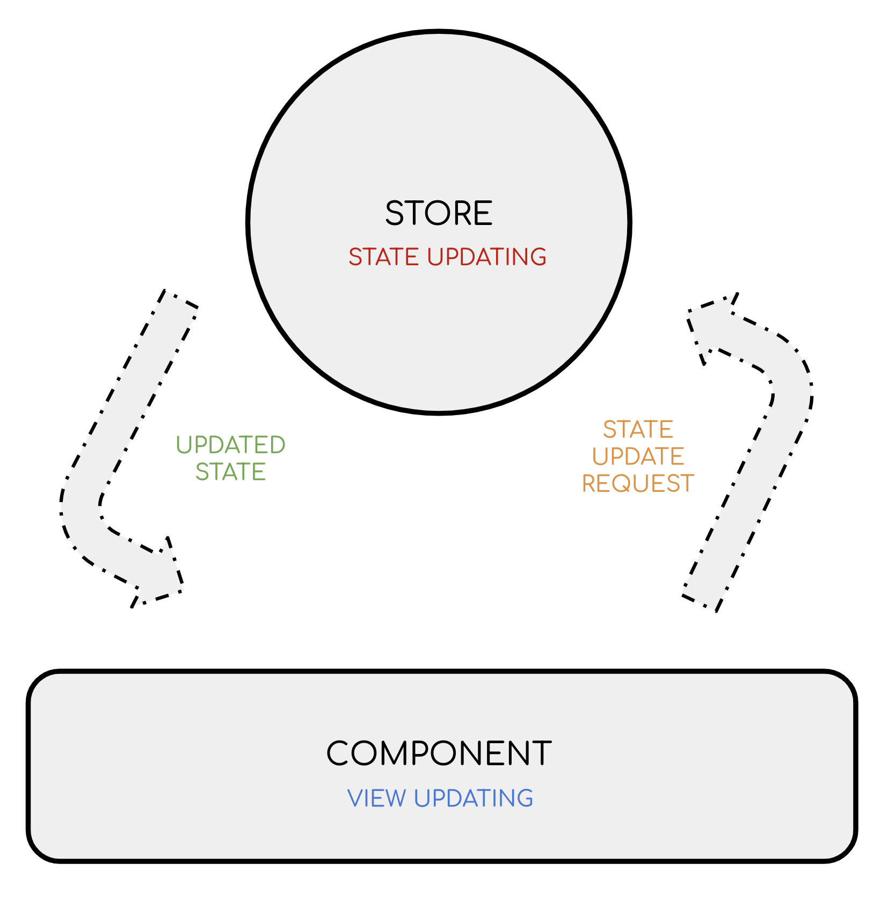

# OpenProject development style guide - frontend

## Code format
OpenProject follows the [AirBnB's style guide](https://github.com/airbnb/javascript) regarding to the code format.  

## Development patterns
### Angularized
OpenProject follows the [Angular's style guide](https://angular.io/guide/styleguide) patterns. 

### Declarative
Declarative Programming is a paradigm where the code describes **what to do** by encapsulating the **how to do it** (implementation details) under abstractions. The ultimate result of declarative programming is the creation of a new Domain Specific Language (DSL).

#### What
*   Encapsulate logic in methods with meaningful names.
    *   Domain/Business logic: \
Encapsulate the implementation details in the subdomain service (e.g., login should be placed in the AuthService and encapsulate all the login functionality).
    *   Presentation or interaction logic: \
Encapsulate the implementation details in a component’s method or in a Presenter (service scoped/provided in the component). 

#### Example
```
// Imperative programming
const bestProducts = [];

for(let i = 0; i < products.length; i++) {
  let product = products[i];
  if (product.rating >= 5 && product.price < 100) {
     bestProducts.push(product);
  }
}

// More declarative
const bestProducts = products.filter(function(product) {
 return product.rating >= 5 && product.price < 100;
});

// Most declarative, implementation details are hidden in a function
const bestProducts = getBestProducts();
```


An example in OpenProject would be the APIV3Service that encapsulates all the logic to deal with the OpenProject API.


#### Why
*   Code is easier to understand and reason about.
*   Favours reusability.
*   Simplifies refactoring.
*   The state management becomes predictable, easy to trace, and under control.
*   Aligns with unidirectional data flow (Stores) and the Components Architecture.  
*   Increases coding pleasure and productivity.


### Immutable
Not capable of or susceptible to change. An immutable value can’t be changed, when edited a new copy is returned.


#### What
Do not mutate objects, spread the word.
*   Do not edit object’s, use the immutable alternatives:

```
const copy = {...originalObject}; 
const add = {...originalObject, propertyToChange: 'new value'};
const remove = {propertyToDelete, ...newObjectWithoutThePropertyToDelete}; 
```

*   Avoid Array mutation methods (push, pop, shift, unshift, sort, reverse, splice, delete), use their immutable alternatives:

```
clone = x => [...x];
push = y => x => [...x, y];
pop = x => x.slice(0, -1);
unshift = y => x => [y, ...x];
shift = x => x.slice(1);
sort = f => x => [...x].sort(f);
delete = i => x => [...x.slice(0, i), ...x.slice(i + 1)];
splice = (s, c, ...y) => x => [...x.slice(0, s), ...y, ...x.slice(s + c)];
```

#### Why
*   In Javascript, Objects can be [edited by reference](https://javascript.info/object-copy), opening the door to unpredictable mutations that can have unintended effects on other parts of the app.
*   Makes code easier to understand because data changes become explicit and obvious.
*   Avoids a set of [hard to detect bugs](https://2ality.com/2019/10/shared-mutable-state.html).
*   Enables unidirectional data flow.
*   Enables performance improvements through ChangeDetectionStrategy.OnPush


### Unidirectional data flow
The app has a single way to read and to write the state, and both are separated ([Command Query Segregation](https://khalilstemmler.com/articles/oop-design-principles/command-query-segregation/)).


#### State definition
We can differentiate the following types of states in an app:

*   Component (local): belongs to a single component. UI state.
*   Shared (global): belongs to multiple components.
*   Remote (global): backend state (e.g., REST APIs), that the app CRUD.
*   App (meta): state about the app itself (e.g., router, loading…).

In the following lines, state refers to global state (shared and remote), usually the REST API data.


#### 2 main actors
*   The Store:
    *   Manages the state
    *   Provides an API for requesting updates in the state
    *   Provides an observable that emits an updated copy of the state whenever it is updated
*   Components:
    *   Consumes the state
    *   Requests updates to the Store


#### Flow        



*   Component/Service requests an update to the Store (directly or through an Action)
*   Store changes the state and emits an updated copy of the state
*   Component receives the update and renders the new state  


#### Unidirectional data flow in the view / component’s tree
Angular also follows the unidirectional data flow pattern in the view to improve the performance and simplify the state distribution:

*   When the state could have been updated (an async operation happens), Angular performs [Change Detection](https://indepth.dev/posts/1058/a-gentle-introduction-into-change-detection-in-angular) in one way, from top to bottom, from the root component all the tree down checking every child component for changes.
*   Every component that receives state updates (@Input, Services, UI...), updates itself, renders its view and then triggers Change Detection for its child components.
*   If the children would trigger state changes up to the parent (bidirectional data flow (two way data binding)), the parent should update itself and then trigger Change Detection for the children, which could trigger changes up to the parent…  causing a loop.
*   This is why unidirectional data flow is enforced in development mode (ExpressionChangedAfterItHasBeenCheckedError) and encouraged in the Components Architecture.

#### What
*   Do use the chosen state management library by default.

#### Why
*   Stores concentrate the state management, allowing the different parts of the application to remain highly decoupled.
*   Container components concentrate the state distribution through @Input and @Outputs, so the state flow is clear just by taking a look at the template.
*   The state management becomes predictable, easy to trace, and under control.
*   Reduces side effects and facilitates debugging.
*   Encourages data normalization and avoids duplications.
*   Code is easier to understand and reason about.
*   Increases coding pleasure and productivity.


### Components architecture
Mental mindset to build clearer apps based on the differentiation between Container Components (CC), Presentational Components (PC) and Services.

#### Services
Are state and logic containers.

##### What
*   Encapsulate logic in services:
    *   State (Store) + Domain logic (state CRUD)
    *   Complex UI logic (Presenters)
*   Provide a meaningful API to access the state and logic.
*   Follow the unidirectional data flow pattern

##### Why
*   Decouples state management from components.
*   Allows to keep the components lean.
*   Scoped Shareability: allow to share the state and logic scoped to components, modules or globally.
*   Testability
*   Encourages Declarative Programming
*   Testability: easier to test because there are no side effects (pure).

#### Container components (CC)
Represent a feature that interacts with the state. This could be a page (routed component) but also standalone components (e.g. sign-in button (tied to the AuthService)).

##### Responsibilities
*   Inject the State Services (Stores).
*   Contain Presentational Components (PC), usually.
*   Bridge State Services (Stores) and PCs:
    *   Pass down state updates (from Stores) through PCs’ @Outputs
    *   React to PCs’ @Outputs
*   Notes:
    *   Could contain other CCs.
    *   Could contain presentational logic (show/hide PCs, calculations..), in those cases are named something like Mixed Components.

##### Example
Pages, components that are routed, are usually container components since the need to fetch state to display it.

##### What
*   Concentrate the interaction with the state (Stores) in Container Components.

##### Why
*   Separation of concerns; separates state interaction from UI (presentation and interaction).
*   Concentrates state interaction; the state management becomes more predictable, easy to trace, and under control.
*   Simplifies the state flow: the state distribution through @Input and @Outputs makes the state flow clear just by taking a look at the template.
*   Reduces side effects and facilitates debugging.
*   Code is easier to understand and reason about.
*   Increases coding pleasure and productivity.

#### Presentational components
Are the building blocks of the UI.

##### Responsibilities
*   Present/display state that is passed via @Inputs.
*   Handle user interaction:
    *   Implement the interaction logic 
    *   Emit @Outputs
*   Notes:
    *   Could contain:
        *   Other Presentational Components and Container Components.
        *   Presenter Services that encapsulate complex UI logic (computed styles, UI calculations...)).

##### Example
Components from UI libraries are usually Presentational Components (e.g., [material button](https://github.com/angular/components/blob/master/src/material/button/button.ts)). 

##### What
*   Create presentational components to encapsulate UI logic (presentation or interaction).


##### Why
*   Reusability: \
Presentational components are more reusable because:
    *   Are not tied to a concrete business logic.
    *   Usually perform a generic interaction/presentation (button, tab, list, layout)
*   Increase
    *   Productivity
    *   Standardization
*   Align with Design Systems
*   Improved testability because there are no side effects (pure).
*   Are easier to replace.

### Clean
Clean code is easily readable, understandable, changeable, extensible, scalable and maintainable.

#### What
*   Do follow clean [patterns and rules](https://github.com/labs42io/clean-code-typescript)
    *   [Summary of the Clean Code principles](https://gist.github.com/wojteklu/73c6914cc446146b8b533c0988cf8d29)

#### Why
*   Standardizes the code.
*   Increases debuggability.
*   Code is easier to understand and to reason about.
*   Increases coding pleasure and productivity.

### BEM CSS
#### What
*   Do follow BEM directives:
    *   [https://en.bem.info/methodology/css/](https://en.bem.info/methodology/css/)
    *   [https://en.bem.info/methodology/html/](https://en.bem.info/methodology/html/)