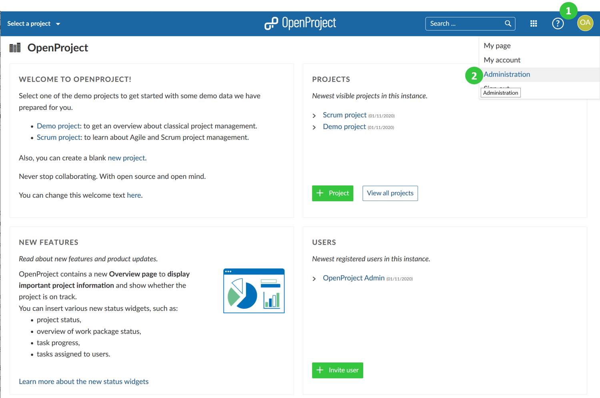
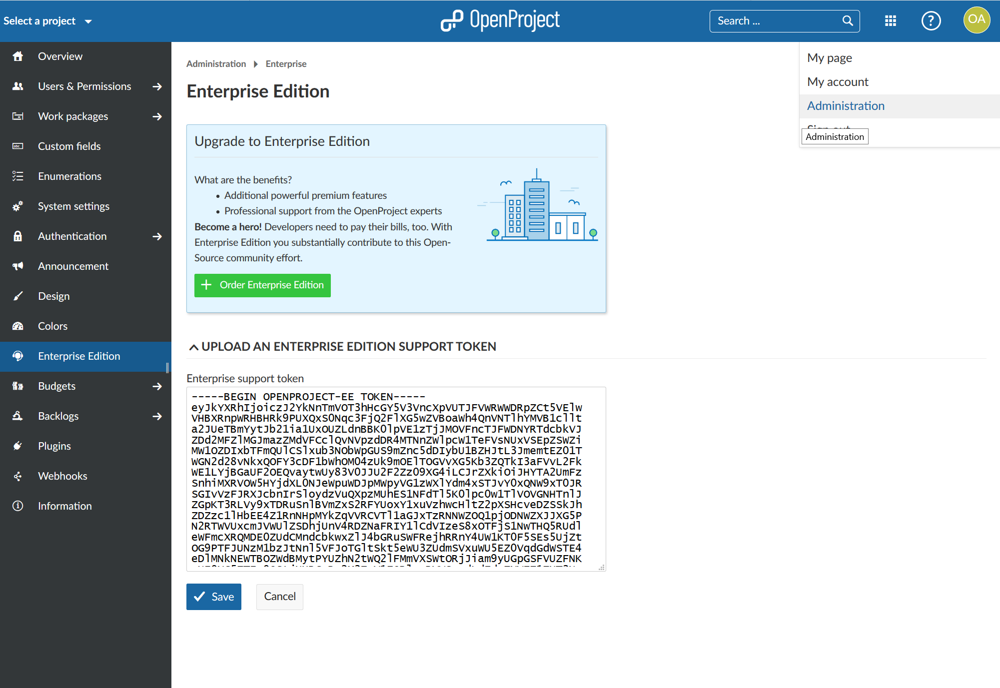
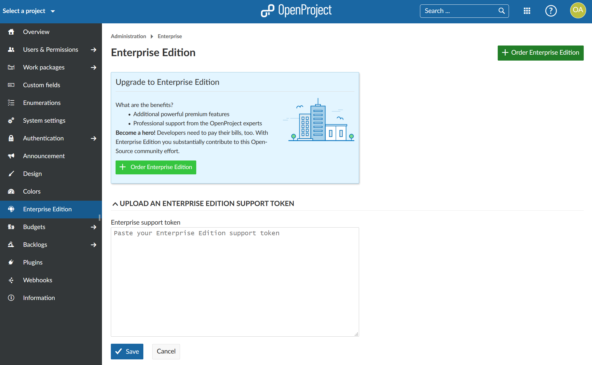

---
sidebar_navigation:
  title: Activate the Enterprise Edition
  priority: 990
description: Activate the OpenProject Enterprise Edition.
robots: index, follow
keywords: Activate Enterprise Edition
---
# Activate the Enterprise on-premises edition

The OpenProject Enterprise on-premises edition builds on top of the Community edition.

In order to upgrade your OpenProject Community edition to the Enterprise on-premises edition, sign into your OpenProject environment with an administrator account.

**Click on your user avatar in the upper right corner** (1) and select **Administration** from the dropdown menu (2). 

Next, select **Enterprise Edition** from the menu items (3).

Do you already have an Enterprise on-premises token?
Yes, then you can proceed entering your token as described below.

No, then you need to [order your Enterprise on-premises token](#order-the-enterprise-edition) or [request a trial token](../enterprise-trial) first.

In the Enterprise on-premises edition section, copy and paste the full content of your Enterprise on-premises support token into the input field and press the blue **Save** button.

Your Enterprise on-premises edition is now active.

## Order the Enterprise on-premises edition

If you want to **order the Enterprise on-premises edition** click on the **+ Order Enterprise Edition** button shown on the page. You can also [request a trial token](../enterprise-trial) to test the premium features included in the Enterprise on-premises edition.

Once you purchased an Enterprise on-premises edition token or received a trial token you can [activate it by pasting the token in the designated area of the Enterprise Edition section](#activate-the-enterprise-edition).

