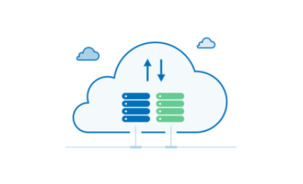

---
sidebar_navigation:
  title: Enterprise cloud guide
  priority: 998
description: OpenProject Enterprise cloud guide.
keywords: cloud edition, enterprise cloud
---
# Enterprise cloud guide

Welcome to the OpenProject **Enterprise cloud guide**.

> **Note**: This guide only describes the management of your Enterprise cloud. The feature descriptions are included in the respective parts of the OpenProject [user guide](../../user-guide).

## Overview

| Topic                                                                                                       | Content                                                                                           |
|-------------------------------------------------------------------------------------------------------------|:--------------------------------------------------------------------------------------------------|
| [Create free trial](./create-cloud-trial/)                                                                  | Learn more about how to create a free trial for the Enterprise cloud instance.                    |
| [Sign in](./sign-in/)                                                                                       | Sign in to your OpenProject Enterprise cloud edition.                                             |
| [Create quote](./create-quote-cloud/)                                                                       | How to create a quote within your Enterprise cloud instance.                                      |
| [Invoices and billing history](./invoices-and-billing-history/)                                             | How to see your payment history and download invoices.                                            |
| [Upgrade, downgrade or cancel subscription](./manage-cloud-subscription/#upgrade-or-downgrade-subscription) | How to upgrade your plan, downgrade or cancel your subscription for the Enterprise cloud edition. |
| [Manage your subscription](./manage-cloud-subscription/)                                                    | How to change billing address and add or edit credit card details.                                |
| [Subscribe](./book-cloud/)                                                                                  | How to book Enterprise cloud.                                                                     |
| [Backups](./backups/)                                                                                       | How do backups work in the cloud?                                                                 |
| [Support](../support/)                                                                                      | How to get support as Enterprise cloud user.                                                      |
| [GDPR and DPA](./gdpr-compliance/)                                                                          | Review and sign a Data Processing Agreement (DPA).                                                |

The OpenProject Enterprise cloud edition contains all OpenProject Community features plus the additional OpenProject Enterprise add-ons, as well as professional support.

For the Enterprise cloud edition the OpenProject experts will take care of the installation as well as maintenance of your OpenProject installation, so you will be able to concentrate on your core business. We will perform regular backups of your Enterprise cloud edition. You will have the latest OpenProject release installed. Hence, you do not have to take care of updates or installation of security patches yourself.

Please find a detailed feature comparison [here](https://www.openproject.org/pricing/#features).
