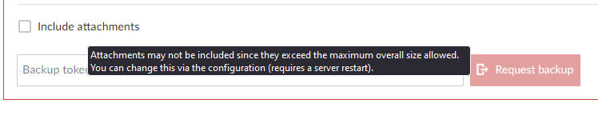

---
sidebar_navigation:
  title: Backups
  priority: 710
description: Backups in the Enterprise cloud edition.
keywords: backups
---

# Backups

## Data retention policy

Your Enterprise cloud data is backed up continuously and retained for 30 days. Within those 30 days we can restore your data to any point in time with a precision of 5 minutes, in case you need us to. (currently this is valid only for cloud instances located in the openproject.com cloud environment)

*Note: At the moment it is only possible to restore the complete instance into a former state. All future edits after the former state will be not available in the restored instance. In order to offer you the possibility of recreating the restored information to your productive instance, the restored version is temporarily available on a separate URL. You will have all the time you need to clone the lost information from the temporary instance to the production one. This could be done by using e.g. API calls or manual interaction.*

## Resource limitations for attachments

Currently resource limitations in the Enterprise cloud allow a Backup to contain attachments only in the case if the file size of all attachments of your instance are less than 1 GB of data. Please contact us at [support@openproject.com](mailto:support@openproject.com) in order to manually request a complete backup containing the SQL dump including all attachments or try to delete unused attachments in order to get below 1 GB of data usage.

In this case you cannot check the **Include attachments** check-box like on the screen-shot below, it will be grayed out:

## Backup via GUI

For detailed usage of the Backup via GUI, please navigate to the [System admin guide Backup page](../../../system-admin-guide/backup/)
