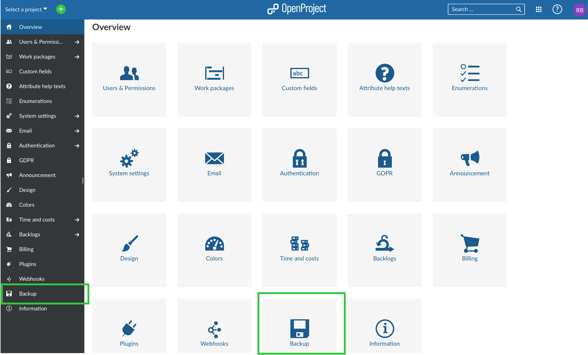
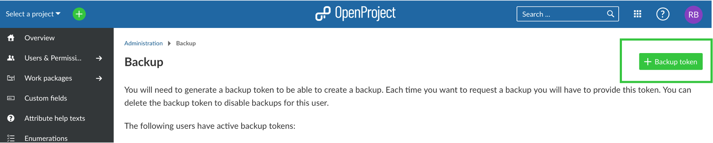
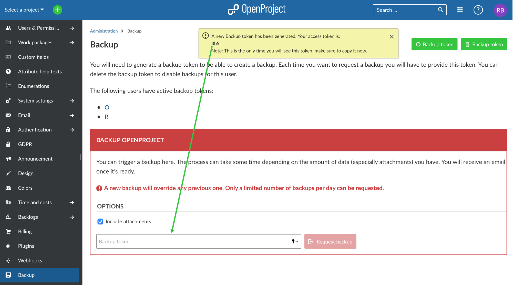

---
sidebar_navigation:
  title: Backups
  priority: 710
description: Backups in the cloud edition.
robots: index, follow
keywords: backups
---

# Backups

Your Enterprise cloud data is backed up continuously and retained for 30 days.
Within those 30 days we can restore your data to any point in time with a precision of 5 minutes, in case you need us to.

## Download

You can yourself create backups of your OpenProject installation. Go to *Administration* and *Backup* to get started.

You will then need to create a backup token by clicking **+ Backup token**.

The system generates the token which you then fill in where requested in the field below.

After having **requested the backup**, you will receive an email notification with a link to download your backup. For this, you will need additional authentication (username and password as well as 2-Factor-Authentication if activated) to download the backup files.

In case you have trouble creating your backup, please [get in touch](mailto:support@openproject.com) with us. We can then provide a current or past backup (database + attachments) to you.

This way you can also get your data if you decide to stop using the Enterprise cloud edition.
