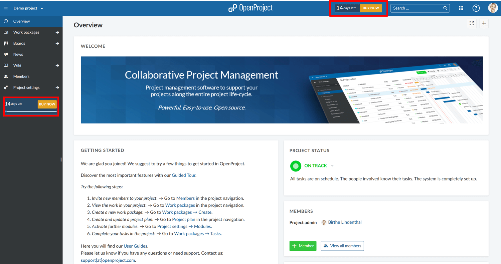
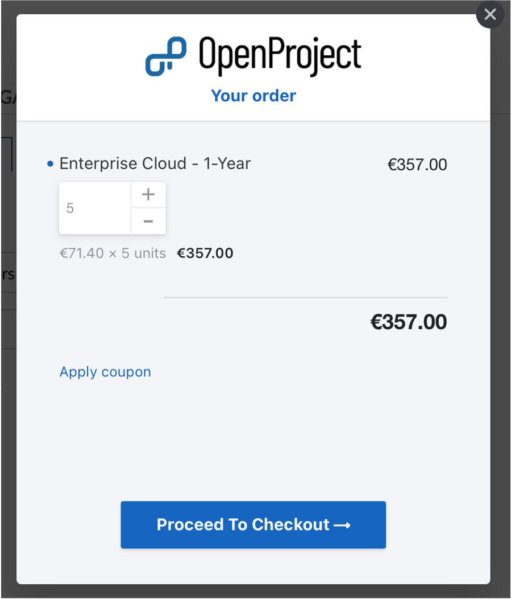
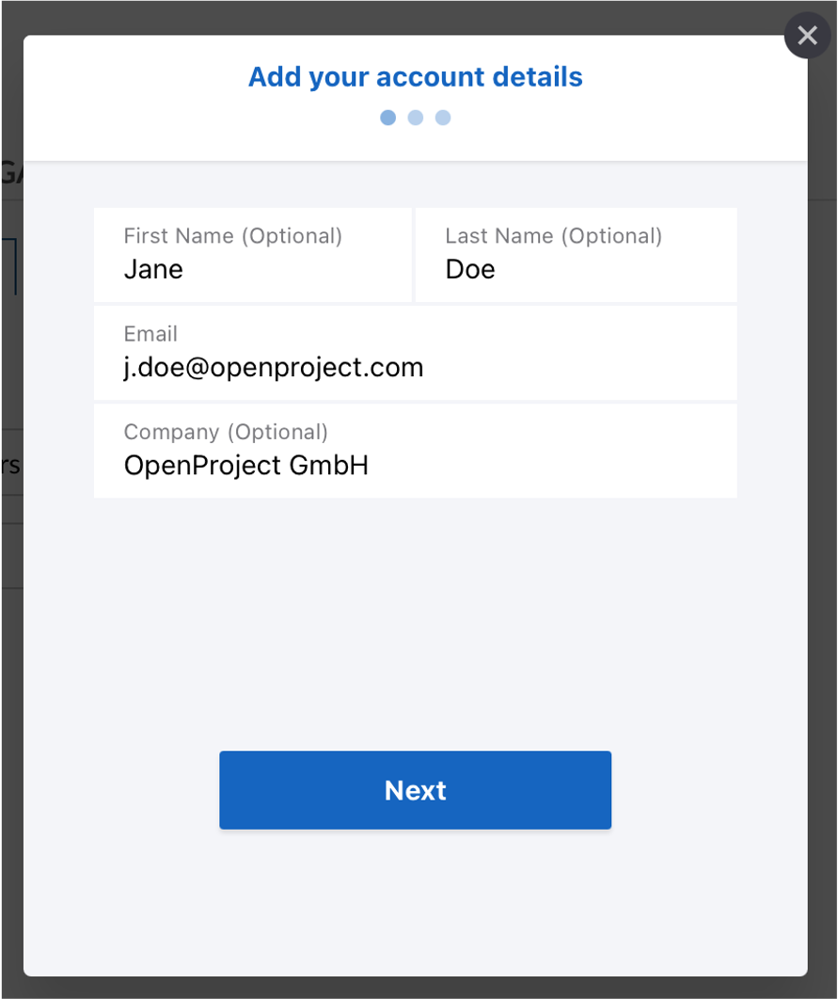
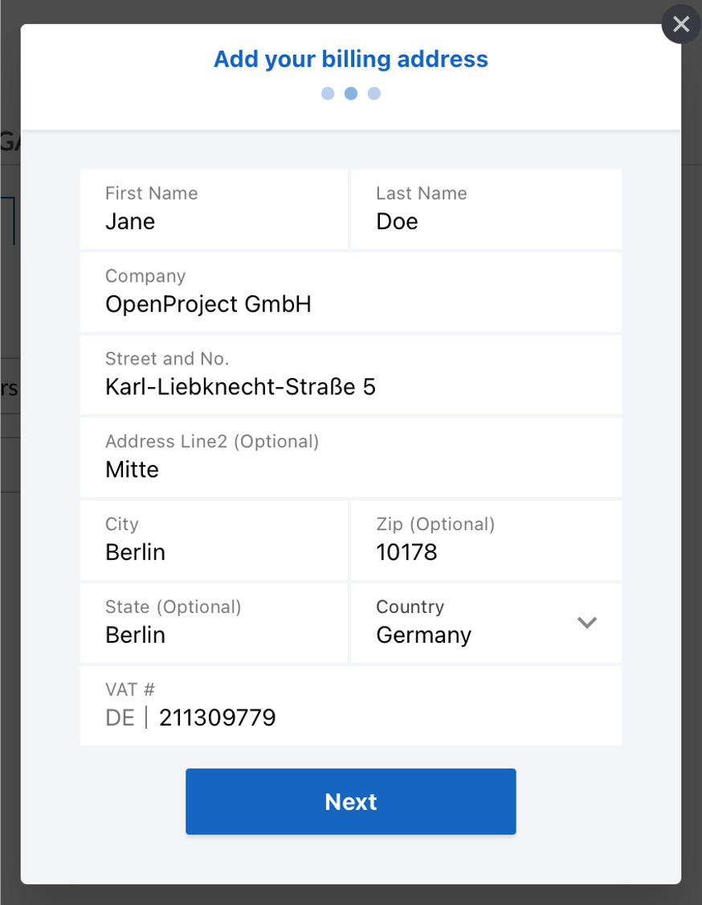
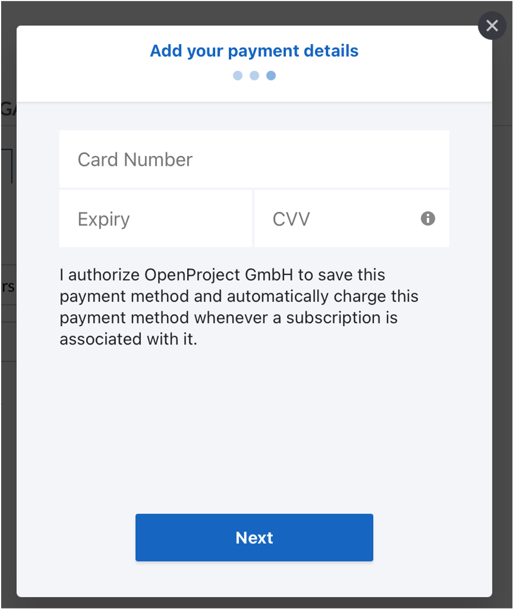
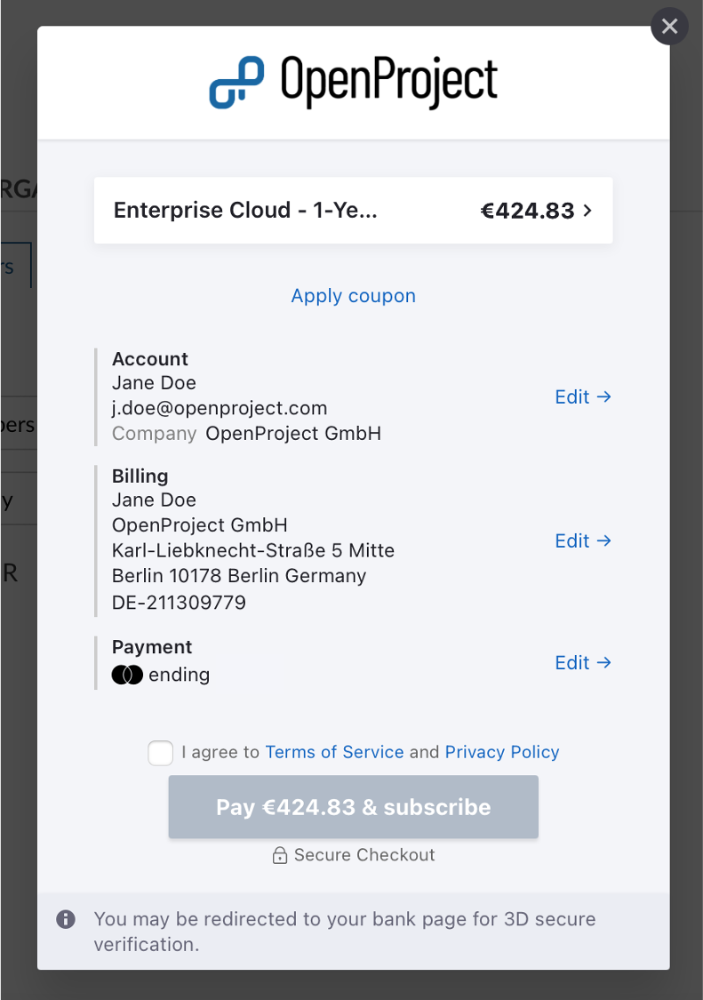
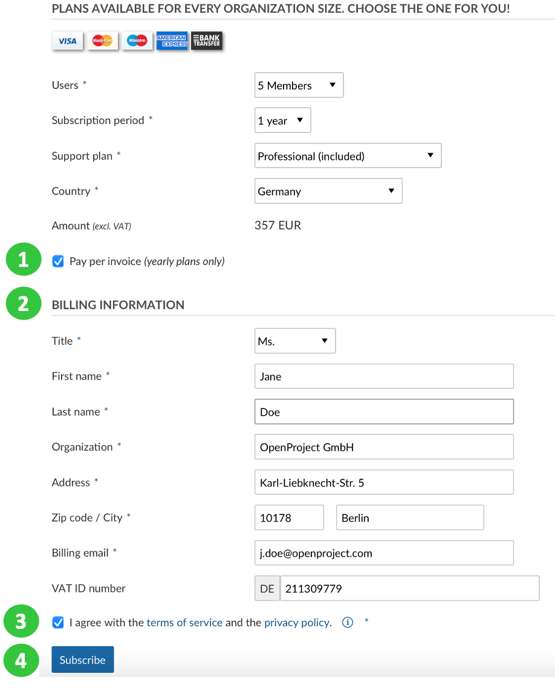
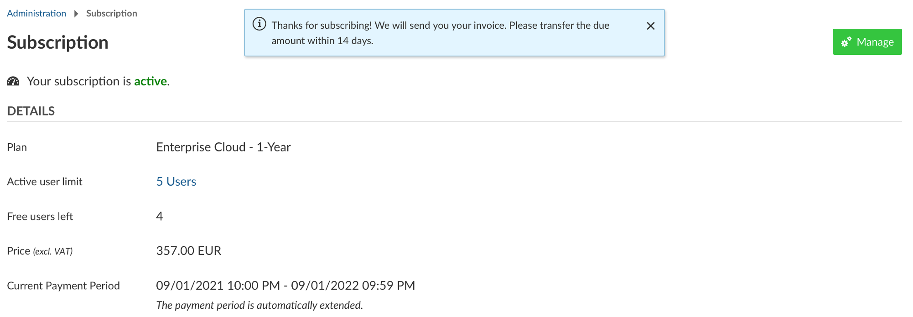

---
sidebar_navigation:
  title: Subscribe
  priority: 960
description: Book the OpenProject Enterprise cloud edition.
keywords: book, enterprise cloud edition
---
# Book the Enterprise cloud edition

After you have tested the OpenProject Enterprise cloud edition and want to continue working with OpenProject, you can subscribe to one of our plans.

Please refer to our website for the Enterprise cloud edition [pricing](https://www.openproject.org/pricing/).

You can subscribe to a monthly or yearly plan. The subscription can be **paid via Credit Card or Bank transfer** (only for yearly subscriptions for customers in the EU, Switzerland and the United States).

To upgrade your trial to the full version, **click on the BUY NOW teaser**, e.g. in the application header or project menu.

You will be directed to -> *Administration* -> *Billing*.

(1) First, choose if you want to subscribe to an **annual or monthly plan**.

(2) Select the **amount of users** from the drop-down list. It is only possible to book members in the steps of 5, minimum 5 users.

(3) Select your **country** from the drop-down list.

(4) The **total amount** (excl. VAT) will  be displayed.

(5) Click the **Subscribe** button.

Next, click the **Proceed to Checkout button**.

Verify your **account details** and click the blue Next button.

Add your **Billing address and VAT number** and click the blue **Next** button.

Enter your **payment details** (credit card information). Make sure to verify your address (same as for the invoice) in order to avoid payment failures via credit card. If your credit card is stated to a different address, make sure to enter it here as card address.

Click the blue **Next** button.

You will once again get an overview about your subscription.
Here, you can edit the account or billing information if needed.

Subscribe to our regular newsletter in order to keep up to date with latest product developments.

Click the blue **Pay** button and subscribe to the OpenProject Enterprise cloud edition.

A payment receipt will be sent via email.

## Pay per invoice (via bank transfer)

If you book an annual plan and your organization is based in the EU, Switzerland or the United States you can also choose to pay via invoice.

(1) Click the **Pay per invoice** check mark.

(2) Enter your **Billing information**. Make sure to validate your billing email to receive the required information and invoice.
If you are a business customer from the EU, please enter a valid **VAT ID number**.

(3) You have to **agree to our terms of services and privacy policy**.

(4) Click the blue **Subscribe** button.

 

You will get an overview of your booked subscription.

An invoice will be sent via email to the Billing email address.

## Frequently asked questions (FAQ)

### Is there an advantage of the annual over the monthly OpenProject plan?

Yes, your subscription gets cheaper the longer the duration you choose. Please check our current pricing [here](https://www.openproject.org/pricing/).

### Additional questions

You can find additional questions and answers regarding pricing and booking at the bottom of our [pricing website](https://www.openproject.org/pricing/#faq).
