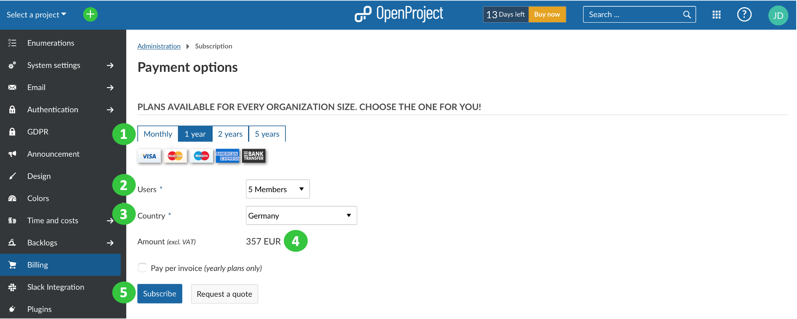

---
sidebar_navigation:
  title: Create quote
  priority: 990
description: Request a quote within your OpenProject Enterprise cloud
keywords: quote, request, offer, tender, bid
---

# Creating a quote in the OpenProject Enterprise cloud

If you would like to request a quote for OpenProject Enterprise cloud you can do so in your trial instance. Alternatively, you can refer to our website for the Enterprise cloud edition [pricing](https://www.openproject.org/pricing/).

To create a quote please, **click on the BUY NOW teaser**, e.g. in the application header or or in the project menu.

You will be directed to -> *Administration* -> *Billing*.

(1) First, choose if you want to subscribe to an **annual or monthly plan**.

(2) Select the **amount of users** from the drop-down list. The number of users can only be selected in steps of five, the minimum is five users.

(3) Select your **country** from the drop-down list.

(4) The **total amount** (excluding VAT) will be displayed.

(5) Click on **Request a quote**.

You will then be asked to provide your address details. After populating the respective fields please click on **Request a quote**.

After that you will receive an **email with the quote**. The email includes a link to accept the quote. Your subscription will be updated once you accept the quote.
