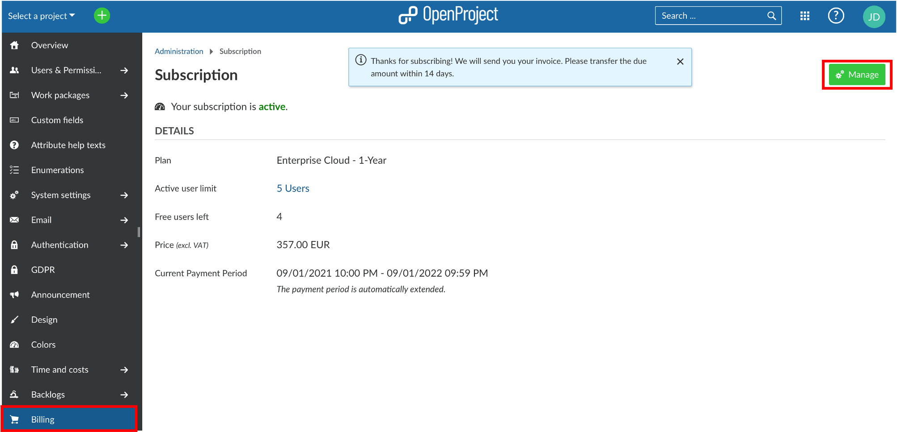
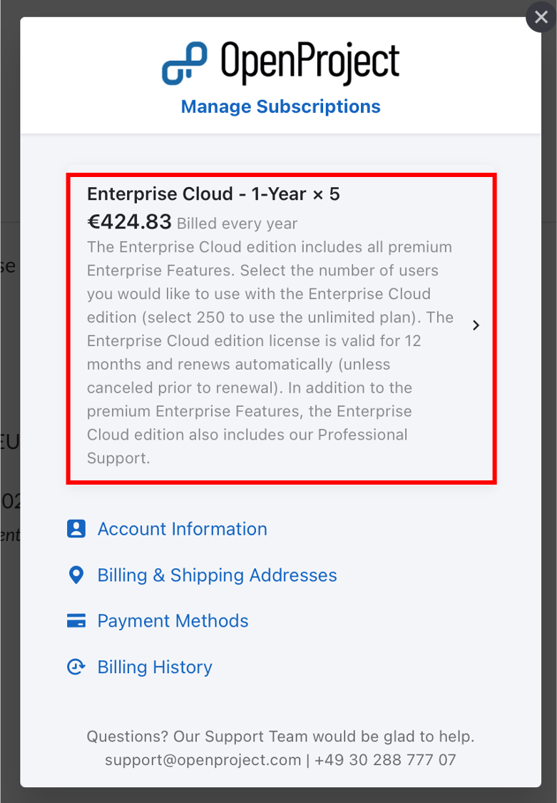
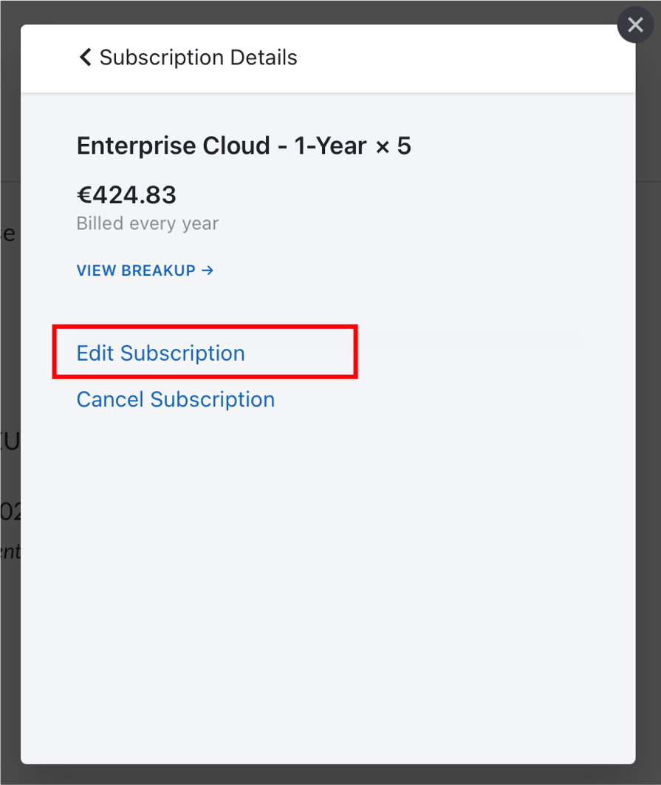
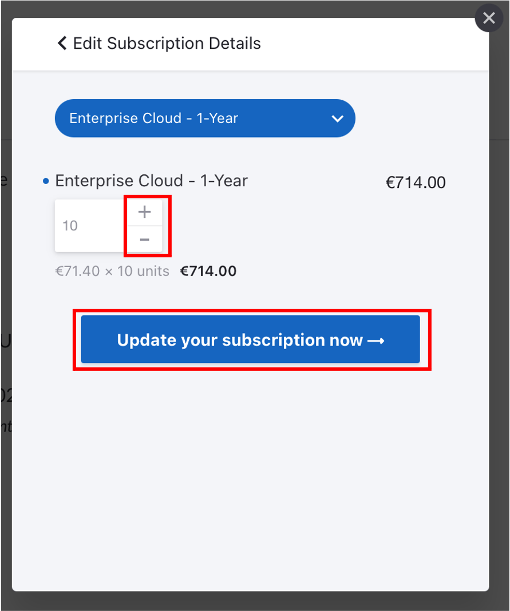

---
sidebar_navigation:
  title: Manage subscription
  priority: 970
description: Manage and change all subscription-related topics of your Enterprise cloud.
keywords: enterprise cloud edition, subscription, address, payment method, invoices
---

# Manage your OpenProject Enterprise cloud subscription

If you want to make changes to your subscription (Up- or downgrade, cancel, change your address or payment method), navigate to *Administration* -> *Billing* within your system's Administration.

Click the green **Manage button**.

In the overlay window, you can choose between several topics:

- [Upgrade, downgrade or cancel](#update-existing-subscriptions)
- Edit Account information
- Edit Billing Addresses
- Edit or add payment methods
- [View billing history and download invoices](../invoices-and-billing-history)

## Update existing subscriptions

If you want to up- or downgrade the amount of users of an existing subscription, click on the subscription listed at the top.

Here you can either **Edit or Cancel the existing subscription**.

### Upgrade or downgrade subscription

You can **upgrade an existing subscription** at any time. Open the [Manage subscription menu](#manage-your-openproject-enterprise-cloud-subscription). Additional users will be billed on a prorated basis, this means you will only pay for the additional users for the rest of the current subscription period.

You can **downgrade a subscription** to the end of a current subscription period. This means the downgrade becomes active with the next payment term.

Click the **Edit Subscription** link.

You can choose the new amount of users. Your next payment will be displayed below.

Click the blue **Update your subscription now button** to save the changes.

### Cancel subscription

To cancel your subscription, open the [Manage subscription](#manage-your-openproject-enterprise-cloud-subscription) form and click to [update the subscription](#update-existing-subscriptions) you want to cancel.

Click on the **Cancel Subscription link** if you want to terminate your OpenProject Enterprise cloud edition subscription.

> **Note**: After cancellation you will receive an email confirmation. Your subscription will be terminated at the end of the current subscription period. After cancellation your data will be kept for a certain period of time in case of reactivation of a subscription.
