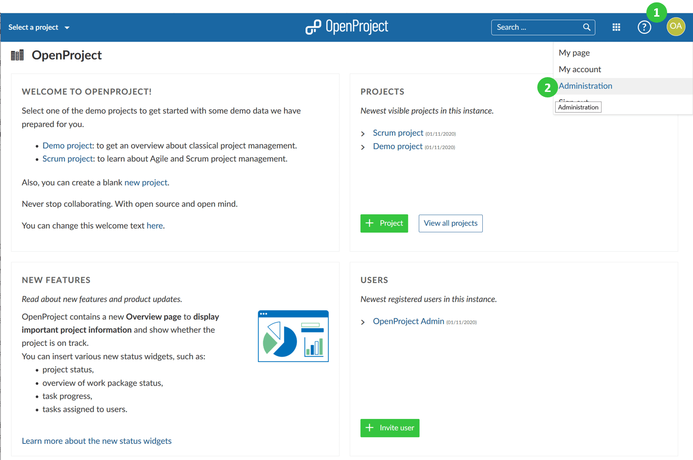
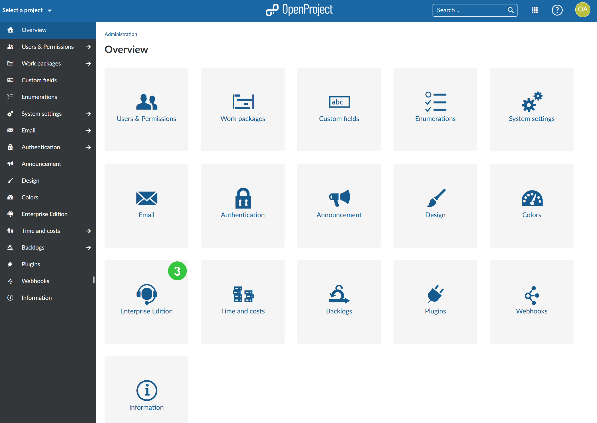
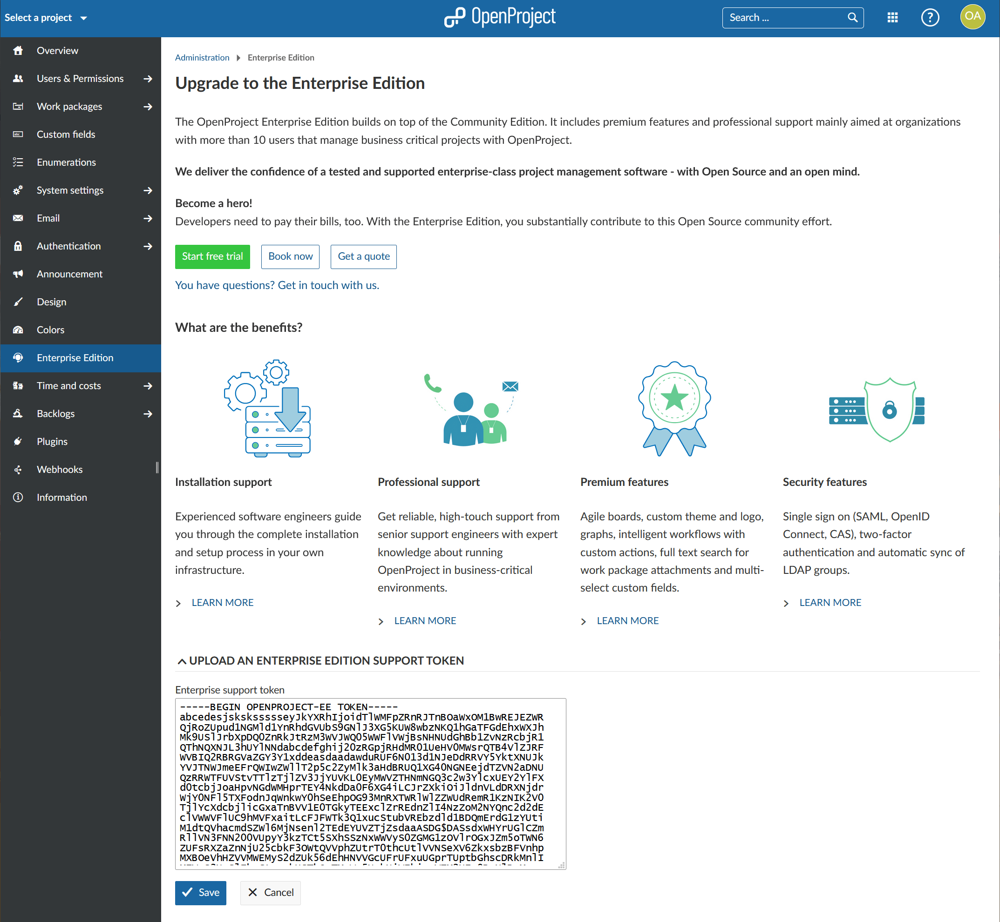
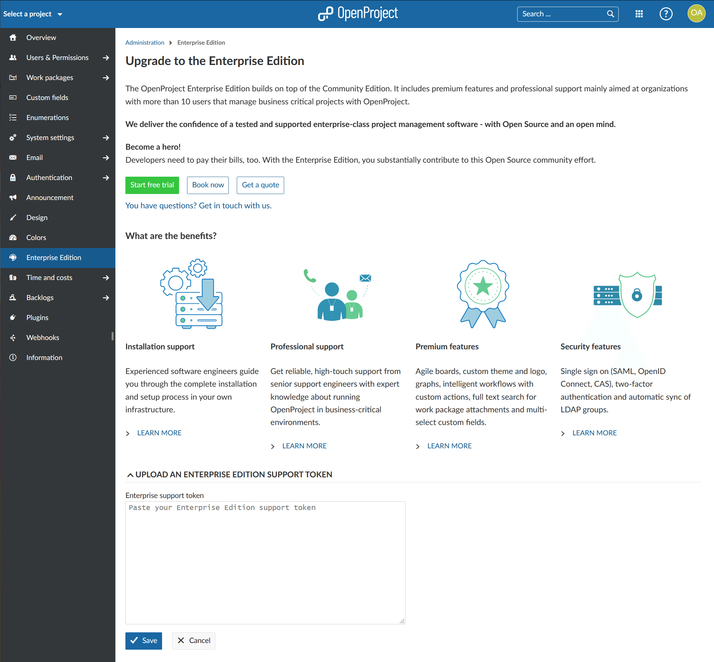

---
sidebar_navigation:
  title: Activate Enterprise on-premises
  priority: 990
description: Activate the OpenProject Enterprise on-premises edition.
keywords: activate, enterprise on-premises, token, license key
---
# Activate the Enterprise on-premises edition

The OpenProject Enterprise on-premises edition builds on top of the Community edition.

In order to upgrade your OpenProject Community edition to the Enterprise on-premises edition, sign into your OpenProject environment with an administrator account.

**Click on your user avatar in the upper right corner** (1) and select **Administration** from the dropdown menu (2).

Next, select **Enterprise edition** from the menu items (3).

Do you already have an Enterprise on-premises token?

Yes: Then you can proceed entering your token as described below.

No: Then you will need to [order your Enterprise on-premises token](#order-the-enterprise-on-premises-edition) or [request a trial token](../enterprise-on-premises-trial) first.

In the Enterprise on-premises edition section, copy and paste the full content of your Enterprise on-premises support token into the input field and press the blue **Save** button.

Your Enterprise on-premises edition is now active.

## Order the Enterprise on-premises edition

If you want to **order the Enterprise on-premises edition** click on the **+ Order Enterprise edition** button shown on the page. You can also [request a trial token](../enterprise-on-premises-trial) to test the Enterprise add-ons included in the Enterprise on-premises edition.

Once you purchased an Enterprise on-premises edition token or received a trial token you can [activate it by pasting the token in the designated area of the Enterprise edition section](#activate-the-enterprise-on-premises-edition).

You can find pricing options and FAQ regarding pricing, booking and billing on our [pricing website](https://www.openproject.org/pricing/#faq).
