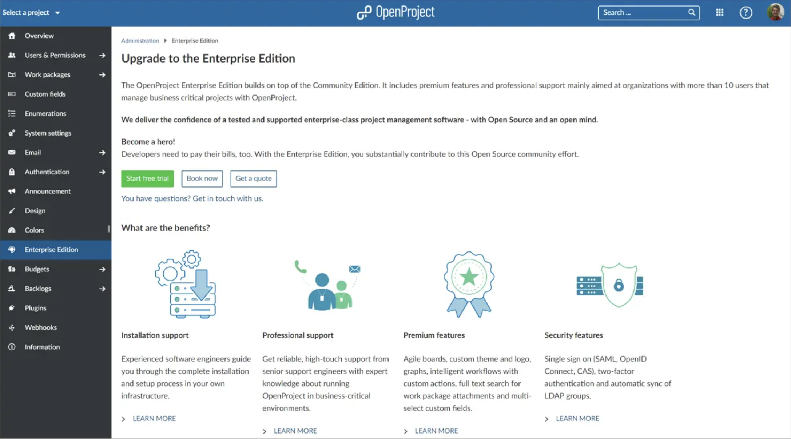
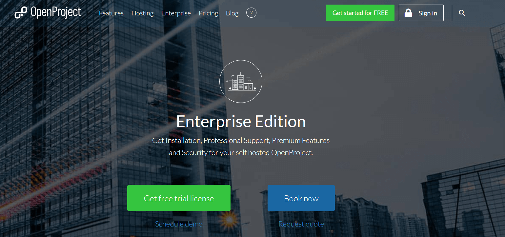
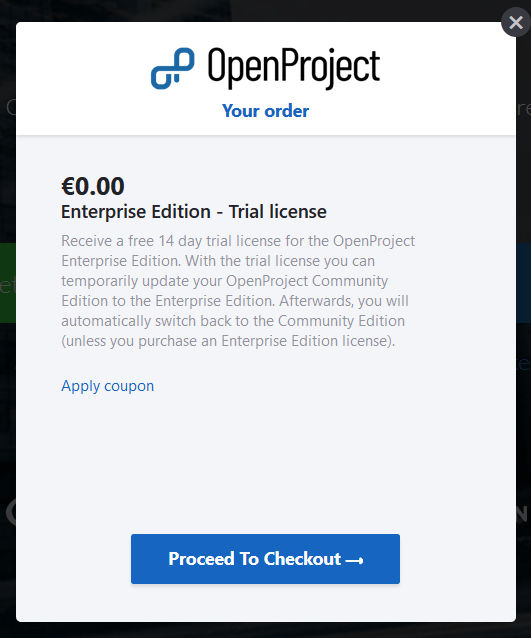

---
sidebar_navigation:
  title: Enterprise on-premises trial
  priority: 999
description: Create an OpenProject Enterprise edition trial installation.
keywords: enterprise on-premises, trial, eop
---
# Create an Enterprise on-premises edition trial

You can **test the OpenProject Enterprise on-premises edition 14 days for free**. It will extend your current Community edition with the Enterprise add-ons so you can thoroughly test those Enterprise functionalities.

You can start the trial period for OpenProject either via an already installed Community edition or via our website.

A) To upgrade your Community installation, navigate to your system -> Administration -> Enterprise edition. Here, you can simply click the green **Start free trial button**.

B) To get a free trial from the website, please go to [the Enterprise site on our website](https://www.openproject.org/enterprise-edition/) and press the green **Get free trial license** button.

A window will appear which explains that you will receive a 14 days free trial license with that you can temporarily upgrade your Community edition.

Click the blue **Proceed To Checkout** button.

Enter you email address. Then your details, First name, last name, company name and phone number.

You will then **receive the token** via email with a description how to [activate Enterprise on-premises](../activate-enterprise-on-premises/).

> **Note**: There is no need to cancel the trial license. The license will run out automatically after 14 days and will bring you back to the Community version.
