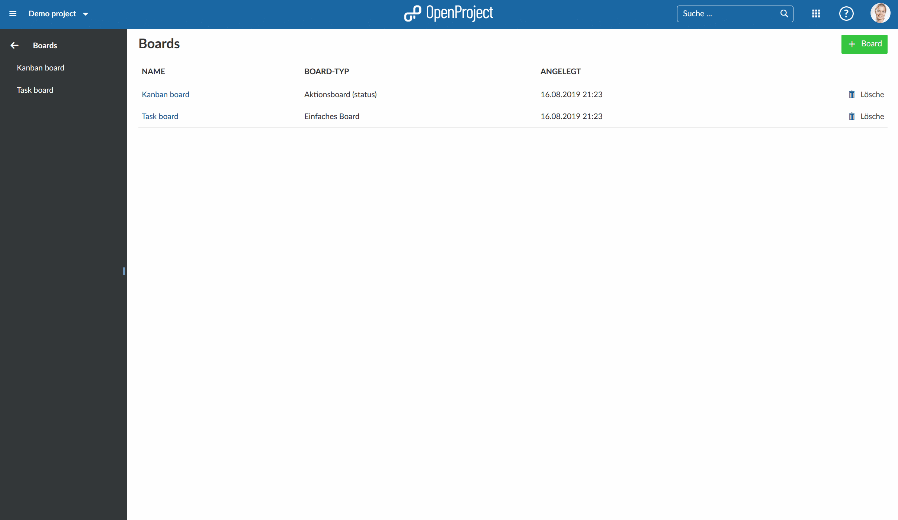

---
sidebar_navigation:
  title: Agile boards introduction
  priority: 500
description: Introduction to agile Boards in OpenProject.
robots: index, follow
keywords: Agile Boards
---

# Introduction to agile boards (premium feature)

This document provides an initial introduction to the boards in OpenProject, i.e. how to use a Kanban board to manage your tasks in an agile way.

**Note**: The agile board is a premium feature and only available for [OpenProject Cloud Edition](https://www.openproject.org/hosting/) and [Enterprise Edition](https://www.openproject.org/enterprise-edition/) customers.

**Boards** in OpenProject enable agile project management, i.e. Kanban. Boards consist of lists (columns) with cards (work packages) on it. They help to visualize work, limit work-in-progress, and maximize efficiency (or flow).

To find out more about the detailed functionalities of Boards, please visit our [user guide for boards](../../user-guide/agile-boards).

Agile boards is only one of OpenProject's features. Find a comprehensive comparison between OpenProject and Trello [here](https://www.openproject.org/alternatives/best-trello-alternative/).

| Topic                                                       | Content                                    |
| ----------------------------------------------------------- | ------------------------------------------ |
| [What is a Board?](#what-is-a-board)                       | Find out what a Board in OpenProject is.   |
| [Manage your work in a Board](#manage-your-work-in-a-board) | How to manage your work in an agile Board? |

<video src="https://openproject-docs.s3.eu-central-1.amazonaws.com/videos/OpenProject-Agile-Boards.mp4" type="video/mp4" controls="" style="width:100%"></video>

## What is a Board?

Agile Boards in OpenProject support teams in their agile project management methodology, e.g. Scrum or Kanban.

You can create as many flexible boards as you want with both lists and cards on it. A list usually represents a workflow, e.g. status or version of a work package. The cards are work packages, e.g. tasks, on this list.

## Manage your work in a Board

To manage your work in an agile board, open the Boards module in the project menu.

1. Choose a board from the list where you want to work on. Open it by double clicking on the board's title.
2. You can prioritize cards within a list via drag and drop.
3. You can add a card to a new list in the same way.
4. You can edit the details of a card by **double click**ing on the card.
5. Finally the arrow brings you back to the boards view.

