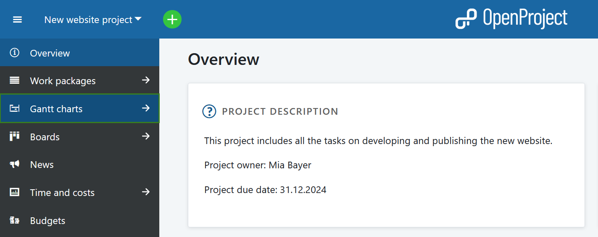
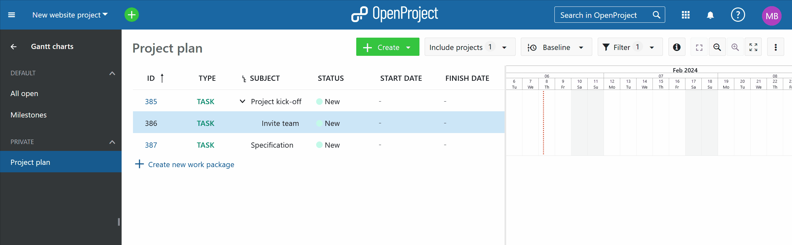

---
sidebar_navigation:
  title: Gantt charts introduction
  priority: 600
description: Introduction to Gantt charts to OpenProject.
keywords: Gantt charts introduction
---

# Introduction to Gantt charts

In this document you will get a first introduction to the Gantt charts in OpenProject, i.e. how to create and manage a project plan.

**Gantt charts** is a module in OpenProject that displays work packages in a specific way. The tasks are listed vertically, with the horizontal axis indicating the time. The length of the task bars is adjusted to the duration of the task.

To find out more about the functionalities for Gantt charts, please visit our [user guide for Gantt charts](../../user-guide/gantt-chart).

| Feature                                                    | Documentation for                                    |
|------------------------------------------------------------|------------------------------------------------------|
| [What is a Gantt chart?](#what-is-a-gantt-chart)           | Find out what is a Gantt chart in OpenProject.       |
| [Activate the Gantt chart](#activate-the-gantt-chart-view) | How to activate the Gantt chart view in OpenProject. |
| [Create a project plan](#create-a-project-plan)            | How to create a project plan with the Gantt charts.  |
| [Edit a project plan](#edit-a-project-plan)                | How to edit a project plan in OpenProject.           |

<video src="https://openproject-docs.s3.eu-central-1.amazonaws.com/videos/OpenProject-Project-Plan-and-Timelines-Gantt-charts.mp4" type="video/mp4" controls="" style="width:100%"></video>

## What is a Gantt chart?

With Gantt charts in OpenProject you can create and manage project plans and share the information with your team. You can schedule your tasks and visualize the required steps to complete your project. As a project manager you are directly informed about delays in your project and can act accordingly.

The dynamic Gantt chart in OpenProject displays the phases, tasks and milestones in your project as well as relationships between them. The elements for phases and tasks each have a start and end date, so you are always informed about the current status. The milestones only appears as a fixed point in time.

## Activate the Gantt chart view

To open the Gantt chart view in OpenProject, the [Gantt charts and work packages modules need to be activated](../../user-guide/projects/project-settings/modules/) in the project settings. Both are usually activated by default.

Within your project menu, navigate to the **Gantt charts** module.

The Gantt chart then displays all work package types, e.g. phases and milestones, tasks or bugs, in a timeline view. It shows dependencies between different work packages as well as additional information, e.g. subject, start or finish dates.

You can also select the cross-project Gantt charts view through the [global modules](../../user-guide/home/global-modules/) menu, which will include the information, which project the work packages are part of.

## Create a project plan

To create a project plan in OpenProject, select the [**Gantt charts** module](../../user-guide/gantt-chart/).

You can create new work packages directly in the table by clicking on the **create new work package** link at the bottom of the table. You can change the work package type or other attributes directly in the table view.

Click in the at the level of the line of the work package you want to map in the Gantt chart to add an element in the project plan.

You can change the duration or move the element in the project plan via drag and drop.

## Edit a project plan

You can edit a project plan by clicking directly in the table and changing work package attributes, e.g. Status, Priority or Assignee.

To change the start and end date or the duration of a work package, click directly in the Gantt chart and change it via drag and drop.
All changes will also be tracked in the work packages [Activity](../../user-guide/activity).

