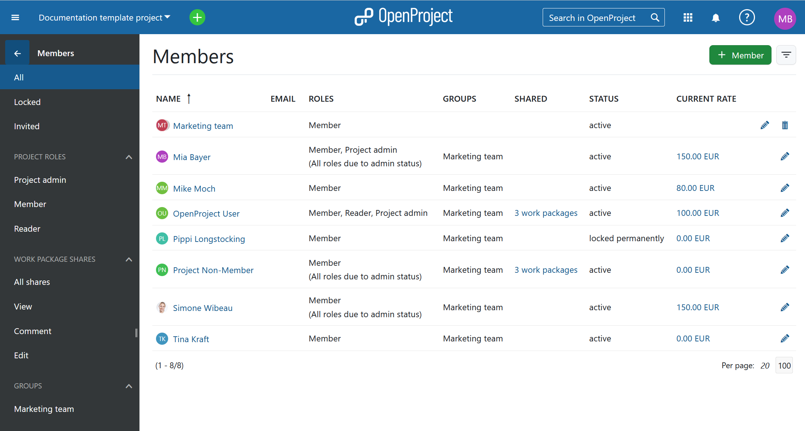
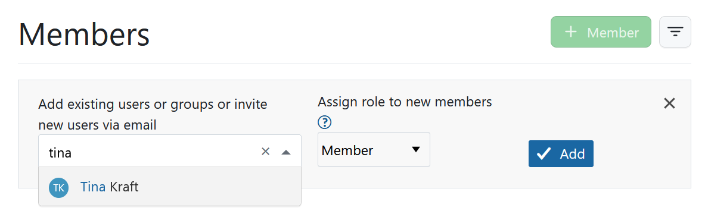
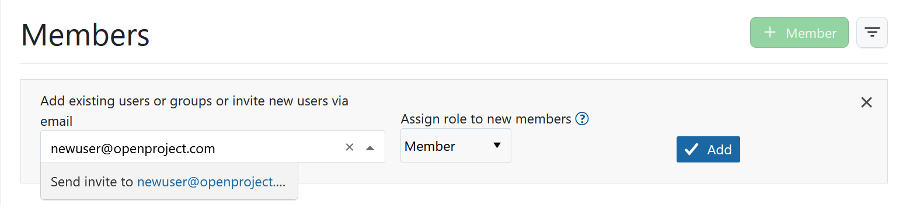
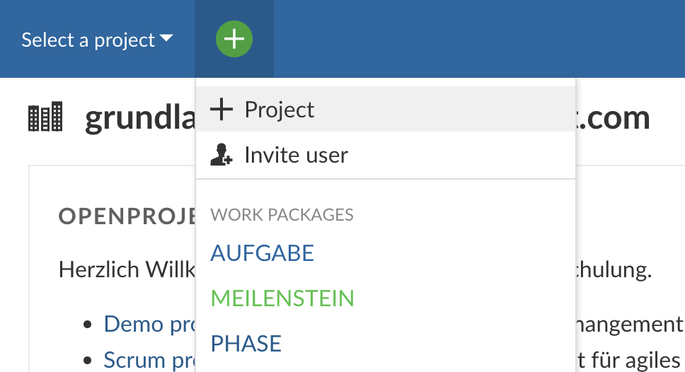
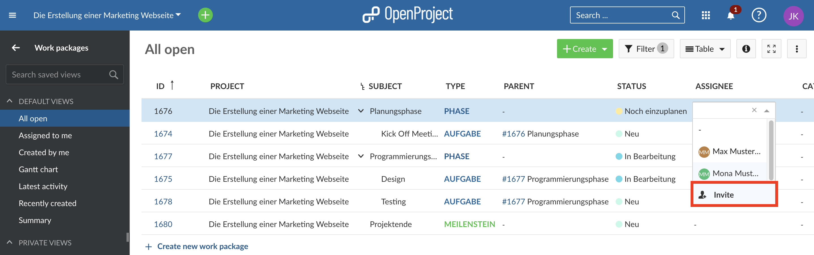

---
sidebar_navigation:
  title: Invite members
  priority: 800
description: Invite team members to OpenProject.
keywords: invite members, add users
---

# Invite members

In order to see a project and work in it, you have to be a member of a project. Therefore, you have to **add team members to a project**.

**Member** is defined as a project member in a project. Project members are added in the Members module in the project menu.

> **Note**: If you are not a member of a project, you do not see the project in the Project selection nor in the project list.

| Topic                                                        | Content                                                      |
| ------------------------------------------------------------ | ------------------------------------------------------------ |
| [View members](#view-members)                                | View the list of members in your project.                    |
| [Add existing users](#add-existing-users)                    | Add existing users, groups or placeholder users to a project. |
| [Invite new members](#invite-new-members)                    | Invite new users to join a project in OpenProject.           |
| [Groups as project members](#behavior-of-groups-as-project-members) | Understand the effects of adding groups as project members.  |
| [Placeholder users as project members](#behavior-of-placeholder-users-as-project-members) | Understand how to differentiate between regular users and placeholder users. |

<video src="https://openproject-docs.s3.eu-central-1.amazonaws.com/videos/OpenProject-Invite-and-Manage-Members.mp4" type="video/mp4" controls="" style="width:100%"></video>

## View members

To view the list of **all project members and their roles** in the project, select Members in the project menu on the left side. It will open a list of all the project members, including groups and external users, that work packages have been shared with.  

You can use both filters in the left hand menu, as well as the filter options next to the **+ Member** button.

Please also refer to [Members module guide](../../user-guide/members).

## Add existing users

To add existing users, [placeholder users](../../system-admin-guide/users-permissions/placeholder-users) or groups to a project, [select the project](../projects/#open-an-existing-project) for which you want to add members. In the project menu on the left, select the **Members** module.

In the [members list](#view-members) you will get an overview of the current members of this project.

Click the green **+ Member** button in the top right corner.

Type the name of the user, placeholder user or group which you want to add. You can also choose several members at once. **Assign a role** to the new member(s) and click the blue **Add** button.

Please note that you will have to click on the new member's name or press the Enter key before clicking the Add button.

## Invite new members

You can also invite users who do not have an OpenProject account, yet. There are different ways to do it.

**Invite in members module**

[Select the project](../projects/#open-an-existing-project) for which you want to add members. In the project menu on the left, select the **Members** module.

Type in the email address of the new member. If OpenProject does not find an existing user, the **Invite** information will automatically be put before the email address. Press the Enter key or select the text "Invite ...". Assign a role to this new member and click the blue **Add** button.

An email invitation will be sent out to the user with a link to [create an account](../sign-in-registration/#create-a-new-account) for OpenProject.

**Invite from header**

In the header menu that is always present, you find a green button that allows you to create projects, work packages and invite users from wherever in the application you are.

Once you clicked the **Invite user**, a dialogue will open. Here you can select the project, to which you want to invite new members and which roles they get.

**Invite within a work package**

When you are working in the work package table, you can also invite users from there. For example when you want to set an assignee for a work package that has not got access to OpenProject yet, you can select the Invite option from the drop down menu. The same applies to the column Accountable or custom fields for your project.

You can now collaborate with your team in OpenProject. Newly invited users will be shown with a letter symbol next to their name.

> Please note that removing a member who has not accepted the invite from a project yet will lead to the deletion of this user, which can't be reversed.

## Behavior of groups as project members

Groups have the following impact on a project members list and behave slightly different than individual users:

- the group name is shown as a separate line on the project members list
- the group members cannot be removed from the members list individually (no delete icon)
- adding a group with members who are already in a project member list will add the group's role to their (the members') project roles
- a project member belonging to a group can have additional roles added individually
- the group's role cannot be changed for individual group members

Find out more about the management of groups [here](../../system-admin-guide/users-permissions/groups/).

## Behavior of placeholder users as project members

Placeholder will look slightly different from regular users in a project member list:

- will be shown without email address
- can't be part of a group, i.e. they will be shown without group affiliation
