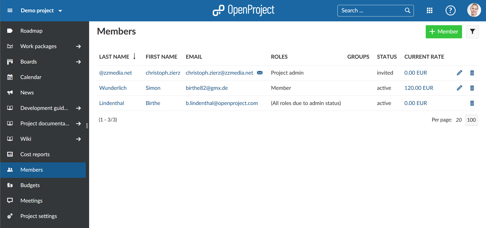
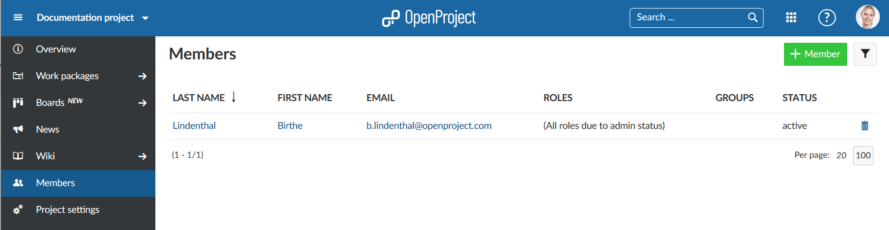

---
sidebar_navigation:
  title: Invite members
  priority: 800
description: Invite team members to OpenProject.
robots: index, follow
keywords: invite members
---

# Invite members

In order to see a project and work in it, you have to be a member of a project. Therefore, you have to **add team members to a project**.

**Member** is defined as a project member in a project. Project members are added in the members tab in the project settings.

**Note**: If you are not a member of a project, you do not see the project in the Project selection nor in the project list.

| Feature                                       | Documentation for                               |
| --------------------------------------------- | ----------------------------------------------- |
| [View members](#view-members)                 | View the list of members in your project.       |
| [Add existing members](#add-existing-members) | Add existing members to a project.              |
| [Invite new members](#invite-new-members)      | Invite new members to a project in OpenProject. |

## View members

To view the list of **all project members and their roles** in the project, select Members in the project menu.

## Add existing members

To add existing users to a project, [select the project](../projects/#select-a-project) where you want to add members. In the project menu on the left, select the **Members** menu item.

In the Members list you will get an overview of the current members of this project.

Click the green **+ Member** button in the top right corner.

Type the name of the team member which you want to add. You can also choose several members at once. **Assign a role** to the new member(s) and click the blue **Add** button.

 

## Invite new members

You can also invite new members who have not yet an OpenProject account. [Select the project](../projects/#select-a-project) where you want to add members. In the project menu on the left, select the **Members** menu item.

Type in the email address of the new member. If OpenProject does not find an existing user, the **Invite** information will automatically be put before the email address. Assign a role to this new member and click the blue **Add** button.

An e-mail invitation will be sent out to the user with a link to [create an account](#create-a-new-account) for OpenProject.

You can now collaborate with your team in OpenProject.

