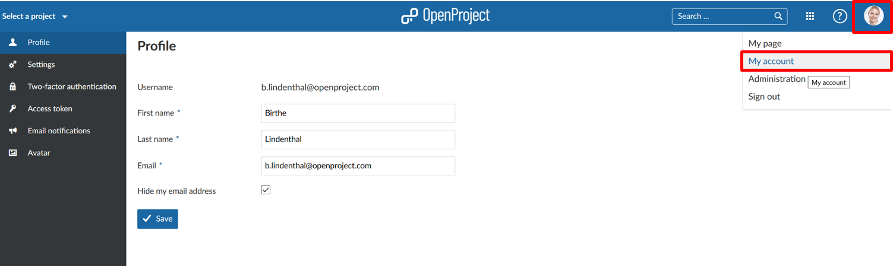
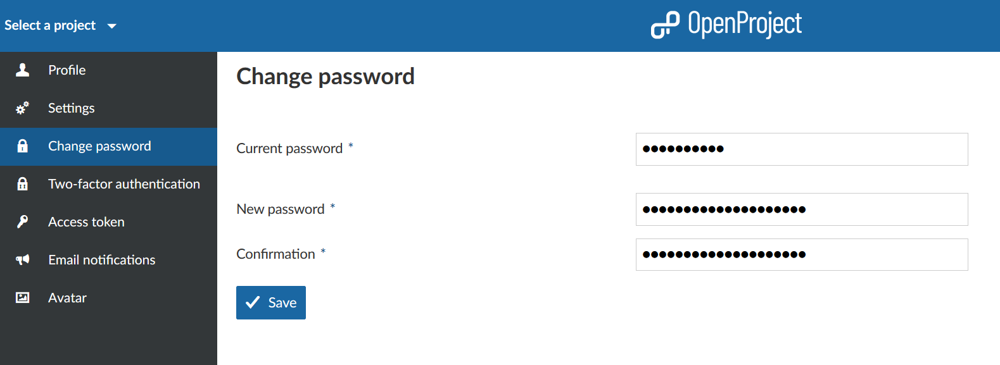
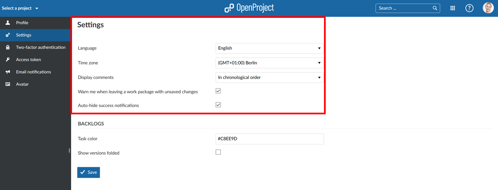
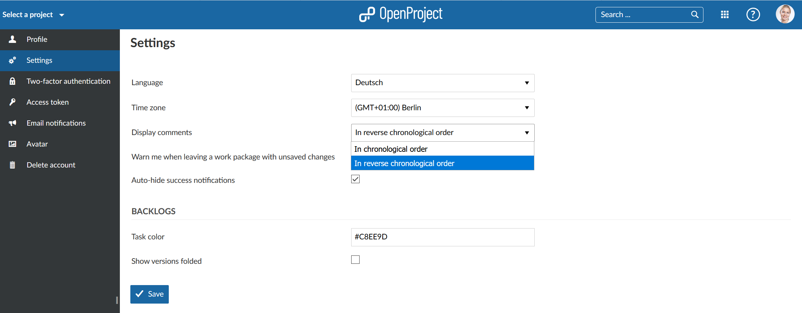
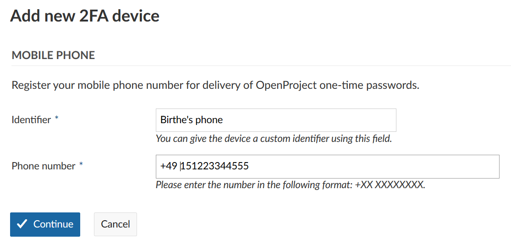
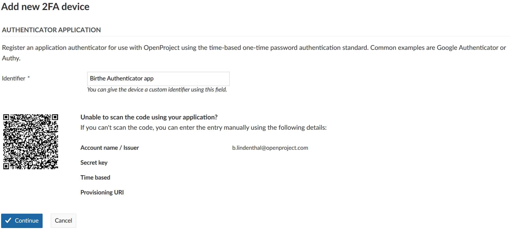
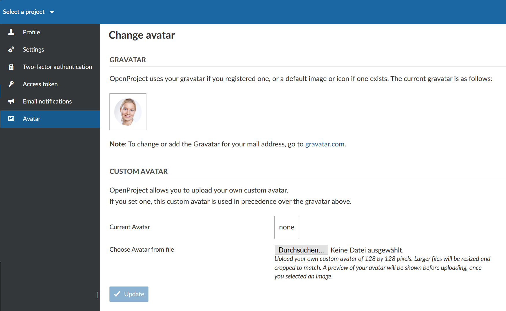
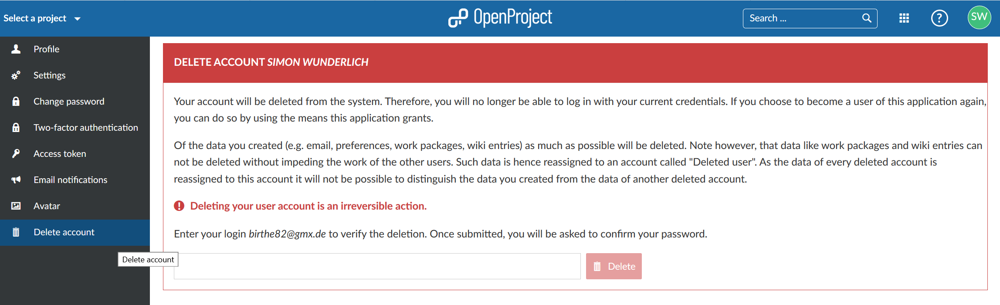

---
sidebar_navigation:
  title: My Account
  priority: 400
description: Learn how to configure account settings.
robots: index, follow
keywords: my account, account settings
---

# My Account

Change your personal settings in My Account. Here you can adapt, e.g. the language, edit notifications, or add an avatar.

| Feature                                                      | Documentation for                                            |
| ------------------------------------------------------------ | ------------------------------------------------------------ |
| [Open My Account settings](#open-my-account-settings)        | How to open your personal settings in OpenProject?           |
| [Change password](#change-password)                          | How to change my password?                                   |
| [Edit your user information](#edit-your-user-information)    | How to change the name or email address in OpenProject?      |
| [Profile settings: change your language, time zone or display of comments](#profile-settings:-change-your-language,-time-zone-or-display-of-comments) | How to change the language, time zone or display of comments in OpenProject? |
| [Two-factor authentication](#two-factor-authentication-premium-feature) | How to set up a two-factor authentication?                   |
| [Email notifications](#email-notifications)                  | How to change email notifications sent by OpenProject?       |
| [Set an Avatar](#set-an-avatar)                              | How to set an Avatar in OpenProject and change the profile picture? |
| [Delete account](#delete-account)                            | How to delete my own account?                                |

## Open My Account settings

To open your personal settings in OpenProject, click on your user icon in the top right corner in the header of the application.

Choose **My account**.

## Change password

In order to reset your password, navigate to the My Account section and choose **Change passwor**d in the menu.

Enter your current password.

Enter your new password and confirm it a second time.

Press the blue **Save** button in order to confirm the password changes.

Note: You cannot reset your Google password in OpenProject. If you authenticate with a Google/Gmail account, please go to your Google account administration in order to change your password.

## Edit your user information

To change your email address or your name, navigate to the **Profile** page in the menu of your My account settings.

Here you can adapt the information and **save** your changes with the blue button.

## Profile settings

Within the My account settings you can change the language of OpenProject, adapt the time zone and change the order how comments are displayed in the Acitivity list for work packages.

Also, you can activate a **warning if you are leaving a work package with unsaved changes**.

Additionally, you can activate to **auto-hide success notifcations** from the system.

### Change your language

To change the language in OpenProject, navigate to the **My account** settings and choose the menu point **Settings**.

Here you can choose between multiple languages.

OpenProject is translated to more than 30 languages. If you do not see your preferred language in the My account settings, the language needs to be activated by your system administrator in the [system's settings](../../system-admin-guide/).

Press the blue **Save** button will save your changes.

If you want to help us to add further languages, you can contribute to the CrowdIn translations project [here](https://crowdin.com/project/openproject).

### Change your time zone

You can choose a Time zone in which you work and how the comments and changes will be saved.

Press the blue **Save** button will save your changes.

### Change the order to display comments

You can select the order of the comments (for example of the comments for a work package which appear in the Activity tab). You can select the **chronological** or **reverse chronological order** to display the comments.

If you choose reverse chronological order you will have the latest comment on top in the Activity list.

## Two-factor authentication (Premium feature)

In order to activate the two-factor authentication for your OpenProject installation, navigate to your **My account** and choose the **Two-factor authentication** in the menu. 

In order to register a new device for two-factor authentication, lick the green button to add **new 2FA device**.

You can either use your mobile phone number to receive the second factor via SMS.

Or you can register to use an app-based authenticator, such as Google Authenticator or Authy.

### Register your mobile phone number for delivery of OpenProject one-time passwords.

To register your phone number to receive a one time password via SMS, click on the **Register device** button under the **Use your mobile phone** section.

- Choose an identifier how you want your phone to be named.
- Enter your phone number in the following format.

Press the blue **Continue** button to confirm your device.

### Backup codes

If you are unable to access your two-factor devices, you can use a backup code to regain access to your account. Use the grey button **Generate backup codes** to generate a new set of backup codes.

If you have created backup codes before, they will be invalidated and will no longer work. 

### Use your app-based authenticator

Register an application authenticator for use with OpenProject using the time-based one-time password authentication standard. Common examples are Google Authenticator or Authy.

Click the grey **Register device** button to register an authentication app. Open your app and follow the instructions to add a new application. The easiest way is to scan the barcode. Otherwise, you can register the application manually by entering the displayed details.

Click the blue **Continue** button to finish the registration.

## Email notifications

To configure the email notifications which you will receive from the system, navigate to **My account** and choose **Email notifications** in the menu.

You can choose between several email notifications. 
**Default: Send email notifications Only for things I watch or I'm involved in.**

You can choose to receive emails for any events in certain projects or for no events at all.

The following options are available for the email notifications (ranging from receiving emails on a lot of events to receiving no emails at all):

- **For any event on all my projects** – When selecting this option you receive an email for any action in the projects you are a member of (independent of whether or not you are involved in this  action). This can be useful for managers who want to always stay up to date of all developments without having to log into OpenProject. This  setting will typically lead to receiving a lot of emails.
- **For any event on the selected projects only** – This option lets you choose the projects for which you receive all email updates. In addition, you receive email notifications from other  projects about activities you watch or are involved in (e.g. when you  are the author, assignee or responsible of a work package.). This is  useful for project managers who need to be informed about any change in the project(s) they manage but who want to only receive email notifications from other projects if the activities directly affect  them.
- **Only for things I watch or I’m involved in** – This is the default option for new users (unless configured differently in the [administration (email notification settings)](https://www.openproject.org/help/system-settings/email-notification-settings/)).  Users with this setting receive emails for activities in which they are  involved (e.g. if they watch an activity, are the author, assignee or  responsible). This option is usually the best option since users only get email updates about activities in which they are involved therefore  reducing the number of emails they receive.
- **Only for things I am assigned to** – With this email setting you only receive email updates of activities to which you are  assigned (e.g. work packages). This is useful for users who want to only  be notified via email if they are actively working on a task, not if  they are responsible for or watching the activity.
- **Only for things I am the owner of** – When you select this setting you only receive email updates for activities which you created (e.g. work packages, wiki pages). This makes sense if you are  not actively involved in a project but want to only be notified if your  activities are updated.
- **No event** – With this setting you receive no emails at all. You need to log into OpenProject to verify the status of your tasks. Unless you check the status within OpenProject very frequently or  are not actively involved in any project this setting is typically too  restrictive.

By default you do not receive any email notifications about your own changes. If you want to receive emails for your own changes (e.g. to  make sure you that emails for changes you made have been sent), activate  the checkbox **I want to be notified of changes that I make myself**.

## Set an Avatar

To change your profile picture in OpenProject you can set an Avatar in your My account settings. Navigate to **Avatar** in the menu.

OpenProject uses Gravatar as default profile image. It displays a preview of your Avatar.

Also, you can upload a **Custom Avatar** by choosing a Avatar to be uploaded from a file. Press the blue **Update** button to change your profile picture.

Note: The optimum size to upload a new profile picture is 128 by 128 pixel. Larger files will be cropped.

# Delete account

You can delete your own account in **My account**.

If you cannot see the entry **Delete account** in the **My account** side menu, make sure the option “Users allowed to delete their account” is [activated in the administration](../../system-admin-guide/users-permissions).

To delete your account, select **Delete account** from the side menu and enter your login to confirm the deletion.

Important: Deleting a user account is permanent and cannot be reversed.

