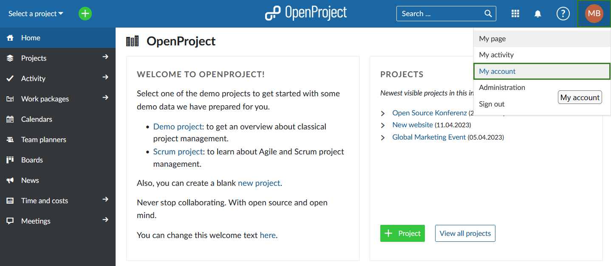

---
sidebar_navigation:
  title: My account
  priority: 400
description: Learn how to configure account settings.
keywords: my account, account settings, change language
---

# My account

Under My account, you can change your personal settings, such as the language, edit notifications, or add an avatar. Moreover you can manage access tokens and sessions.

To open your personal settings in OpenProject, click on your user icon in the top right corner in the header of the application and choose **My account**.

For more details please take a look at [My account section of OpenProject user guide](../../user-guide/my-account).

