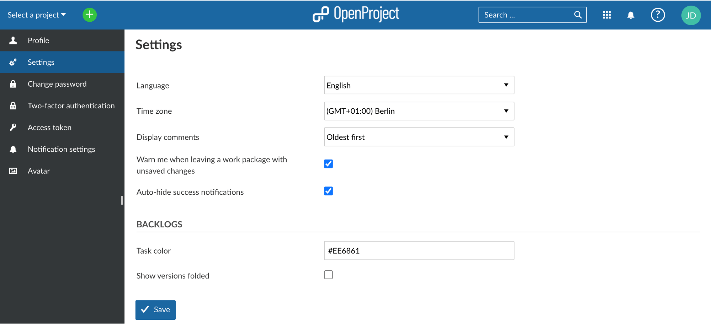
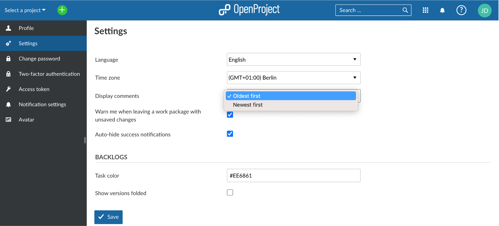
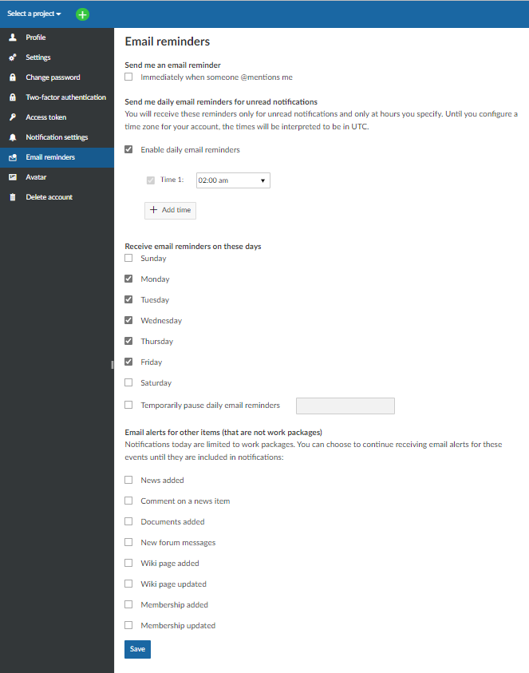

---
sidebar_navigation:
  title: My account
  priority: 400
description: Learn how to configure account settings.
robots: index, follow
keywords: my account, account settings, change language, Deutsch
---

# My account

Change your personal settings in My account. Here you can adapt, e.g. the language, edit notifications, or add an avatar.

| Topic                                                        | Content                                                      |
| ------------------------------------------------------------ | ------------------------------------------------------------ |
| [Open My account settings](#open-my-account-settings)        | How to open your personal settings in OpenProject            |
| [Change password](#change-password)                          | How to change my password                                    |
| [Edit your user information](#edit-your-user-information)    | How to change the name or email address in OpenProject       |
| [Profile settings: change your language, time zone or display of comments](#profile-settings) | How to change the language, time zone or display of comments in OpenProject |
| [Two-factor authentication](#two-factor-authentication-premium-feature) | How to set up a two-factor authentication         |
| [Notifications settings](#notifications settings)            | How to change in-app notifications in OpenProject            |
| [Email reminders](#email-reminders)                          | How to change email reminders sent by OpenProject            |
| [Set an Avatar](#set-an-avatar)                              | How to set an avatar in OpenProject and change the profile picture |
| [Delete account](#delete-account)                            | How to delete my own account                                 |

## Open My account settings

To open your personal settings in OpenProject, click on your user icon in the top right corner in the header of the application.

Choose **My account**.

## Change password

In order to reset your password, navigate to the My account section and choose **Change password** in the menu.

Enter your current password.

Enter your new password and confirm it a second time.

Press the blue **Save** button in order to confirm the password changes.

Note: You cannot reset your Google password in OpenProject. If you authenticate with a Google/Gmail account, please go to your Google account administration in order to change your password.

## Edit your user information

To change your email address or your name, navigate to the **Profile** page in the menu of your My account settings.

Here you can adapt the information and **save** your changes with the blue button.

## Profile settings

Within the My account settings you can change the language of OpenProject, adapt the time zone and change the order how comments are displayed in the Activity list for work packages.

Also, you can activate a **warning if you are leaving a work package with unsaved changes**.

Additionally, you can activate to **auto-hide success notifications** from the system. This (only) means that the green pop-up success notifications will be removed automatically after five seconds.

### Change your language

To change the language in OpenProject, navigate to the **My account** settings and choose the menu point **Settings**.

Here you can choose between multiple languages.

OpenProject is translated to more than 30 languages, like German, Chinese, French, Italian, Korean, Latvian, Lithuanian, Polish, Portuguese, Russian, Spanish, Turkish and many more. If you do not see your preferred language in the My account settings, the language needs to be activated by your system administrator in the [system's settings](../../system-admin-guide/system-settings/display-settings).

Pressing the blue **Save** button will save your changes.

If you want to help us to add further languages or to add the translations in your language, you can contribute to the CrowdIn translations project [here](https://crowdin.com/project/openproject).

### Change your time zone

You can choose a time zone in which you work and how the comments and changes will be saved.

Pressing the blue **Save** button will save your changes.

### Change the order to display comments

You can select the order of the comments (for example of the comments for a work package which appear in the Activity tab). You can select the **oldest first** or **newest first** to display the comments.

If you choose newest first the latest comment will appear on top in the Activity list.

### Backlogs settings

There are two personal settings available for the [Backlogs module](../../user-guide/backlogs-scrum):
**Task color**: Here you can enter the color in which your tasks on the task board (on the Backlogs page) are displayed. Tasks on the task board are color-coded based on who they are assigned to. Every user has a default color assigned but if you prefer a different color, you can change it here.
**Show versions folded**: When you navigate to the "Backlogs" module in a project, the available versions (e.g. Product backlog, Sprints) are displayed. By default they are expanded, i.e. all work packages included in those versions are shown right away. If you have a large number of versions that are shown on the "Backlogs" page, you may opt to collapse them by default. This way you see all the versions on a page and can then choose to expand those versions for which you want to see details.

## Two-factor authentication (Premium feature)

In order to activate the two-factor authentication for your OpenProject installation, navigate to your **My account** and choose the **Two-factor authentication** in the menu.

In order to register a new device for two-factor authentication, lick the green button to add a **new 2FA device**.

You can either use your mobile phone number to receive the second factor via SMS. Or you can register to use an app-based authenticator, such as Google Authenticator or Authy.

### Register your mobile phone number for delivery of OpenProject one-time passwords.

To register your phone number to receive a one time password via SMS, click on the **Register device** button under the **Use your mobile phone** section.

- Choose an identifier how you want your phone to be named.
- Enter your phone number in the following format.

Press the blue **Continue** button to confirm your device.

### Backup codes

If you are unable to access your two-factor devices, you can use a backup code to regain access to your account. Use the grey button **Generate backup codes** to generate a new set of backup codes.

If you have created backup codes before, they will be invalidated and will no longer work.

### Use your app-based authenticator

Register an application authenticator for use with OpenProject using the time-based one-time password authentication standard. Common examples are Google Authenticator or Authy.

Click the grey **Register device** button to register an authentication app. Open your app and follow the instructions to add a new application. The easiest way is to scan the barcode. Otherwise, you can register the application manually by entering the displayed details.

Click the blue **Continue** button to finish the registration.

## Notifications settings

**My account > Notification settings**

In-app notifications can be configured and customized various ways. For a detailed guide, [click here](../../user-guide/notifications/notification-settings).

Please also see our detailed [in-app notifications](../../user-guide/notifications) guide to gain a general understanding.

## Email reminders

**My account > Email reminders**

To configure the email reminders which you receive from the system, navigate to **My account** and choose **Email reminders** in the menu. Your system administrator can also set them for you or change the global default settings.

You can choose between several email reminders. 

Default: Enable daily email reminders: 2am, Monday - Friday.

You can choose to receive emails immediately, or only on certain days and times, temporarily pause reminder emails, or opt for no reminders at all. 

You can also opt-in to receive **email alerts for other items (that are not work packages)** whenever one of your project members:

- **News added** - ...adds or updates news in the [News Page](../../user-guide/news)
- **Comment on a news item** - ...adds a comment on a news item
- **Documents added** - ...adds a document somewhere in the project (i.e. a work package)
- **New forum message** - ...sends a new message into the [forum](../../user-guide/forums/)
- **Wiki page added** - ...adds a new [Wiki page](../../user-guide/wiki)
- **Wiki page updated** - ...updates a [Wiki page](../../user-guide/wiki)
- **Membership added** - ...adds you to a new work package
- **Membership updates** - ...updates your membership associations

## Set an avatar

To change your profile picture in OpenProject you can set an avatar in your My account settings. Navigate to **Avatar** in the menu.

OpenProject uses Gravatar as default profile image. It displays a preview of your avatar.

Also, you can upload a **Custom Avatar** by choosing a Avatar to be uploaded from a file. Press the blue **Update** button to change your profile picture.

Note: The optimum size to upload a new profile picture is 128 by 128 pixel. Larger files will be cropped.

# Delete account

You can delete your own account in **My account**.

If you cannot see the entry **Delete account** in the **My account** side menu, make sure the option "Users allowed to delete their account" is [activated in the administration](../../system-admin-guide/users-permissions/settings/#user-deletion).

To delete your account, select **Delete account** from the side menu and enter your login to confirm the deletion.

Important: Deleting a user account is permanent and cannot be reversed.

