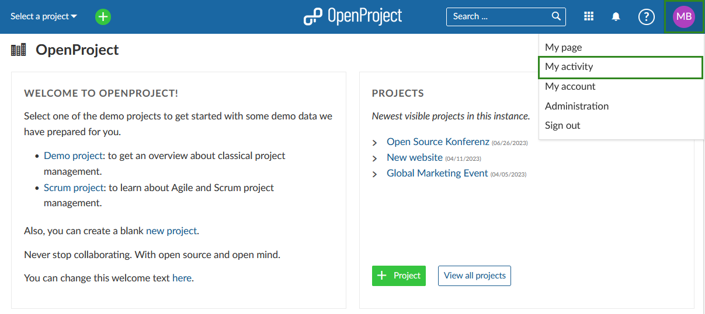
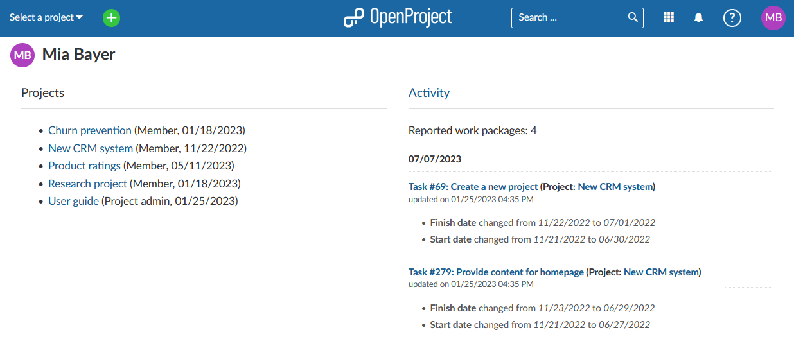

---
sidebar_navigation:
  title: My Activity
  priority: 200
description: My Activity in OpenProject - your latest actions
keywords: my activity, personal changes, dashboard
---

# My Activity

**My Activity** gives you an overview of all your latest actions and projects you are involved in.

You can open your **My Activity** page by clicking on your user avatar in the upper right corner and then selecting **My Activity** from the dropdown menu.

You will see two lists by default.

**Projects** will show all projects you are a member of.

**Activity** will show all of your activities that are being recorded in OpenProject.

>Please note that only activities from projects that have the **Activity** module enabled will be shown.

