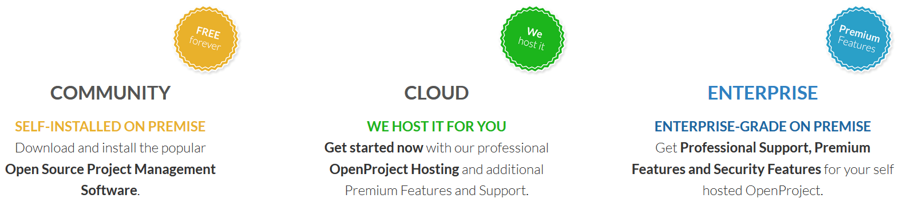

---
sidebar_navigation:
  title: Introduction to OpenProject
  priority: 999
description: Get and introduction to OpenProject.
robots: index, follow
keywords: OpenProject introduction
---
# Introduction to OpenProject

Welcome to OpenProject! We are glad to have you here. In this section we will cover an introduction to project management with OpenProject as well as general topics regarding OpenProject.

## Overview

| Popular Topics                                               | Description                                                  |
| ------------------------------------------------------------ | :----------------------------------------------------------- |
| [About OpenProject](#about-openproject)                      | What is OpenProject?                                         |
| [First steps to get started](#first-steps-to-get-started)    | The first steps to get started with OpenProject.             |
| [The entire Project Management Life-Cycle](#the-entire-project-management-life-cycle) | Find out more how OpenProject supports the different project phases. |
| [OpenProject products](#openproject-products)                | What is the difference between the Community, Cloud and Enterprise Edition? |

## About OpenProject

OpenProject is free and **open source software** for **classical as well as agile project management** to support your team along [the entire project life-cycle](#the-entire-project-management-life-cycle). OpenProject is available in more than 30 languages.

OpenProject is licensed under **GNU GPL V3**. The source code is freely published on [GitHub](https://github.com/opf/openproject). We understand free as in free speech. We do offer [paid subscriptions](#openproject-products) for our software.

OpenProject exists since 2011 and is a fork of the deprecated ChiliProject which was a fork of Redmine.

## First steps to get started

To get started with OpenProject, there are a few easy steps to follow:

1. [Get an account and sign in](#sign-in-and-registration)
2. [Create a new project](#projects)
3. [Invite team members to collaborate](#invite-members)
4. [Create work packages](#create-work-package)
5. [Set up a project plan](#gantt-chart-introduction)

## The entire Project Management Life-Cycle

OpenProject offers a full feature set to **support project teams along the entire project management process:**

OpenProject enables project collaboration and communication without system interruption from the initial project idea until project closure and documentation.

The following sections provide links to the documentation for each project phase:

| Project phase                                                | Documentation for                                            |
| ------------------------------------------------------------ | ------------------------------------------------------------ |
| [Project concept and initiation](#project-concept-and-initiation) | Collect ideas and specify project scope and deliverables:  set up a project, document initial ideas, project description, invite members. |
| [Project definition and planning](#project-definition-and-planning) | Create a project overview with detailed information, set up a project plan, create your roadmap. |
| [Project launch or execution](#project-launch-or-execution)  | Manage all project activities, such as tasks, deliverables, risks, features, bugs, change requests. Use agile boards with your teams, document meetings, share news. |
| [Project performance and control](#project-performance-and-control) | Create and manage project budgets, track and evaluate time and costs. Have custom reports for accurate, current insight into project performance and allocated resources. |
| [Project close](#project-close)                              | Document project achievements, lessons learned, best practices and easily summarize the main results of a project. Archive projects for later reference and lessons learned. |

### Project concept and initiation

OpenProject supports the initial set-up and configuration of a project structure.

| Features                   | Documentation for                                            |
| -------------------------- | ------------------------------------------------------------ |
| Create a new project       | Create and set up a new project in OpenProject.              |
| Set up a project structure | Create a project hierarchy to structure your work in OpenProject. |
| Document ideas             | Create first ideas, tasks, rough milestones.                 |
| Project description        | Describe the goal and the way to reach them for your project. |
| Invite members             | Invite your team to collaborate in OpenProject.              |

### Project definition and planning

Create a project overview with more detailed information, set up your project plan, structure your work, create a roadmap.

| Features            | Documentation for                                            |
| ------------------- | ------------------------------------------------------------ |
| Project overview    | Create a project overview with important project information. |
| Project plan        | Set up a project timeline.                                   |
| Structure your work | Create work packages and structure your work                 |
| Roadmap planning    | Create a roadmap for your project.                           |

### Project launch or execution

Manage all project activities, such as tasks, deliverables, risks, features, bugs, change requests in the work packages. Use agile boards with your teams. Document meetings, share news.

| Features      | Documentation for                                            |
| ------------- | ------------------------------------------------------------ |
| Work packages | Create and manage all project deliverables, tasks, features, risks, and more. |
| Boards        | Manage your work with an Agile approach in the flexible boards view. |
| Meetings      | Plan and document your project meetings and share minutes with all your team. |
| News          | Share project news with your team.                           |
| Wiki          | Document all important project information and keep it up to date with your team. |

### Project performance and control

Create and manage project budgets, track and evaluate time and costs. Have custom reports for accurate, current insight into project performance and allocated resources.

| Features                | Documentation for                                            |
| ----------------------- | ------------------------------------------------------------ |
| Dashboard               | Visualize your progress within a project or project overarching (coming soon). |
| Budgets                 | Create and manage budgets in your project.                   |
| Time tracking           | Track time for any work within your project.                 |
| Track unit costs        | Track unit costs for your project.                           |
| Time and cost reporting | Have accurate detailed reports of current spent time and costs within your project. |

### Project close

Document project achievements, lessons learned, best practices and easily summarize the main results of a project. Archive projects for later reference and lessons learned.

| Features        | Documentation for                                            |
| --------------- | ------------------------------------------------------------ |
| Wiki            | Document all relevant project information, lessons learned, best practices, results, and more. |
| Project archive | Archive your project for further reference and documentation. |

## OpenProject products

###  What is the differences between the Community, Cloud and Enterprise Edition?

OpenProject can be used in three different Editions, either on-premise or as software-as-a-service.

* [Community Edition](https://www.openproject.org/download-and-installation/): self-installed on-premise.
* [Cloud Edition](https://www.openproject.org/hosting/): we host it, incl. premium features and support.
* [Enterprise Edition](https://www.openproject.org/enterprise-edition/): self-hosted version, incl. premium features and support.

To compare the features side by side, please visit our [Feature Comparison](https://www.openproject.org/pricing/#features) page.
