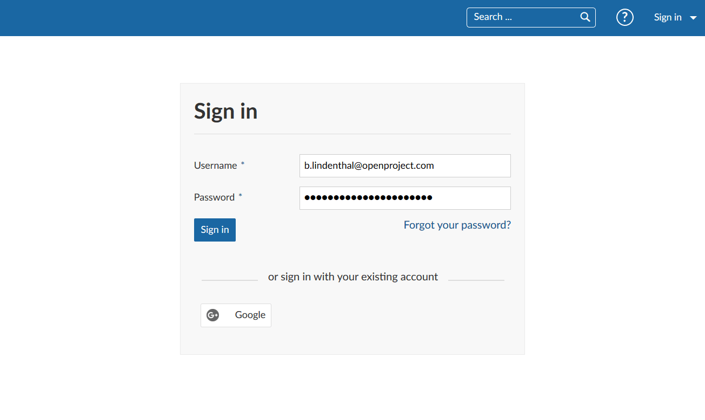
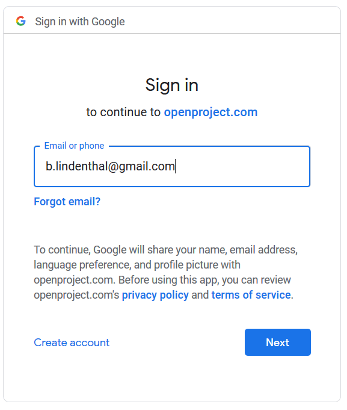
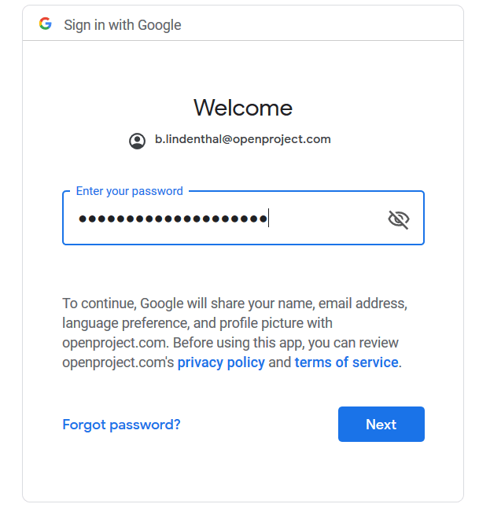
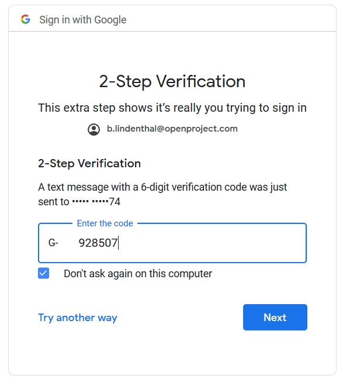
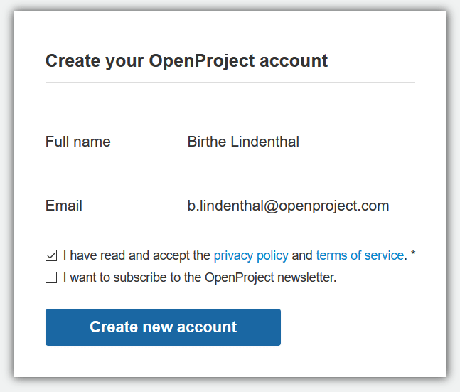
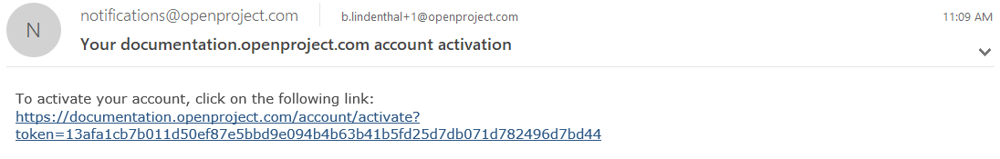
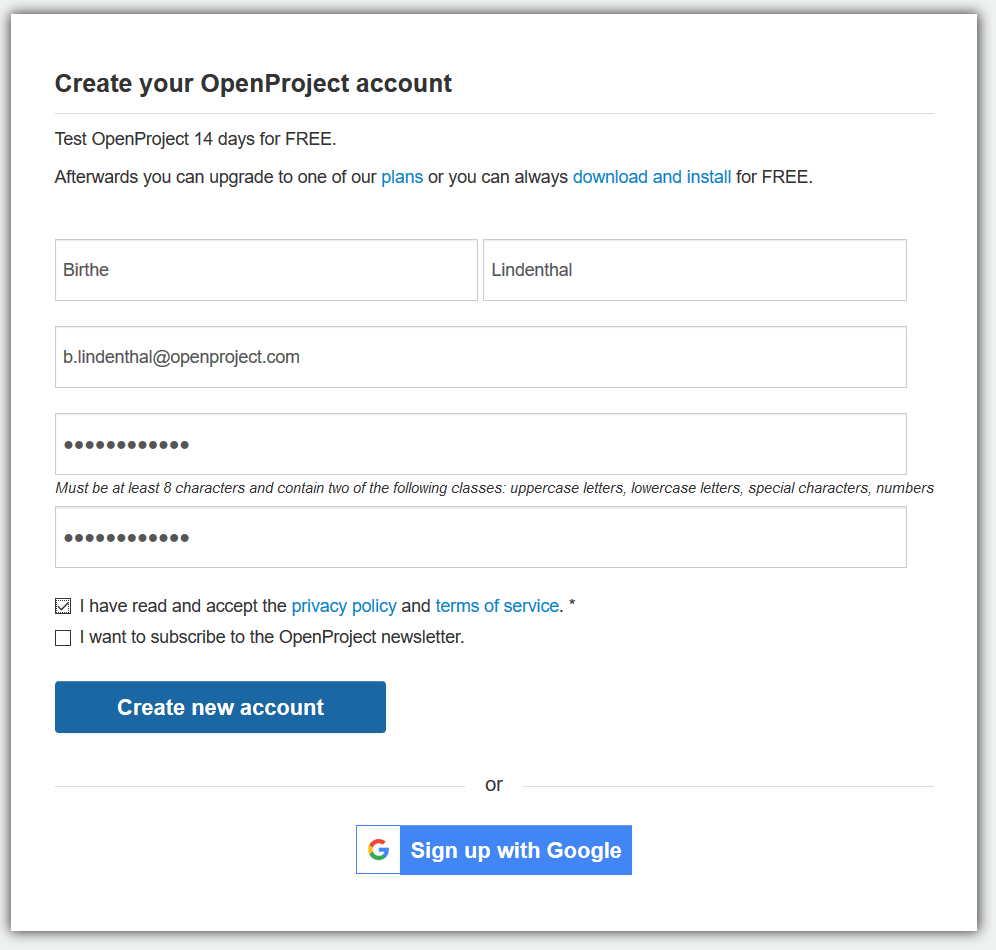
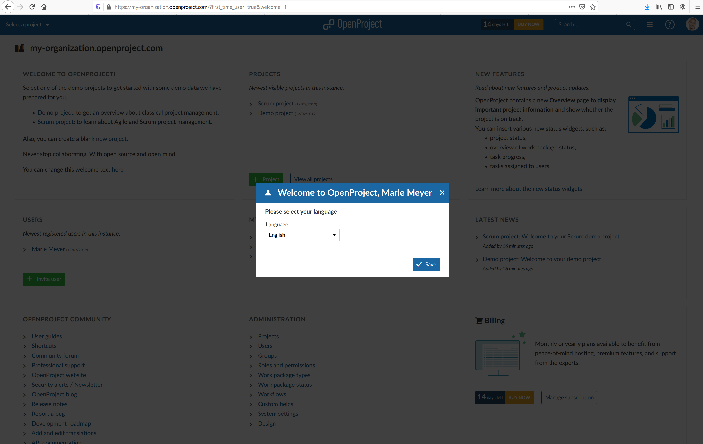
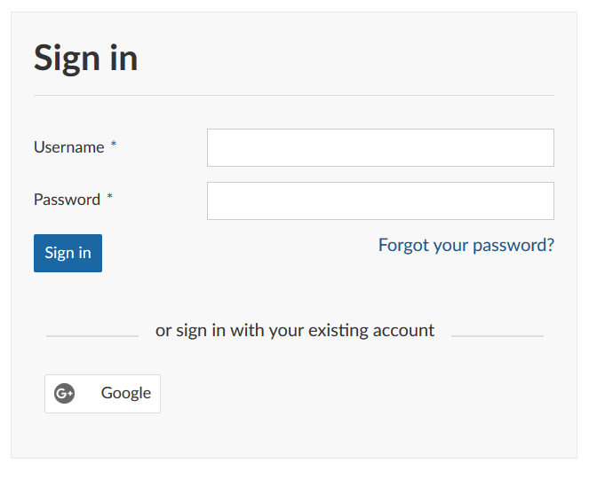
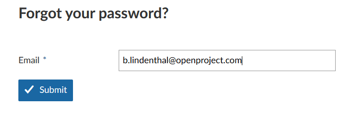

---
sidebar_navigation:
  title: Sign in and registration
  priority: 990
description: Sign in and registration in OpenProject.
robots: index, follow
keywords: sing in, login, registration
---
# Sign in and registration

Here you will get an overview how to sign in and register to an existing OpenProject installation.

**Note**: If you do not have an OpenProject installation yet, please visit our site: [create an OpenProject trial installation](../../cloud-edition-guide/#create-an-openproject-trial-installation).

| Feature                                                      | Documentation for                                            |
| ------------------------------------------------------------ | ------------------------------------------------------------ |
| [Sign in with an existing account](#sign-in-with-an-existing-account) | Sign in with an existing account to an OpenProject installation. |
| [Sign in with Google](#sign-in-with-google)                  | Find out how to sign in with a Google account.               |
| [Sign in from the OpenProject website](#sign-in-from-the-openproject-website) | Sign in to an existing OpenProject Cloud Edition from the website. |
| [Create a new account](#create-a-new-account)                | Create a new account for OpenProject.                        |
| [Choose your language](#choose-your-language)                | How to select your language in OpenProject?                  |
| [Reset your password](#reset-your-password)                  | If you forgot your password find out how to reset it.        |

<iframe width="560" height="315" src="https://www.youtube.com/embed/JO-ugpygx68" frameborder="0" allow="accelerometer; autoplay; encrypted-media; gyroscope; picture-in-picture" allowfullscreen></iframe>

## Sign in with an existing account

To sign in to an OpenProject installation with an existing account, please enter the URL of your OpenProject in a modern browser, e.g. documentation.openproject.com.

Type in your user name and password in the respective fields and click the blue Sign in button. You will then be signed in to your OpenProject environment.

## Sign in with a Google account

Enterprise Edition and Cloud Edition customers can sign in with OpenID Connect, using their Google account. To sign in just click the Google button below the sign in form.

Please enter your email and click the blue Next button.

Enter you password and click the blue Next button.

If you have activated Two-factor authentication, please enter your second factor and click the blue Next button.

Then, you are asked to create your OpenProject Account.

## Sign in from the OpenProject website

If you are using the OpenProject Cloud Edition, you can sign in to your installation directly from the OpenProject website.

Please follow the [instructions in our Cloud Edition guide](../../cloud-edition-guide/#sign-in).

## Create a new account

If you have been invited via email to an OpenProject installation, or if you have set up your own OpenProject (trial) installation, you are asked to create a new account in the system.

Please click the link in the invitation email:

Enter the following information:

* First name
* Last name
* Company E-Mail address
* Choose a password

Please confirm the Privacy policy and terms of service and click the blue **Create new account** button.

Make sure to remember your password in order to sign-in again at a later point.

## Choose your language

After the creation of your account you are logged into the system. You will then be asked to set your language in the system. Please choose your preferred language from the drop-down list.

**Note**: OpenProject is available in more than 30 languages. If you do not find your preferred language, it first needs to be activated in the system's administration. Please talk to your system administrator so set up the language.

If you have already logged in before, you can [set your language in your user profile](../my-account/#profile-settings:-change-your-language,-time-zone-or-display-of-comments).

## Reset your password

If you forgot your password, you can reset your password by clicking the blue **Forgot your password** link directly below the Sign in field.

You are then asked to enter you email address with which you have registered to OpenProject. 

You will then receive an email with a link to reset your password.

**Note**: If you have [signed-in with a Google account](#sign-in-with-a-google-account), your are not able to reset your password at this point.

## Frequently asked questions (FAQ)

### Is it possible to use multiple languages in OpenProject?

Yes, it is possible to use OpenProject in multiple languages. We support English, German, French and a number of additional languages. Each user can select their own preferred language by signing into OpenProject, clicking on the user avatar on the upper right side and selecting "My account" from the dropdown menu.
You can then select "Settings" from the side menu on the left side and [change the language](../my-account/#change-your-language).
