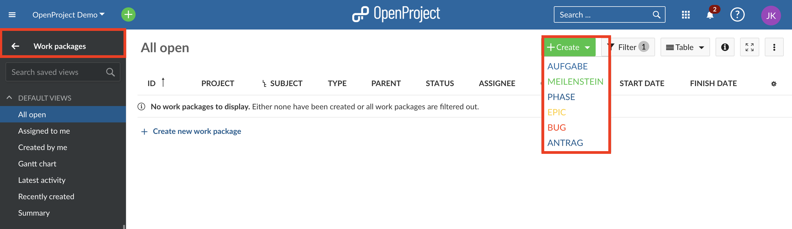
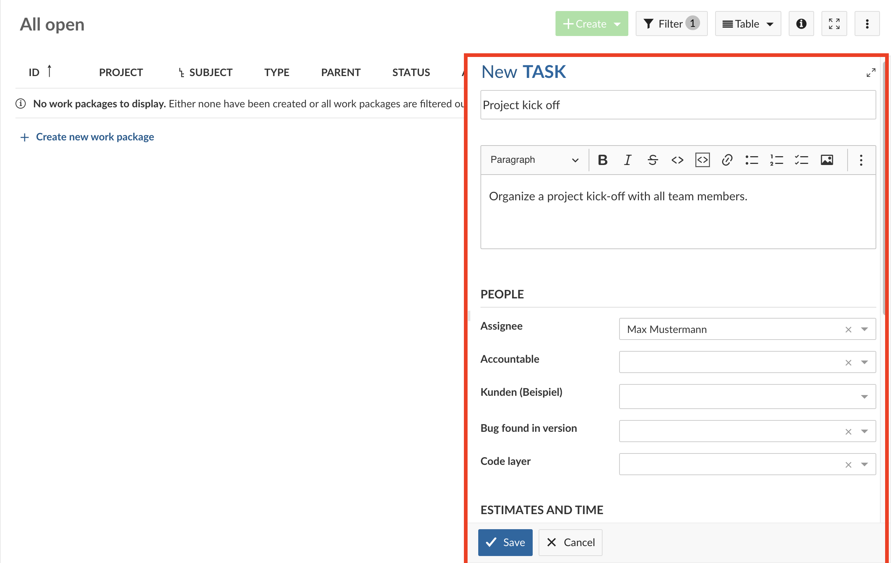
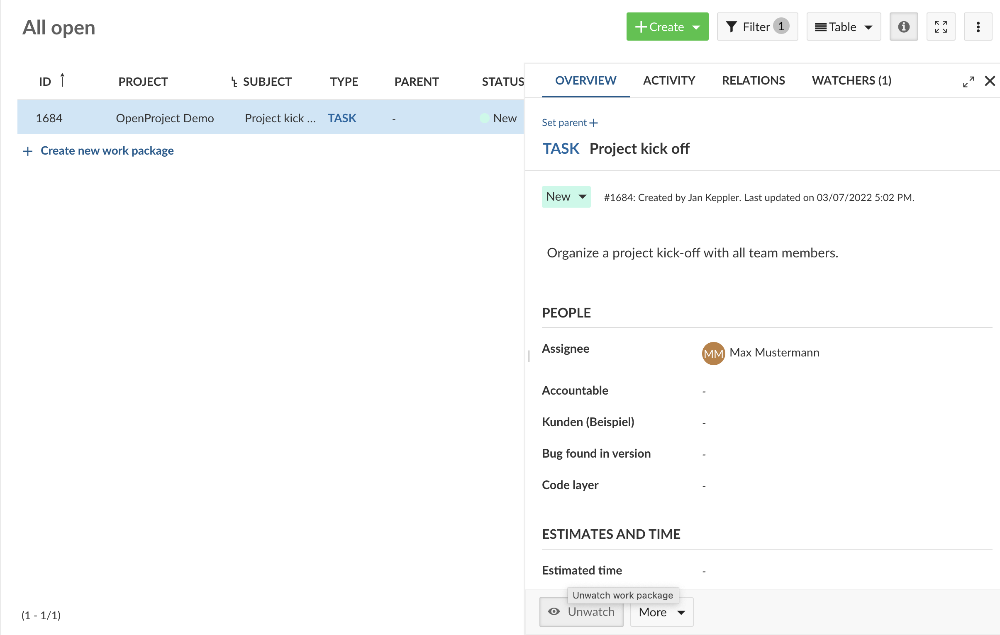
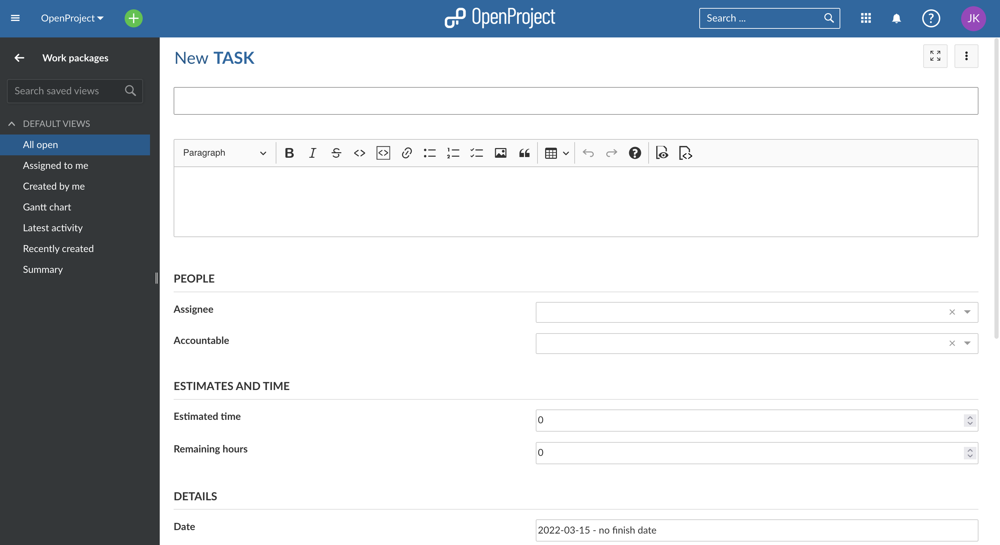
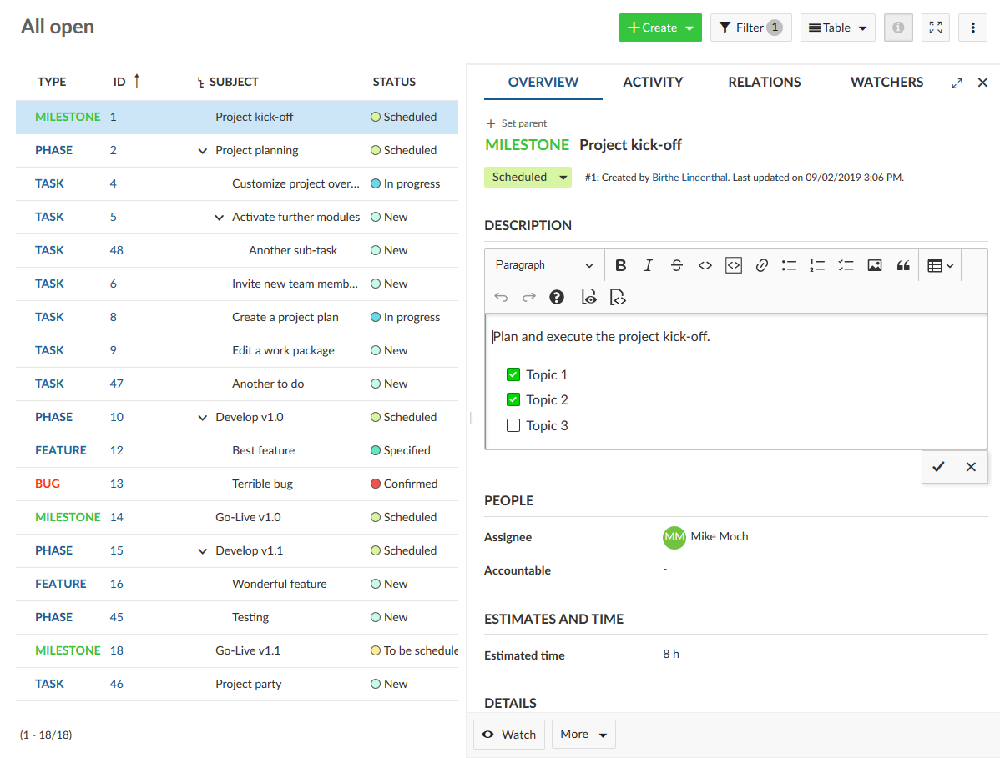
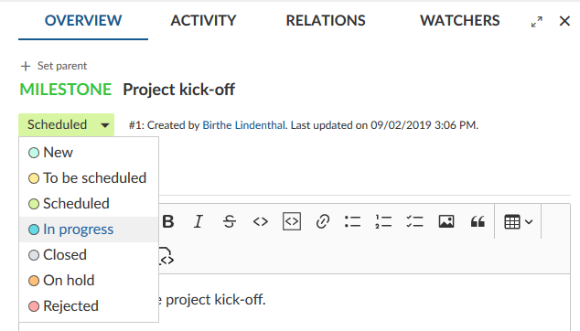
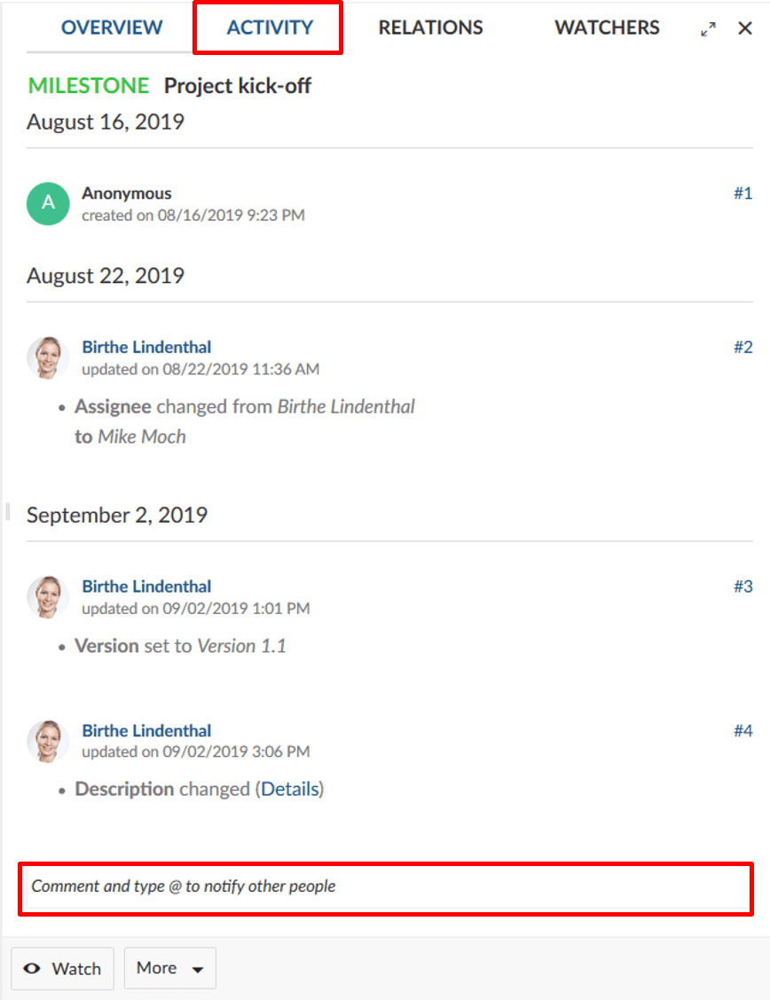

---
sidebar_navigation:
  title: Work packages introduction
  priority: 700
description: Introduction to work packages in OpenProject.
keywords: work packages introduction, attributes, values, task
---

# Introduction to Work Packages

In this document you will get a first introduction to work packages. You will find out how to create and update work packages in a project.

For further documentation, please visit our [user guide for work packages](../../user-guide/work-packages).

| Topic                                                         | Content                                                   |
|---------------------------------------------------------------|-----------------------------------------------------------|
| [What is a work package?](#what-is-a-work-package)            | Find out what a work package in OpenProject is.           |
| [Create a new work package](#create-a-new-work-package)       | How to create a new work package in a project.            |
| [Open and edit a work package](#open-and-edit-a-work-package) | How to open and make changes to an existing work package. |
| [Activity of work packages](#activity-of-work-packages)       | See all changes in a work package.                        |

<video src="https://openproject-docs.s3.eu-central-1.amazonaws.com/videos/OpenProject-Work-Packages.mp4" type="video/mp4" controls="" style="width:100%"></video>

## What is a work package?

A work package in OpenProject can basically be everything you need to keep track off within your projects. It can be e.g. a task, a feature, a bug, a risk, a milestone or a project phase. These different kinds of work packages are called **work package types**.

## Create a new work package

To get started, create a new work package in your project, [open the project](../projects/#open-an-existing-project) with the project drop-down menu, navigate to the **module work packages** in the project menu.

Within the work packages module, click the green + Create button to create a new work package. In the drop down menu, choose which type of work package you want to create, e.g. a task or a milestone. To create a new work package, you can also select the blue printed + Create a new work package writing.

A split screen view is opened with the new work package form on the right and the table listing already existing work packages on the left.

If there are not yet any work packages in the project, you will see a message that there are no work packages to be displayed in the table.

In the empty form on the right, you can enter all relevant information for this work package, e.g. the subject and a description, set an assignee, a due date or any other field. The fields you can populate are called **work package attributes**. Also, you can add attachments with copy & paste or with drag and drop.

Click the green **Save** button to create the work package.

The work package will the be displayed in the table view:

 

Another option to create a work package is to do it from the header menu. The [work package types](../../user-guide/projects/project-settings/work-package-types/#work-package-types) that are activated, will be shown and you can select the relevant work package type to be created.

Once you click on the work package type that you want to create, the work package detail view opens and you have to **select the project** that you want to create the work package for.

Then you follow the same steps as mentioned above to fill in the your work package attributes and save it.

## Open and edit a work package

To open and edit an existing work package from the table, select the work package which you want to edit and click on the **open details view** icon in the work package table or on top of it to open the split screen view. Other ways to open it would be to double-click on the work package or to click on the work package ID.

By clicking through the list on the left hand side you will see the details of each work package on the right in the split screen.

Click in any of the fields to **update a work package**, e.g. description. Click the checkmark at the bottom of the input field to save changes.

To **update the status**, click on the highlighted displayed status on top of the form and select the new status from the drop-down.

## Activity of work packages

To keep informed about all changes to a work package, open the **ACTIVITY** tab in the details view.

Here you will see all changes which have been made to this work package.

You can also insert a comment at the end of the Activity list.

To notify other people about changes in your work packages activities, you can comment and type an @" in front of the username you want to inform and when you publish your message the person you have tagged will get a notification in OpenProject. The aggregation of changes in the Activity list can be configured in the [system administration](../../system-admin-guide/calendars-and-dates/#date-format).

To find out more about the work package functionalities, please visit our detailed [user guide for work packages](../../user-guide/work-packages).
