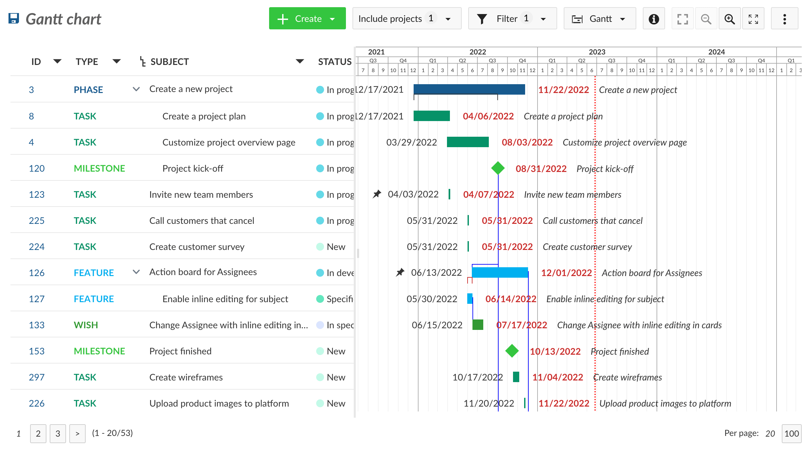

---
sidebar_navigation:
  title: Glossary
  priority: 999
description: Glossary of OpenProject project management software related terms, with definitions and additional links.
keywords: glossary, help, documentation, terms, vocabulary, definition, dictionary, lexicon, index, list, wordbook
---

# OpenProject Glossary

## Accessibility mode

OpenProject offers an accessibility mode which is defined as an optimized user interface for physically disabled users. The accessibility mode can be activated in the account settings (System preferences). Note: When activated, the backlogs plugin cannot be used. Accessibility is an important topic for OpenProject and we strive to comply to the [Web Content Accessibility Guidelines (WCAG) 2.1](https://www.w3.org/TR/WCAG21/). Nevertheless, accessibility is a big field which takes time to implement and not all elements in OpenProjects are barrier-free - yet.

## Agile project management

Agile project management is an iterative and flexible approach to managing projects. It focuses on collaboration, adaptability, and self-organizing teams. OpenProject supports agile project management as well as *classic project management* and works best for *hybrid project management*.

## Authentication

In Openproject, authentication is an important element to guarantee a data protected usage. To adapt these authentication settings, navigate to your user name and select -> Administration -> Authentication. At OpenProject, we use *OAuth 2.0* as this is this is the definitive industry standard for online authorization.

**More information on authentication in OpenProject**

- [See answers to frequently asked questions (FAQ) for authentication](https://www.openproject.org/docs/system-admin-guide/authentication/authentication-faq/)
- [See our blog post on multi-factor authentication to improve data security](https://www.openproject.org/blog/multi-factor-authentication-for-data-security/)
- [Read more about Two-factor authentication (2FA) in OpenProject](https://www.openproject.org/docs/system-admin-guide/authentication/two-factor-authentication/)
- [Read more about LDAP Authentication in OpenProject](https://www.openproject.org/docs/system-admin-guide/authentication/ldap-authentication/)

## Backlog

A backlog in OpenProject is defined as a plugin that allows to use the backlogs feature in OpenProject. In order to use backlogs in a project, the backlogs module has to be activated in the project settings of a project.

## Baseline (Comparisons)

Baseline is a feature in OpenProject that will be released with 13.0. It allows users to quickly track changes on filtered work packages list views. [Read more about technical challenges, design and next steps for Baseline in the OpenProject blog](https://www.openproject.org/blog/news-product-team-baseline/)

## BIM

BIM stands for Building Information Modeling. In OpenProject, we offer a special plan for users working in the construction industry. On top of the general project management features, OpenProject BIM enables construction teams to better plan, communicate and collaborate in their building projects. [Read the OpenProject BIM guide to get more information](https://www.openproject.org/docs/bim-guide/)

## Board

A board in OpenProject is a view that allows you to see your work packages as cards divided into columns. A board is a typical element in agile project management, supporting methodologies such as Scrum or Kanban. As a community user of OpenProject, you can use a [basic board](https://www.openproject.org/docs/user-guide/agile-boards/#basic-board-community-edition). [Advanced Action boards](https://www.openproject.org/docs/user-guide/agile-boards/#action-boards-enterprise-add-on) are part of the Enterprise add-on. Use advanced Action boards to quickly change attributes of your work package. [Read more about boards for agile project management](https://www.openproject.org/docs/user-guide/agile-boards/)

**More information on boards in OpenProject**

- [Examples of agile boards in OpenProject](https://www.openproject.org/docs/user-guide/agile-boards/#agile-boards-examples)
- [Blog post on 5 agile boards to boost efficiency in multi-team projects](https://www.openproject.org/blog/agile-boards/)

## Classic project management

Classic project management is a structured and sequential approach to project management. It often follows a hierarchical structure with a project manager overseeing team coordination, and is associated with methodologies like Waterfall. OpenProject supports classic project management as well as *agile project management* and works best for *hybrid project management*.

## Community edition

Community edition is defined as the main and free-of-charge edition of OpenProject software. It is installed on-premises and therefore self-managed. Benefit from a wide range of features, data sovereignty in a free and open source project management software. The Community edition is actively maintained and is continuously being further developed. [Read more about OpenProject Community edition](https://www.openproject.org/community-edition/)

## Custom action

A custom action in OpenProject is defined as customizable buttons which trigger a certain action. Custom actions are an included in the Enterprise edition of OpenProject and part of automated *workflows*. Custom actions support you to easily update several workpackage attributes at once – with a single click.

**More information on custom actions in Openproject**

- [Watch a short video how custom actions work](https://www.openproject.org/docs/system-admin-guide/manage-work-packages/custom-actions/#automated-workflows-with-custom-actions-enterprise-add-on)
- [Read this guide on how to create custom actions](https://www.openproject.org/docs/system-admin-guide/manage-work-packages/custom-actions/#create-custom-actions)
- [Read this blog article on how to create an intelligent workflow with custom action - explained with an example](https://www.openproject.org/blog/customise-workflows/)

## Custom field

In OpenProject, a custom field is defined as an additional value field which can be added to existing value fields. The different sections that can use custom fields are *work packages*, *spent time*, *projects*, *versions*, *users*, *groups*, *activities (time tracking)*, and *work package priorities*.

** More information on custom fields in OpenProject**

- [Read how to enable custom fields in projects to use them in work packages](https://www.openproject.org/docs/user-guide/projects/project-settings/custom-fields/)
- 

## Custom query

A custom query in OpenProject consists of saved filters and groupings in the work package list. Custom queries can be either set to public (visible by any user who is allowed to see the project and the work package list) or to private (visible only to the person creating the query).

## Dashboard

A dashboard is defined as an overview page in a software. In OpenProject, you have several options to create dashboards:

First, you have the "***My Page\***" which shows your personal customized widgets on one page, for example a calendar or work package reports.

Then, you can create **private dashboards inside your project** by filtering a work package view and then saving it under a new name. For example, filter all work packages assigned to yourself and save this view as "assigned to me", to quickly navigate to those work packages.

Admins of a project can also create **dashboards that are visible to everyone in the project**.

## Date alerts

Date alerts in OpenProject are an Enterprise add-on and defined as a feature to generate automatic and customized notifications regarding a work package's due date or start date. You can find the date alerts feature in your notification center, symbolized by a little bell on the right upper side of your instance. [Read more about the date alerts feature in our user guide](https://www.openproject.org/docs/user-guide/notifications/notification-settings/#date-alerts-enterprise-add-on) or in [this article on deadline management with OpenProject](https://www.openproject.org/blog/deadline-management-date-alert/)

## Enterprise add-on

In OpenProject, some features are defined as an Enterprise add-on. This means, they are not part of the Community edition and therefore not free of charge. Enterprise add-ons are available as Cloud or on-premises versions. You can chose from the following plans to get access to all Enterprise add-ons: Basic, Professional, Premium and Corporate. [Read more about OpenProject plans and pricing](https://www.openproject.org/pricing/)

## Effort (shirt size)

## Excel synchronisation

[Read more about Excel synchronization with OpenProject](https://www.openproject.org/docs/system-admin-guide/integrations/excel-synchronization/)

## Forum

A forum in OpenProject is defined as a module used to display forums and forum entries. The module has to be activated in the project settings and a forum has to be created in the forums tab in the project settings to be displayed in the side navigation. [Read more about forums in OpenProject](https://www.openproject.org/docs/user-guide/forums/)

## File link

## File storage

## Filters

Filters are essential for task and project management in OpenProject. You have several filtering options applicable to work package list. Filter options can be saved via *custom queries*. A filtered work packages list view (e.g. only open work packages) can be safed and therefore work as a *dashboard*. 

## Forum

In OpenProject, a forum is defined as a module used to display forums and forum entries. The module has to be activated in the project settings and a forum has to be created in the forums tab in the project settings to be displayed in the side navigation.

## Gantt chart

The Gantt chart in OpenProject displays the work packages in a timeline. You can collaboratively create and manage your project plan. Have your project timelines available for all team members and share up-to-date information with stakeholders. You can add start and finish dates and adapt it with drag and drop in the Gantt chart. Also, you can add dependencies, predecessor or follower within the Gantt chart.

[Read more about how to activate and work with Gantt charts in OpenProject](https://www.openproject.org/docs/user-guide/gantt-chart/)

## Group

A Group in OpenProject is defined as a list of users which can be assigned to a project with a selected role. New groups can be defined in **Administration -> Users and permissions -> Groups**.

## Hybrid project management

Hybrid project management is an approach that combines elements of both classic and agile project management methodologies. It allows flexibility and adaptability while still incorporating structured planning and control. OpenProject works best for hybrid project management and also supports *classic project management* as well as *agile project management*.

## Meetings

In OpenProject Software, Meetings is defined as a module that allows the organization of meetings. The module has to be activated in the project settings in order to be displayed in the side navigation.

## Member

In OpenProject Software, a member is defined as a project member in a project. Project members are added in the Members module in the project menu.

## Module

A module in OpenProject is defined as an independent unit of functionality that can be used to extend and improve the existing core functions.

## My Page

The My Page in OpenProject is defined as your personal *dashboard* with important overarching project information, such as work package reports, news, spent time, or a calendar. It can be configured to your specific needs. [Read more about the My Page in OpenProject](https://www.openproject.org/docs/getting-started/my-page/)

## Nextcloud integration

OpenProject offers a Nextcloud integration which allows you to manage files in a secure and easy way, e.g. to link files or folders in Nextcloud or upload files to Nextcloud on work packages. You find the Nextcloud integration in the Files tab of your work package, if you have activated the Nextcloud integration for your instance. Get access to the OpenProject-Nextcloud integration by downloading and activating it in the built-in [Nextcloud app store](https://apps.nextcloud.com/) within your Nextcloud instance. [Read more about the Nextcloud integration of OpenProject](https://www.openproject.org/docs/user-guide/nextcloud-integration/)

## OAuth

OAuth is an open standard authorization framework. It allows you to access certain information or resources on the internet without sharing your username and password with each individual service. In OpenProject, OAuth acts as a secure middleman, granting permissions to access your data to authorized applications or services. [Read more about OAuth applications in OpenProject](https://www.openproject.org/docs/system-admin-guide/authentication/oauth-applications/)

### OAuth applications

### OAuth client

### OAuth provider

## On-premises

## Phase

A phase in OpenProject is defined as a *work package type* which usually includes several work packages of types like task or feature. For example, typical phases for a construction repair project would be the following: Project definition, detailed Design & Tender, Construction and Post project.

## Plugins / Integrations

In OpenProject, you can chose from several plugins or integrations or add your own plugins to the Community. As an open source software, OpenProject is open to Community-created plugins. Please note that we do not guarantee error-free and seamless use of those plugins. There are also integrations developed by the core OpenProject team, such as the *Excel synchronization* or the *Nextcloud integration*.

Your activated plugins are listed together with your modules in your instance under --> Administration --> Plugins. 

**More information on plugins in OpenProject**

- [See all available plugins and integrations for OpenProject](https://www.openproject.org/docs/system-admin-guide/integrations/)
- [Read how to create an OpenProject plugin](https://www.openproject.org/docs/development/create-openproject-plugin/)

## Project

In OpenProject, a [project](https://www.openproject.org/docs/user-guide/projects/) is defined as an individual or collaborative enterprise that is carefully planned to achieve a particular aim. Projects are the central organizational unit in OpenProject. Your projects can be available publicly or internally. OpenProject does not limit the number of projects, neither in the Community edition nor in the Enterprise cloud or in Enterprise on-premises edition. If you have more than one project in your instance, projects build a structure in OpenProject. You can have parent projects and sub-projects. For example, a project can represent

- an organizational unit of a company,
- an overarching team working on one topic or
- separate products or customers.

### Project dashboard

See dashboard

### Project folder

### Project identifier

The project identifier is defined as the unique name used to identify projects. Project identifiers can be changed in the project settings.

### Project navigation

The project navigation is the side navigation within a project. Entries in the project navigation can be added and removed by activating and deactivating modules in the project settings.

### Project settings

Project settings means project-specific setting configuration. The project settings contain general settings (e.g. the name and ID of the project), configuration of modules, the members configuration, version settings, work package categories, repository settings, Types configuration and Backlog settings (if plugin is installed). [Read more about project settings in OpenProject](https://www.openproject.org/docs/user-guide/projects/#project-settings)

### Project status

The project status in OpenProject is the reporting relationship between different projects. Reporting relationships can be assigned a project status. Status reportings can be used to display multiple projects (and the associated work packages) in a single timeline: The reporting project and its work packages are displayed in the timeline of the project that is reported to. [Read more about the project status in OpenProject](https://www.openproject.org/docs/user-guide/projects/project-status/)

### Project storage

### Project template

A project template in OpenProject is defined as a dummy project to copy and adjust as often as you want. Project templates can be used for several projects that are similar in structure and members. Creating project templates can save time when creating new projects. [Read more about project templates in OpenProject in our user guide](https://www.openproject.org/docs/user-guide/projects/project-templates/) and see [this blog article to learn how to work with project templates](https://www.openproject.org/blog/project-templates/).

### Project type

The project type in OpenProject is defined as an attribute that is assigned to a project. The project type allows the grouping of projects based on defined types. Project types are used in the timeline configuration.

### Public project

In OpenProject, projects can be private or public. Public means that the project is visible to any user regardless of project membership. The visibility of a project can be changed in the project settings. [Read how to set a project to public in OpenProject](https://www.openproject.org/docs/user-guide/projects/#set-a-project-to-public)

## Repository

A repository is defined as a document management system that allows users to manage files and folders via different version control system (SVN or Git).

## Roadmap

In OpenProject, a roadmap is defined as an overview page displaying the versions sorted alphabetically and the work packages assigned to them. The roadmap is displayed in the project navigation when the work package module is activated and a version has been created (project settings).

## Role

In OpenProject, a role is defined as a set of permissions defined by a unique name. Project members are assigned to a project by specifying a user’s, group’s or placeholder user’s name and the role(s) they should assume in the project.

## Single user

## Story points

## Team planner

## Time tracking

Time tracking in OpenProject is defined as a module which allows users to log time on work packages. Once the time tracking module is activated, time can be logged via the action menu of a work package.

## User

In OpenProject, a user is defined as a person who uses OpenProject, described by an identifier. New users can be created in the admin settings. Users can become project members by assigning them a role and adding them via the project settings.

## Widget

## Wiki

In OpenProject, a wiki is defined as a module that allows to use textile-based wiki pages. In order to use the wiki module, it has to be activated in the project settings.

## Workflow

A workflow in OpenProject is defined as the allowed transitions between status for a role and a type, i.e. which status changes can a certain role implement depending on the work package type. Workflows can be defined in the admin settings. For example, you might only developers to be able to set the status "developed". [Read more about work package workflows in OpenProject](https://www.openproject.org/docs/system-admin-guide/manage-work-packages/work-package-workflows/#manage-work-package-workflows)

## Work package

In OpenProject, a [work package](https://www.openproject.org/docs/user-guide/work-packages/#overview) is defined as an item in a project. It is a subset of a project that can be assigned to users for execution, such as Tasks, Bugs, User Stories, Milestones, and more. Work packages have a type, an ID and a subject and may have additional attributes, such as assignee, responsible, story points or target version. Work packages are displayed in a project timeline (unless they are filtered out in the timeline configuration) - either as a milestone or as a phase. In order to use the work packages, the work package module has to be activated in the project settings.

### Work package types

Work package types are the different items a work package can represent. Each work package is associated to exactly one type. Examples for most used work package types are a Task, a Milestone, a Phase or a Bug. The work package types can be configured in the system administration. [Read more about work package types in OpenProject](https://www.openproject.org/docs/user-guide/projects/project-settings/work-package-types/#work-package-types).

### Work package categories

Work package categories are a functionality used to automatically assign a member to a work package by specifying a category.[ Read more about work package categories in OpenProject](https://www.openproject.org/docs/user-guide/projects/project-settings/work-package-categories/#manage-work-package-categories).

### Work package view

A list of work packages is considered a view. The containing work packages in any view can be displayed a number of different ways. Examples for most used work package views are the list view or the split screen view. [Read more about work package views in OpenProject](https://www.openproject.org/docs/user-guide/work-packages/work-package-views/#work-packages-views).

### Work package ID

Work package ID is defined as a unique integer assigned to a newly created work package. Work package IDs cannot be changed and are numbered across all projects of an OpenProject instance (therefore, the numbering within a project may not be sequential).
